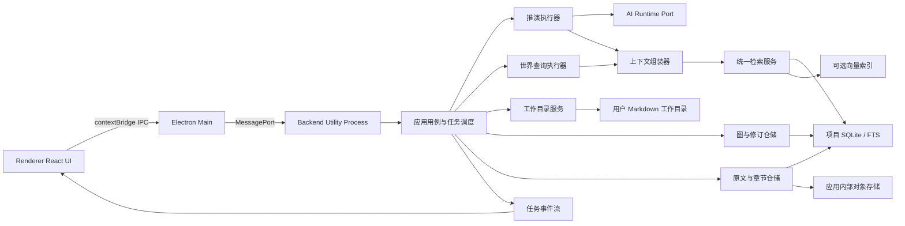
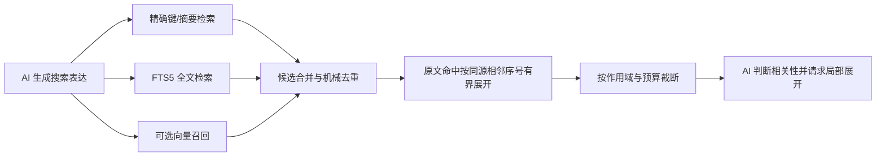
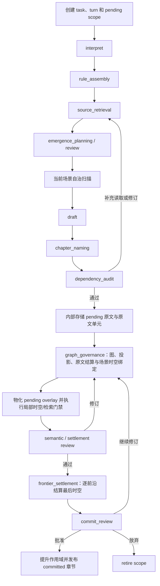

# Worldseed：后端代码架构设计

## 1. 目标与边界

本文把 [底层动态图设计](system-design.md) 转换为可实现的后端代码结构。它定义进程边界、模块职责、依赖方向、端口接口、持久化布局、执行管线、并发策略和测试边界，不重新定义世界语义。所有后端实现还必须遵守 [后端编码原则](backend-coding-principles.md)，该文档规定复用边界、业务隔离、依赖方向、契约版本和架构测试要求。V1 的冻结值、Migration、DeepSeek 配置和编码入口见 [V1 编码前冻结基线](v1-freeze.md)。单轮上下文、选择性读取和 DeepSeek KV 缓存复用见 [单轮上下文与 KV 缓存设计](context-and-kv-cache.md)，阶段 JSON 契约见 [AI 阶段契约](ai-phase-contracts.md)，场景、多时间流和动态空间见 [通用时空锚点设计](spacetime-anchor-design.md)，任意异常后的检查点、用户确认、续时和进程恢复见 [推演中断、确认与恢复设计](turn-interruption-recovery.md)，长期保存、返回历史状态、世界线分叉和内部 Git 隔离见 [推演历史、世界线与版本恢复设计](world-history-versioning.md)。

后端只负责机械能力：

- 保存、读取和索引任意可规范序列化的节点、连接及其修订；
- 隔离 `pending`、`committed` 和 `retired` 作用域；
- 保存小说原文、章节修订、原文单元、结算记录和 AI 决定记录；
- 按 Prompt Contract 调度 AI 阶段并保存每次实际读取集合；
- 执行 AI 已决定的图修改、归档、检索、上下文组装和提交指令；
- 管理用户 Markdown 工作目录与独立的应用内部存储；
- 提供任务进度、事件流、预算统计、失败恢复和只读诊断。

每次模型调用同时受三类边界约束：单次请求截止时间、整轮截止时间和模型供应商自身的网络超时。项目参数 `execution.maxModelRequestTimeMs` 默认 1 小时，可由用户调整到 30 秒至 1 小时；单次请求超时只产生可恢复的中断记录，保留当前检查点并等待用户选择，不会把已完成阶段或 pending 作用域丢弃。

后端不负责：

- 定义人物、势力、地点、状态、事件或其他领域类型；
- 判断用户输入是否为真；
- 判断两个节点是否属于同一对象；
- 决定图修改是否合理、当前状态是什么或查询应该沿哪个语义方向展开；
- 使用固定业务规则替代 AI 的出现规划、自审、连续性证明和图治理。

## 2. 核心架构决策

### 2.1 V1 采用模块化单体

V1 使用一个本地后端进程和一个项目级内部数据库，不拆微服务。原因是正文、图、索引、AI 阶段和文件任务需要共享同一项目状态；过早拆分会引入分布式一致性和部署成本，却不会改善世界语义质量。

模块化单体仍保持明确端口，未来可以把模型调用、向量检索或后台演化迁移到独立进程，而不改变应用层用例。

### 2.2 本地优先，传输层可替换

桌面端默认通过本地 IPC 调用后端。应用层不依赖 Electron、Tauri、HTTP 或 WebSocket；传输适配器只把外部请求转换为命令、查询和事件订阅。

后续远程部署可以增加 HTTP/WebSocket 适配器，不复制业务用例。

### 2.3 端口与适配器

代码分为四个主要边界：

1. **core**：无外部依赖的通用图、修订、作用域、原文和检索模型；
2. **application**：用例、执行状态机、预算、任务调度和所需端口；
3. **contracts**：独立的跨进程 DTO、事件、错误码和协议版本；
4. **transport / infrastructure**：MessagePort、SQLite、文件系统、全文索引、向量检索和模型供应商适配器。

依赖关系如下：

```text
transport ───────> contracts
    │
    └────────────> application ─────> core

infrastructure ──> application ports
bootstrap ───────> transport + infrastructure + application
```

`contracts` 不依赖 `application` 或 `infrastructure`，`core` 不依赖其他业务包。`application` 不导入数据库驱动、桌面框架或具体模型 SDK；基础设施只实现应用层定义的端口。

跨进程响应只允许暴露公开 DTO。任务记录中的执行器、模型、端口、依赖对象和原始输入等运行时对象不得通过 `turn.status` 或其他 MessagePort 响应返回；阶段结果和 AI 思考仍持久化，但由公开快照按协议返回。若响应传输发生结构化克隆失败，MessagePort 适配器必须记录诊断并尝试返回可恢复的小型错误响应，不能让调用静默等待到超时。

### 2.4 不采用领域实体服务

后端不能出现 `CharacterService`、`FactionRepository`、`LocationTable`、`MarriageStatus` 等固定模块。所有世界内容都使用同一组通用图原语和任意载荷接口。

## 3. 技术基线

后端固定运行在 Electron 管理的 Node.js Utility Process 中，使用：

- Node.js LTS、TypeScript 严格模式和 pnpm workspace；
- SQLite WAL、Kysely、`better-sqlite3`；
- SQLite FTS5；`sqlite-vec` 只作为独立端口后的可选扩展，V1 首个闭环默认关闭；
- Zod 校验跨进程 DTO 和 AI 结构化输出；
- Vitest、Pino；
- Electron MessagePort 作为 V1 传输层。

第一阶段 AI 固定使用 [DeepSeek API](https://api-docs.deepseek.com/zh-cn/) 的 OpenAI 兼容接口，基础地址为 `https://api.deepseek.com`，调用 `chat/completions`。默认模型为 `deepseek-chat`，可选的 `deepseek-reasoner` 只通过配置启用。完整桌面技术栈、Main/Preload/Renderer 边界和打包方式见 [项目代码架构](project-code-architecture.md)。V1 不引入 NestJS、消息队列、独立图数据库或分布式任务系统。

## 4. 运行拓扑



每个项目具有独立的工作目录引用和内部存储引用。用户目录只包含协议允许的文件夹与 Markdown；数据库、索引、模型缓存、pending 内容和不可变历史只进入应用内部目录。应用级项目注册表负责从规范化工作目录路径找到内部 `ProjectManifest`，不要求用户目录保存非 Markdown 清单文件。

## 5. 源码目录

```text
apps/
└── backend/
    └── src/
        ├── bootstrap/
        ├── transport/
        │   └── message-port/
        ├── application/
        │   ├── projects/
        │   ├── workspace/
        │   ├── turns/
        │   ├── queries/
        │   ├── chapters/
        │   ├── evolution/
        │   └── operations/
        ├── core/
        │   ├── graph/
        │   ├── revisions/
        │   ├── scopes/
        │   ├── documents/
        │   ├── retrieval/
        │   ├── prompts/
        │   ├── rules/
        │   └── budgets/
        └── infrastructure/
            ├── sqlite/
            ├── filesystem/
            ├── fts/
            ├── vector/
            ├── models/
            └── telemetry/
packages/                           # 详见项目代码架构
├── contracts/
├── prompt-contracts/
└── test-fixtures/
```

目录按技术职责组织，不按小说领域分类。`application/chapters` 只处理文档生命周期，不理解章节中的世界含义。

应用层端口放在对应用例附近，例如 `application/turns/ports`、`application/workspace/ports` 和 `application/queries/ports`，避免形成所有模块互相依赖的全局 `ports` 包。

## 6. 核心标识与作用域

所有持久化记录至少属于一个项目。参与推演或修订的记录还必须关联作用域：

```ts
type ProjectId = string
type TaskId = string
type TurnId = string
type ScopeId = string

type Visibility = "pending" | "committed" | "retired"

type ArtifactScope = {
  projectId: ProjectId
  scopeId: ScopeId
  taskId: TaskId
  turnId?: TurnId
  visibility: Visibility
  baseCommittedSequence: number
}
```

`scopeId` 是后端隔离 pending 内容的机械边界。任何 pending 节点修订、原文版本、检索投影、决定记录、阶段结果和结算记录都必须具有同一个 `scopeId`，不能只依赖 `visibility` 推断归属。

普通查询只能读取 `committed`。恢复任务时必须显式提供 `taskId + scopeId`，后端才返回该作用域的 pending 内容。

### 6.1 项目级永久 ID

项目内已有持久化对象在应用层、数据库和模型协议中使用同一个紧凑永久 ID。永久 ID 由代码维护的按前缀独立计数器生成，例如：

```text
node     -> 102
source   -> 121
link     -> 23
evidence -> 86
revision -> 147
```

调用 `next("node")` 得到 `node_103`，调用 `next("source")` 得到 `source_122`；所有前缀分别递增，不共享统一数值序列。`ProjectIdAllocatorPort` 位于应用端口，SQLite 实现使用 `id_counters(prefix, current_value)` 在事务中原子递增。

前缀只能来自代码维护的基础设施允许列表，AI 不得创建前缀或决定编号。计数器属于项目基础设施而不是世界状态：所有任务和世界线共享，历史恢复、返回上一轮、分叉、删除、归档和失败回滚都不能降低计数。已分配编号永不复用，允许出现空洞。

导入或重建项目时，如果缺少计数器记录，基础设施必须扫描仍可达的永久 ID，并把各前缀计数初始化到不小于对应最大后缀；不能从 `1` 重新开始。编号仅表示技术身份，不表示世界时间、剧情顺序、重要程度或修订新旧。

AI 在单个 `graph_governance` 结果中创建新对象时仍可使用 `local:*` 表达新对象间的相互引用。该结果通过结构校验后，应用层为每个局部引用调用对应前缀计数器并一次性物化；`local:*` 映射不跨治理事务持久化为第二套身份。

## 7. 通用图模块

### 7.1 存储模型

后端沿用最小原语：

```ts
type StoredNode = {
  projectId: ProjectId
  id: string
  content: unknown
  metadata?: Record<string, unknown>
  sourceRefs?: SourceRef[]
}

type StoredLink = {
  projectId: ProjectId
  id: string
  fromNodeId: string
  toNodeId: string
  content?: unknown
  metadata?: Record<string, unknown>
  sourceRefs?: SourceRef[]
}
```

载荷进入仓储前必须经过规范序列化。规范化只保证可保存、可摘要和可比较，不解释其中的世界语义。

### 7.2 仓储端口

```ts
interface GraphRepository {
  getNode(ref: ReadScope, nodeId: string): Promise<StoredNode | null>
  getLink(ref: ReadScope, linkId: string): Promise<StoredLink | null>
  getNeighborhood(input: NeighborhoodRead): Promise<GraphSlice>
  stageMutations(scope: ArtifactScope, mutations: GraphMutation[]): Promise<GraphRevision[]>
  readOverlay(scope: ArtifactScope, request: GraphReadRequest): Promise<GraphSlice>
  promoteScope(scopeId: ScopeId): Promise<void>
  retireScope(scopeId: ScopeId, reason: string): Promise<void>
}
```

`getNeighborhood` 只执行 ID、方向、数量、访问集合和容量限制，不判断哪个邻接具有语义价值。语义选择由 AI 在实际读取集合中完成；AI还可以根据已有局部图自主理解和重构查询组织，机械方向和深度不能演变为固定出口规则。

### 7.3 当前图与修订历史

SQLite 中同时维护：

- append-only `graph_revisions`：不可变修改前后值；
- `node_heads` 和 `link_heads`：当前 committed 物化入口；
- `pending_overlays`：按 `scope_id` 隔离的待提交结果；
- 双向邻接索引：`from_node_id` 和 `to_node_id` 均可快速查询。

归档仍然由 AI 组合普通 committed 节点和连接完成。后端没有 `archive_type` 或领域化归档表；`retired` 只表示未提交或放弃的 pending 作用域，不表示已提交世界中的历史归档。当前设计不物理删除已提交图结构，历史通过修订、原文来源和归档出口继续可追溯。

### 7.4 时空绑定是普通图的机械投影

后端不建立 `WorldClock`、`MapCoordinate`、`PortalType` 或其他世界领域对象。时间参照、空间参照、同步点、通道、比例和不确定性仍是普通节点、连接及其修订。

应用层只保存 AI提交的 `SceneSpacetimeBinding`、`MutationSpacetimeSettlement` 和逐前沿 `FrontierSpacetimeSettlement`。这些记录只包含场景或修改索引、普通图与修订引用、作用域、来源、原因和自审，用于快速恢复场景局部与执行机械门禁，不复制图载荷，也不成为第二套世界事实。前沿集合由 AI 定义为可独立继续、暂停或归档的局部边界，不按修改项、节点或连接自动展开；代码只校验结算锚点集合与语义复核批准集合一致，不替 AI 选择前沿。

数据库系统时间统一命名为 `created_at`、`updated_at`、`last_processed_at` 或 `next_attempt_at`。这些字段只参与任务排序、调度和诊断，禁止作为世界时间锚点进入模型事实上下文。

## 8. 原文与章节模块

### 8.1 不可变正文版本

每个 `sourceId` 对应一份应用内部对象存储中的不可变 Markdown 内容。用户工作目录中的章节文件只是当前 committed 版本的发布投影，不是唯一历史来源。

```ts
type DocumentVersion = {
  projectId: ProjectId
  scopeId: ScopeId
  sourceId: string
  chapterId: string
  predecessorSourceId?: string
  internalContentRef: string
  publishWorkspacePath: string
  heading: string
  digest: string
  visibility: Visibility
}
```

### 8.2 pending 修订隔离

新章节和已提交章节的编辑都先保存到应用内部目录：

```text
<internalStore>/<projectId>/documents/<sourceId>.md
```

pending 文档只在应用内部存储和任务恢复视图中存在，不进入用户的 `章节正文` 文件树；用户工作目录中的 committed Markdown 不被普通保存覆盖。完成结构、图修订、原文结算、检索投影和时空连续性门禁后，发布器把该 `sourceId` 投影到 `publishWorkspacePath`；`commit_review` 只保存 AI 的连续性审查建议，不拥有拒绝提交的权限。

这同时满足：

- pending 内容已经持久化并可恢复；
- 普通正文阅读仍然只看到 committed；
- 编辑已提交章节时，保存修订不会让磁盘正文与世界图提前分叉；
- 历史版本始终可以通过 `sourceId` 恢复。

### 8.3 文档端口

```ts
interface DocumentRepository {
  stageVersion(input: StageDocumentVersion): Promise<DocumentVersion>
  readVersion(sourceId: string): Promise<string>
  listCommittedChapters(projectId: ProjectId): Promise<DocumentVersion[]>
  splitSourceUnits(sourceId: string): Promise<NarrativeSourceUnit[]>
  promoteVersion(scopeId: ScopeId, sourceId: string): Promise<void>
  retireVersion(scopeId: ScopeId, sourceId: string, reason: string): Promise<void>
}

interface ChapterPublisher {
  publish(version: DocumentVersion): Promise<WorkspaceOperation>
  restoreCommittedProjection(chapterId: string): Promise<WorkspaceOperation>
}
```

`ChapterPublisher` 只验证路径、标题一致性、摘要和文件写入结果，不决定正文是否合理。

## 9. 统一检索模块

### 9.1 检索投影

后端实现使用显式作用域字段：

```ts
type StoredRetrievalProjection = {
  projectId: ProjectId
  scopeId: ScopeId
  ownerKind: RetrievalOwnerKind
  ownerId: string
  ownerRevisionId?: string
  canonicalDigest: string
  exactKeys: string[]
  semanticTexts: string[]
  sourceRefs?: SourceRef[]
  visibility: Visibility
}
```

索引层只产生候选，不决定候选是否正确。

### 9.2 检索流水线



检索端口：

```ts
interface RetrievalIndex {
  upsert(projections: StoredRetrievalProjection[]): Promise<void>
  search(request: RetrievalRequest): Promise<RetrievalCandidate[]>
  retireScope(scopeId: ScopeId): Promise<void>
  promoteScope(scopeId: ScopeId): Promise<void>
}
```

`RetrievalRequest` 必须包含 `projectId`、允许的可见性、可选 `scopeId`、候选上限和预算；基础设施不能默认跨项目或跨 pending 作用域搜索。

对图节点和连接，候选排序还必须结合 `node_heads`/`link_heads` 的当前头：同一所有者的当前修订投影先于历史修订进入候选集合，再按上限截断；历史修订仍然保留在结果集合中，以支持回溯过去状态、原始话语和旧事实。pending 作用域存在时，pending 头覆盖 committed 头；pending 头归档后不得继续作为当前候选。

每条 committed 当前图投影还必须携带其来源作用域的 `committedSequence`，并把该机械提交序号贯通到模型可见 Evidence。它用于比较不同所有者的当前头来自哪个更晚的已提交世界状态，不能替代故事内时间锚点，也不能由代码据此推断领域语义。候选均为当前头时，较新的提交序号优先展示；最终是否构成覆盖仍由 AI 根据语义、时空锚点和演化关系判断。pending 投影尚未获得提交序号，仍由 pending 可见性优先级处理。

`anchorIds` 使用独立的 owner 解析端口，直接从当前 node/link head 取得对应投影，不得复用 `searchExact()`。精确键和语义搜索返回候选后，应用按 owner 执行当前状态闭包：历史图投影只有在同一可见作用域的当前头投影可以同时返回时才进入最终候选。运行时 Evidence 明确携带 `current` 或 `historical` 角色；该角色由 head 表机械导出，不写回世界语义载荷。

候选裁剪以 owner 证据组为单位。当前头优先，历史投影随后；若剩余候选或 token 容量不足以容纳当前头和历史投影，则不返回该历史投影。source、规则和参考文件不参与图 head 闭包，避免把原文单元或工作区文件错误解释为可变图状态。

对内部 `source` 原文投影，语义命中的是进入连续原文的入口，不等于完整段落已经召回。仅当请求的 `sourceKinds` 只包含 `source` 时，应用层才以当前请求的首个高相关 source unit 为中心，按同一 `sourceId` 的相邻 `sequence` 机械展开有界窗口；混合 `graph`、`revision` 与 `source` 的请求只返回各自的直接候选，避免图入口检索的早期噪声耗尽累计原文证据预算。窗口半径由 `maxCandidates` 推导，最终内容仍同时服从候选上限和累计 `maxEvidenceTokens`。该机制只利用不可变来源身份和顺序，不识别人物、对白、地点、章节类型或其他世界语义，也不读取用户工作区中的章节文件。

每个模型可见的内部 `source` 投影同时携带机械生成的 `sourcePosition`：来源引用、当前序号、首末序号、单元总数以及 `isStart`/`isEnd`。模型需要来源首端或末端时，可用已读 `sourcePosition.sourceRef` 通过 `sourceIds` 与 `sourceBoundary=start|end` 请求有界边界窗口。仓储按同一来源的分块序号计算并返回，代码不解释该段剧情的时间、地点、状态或因果；AI仍须结合图中当前状态和故事时空判断如何继续。该能力解决“语义命中开篇却误当作章节结尾”的问题，但不把来源顺序误作世界时间。

证据账本必须保留检索投影的真实来源身份：内部原文 `source` 投影记为 `chapter`，图投影记为 `graph`，修订投影记为 `revision`。模型侧仍通过 `ownerKind` 判断具体投影所有者；账本来源不得把逐字原文伪装成图摘要。

同一轮内重复读取相同投影时，应用层必须以稳定证据键去重；稳定键至少包含所有者身份与投影摘要，不能只依赖每次查询生成的临时 projection/read ID。重复命中不得再次写 Evidence、追加上下文段或消耗累计证据预算；只有所有者当前修订或投影内容实际变化后，才能作为新证据进入本轮上下文。该规则与具体人物、事件和世界类型无关。

模型可见证据使用单轮接纳窗口。`interpret` 从初始候选中筛选本轮相关证据；任何阶段合法引用的新证据都会加入该窗口，之后的规则组装、资料检索、正文、治理和审查阶段只能增补，不能仅因本阶段未再次引用而删除先前证据。新增读取继续按稳定证据键去重，并以当前已接纳窗口计入累计 `maxEvidenceTokens`，因此该规则不会退化为全量上下文，也不能通过阶段切换绕过预算。完整 Evidence 仍保存在持久账本中，窗口淘汰不等于物理删除。

## 10. 规则与资料模块

该模块负责：

- 扫描五个固定目录和固定子目录；
- 校验用户文件仅为目录或 `.md`；
- 为规则、设定和参考 Markdown 生成不可变文件版本；
- 保存 Skill manifest、索引入口和文件片段定位；
- 根据 AI 请求读取实际片段并加入 `committedReadIds`；
- 形成并保存 `RuleSnapshot`。

它不根据文件名自动建立人物、势力等领域对象。

```ts
interface RuleSourceService {
  createSnapshot(input: RuleAssemblyRequest): Promise<RuleSnapshot>
  retrieveFragments(input: FragmentRetrievalRequest): Promise<SourceFragment[]>
  indexMarkdown(versionId: string): Promise<void>
}
```

## 11. AI Runtime 与 Prompt Contract

### 11.1 模型端口

```ts
interface AIModelPort {
  execute<TOutput>(request: ModelExecutionRequest<TOutput>): Promise<ModelExecutionResult<TOutput>>
}

type ModelExecutionRequest<TOutput> = {
  projectId: ProjectId
  taskId: TaskId
  phase: AIPhase
  provider: "deepseek"
  model: "deepseek-chat" | "deepseek-reasoner"
  promptRef: string
  promptDigest: string
  messages: ModelMessage[]
  outputSchema: Schema<TOutput>
  budget: ModelCallBudget
}

type ModelExecutionUsage = {
  totalInputTokens: number
  cacheHitInputTokens?: number
  cacheMissInputTokens?: number
  outputTokens: number
  latencyMs: number
}

type ModelExecutionResult<TOutput> = {
  output: TOutput
  usage: ModelExecutionUsage
  rawResponseDigest: string
}
```

`DeepSeekAdapter` 使用 `openai` SDK 的兼容客户端发送请求。统一运行配置分别控制 `thinkingModeEnabled`、`reasoningEffort` 与 `jsonModeEnabled`：思考开启时发送 `thinking.enabled` 和 `reasoning_effort: low | high | max`，关闭时发送 `thinking.disabled` 且不发送强度；JSON Mode 默认关闭。模型仍由末尾输出契约要求返回单个 JSON 对象，适配器提取首个完整对象后通过 Zod `outputSchema` 校验；JSON 合法不代表语义已经被后端批准。一次真实同请求对照表明 `high`、`low`、`disabled` 都能返回最终 `content`，因此空 `content` 不能简单归因于某个固定思考强度，必须保留响应通道日志与有限重试。供应商单次输出上限只是故障边界，不是阶段目标；控制阶段提示词必须在请求尾部明确输入只读、完整性不等于复述、数组项不得重复，并要求单个 JSON 对象闭合后立即停止。若供应商返回 `finish_reason=length`，即使前缀看似可解析也按截断处理并紧凑重生成，同时只在 debug 日志保存有限首尾片段用于识别重复输出；日志同时区分 `reasoningTokens` 与估算的最终内容 Token，避免把异常内容误判为深度思考。

轮次 deadline 生成的 `AbortSignal` 只能作为 OpenAI SDK 的请求选项传入，不能混入 HTTP JSON body。单请求默认超时为 `3600000ms`，且始终受轮次剩余 deadline 的更小值约束；这样不会用过短的单请求保护时间截断仍在正常处理的模型阶段，同时仍避免请求越过整轮预算。用户或环境可以把单请求超时调小，但这会使请求更早进入可恢复的错误确认流程。若请求在整轮 deadline 处被 Abort，编排器将其统一记录为 `wall_time` 限制耗尽，而不是丢失为无指标的普通异常。模型只返回 `reasoning_content` 而最终 `content` 为空时，适配器将其分类为供应商响应不完整，并以完整的 `user -> assistant -> user` 消息结构进行有限修复，不把空字符串交给 JSON 解析器。

用户主动取消使用另一条运行时 signal：`BackendFacade` 为每个 start/resume 执行代次持有独立 `AbortController`，经 `TurnExecutionHooks -> AIModelPort.execute options -> DeepSeek SDK request options` 传递，并与单请求及整轮超时 signal 合并。controller 不进入任何持久化协议。取消会中止当前网络请求并在阶段边界停止编排；异步完成回调必须校验当前 controller 身份，不能在取消后覆盖任务状态。取消只终止执行，保留 pending scope 和检查点，不提交也不物理删除它们。

V1 不依赖 Tool Calling。模型需要查询或提出修改时，先返回 Worldseed 自己的结构化 JSON，应用层执行 `request_read` 或暂存 mutation，再把结果放入下一次模型输入。未来接入 Tool Calling 时，只能在 `DeepSeekAdapter` 内转换为相同的 `AIPhaseResult`，不能改变应用层协议。

供应商适配器负责认证、流式传输、重试限制、token 统计和原始错误转换。它不能修改阶段输出的世界含义。

```text
apps/backend/src/infrastructure/models/deepseek/
├── deepseek-adapter.ts
├── deepseek-client.ts
├── deepseek-config.ts
└── deepseek-errors.ts
```

第一阶段默认所有 AI 阶段使用 `deepseek-v4-flash`，保持模型变量单一。模型、base URL、超时、最大调用次数和 token 上限都进入项目运行配置与任务预算快照。应用不设置整轮累计输出截止线；已知模型的正文阶段按用户字数范围计算单次输出预算，非正文阶段使用阶段级结构化护栏，未知模型不硬编码供应商能力。

### 11.2 Prompt 注册表

所有阶段提示词是版本化只读资源，具体阶段输入输出和允许回流见 [AI 阶段契约](ai-phase-contracts.md)：

```ts
interface PromptRegistry {
  resolve(protocolVersion: string, phase: AIPhase): Promise<PromptDefinition>
}
```

任务开始后固定 Prompt Contract 版本和 `RuleSnapshot`。任务恢复继续使用原版本，不能静默切换。

### 11.3 结构验证

所有阶段共用 `packages/prompt-contracts` 中唯一的语义 artifact schema。已有持久化对象在模型协议与数据库中统一使用项目级永久 ID，例如 `node_103`、`link_24`、`evidence_87`；不再为每次请求建立临时 `read-*`、`node-*`、`link-*`别名，也不维护永久 ID 到 UUID 的长期映射。共享契约校验器只要求永久 ID 已出现在当前模型可见输入、工作区选择来自实际读取文件、`graph_governance` 中的所有 `local:*` 都在当前治理 artifact 明确声明；规划、草稿和审查阶段不得提前发明局部句柄。应用层只把本次治理新对象的 `local:*` 按技术类别一次性物化为永久 ID，并生成章节、修订、投影、结算、时空绑定和决定记录。项目为每个前缀维护独立原子计数器；计数器跨任务和世界线共享，历史恢复不能回退。详见 [模型协议边界设计](model-protocol-boundary.md)。

后端只验证：

- 阶段结果是否符合结构 schema；
- 引用 ID 是否存在于实际读取集合或本作用域新产物；
- `request_read`、`revise`、`approve` 等结果是否沿允许的阶段回流；
- 预算是否超限；
- 必需产物是否存在；
- 场景清单索引是否连续唯一，图治理是否按该索引恰好覆盖一次，AI 声明需要前置或跨参照时相应引用是否非空；
- 每个图修改索引是否恰好进入一条 `MutationSpacetimeSettlement`，`world_effect` 是否至少引用本轮或已读既有场景；
- 图治理声明的每个受影响前沿是否恰好结算一次，活跃或推迟前沿是否分别具有最后场景、时间、地点锚点和重访条件；
- 系统处理时间是否与世界时空引用严格分离。

已有图引用必须使用当前模型可见输入中出现过的 `node_*` 或 `link_*` 永久 ID；模型发明的永久 ID 或未读取引用直接拒绝。`predecessorRevisionRefs` 通过已读 Evidence 冻结的 owner、version 和 digest 解析具体修订，而不是提交时再追随最新 head。该校验只证明引用可见，不判断其世界语义是否合理。

后端不验证 AI 的语义理由是否正确。

一句话就是世界生成的起点。资料不存在或设定需要补全时，AI应依据已读上下文、规则和用户输入直接推演新事物，并用时间、地点、因果和不确定性保持连续；不能把资料缺失直接当作拒绝正文的理由。正文出现的万事万物都必须进入图。草稿阶段允许 AI 创作本轮首次出现的新事物。应用层只拒绝明显的等待或拒绝占位正文，例如“等待读取资料”“尚未开始撰写正文”，避免把空壳内容送入章节和图结算；这不是对世界语义的判断，也不要求新事物先在旧图中存在。

后端也不生成语义兜底：不得从图内容自动派生检索投影，不得为缺少决定记录的修改补写默认理由或自审。检索入口和修改说明属于 AI 图治理产物；代码只物化并校验其引用与索引。

## 12. 推演执行器

### 12.1 状态机

`TurnOrchestrator` 是应用层状态机，不是世界规则引擎。

```text
created
  -> running
  -> waiting_for_read | waiting_for_model | waiting_for_review
  -> committing | needs_revision | paused
  -> completed | retired | failed | cancelled
```

每个阶段运行都保存 `AIExecutionEnvelope` 和 `AIPhaseResult`。状态机根据结构化 outcome 进入下一阶段、补充读取、回流修订或停止。

### 12.2 正式正文管线



### 12.3 阶段执行接口

```ts
interface TurnOrchestrator {
  start(command: StartTurnCommand): Promise<TaskHandle>
  resume(command: ResumeTaskCommand): Promise<TaskHandle>
  pause(taskId: TaskId): Promise<void>
  cancel(taskId: TaskId): Promise<void>
  getStatus(taskId: TaskId): Promise<TurnTaskStatus>
}
```

所有长任务返回 `TaskHandle`，进度通过事件流推送；IPC 请求不等待整章生成结束。

## 13. 查询执行器

查询和正文生成共享检索、上下文组装和 Prompt Contract，但查询默认不创建可提交世界内容。

```ts
interface WorldQueryService {
  query(command: QueryWorldCommand): Promise<TaskHandle>
}
```

查询流程：

1. `interpret` 生成搜索目标；
2. 检索候选入口；
3. AI 选择局部展开方向；
4. 上下文组装器记录实际读取 ID；
5. `dependency_audit` 检查依据闭合；
6. `response_review` 生成只读回答；
7. 若 AI 判断产生了应提交的新事实，则显式升级为图治理任务，不能在查询接口中暗写世界图。

## 14. 自治世界推进器

后台演化与前台正文使用相同作用域、检索、AI 阶段和图治理端口，不建立第二套世界模型。

`EvolutionScheduler` 只负责机械触发和预算队列：

```ts
interface EvolutionScheduler {
  enqueue(projectId: ProjectId, reason: EvolutionTrigger): Promise<TaskHandle>
  runDue(projectId: ProjectId, profile: WorldEvolutionProfile): Promise<void>
}
```

哪些局部值得推进、发生什么、是否形成联合演化以及如何更新前沿，仍由 AI 决定。

## 15. 并发与调度

### 15.1 项目级单写者

同一项目允许多个 committed 只读查询并发执行，但图头、章节发布和工作目录修改通过项目级单写者队列串行执行。

这不是世界语义审批，只用于避免两个任务同时覆盖同一个机械当前入口。

### 15.2 基线序列检查

每个 pending scope 保存 `baseCommittedSequence`。进入 `commit_review` 前，后端比较当前 committed 序列：

- 未变化：继续提交；
- 已变化但读取集合不受影响：AI 必须给出复核结果后继续；
- 可能受影响：任务返回补充读取和重新审查阶段。

代码只报告机械版本变化，不判断世界冲突。

### 15.3 前台优先级

正文任务优先于后台演化任务。后台任务达到预算或被前台抢占时保存阶段和 scope，之后恢复，不能把半完成结果提交为世界事实。

## 16. 持久化设计

### 16.1 SQLite 表组

建议按模块建立以下通用表组：

```text
projects
project_manifests
workspace_operations

artifact_scopes
tasks
phase_runs
ai_decision_records
rule_snapshots

turn_contexts
context_segments
kv_usage

nodes
links
node_heads
link_heads
graph_revisions

document_versions
source_units
settlement_records
scene_spacetime_bindings
graph_revision_spacetime

retrieval_projections
retrieval_exact_keys
retrieval_fts
retrieval_embeddings          # 可选

frontier_refs
operation_events
```

表名表示基础设施职责，不表示世界领域类型。

`scene_spacetime_bindings` 只保存 `scene_index`、`scene_anchor_id`、直接覆盖的原文单元索引、时间与空间参照引用、时间与地点锚点引用、本轮前置场景索引、已读旧场景引用、过渡路径引用、跨参照对应引用、来源、原因、自审、作用域和可见性。它不保存第二份时间、地图或场景事实；`(scope_id, scene_index)` 用于和审计场景清单执行机械全集比对。正式正文记录 `source_id` 和非空原文单元集合，无正文后台演化允许两者为空，但必须保留任务与作用域来源。

`graph_revision_spacetime` 是批准后的 `MutationSpacetimeSettlement` 投影。应用层把临时 `mutationIndexes` 物化为图修订 ID，再保存其生效场景绑定、已读既有场景、当前入口、前置修订声明与具体 revision ID、历史返回引用。模型使用的 `predecessorRevisionReadRefs` 必须解析到读取证据冻结的具体修订，不能在提交时追随最新 head。该表不保存世界语义载荷，也不能脱离普通图独立回答世界问题。

验证探针不是世界事实，也不能只保存 AI 自报的结果。探针计划、应用执行结果和 AI 审查分别作为阶段运行记录持久化；任务检查点保存当前治理代次、未完成探针和执行游标。提交门禁按治理代次、探针数组索引、场景和修改结算全集检查三者是否闭合，不把探针复制成图节点或世界事实表。

### 16.1.1 VerificationProbeExecutor

`VerificationProbeExecutor` 是独立应用服务，位于 `semantic_review` 的计划调用与审查调用之间：

```text
SemanticReviewPlanner
  -> VerificationProbeExecutor
       -> RetrievalPort
       -> GraphReadPort
       -> SourceReadPort
       -> ProbeRunStorePort
  -> SemanticReviewAssessor
```

职责边界：

- 接收 AI 提出的通用 `VerificationProbePlan`，不解释其中的世界语义；
- 使用普通召回已经存在的 exact、semantic、neighborhood 和 source 能力执行查询；
- 在治理尚未提交时，以当前治理 artifact 构造只读提案 overlay，支持本轮 `local:*`、修改和检索投影的有限查询；overlay 不写入 SQLite、不分配永久 ID；
- 冻结真实返回的 read 引用、graph owner 引用、结果摘要、预算和错误类型；
- 将提案 overlay 命中与持久化 Evidence、已提交图命中分开记录，不能把 `local:*` 当成旧图 Evidence；
- 使用稳定 `operationId` 幂等恢复，只重跑未完成探针；
- 不替 AI 生成 `verdict`，不根据关键词判断人物、势力、地点或任何领域类型；
- 不允许模型提交的观察引用覆盖真实执行结果。

探针完成后，编排器把 `ProbeExecutionResult[]` 作为不可变系统消息追加到当前阶段尾部，再调用 AI 作语义审查。AI 的 `pass`、`uncertain` 和 `fail` 都是审核建议，不改变正式提交门禁；只有探针执行本身因预算、外部错误或进程中断未完成时，任务才进入可恢复暂停。后续治理使用新的代次和探针记录，旧记录只保留审计。

`frontier_refs` 为每个前沿分别保存 `last_scene_anchor_refs`、`last_time_anchor_refs`、`last_location_anchor_refs` 和 `correspondence_refs`。原 `last_effective_time` 不得继续表示世界时间，应拆为世界图引用和纯系统调度字段 `last_processed_at`。不同前沿没有已读对应结构时，调度器不能仅凭系统时间比较其世界进度。

`TurnPersistencePort` 同时提供有界的 committed 前沿读取端口。它只返回活动或推迟状态、调度顺序以及前沿已经保存的原因、重访条件和锚点引用，不解释内容语义。`world.evolve` 在首个模型阶段前把这些记录转换为 committed Evidence，并通过 owner 身份解析读取对应当前图投影。非空世界存在可用前沿时，提交门禁要求本轮读取集合至少包含一个前沿记录及其场景、时间、地点锚点证据；空世界不应用该门禁。

### 16.2 内部目录

```text
<app-data>/Worldseed/
├── registry.sqlite
└── projects/<projectId>/
    ├── project.sqlite
    ├── objects/
    │   ├── documents/
    │   ├── prompts/
    │   └── external-content/
    ├── indexes/
    ├── model-cache/
    └── recovery/
```

`registry.sqlite` 只保存项目 ID、规范化工作目录引用、内部存储引用和最近打开信息，不保存世界内容。`ProjectManifest` 保存在项目内部数据库中。`internalStoreRef` 必须解析到 `workspaceRootRef` 之外；后端启动项目时执行规范路径比较，拒绝把数据库、索引或 pending 内容放入用户 Markdown 工作目录。

打开项目时，后端先使用规范化路径查询注册表，再读取内部 `ProjectManifest` 并校验工作目录。工作目录被移动后不会静默创建新项目；用户必须执行明确的“重新关联项目”操作，后端核对项目清单、固定目录和已有摘要后再更新注册表。新设备导入只有在用户明确选择导入时才建立新的内部存储和项目身份。

### 16.3 当前原子性边界

本架构只定义逻辑提交顺序和可恢复状态，不承诺数据库、全文索引、对象存储与用户章节文件之间的跨介质原子提交。V1 必须记录提交阶段和失败位置，使任务可以恢复或重新发布；完整原子提交协议留待后续设计。

## 17. 工作目录服务

```ts
interface WorkspaceService {
  createProject(command: CreateProjectCommand): Promise<ProjectManifest>
  openProject(path: string): Promise<ProjectOpenResult>
  listDirectory(projectId: ProjectId, path: string): Promise<WorkspaceEntry[]>
  readMarkdown(projectId: ProjectId, path: string): Promise<MarkdownDocument>
  saveMarkdown(command: SaveMarkdownCommand): Promise<WorkspaceOperation>
  importMarkdownFiles(command: ImportMarkdownFilesCommand): Promise<WorkspaceOperation>
  importMarkdownFolder(command: ImportMarkdownFolderCommand): Promise<WorkspaceOperation>
  archive(command: ArchiveWorkspaceEntryCommand): Promise<WorkspaceOperation>
  restore(command: RestoreWorkspaceEntryCommand): Promise<WorkspaceOperation>
}
```

机械安全规则：

- 所有路径先规范化并验证仍位于 `workspaceRootRef`；
- 拒绝符号链接或目录联接造成的越界访问；
- 用户内容只允许目录和 `.md`；
- 五个顶级目录及固定子目录不能被重命名、移动或删除；
- 平台基础规则文件只读；
- 用户文件归档后保留不可变版本和引用记录。
- 单文件导入只接受 `.md`；文件夹导入递归检查全部文件，发现任意非 `.md` 文件、符号链接或越界路径时整批拒绝并返回明细。

## 18. 后端 Facade

UI 只调用稳定的用例接口：

```ts
interface BackendFacade {
  projects: ProjectCommands
  workspace: WorkspaceCommands
  turns: TurnCommands
  queries: QueryCommands
  chapters: ChapterCommands
  graph: GraphReadCommands
  evolution: EvolutionCommands
  operations: OperationQueries
  events: EventSubscription
}
```

主要命令：

- `project.create`、`project.open`、`project.validate`；
- `workspace.list`、`workspace.read`、`workspace.save`、`workspace.importFiles`、`workspace.importFolder`、`workspace.archive`、`workspace.restore`；
- `turn.start`、`turn.resume`、`turn.recoverable.list`、`turn.pause`、`turn.cancel`、`turn.status`；
- `turn.recoverable.list` 只读当前项目中状态为 `awaiting_user_decision` 或 `paused` 的任务，按更新时间倒序返回检查点摘要和阶段运行记录；项目打开后由 UI 加载最近一条，恢复任务保持暂停，不自动发起模型请求。
- `world.query`、`world.evolve`；
- `chapter.list`、`chapter.read`、`chapter.startRevision`、`chapter.submitRevision`、`chapter.retireRevision`；
- `graph.search`、`graph.neighborhood`、`graph.revisions`；
- `operation.get`、`operation.listActive`；
- `events.subscribe`。

修改图的内部命令不直接暴露给 UI。只有推演执行器和经过 Prompt Contract 的图治理用例可以调用 `stageMutations`。

### 18.1 世界图分批查询

`graph.neighborhood` 的入口数量是局部图读取容量，不是节点出度。客户端可以提交本轮完整的锚点列表和 `anchorOffset`；后端按照项目的 `graph.maxNeighborhoodAnchors` 选择当前窗口，单批最多处理 `64` 个入口，并在结果中返回 `anchorWindow`：请求总数、当前偏移、已处理数、剩余数和可选的 `nextOffset`。

入口数量超过单批容量属于正常的可继续状态，不返回 `validation_error`，也不改变正文任务的 `completed` 状态。UI 只有在用户确认后才使用 `nextOffset` 读取下一批，并按技术 ID 合并去重。图展示查询、工作区刷新或正文打开失败均属于提交后的只读投影失败，不能回写任务失败、撤销已提交章节或丢弃已提交图。

## 19. 事件与进度

后端通过统一事件流向 UI 推送：

```ts
type BackendEvent =
  | { type: "task.phase.changed"; taskId: TaskId; phase: AIPhase; status: string }
  | { type: "task.budget.updated"; taskId: TaskId; usage: BudgetUsage }
  | { type: "task.cache.updated"; taskId: TaskId; usage: KVCacheUsage }
  | { type: "operation.progress"; operation: WorkspaceOperation }
  | { type: "chapter.visibility.changed"; chapterId: string; visibility: Visibility }
  | { type: "graph.scope.changed"; scopeId: ScopeId; visibility: Visibility }
  | { type: "retrieval.completed"; taskId: TaskId; candidateCount: number }
  | { type: "task.failed"; taskId: TaskId; error: BackendError }
```

事件用于展示，不是持久事实的唯一来源。UI 重连后必须通过查询接口恢复当前状态。

## 20. 错误与恢复

错误分为：

- `validation_error`：DTO、路径或 AI 结构输出无效；
- `scope_violation`：跨项目或跨 pending scope 读取；
- `budget_exhausted`：模型调用、token、时间或循环预算耗尽；
- `stale_base`：提交前 committed 基线变化；
- `index_unavailable`：检索投影尚未可用；
- `model_failure`：供应商错误或结构输出失败；
- `workspace_failure`：Markdown 读写或发布失败；
- `storage_failure`：内部数据库或对象存储失败；
- `protocol_mismatch`：桌面端、后端或阶段契约版本不兼容。

任务失败时：

1. 保存最后完成阶段和错误；
2. 保留该任务的 pending scope；
3. 不将 pending 投影加入普通检索；
4. 为可恢复错误提供 `resume`；
5. 用户放弃后转为 `retired`，不删除不可变历史。

机械容量达到单批上限但存在 `nextOffset` 时不进入上述失败流程。后端返回可继续结果，前端显示已提交状态和剩余工作，由用户选择继续读取或停止展示；“停止展示”不等于取消、回滚或退休正文任务。

## 21. 配置

配置分为三类：

- 基础设施配置：数据库、索引、模型供应商、日志和目录；
- 机械容量配置：候选数、邻接数、token、调用、耗时和循环上限；
- AI 语义规则：版本化 Prompt Contract、基础规则和用户规则。

基础设施配置不能包含人物、势力、地点、事件或题材规则。配置按项目覆盖时必须记录版本，并进入任务预算快照。

## 22. 可观测性

每个任务记录：

- `projectId`、`taskId`、`turnId`、`scopeId`；
- 阶段开始、结束、回流和失败；
- 模型供应商、模型标识、调用次数、token 和耗时；
- 每次调用及本轮聚合的缓存命中输入 token、未命中输入 token 和 KV 缓存命中率；
- 检索表达数量、候选数量、展开节点和连接数量；
- 工作目录操作进度；
- 提交前后的 committed 序列；
- 使用的 Prompt Contract 与 `RuleSnapshot` 版本。

日志不保存未脱敏的供应商密钥。正文和图载荷默认不写入普通运行日志，只记录 ID、摘要和明确开启的诊断片段。

KV 缓存命中率使用 `cacheHitInputTokens / totalInputTokens` 计算；当供应商没有返回缓存 token 明细时显示“不可用”，不能推测为 `0%`。该指标只用于观察上下文前缀复用效果、成本和延迟，不参与 AI语义判断、读取依据或提交门禁。

Debug 级性能剖析必须保持世界语义无关，并覆盖以下边界：

- 模型请求按基础规则、阶段规则、协议和本轮请求四条消息记录字符数与摘要；本轮请求继续拆分为 envelope、核心输入、项目配置、目录、Evidence、检索缺口和 artifact；
- 同一任务相邻模型请求记录严格公共前缀字符数、占当前请求比例及连续完全相同的消息数量，用于解释供应商 KV 缓存命中，而不把字符比例冒充 Token 缓存比例；
- 供应商响应记录实际输入、输出、推理、缓存命中和缓存未命中 Token，以及模型等待耗时；
- 检索请求记录锚点、精确键和语义表达数量，各来源候选数，过滤前后唯一候选数，最终候选顺序、来源、类型、状态角色和估算 Evidence Token；
- 阶段读取记录本地检索耗时、新增 Evidence 分布和可见窗口分布，使模型等待、检索和编排开销可以分开计算。

性能日志不得写入提示词正文、Evidence 内容或模型原始回答，只能保存计数、长度、摘要、技术 ID 和分类结果。

## 23. 测试架构

### 23.1 单元测试

- 作用域过滤和跨 scope 拒绝；
- 路径规范化和 Markdown 限制；
- 阶段状态机和允许回流；
- 预算累计与停止；
- 规范摘要和精确键生成；
- pending 章节不会覆盖 committed 工作目录文件。

### 23.2 端口契约测试

所有 SQLite、文件系统、模型和索引适配器必须通过共享契约测试，确保替换实现后仍满足相同可见性、排序、分页和错误语义。

### 23.3 集成测试

- 创建项目并校验工作目录与内部目录分离；
- 生成 pending 章节、恢复任务、提交后发布 Markdown；
- pending 图和检索投影不进入普通查询；
- 编辑 committed 章节时保留原文件，提交后切换发布版本；
- 后台演化和前台正文竞争时遵守项目单写者；
- 基线变化触发 AI 重新读取，而不是静默覆盖。

### 23.4 长篇验收

复用底层设计中的固定长篇测试集，后端额外统计：

- scope 泄漏次数；
- 不可恢复任务次数；
- 索引投影缺失次数；
- 章节发布与 committed 版本不一致次数；
- 项目间数据串读次数；
- P95 检索和上下文组装耗时。

## 24. 实施顺序

### 阶段一：基础持久化

1. 建立 TypeScript workspace、contracts 和错误模型；
2. 实现项目清单、内部目录和工作目录校验；
3. 实现 SQLite migration、scope、图修订和文档版本仓储；
4. 实现精确索引、FTS 和双向邻接读取；
5. 建立仓储契约测试。

### 阶段二：AI 执行闭环

1. 实现 Prompt Registry 和模型端口；
2. 实现阶段状态机、实际读取集合和预算；
3. 实现 pending overlay、检索隔离和任务恢复；
4. 实现场景时空绑定、逐前沿时空结算和系统时间隔离；
5. 实现正式正文与查询两条执行管线；
6. 实现章节内部暂存与 committed 发布。

### 阶段三：自治与 UI 接入

1. 实现演化前沿调度和前后台优先级；
2. 实现 IPC Facade 和事件流；
3. 接入 UI 的流程、世界图、自洽演化和状态栏；
4. 执行长篇测试、预算调优和故障恢复测试。

## 25. 架构验收标准

1. 后端源码不存在人物、势力、地点、状态或事件的固定领域仓储；
2. 所有 pending 产物都通过 `scopeId` 隔离，普通查询无法读取；
3. 用户工作目录与应用内部存储物理分离；
4. 用户目录只允许协议目录、文件夹和 Markdown；
5. committed 章节是工作目录唯一正式发布版本，pending 修订不会覆盖它；
6. 任意图修改都有不可变修订、决定记录和检索投影；
7. AI 阶段只能使用实际读取集合、本 scope 新内容和用户输入；
8. 后端只校验结构、引用、预算、作用域和阶段顺序，不审批世界语义；
9. 前台正文、后台演化、查询和章节修订复用同一核心端口；
10. 项目内写任务串行，跨项目任务相互隔离；
11. 失败任务保留可恢复状态，不污染 committed 世界；
12. 每个正式场景都能从绑定直接恢复局部时间、地点、前置场景和过渡路径；
13. 多时间流和动态空间只在存在已读对应结构时比较，未知对应不会被机械换算成精确结果；
14. 每个活跃或推迟前沿分别保存最后场景、时间和地点锚点，系统调度时间不参与世界推理；
15. UI 只通过 Facade 和事件流访问后端，不能直接写图数据库或内部对象存储。

## 26. 最终定义

Worldseed 后端是一个本地优先、模块化、无领域 schema 的 AI 推演基础设施：

> 应用层负责组织 AI 阶段和机械任务，核心层提供图、修订、作用域、原文和检索原语，基础设施层负责数据库、文件、索引和模型接入；世界里存在什么、如何变化、如何查询和是否合理，始终由 AI 决定。
