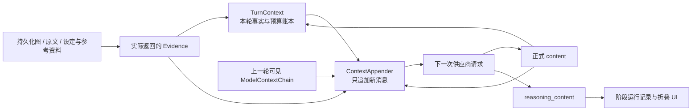

# Worldseed 模型上下文链、KV 缓存与机械压缩设计

## 1. 文档地位

本文是 Worldseed 关于以下主题的权威设计：

- 模型上下文如何跨阶段、跨轮次连续追加；
- `TurnContext` 与模型实际消息链如何分工；
- DeepSeek 等供应商的前缀 KV 缓存如何复用；
- 模型上下文接近窗口上限时如何机械压缩；
- 退出默认可见上下文的历史资料如何重新召回。

本文不改变世界事实、动态图、历史版本、任务检查点和推演历史的既有持久化原则。若其他文档仍描述“由 AI 生成上下文摘要、压缩提案、压缩复核或压缩检查点”，以本文为准，相关旧协议必须在实现前同步删除。

本设计先完成评审，再进入代码改造。

## 2. 目标与非目标

### 2.1 目标

1. 同一条推演分支只维护一条连续的模型上下文链。
2. 每次模型调用都在上一请求的完整可见前缀后追加内容，不为不同阶段重新拼装一套独立提示词。
3. 后续阶段能自然继承前面已经读取的资料和已经完成的工作，减少重复检索。
4. 让供应商尽可能复用相同前缀的 KV 缓存，使缓存命中率随链条增长而提高。
5. 在有限上下文窗口内优先保留小说正文连续性，并能从持久化图和原文中恢复已移出的历史细节。
6. 压缩行为确定、可解释，不让 AI 摘要成为新的事实层。

“单一上下文链”和“高 KV 命中”是同一产品约束的两个可观测面，不能相互替代。验收必须同时证明活动世界线只有一条当前链、相邻正式请求保持完整字节前缀、只有首条规则消息使用 `system` 角色，并且同一模型暖链后的 KV 命中达到门限；任一项失败都表示当前上下文链未达到要求。

### 2.2 非目标

- 不把整个世界图、全部设定集或全部参考文件一次性放入上下文。
- 不把模型上下文或供应商 KV 缓存当作世界事实来源。
- 不保存供应商内部 KV 张量，也不依赖供应商一定命中缓存。
- 不使用 AI 总结历史上下文，不增加语义压缩阶段。
- 不在上下文中保存“已移出第几章到第几章”、逐章移出记录、返回指针或压缩摘要。
- 不在本设计中处理推演事务原子性、历史分支切换或任务检查点的完整实现。

## 3. 核心原则

### 3.1 一条当前模型上下文链

同一条活动推演分支只有一个 `ModelContextChain`。一轮推演不是多组相互独立的模型请求，而是在同一消息链上连续工作：

```text
稳定系统提示词
→ 用户本轮输入与首批必读资料
→ 当前阶段指令
→ AI 当前阶段输出
→ 新检索到的 Evidence
→ 下一阶段指令
→ AI 下一阶段输出
→ ……
→ 本轮正文与图完成提交
→ 下一轮用户输入
→ 继续追加
```

在同一轮和两次压缩之间，已发送消息必须保持内容、顺序和序列化结果不变。新的规则、证据、修复要求和阶段指令只能追加在尾部，不能回头修改旧消息。触发机械压缩时，允许直接从当前链移出旧轮次内容；被移出的内容由推演历史快照负责恢复，不需要在当前项目中同时保留第二份完整消息链。

### 3.2 上下文不等于事实库

三者职责不同：

- `ModelContextChain`：模型当前实际可见的消息序列，负责连续工作和 KV 缓存复用。
- `TurnContext`：本轮事实权限账本，记录实际读取、待提交产物、阶段结果和预算使用。
- 持久化图、图修订、原文单元与章节 Markdown：世界历史和当前状态的权威来源。

模型只能使用当前可见链中有真实来源的旧资料、已提交正文和本轮新产生的内容。仍在可见链中的 Evidence 已经由先前实际读取进入链条，后续轮次可以直接继承，不需要为了轮次边界重复检索；仅由模型推测、但未提交为正文或图事实的内容不会因为留在链中自动变成事实。资料已经被机械压缩移出、需要确认后续变更后的当前状态，或需要当前链中没有的精确原文时，才通过图或原文检索重新追加 Evidence。

当前状态采用“最新覆盖、无更新则继承”的通用规则：

1. 对同一事物的同一项事实或状态，旧资料与更新的已提交图修订、设定资料或其他有效来源发生冲突时，以时间或版本更新且已经提交的内容为准；
2. 旧资料中存在某项事实或状态，而其后没有任何已提交内容修改、终止、归档或否定它时，继续继承旧值，视为该项没有发生变化；
3. 在当前检索规则、检索预算和实际返回范围内没有召回更晚的已提交更新时，按“没有变化”处理并继续继承旧值；该判断接受召回不完整带来的残余风险，不声称已经证明全局不存在更新；
4. 显式删除、终止、归档、失效和不确定性记录本身属于更新，不能按“没有新值”回退到旧状态；
5. 查询过去状态时，使用目标时间点之前实际召回的最后一个有效状态；查询当前状态时，使用当前实际召回演化链上的最后一个有效状态。

这是一条与人物、势力、地点、物品或其他具体领域无关的通用版本解析原则，不为不同事物类型建立专用规则。

### 3.3 模型推理内容与上下文分离

供应商返回的原生 `reasoning_content` 单独保存到阶段运行记录，用于 UI 中默认折叠的“AI 思考”面板。它不是世界事实，也不进入后续模型上下文。

只有通过当前阶段协议和业务 Schema 校验的正式 `content` 才能追加到当前 `ModelContextChain`。结构校验失败时，编排器必须停留在当前阶段，不能进入任何后续阶段。原始失败输出、校验错误和修复次数写入该阶段的尝试日志与任务检查点，不进入正式上下文链，也不能成为后续事实依据。

修复调用仍使用当前唯一正式链作为稳定前缀，并临时追加“失败输出、校验错误和本阶段修复要求”作为本次请求尾部；临时修复尾部只属于该次模型尝试。修复成功后，仅将通过校验的最终阶段结果追加到正式链；修复失败或达到尝试上限时，任务停留在当前阶段并进入可恢复暂停。这样正式链天然只包含有效阶段结果，不需要让后续 AI 在多个失败版本之间判断权威性。

合法返回的 `request_read`、`revise` 或其他协议允许的回流决定不是失败输出。它们作为有效阶段结果进入正式链，并按阶段协议回到允许的检索或前置阶段；只有当前阶段给出允许前进的有效结果时，编排器才能进入后续阶段。

### 3.4 缺失资料时继续合理推演

图、设定集和参考文件有资料时必须遵守；没有命中所需资料时，模型应依据当前上下文合理补全新的世界内容，而不是因为“资料不足”拒绝生成。新增内容在正文出现后仍按图治理流程进入持久化图。

## 4. 两类运行上下文

### 4.1 TurnContext：事实与执行账本

`TurnContext` 以一轮任务为边界，至少表达：

```ts
type TurnContext = {
  contextId: string
  projectId: string
  taskId: string
  turnId: string
  taskKind: "turn" | "query" | "evolution" | "revision"
  baseCommittedSequence: number
  segments: ContextSegmentRef[]
  readLedger: ContextReadLedger
  budget: ContextBudgetSnapshot
}
```

它回答的是：

- 本轮用户要求是什么；
- 本轮实际读取了哪些图、原文、规则或参考资料；
- 哪些资料只是请求过但没有返回；
- 各阶段产生了什么结果；
- 哪些内容仍处于 pending，哪些已经 committed；
- 本轮已经消耗多少调用、时间和 Token。

`requestedReadIds` 不是事实。只有检索层真实返回并写入 `returnedReadIds` 的 Evidence 才能进入后续阶段。

新一轮建立 `TurnContext` 时，应登记当前 `ModelContextChain` 中仍可见且有来源的继承 Evidence。继承表示复用已经实际读取的内容，不产生新的读取请求，也不重复计算检索次数；若依据已经退出可见链，则必须重新检索后才能进入本轮读取账本。

### 4.2 ModelContextChain：供应商可见消息链

`ModelContextChain` 以活动推演分支为边界，跨越多个 `TurnContext`：

```ts
type ModelContextChain = {
  chainId: string
  projectId: string
  historyBranchId: string
  modelProfileId: string
  protocolVersion: string
  visibleMessages: ModelMessageRef[]
  usage: ModelContextUsage
}
```

它回答的是：

- 下一次请求需要向供应商发送哪些消息；
- 这些消息的精确顺序是什么；
- 哪些前缀可以与上一次请求保持完全一致；
- 当前可见上下文预计占用多少 Token；
- Evidence 和已有图对象在模型可见文本中使用哪个项目级永久 ID。

不同历史分支、不同项目或明确隔离的后台任务不得共享可变消息链。它们可以共享完全相同的稳定系统前缀，从而分别获得供应商前缀缓存收益。

`modelProfileId` 只表示当前请求使用的模型配置，不是剧情分支身份。用户切换模型时，继续使用同一历史分支和同一份当前上下文消息；新模型从这份消息开始请求，供应商 KV 缓存重新建立，但不能创建新的剧情分支或丢失上下文。

### 4.3 二者的关系



`TurnContext` 不负责每次重新生成完整 Prompt；`ModelContextChain` 也不决定某条资料是否具有事实权限。二者必须同时存在，不能合并成一个含义模糊的“大上下文对象”。

## 5. 消息链组织

### 5.1 稳定系统提示词

链条创建时，首先写入锁定的系统提示词，来源是平台不可修改的基础规则 Markdown 和固定协议。系统提示词只写入一次，始终位于整条消息链最前端，后续阶段和后续轮次都不能再次追加、替换、覆盖或修改。其至少包含以下恒定规则：

- 当前模型上下文并不等于完整世界历史；
- 需要过去事实、状态、原话或完整过程时，从持久化图、图修订和 `source` 中选择性检索；
- 内容不在当前可见上下文中，不代表它没有在世界中发生；
- 只使用当前可见链中有真实来源的继承内容、本轮实际读取的旧图和资料，以及本轮新产生的内容；
- 图中没有资料时允许根据当前上下文合理推演补全；
- 保持时间、空间、状态、因果与主体认知连续；
- 万事万物均可进入图，图结构与查询规则由 AI 按通用原则自主组织和演化。

系统提示词规范化后必须保持字节稳定。随机 ID、时间戳、运行进度、Token 使用量和 UI 状态不得进入该前缀。平台系统规则升级不能原地修改已经存在的链；现有链继续使用创建时的系统规则版本，只有显式创建新链版本时才能采用新的系统规则。

### 5.2 每轮开始追加的内容

每轮用户输入到来后，按固定顺序追加：

1. 当前项目目录快照；
2. `世界推演规则/用户规则` 下全部 Markdown；
3. 不可删除但可编辑的 `设定集/readme.md`；
4. 不可删除但可编辑的 `参考文件/readme.md`；
5. 根据索引和当前上下文选择性读取的设定与参考资料；
6. 根据当前依赖选择性读取的图和原文 Evidence；
7. 用户前置提示；
8. 用户本轮输入；
9. 用户选择的描写规则、笔风规则和字数范围；
10. 固定的本轮后置强调；
11. 当前阶段的任务说明和输出契约。

`表现输出` 只读取本轮选中的描写规则和笔风规则；`章节正文` 不默认全量读取。历史正文需要进入上下文时，通过 `source` 或明确的章节读取按需返回。

用户规则与系统规则不同：每一轮都必须重新读取 `世界推演规则/用户规则` 下的全部 Markdown，并把本轮完整用户规则追加到链尾，即使文件内容与上一轮完全相同也不能省略。本轮推演以本轮追加的用户规则为当前有效版本；旧轮次用户规则仍保留在链中作为当时的规则背景，但不能覆盖较新的规则。机械压缩后只保留当前轮的完整用户规则，旧轮次副本从默认可见上下文中移出，原文件版本和推演历史不删除。

### 5.3 阶段间只追加

每个阶段遵循相同模式：

```text
已有可见消息链
→ 追加本阶段新增 Evidence（如有）
→ 追加本阶段核心指令与业务 Schema（均作为 user 尾部消息）
→ 调用模型
→ 追加模型正式输出（assistant 消息）
```

首条消息只能承载锁定的系统规则；后续阶段不能在历史 assistant 消息之后插入新的 system 消息。阶段说明、协议、业务 Schema 和输出要求统一追加为请求尾部的 user 消息，正式结果追加为 assistant 消息。这样既符合 DeepSeek 多轮消息协议，也让上一次完整请求成为下一次请求的可复用前缀。本阶段最重要的输出要求和业务 Schema 必须放在请求尾部。公共规则已经位于稳定前缀，不应在每个阶段重新复制一份导致前缀漂移。

旧项目若包含历史阶段遗留的 system 角色，不新建链、不改写历史记录；模型发送边界将首条系统规则之后的遗留 system 消息规范化为 user。规范化后的完整消息序列才是 KV 前缀验收对象，且同一模型连续三次的平均命中率默认不得低于 90%。

AI 提出资料读取请求后，代码执行检索。检索结果作为新的 Evidence 消息追加，然后再追加“基于这些已返回资料继续当前阶段”的尾部指令。未命中只能追加统一的检索缺口标记，不能伪造随机 Evidence ID。

### 5.4 跨轮次保留

一轮完成后不创建新的模型链。下一轮用户输入继续追加到现有链尾部。因此在未压缩时，模型自然看到前几轮正文和阶段工作过程，不需要每个阶段反复把历史重组为新 Prompt。

跨轮次保留不改变持久化事实规则：长期一致性最终仍依赖图、修订和原文，而不是假设所有历史永远停留在模型窗口内。

仍然可见的旧资料用于减少重复读取；涉及“当前状态”的判断必须应用“最新覆盖、无更新则继承”。若可见链只含较早状态，阶段应沿相关事物和状态出口查询后续已提交修订：召回更新则使用最新值，在当前检索预算内没有召回更新则继续使用旧值。该规则优先保证推演可以继续，不承诺消除所有召回遗漏。

### 5.5 图 Evidence 的按需新鲜度校验

图 Evidence 保存读取时的 `ownerKind`、`ownerId` 和 `revisionId`。`revisionId` 表示该 Evidence 对应的图对象修订快照，不表示故事内时间。

当模型在本轮明确提出已有图身份作为 `anchorIds` 时，应用只对本次请求的锚点及其已展开局部批量读取当前 head revision，不扫描整张图：

```text
当前可见 Evidence(ownerId, revisionId)
        + 本轮实际依赖的 anchorIds
        -> 批量比较当前 head revision
        -> 相同：登记本次已满足，复用原 Evidence，不创建新读取
        -> 不同或缺失：读取该所有者的当前投影，追加新 Evidence
        -> 旧 Evidence 保留，并标记为 historical
```

版本一致只表示图对象没有新的已提交修订；它不代表模型可以使用未展示过的邻域或原文。后台演化或其他任务产生的更新不会自动把全部内容追加到主剧情链；当本轮依赖锚点的 head 发生变化时，锚点查询才把相关最新投影追加到主链。这样既保持单链和 KV 缓存前缀，又避免把无关后台变化灌入当前叙事视角。

## 6. 项目级永久 ID 与前缀计数器

### 6.1 目的

模型和数据库对已有对象统一使用同一个紧凑永久 ID，不再维护 `node-2 -> UUID`、`read-3 -> UUID` 之类的长期双向别名。永久 ID 由代码生成，AI 只能复用已经提供的 ID。

```text
node_1
link_1
evidence_1
revision_1
source_1
```

`nodeId` 和 `evidenceId` 仍然表示不同对象：前者表示图身份，后者表示一次具有来源、版本和摘要的实际读取结果。取消的是“同一个对象同时具有模型别名和数据库 UUID”这层重复表示。

### 6.2 按前缀独立计数

每个项目维护一组以技术前缀为键的独立单调计数器，语义等价于：

```text
node     -> 102
source   -> 121
link     -> 23
evidence -> 86
revision -> 147
```

下一次分配分别得到 `node_103`、`source_122`、`link_24`、`evidence_87` 和 `revision_148`。所有前缀互不共享数值序列，前缀由代码定义，AI 不得新增或修改前缀。

建议基础设施表：

```sql
CREATE TABLE id_counters (
  prefix TEXT PRIMARY KEY,
  current_value INTEGER NOT NULL
);
```

每次递增必须在 SQLite 事务中原子完成。计数器属于项目基础设施，不属于某轮推演、某个任务检查点或某条世界线；所有世界线共享同一组计数器。历史恢复、返回上一轮、分叉、删除、归档和失败任务都不能回退或复用已经分配的编号。允许出现编号空洞，不能为了连续外观牺牲唯一性。

永久 ID 只表示技术身份。编号大小不能被 AI、代码或用户界面解释为世界时间、剧情顺序、重要程度或修订新旧。

### 6.3 新对象的局部引用

AI 在一次 `graph_governance` 结果中提出多个新对象时，这些对象尚未获得永久 ID，因此只在当前治理事务内使用 `local:*` 建立相互引用。代码验证完整治理结果后，按对象技术类别调用对应前缀计数器，为每个局部引用分配一次永久 ID：

```text
local:old-copper-key -> node_103
local:key-holder     -> node_104
```

该映射只服务当前治理事务的物化，不是长期模型别名表。提交后，数据库、Evidence、后续模型阶段和后续轮次统一使用永久 ID。

## 7. 模型上下文配置

### 7.1 唯一容量来源

每个模型配置必须包含模型最大上下文：

```ts
type ModelContextPolicy = {
  contextWindowTokens: number
  compressionTriggerRatio: number
  compressionTargetRatio: number
}
```

默认值：

```text
contextWindowTokens = 1,000,000
compressionTriggerRatio = 0.97
compressionTargetRatio = 0.50
```

模型配置是最大上下文容量的唯一事实来源。项目级设置可以选择压缩比例，但不能再维护一份与模型配置冲突的 `contextWindowTokens`。

### 7.2 触发判定

不能等供应商拒绝请求后才压缩。业务层必须先完成本次请求的完整消息组装，包括当前可见链、本阶段新增 Evidence、本阶段指令和输出 Schema，然后计算实际输入占用：

```text
本次输入占用 = tokenizer(本次完整请求消息)
```

当：

```text
本次输入占用 >= contextWindowTokens × compressionTriggerRatio
```

立即执行机械压缩，再组装下一次请求。

压缩完成后必须重新组装并重新计算实际输入占用，不能使用压缩前的估算值。默认不发送 `max_tokens`，由模型自身决定输出长度；系统不额外猜测或限制模型输出预算。

Token 计算应使用当前模型对应 tokenizer；没有精确 tokenizer 时使用偏保守估算，并记录估算来源。机械压缩会移出所有允许移出的旧轮次内容；如果旧模型的实际上下文窗口过低，导致系统规则、当前有效规则和当前轮保护内容本身超过该模型上限，则该模型不满足项目的上下文能力要求，任务暂停并提示用户切换支持更大上下文的模型。正常支持项目配置窗口的模型不会因为压缩目标本身而无限循环。

## 8. 两阶段机械压缩

### 8.1 总原则

压缩是从下一次供应商请求的默认可见消息集合中移出内容，不是删除持久化资料，也不是让 AI 总结。

压缩过程：

- 不调用模型；
- 不生成摘要；
- 不生成压缩提案或压缩复核；
- 不创建“第几章已移出”的上下文消息；
- 不创建逐章返回入口；
- 不修改章节 Markdown、原文单元、世界图、图修订、结算映射或阶段运行记录；
- 只按已提交边界和消息种类确定性地选择保留项。

### 8.2 压缩前的保护项

任何阶段都必须保留：

1. 稳定系统提示词；
2. 当前有效的全部用户规则；
3. 当前轮从用户输入开始到当前时刻的全部消息；
4. 当前轮实际读取的 Evidence、阶段输出、校验与修复消息；
5. 当前轮尚未完成的依赖和 pending 产物。

如果仅系统提示词、当前有效用户规则和完整当前轮就已经超过模型窗口，不能破坏这些保护项。任务应进入可恢复暂停，由用户调整规则规模、模型上下文或任务输入后继续。

### 8.3 第一阶段：只保留旧轮次正文

第一阶段处理“当前轮之前”的内容：

- 保留每轮最终已提交的章节标题和完整正文；
- 移出旧轮次用户输入；
- 移出旧轮次目录快照、用户规则副本和索引副本；
- 移出旧轮次阶段指令、业务 Schema、阶段 JSON 输出和修复消息；
- 移出旧轮次 Evidence、检索请求、审查结果、图治理中间产物和运行诊断；
- 移出旧轮次 reasoning 的展示引用；reasoning 本来就不进入模型链。

这里的“正文”必须是最终 committed 的小说原文，不是草稿、摘要、阶段 JSON 中嵌套的正文副本，也不是被修订前的候选文本。

正文生命周期必须遵守唯一提交边界：`draft`、`chapter_naming`、审查结果和图治理结果都属于 pending 阶段产物；只有正文与图完成提交、原文单元和结算映射建立成功后，才向当前上下文追加一条唯一的正式章节消息。该消息引用已提交的 `sourceId`、章节身份和原文顺序，但正文内容必须与已发布 Markdown 完全一致。提交失败时不追加正式章节消息，草稿也不能进入旧轮次正文保留集合。

第一阶段完成后重新计算可见上下文占用。如果已经不超过 `contextWindowTokens × compressionTargetRatio`，压缩结束。

### 8.4 第二阶段：按整章移出最旧正文

若第一阶段后仍超过目标比例，则：

1. 从最旧的已提交章节开始；
2. 每次移出一个完整章节的标题和正文；
3. 每移出一章重新计算 Token；
4. 直到可见上下文不超过 `contextWindowTokens × compressionTargetRatio`；
5. 不能截断章节，不能只保留章节摘要，不能优先按人物、势力或事件类型做特化裁剪。

当前轮始终不参与第二阶段。当前轮完成后，它在未来轮次中成为普通的已提交章节，才可以按时间顺序进入第二阶段候选。

### 8.5 为什么不保存压缩检查点

移出上下文不等于丢失资料。系统已经有：

- `章节正文/*.md`；
- 不可变 `source` 原文单元；
- 世界图及图修订；
- 正文与图的结算映射；
- 既有阶段运行记录和推演历史。

因此无需再制造“压缩摘要”“已移出章节范围”或动态返回指针。系统提示词只需恒定说明历史资料可从图、修订和 `source` 查询。随着章节增多，这条恒定规则不会增长。

当前链被压缩后，压缩前的完整上下文不再作为当前运行数据保留。需要回到压缩前状态时，使用推演历史中的完整快照恢复，而不是依赖压缩摘要、移出范围记录或返回指针。

### 8.6 推演历史负责恢复上下文

当前分支只保留一份活动中的 `ModelContextChain`。每个自动保存点和手动保存点都是该时刻的完整逻辑快照，至少包含：

- 当时的模型上下文消息及其顺序；
- 当前链的模型、协议版本和已经出现的永久 ID；
- 当前任务阶段、最近稳定任务检查点和暂停状态；
- 世界图、图修订、正文、`source` 映射和工作区 Markdown 文件；
- 本次推演所需的配置与规则版本。

内部 Git 可以使用内容寻址和对象复用，避免重复存储相同消息和文件；这不改变“每个历史记录都能恢复完整逻辑状态”的语义。

```text
历史快照 A：某个已经保存的完整状态
        ↓ checkout 后继续工作
当前活动链：机械移出旧消息，不修改快照 A
        ↓ 下一次自动保存或手动保存
历史快照 B：保存新的完整逻辑状态
```

加载历史快照 A 会恢复压缩前的上下文，加载历史快照 B 会恢复压缩后的上下文。加载历史记录后统一置为暂停，不自动继续执行。

## 9. 历史召回

### 9.1 召回路径

当用户或推演依赖早期事实时，不扫描全部章节，也不依赖压缩清单：

```text
当前问题或依赖
→ 先查询图，确定事物身份、关系、历史演化和当前状态
→ 需要精确对白、原句、标题、数值或完整过程时查询 source
→ 只把实际命中的 Evidence 追加到当前模型链
→ AI 基于已返回证据继续回答或推演
```

图负责快速找到“是什么、与谁有关、何时何地发生、如何演化、当前怎样”；`source` 负责返回正文中的精确表达和连续原文窗口。二者互补，不能只靠图摘要回答精确对白，也不能每次全文扫描小说。

### 9.2 未命中时的处理

- 图和 `source` 命中：使用实际返回资料。
- 图未命中但 `source` 命中：根据原文恢复身份和事实，并允许后续图治理补齐可发现路径。
- 图命中但需要精确原话：继续查询 `source`，不能把图中的概括当原话。
- 两者均未命中：明确这是当前资料缺口；创作任务可依据上下文合理补全新内容，历史事实查询不得把推测冒充已发生事实。

### 9.3 `source` 索引与连续窗口

`source` 的快速查询由应用层索引完成，不能只依赖提示词让 AI 自己翻阅全部正文。每个不可变原文单元建立以下通用索引信息：

- 原文身份、版本身份和同一来源内的稳定顺序；
- 规范化内容摘要和可精确匹配的 `exactKeys`；
- 已提交图、修订和结算映射提供的来源反向入口；
- AI 提炼的 `semanticTexts` 作为语义候选入口，不替代原文；
- 原文单元 Token 估算和可返回的连续邻接关系。

查询按以下顺序执行：

1. 使用非空 `exactKeys` 命中精确索引；
2. 使用图节点、连接、修订或结算来源反向索引定位相关原文单元；
3. 没有精确入口时，使用语义索引取得有界候选；
4. 围绕首个高相关单元，按同一 `sourceId` 的顺序展开连续原文窗口；
5. 应用 `maxCandidates`、`maxEvidenceTokens` 和单次窗口上限后返回 Evidence。

代码只负责规范化、索引、去重、排序和窗口边界，不理解人物、势力、地点、对白或其他领域类型。AI负责根据返回的局部原文判断证据是否足够，并决定是否继续提出下一次读取。

## 10. KV 缓存复用

### 10.1 工作方式

DeepSeek API 在应用层仍是无状态 HTTP 请求。应用每次发送当前完整可见消息链，供应商根据相同前缀自动复用 KV 缓存。

理想调用序列：

```text
请求 1 = A
请求 2 = A + B
请求 3 = A + B + C
请求 4 = A + B + C + D
```

若 `A`、`B`、`C` 的文本、角色、消息边界和序列化结果完全相同，后续请求应有越来越大的缓存命中前缀。当前实现若每阶段重新生成四条消息、重新排序 Evidence 或重新生成对象 ID，就会破坏这一性质。

### 10.2 保持前缀稳定

- 已发送消息不改写、不重新规范化；
- 固定 JSON 字段顺序和 Markdown 包装格式；
- Evidence 按追加顺序进入，不每次重新全量排序；
- 已有对象的永久 ID 不重新编号；
- 阶段差异放在尾部，不改系统提示词；
- 用户规则每轮完整追加在既有链尾，不回到链首修改系统前缀；
- 动态预算、耗时和缓存统计不注入稳定前缀；
- 模型、系统提示词或协议发生变化时显式开启新链或新链版本，不静默重写旧前缀。

机械压缩会使可见前缀发生一次变化，因此压缩后的第一次请求可能降低缓存命中。之后继续在压缩后的稳定链上追加，命中率应再次逐步提高。这是有限窗口下可接受的成本。

### 10.3 指标

每次模型调用记录：

```ts
type KVCacheUsage = {
  totalInputTokens: number
  cacheHitInputTokens?: number
  cacheMissInputTokens?: number
  outputTokens: number
  hitRate?: number
}
```

```text
hitRate = cacheHitInputTokens / totalInputTokens
```

供应商没有返回缓存明细时，UI 显示“不可用”，不能显示 `0%`。监控面板同时显示本次调用、本轮累计和当前活动链的趋势，以便发现某个阶段是否意外重建了前缀。

缓存命中只影响速度和费用，不扩大事实权限，也不改变图提交与检索规则。

## 11. 失败、暂停与恢复

### 11.1 调用或校验失败

任何错误都不能直接丢弃本轮已完成工作：

- 保留最后一个完整阶段结果；
- 保留已经追加并通过校验的正式模型输出和实际 Evidence；
- 当前失败响应只保存到阶段尝试日志，不追加到正式模型上下文；
- 保存错误类别、阶段、预算与调用统计；
- 未达到修复上限时，使用正式链加临时修复尾部继续执行当前阶段；
- 达到修复上限或无法自动继续时，将任务停留在当前阶段并置为可恢复暂停；
- 用户确认面板统一提供“继续执行”“从本轮当前阶段继续”“从本轮当前阶段暂停”三个动作；
- “继续执行”在用户处理可重试错误或重置相关指标后继续当前工作流；
- “从本轮当前阶段继续”从当前轮最近稳定阶段状态恢复，不跳过当前阶段；
- “从本轮当前阶段暂停”保存当前可恢复状态但不发起模型请求；
- 用户选择重新执行本阶段时创建新的阶段尝试，不改写旧尝试日志。

### 11.2 上下文超限

本次完整请求的实际输入达到 97% 时自动执行两阶段机械压缩，不需要用户确认。只有保护项本身无法放入模型窗口时才暂停，并让用户调整配置；不能静默截断当前轮或让供应商自行丢失前文。

### 11.3 恢复与历史切换

恢复任务时必须从对应历史快照恢复该时刻唯一的 `ModelContextChain` 和最近稳定任务状态。历史切换不需要重启应用，也不能把一个分支的动态消息追加到另一个分支。恢复完成后统一置为暂停，由用户决定是否继续。

手动保存若发生在模型请求中，仍回落到最近稳定任务检查点，并在恢复后保持暂停。该任务检查点属于推演历史设计，不是上下文压缩检查点，两者不得混淆。

## 12. 实现职责边界

### 12.1 ContextChainStore

- 持久化当前活动分支唯一的有序模型上下文；
- 在普通阶段和轮次执行期间保证只追加写入；
- 允许 `ContextWindowManager` 在机械压缩时替换压缩后的当前链；
- 读取当前可见消息；
- 在历史分支切换时加载对应链；
- 不判断世界事实，不执行检索。

### 12.2 HistorySnapshotStore

- 一轮完成后自动保存完整逻辑快照；
- 用户手动保存时，保存最近稳定任务检查点对应的完整逻辑快照；
- 恢复指定历史时，整体恢复当前上下文链、图、正文、工作区和任务状态；
- 使用内部 Git 的内容寻址和对象复用减少重复存储；
- 不与项目正式 Git 仓库共用目录、分支或索引。

### 12.3 ContextAppender

- 将用户输入、Evidence、阶段指令和正式输出按固定格式追加；
- 保证旧消息字节不变；
- 绑定 `TurnContext` 片段与模型消息；
- 不允许编排器和模型适配器各自重新拼 Prompt。

### 12.4 ProjectIdAllocator

- 按项目和前缀原子分配永久 ID；
- 保证每个前缀独立单调递增；
- 永不回退、回收或复用已经分配的编号；
- 将当前治理事务的 `local:*` 一次性物化为永久 ID；
- 不解释前缀之外的世界语义。

### 12.5 ContextWindowManager

- 读取模型配置中的上下文窗口；
- 在发送前组装并计算本次完整请求的实际输入 Token；
- 在 97% 触发机械压缩；
- 执行阶段一和阶段二的确定性保留规则；
- 压缩到 50% 以下；
- 不调用 AI，不生成业务数据。

### 12.6 TurnOrchestrator

- 决定下一业务阶段和读取动作；
- 更新 `TurnContext`；
- 调用统一追加器和窗口管理器；
- 不自行构造完整模型消息，不维护第二套 ID 表示。

### 12.7 ModelAdapter

- 接收已经完成的可见消息序列；
- 原样发送给供应商；
- 返回正式内容、原生思考、Token 与缓存统计；
- 不重建上下文，不重新编号引用，不把阶段输入再次包装成另一套四消息 Prompt。

## 13. 与现有设计和代码的差异

旧的 AI `context_compaction`、`context_compaction_review` 阶段、Schema、提示词资源和阶段跳转已经从当前代码契约移除；其他架构文档也必须只描述业务层机械压缩。

截至 2026-08-10，当前工作树已经实现的基础：

1. SQLite 中已经存在每项目唯一的活动 `ModelContextChain` 和有序消息；
2. 基础系统规则在链创建时写入一次，阶段输入和校验成功输出沿链尾追加；
3. Schema 修复过程和原生 reasoning 不进入正式活动链；
4. 模型切换继续使用同一活动链；
5. 正式章节通过 Finalization 登记唯一正文引用，不把草稿当作正式章节消息。

当前仍待实施的代码差异：

1. 阶段消息仍包含较大的重复状态，尚未完全收敛为最小增量；
2. 模型引用仍使用按请求创建的临时别名和内部 UUID，需要统一迁移为项目级永久 ID；
3. 两阶段机械压缩和发送前精确 Token 计算尚未实现；
4. 模型配置和项目执行设置仍重复声明上下文窗口，需要统一模型配置为容量来源；
5. 活动链尚未接入完整历史快照、世界线切换和恢复；
6. 当前链中仍可见 Evidence 的跨轮继承尚未形成完整实现；
7. 三种错误暂停动作、额度重置和恢复游标仍未形成完整后端与 UI 闭环。

这些差异属于后续实现任务，不再通过增加 AI 压缩阶段解决。

## 14. 验收标准

### 14.1 上下文链

- 同一历史分支只有一条活动 `ModelContextChain`。
- 未触发压缩时，连续两个阶段的后一请求严格等于前一请求消息序列加尾部新增消息。
- 未触发压缩时，旧消息的角色、内容、顺序和序列化结果保持不变。
- 触发压缩后，当前活动链允许机械移出旧消息，不额外保留第二份完整当前链。
- 下一轮在上一轮活动链尾部继续追加，不重新创建独立 Prompt。
- 加载历史快照后，当前活动链、图、正文和任务状态与该保存点一致。
- 阶段校验失败时不能进入后续阶段，失败输出不能追加到正式链。
- 修复成功后只有最终有效阶段结果进入正式链。
- reasoning 只进入阶段记录和 UI，不进入后续模型消息。

### 14.2 事实权限与检索

- 未真实返回的读取请求不能成为模型事实依据。
- 当前链中仍可见且有真实来源的历史 Evidence 能被下一轮直接继承，不重复发起相同读取。
- 同一事实或状态发生冲突时使用最新已提交版本；没有后续更新时继承旧值。
- 当前检索预算内没有召回后续更新时继承旧值，并接受可能遗漏更新的已知风险。
- 已移出可见上下文的历史事实仍能通过图查询恢复。
- 精确对白、原句和完整过程能通过 `source` 返回，不由图摘要伪造。
- 图和资料均无命中时，创作任务能够合理补全，而不是拒绝生成。

### 14.3 压缩

- 模型配置默认上下文窗口为 1,000,000 Token。
- 实际请求输入达到模型窗口的 97% 前触发压缩。
- 第一阶段只保留系统规则、当前有效用户规则、完整当前轮和旧轮次最终正文。
- 第二阶段只按从旧到新的顺序移出完整章节。
- 压缩结束后可见上下文不超过 50%，除非保护项本身已超过该值。
- 不产生 AI 摘要、压缩检查点、移出章节清单或逐章返回指针。
- 章节 Markdown、`source`、图、修订和历史记录不因压缩而删除。

### 14.4 KV 缓存

- 不发生压缩时，阶段请求的缓存可复用前缀单调增长。
- Evidence 与图对象的永久 ID 跨阶段稳定，新对象只分配新的永久 ID。
- 缓存命中率在连续调用中可观测；供应商不提供指标时显示“不可用”。
- 缓存未命中只影响成本和耗时，不影响语义结果。

### 14.5 失败恢复

- 网络、Schema、预算、时间和上下文问题不会丢弃最近稳定任务检查点中的产物。
- 用户继续执行时从当前消息链尾部继续。
- 历史分支切换后加载对应链，不串入其他分支上下文。
- 历史恢复后任务保持暂停，不自动继续。
- 保护项无法放入窗口时任务暂停，不静默裁剪。

## 15. 实施顺序

本文评审通过后，按以下顺序实施：

1. 删除 AI 上下文压缩阶段及其协议冲突；
2. 统一模型上下文容量与压缩比例配置；
3. 增加 `ModelContextChain`、项目级前缀计数器和消息持久化契约；
4. 将模型适配器改为接收完整有序消息，不再自行重建 Prompt；
5. 将各阶段改为统一尾部追加；
6. 实现两阶段机械压缩；
7. 补齐历史图与 `source` 召回链路；
8. 增加 KV 缓存、压缩、恢复和历史分支自动化测试；
9. 完成真实模型跨阶段、跨轮次与压缩场景验收。

## 16. 正式章节与 Finalization

模型阶段返回的是带阶段协议的草稿响应，其中可能包含思考、JSON 外壳、审查建议和图治理产物。它会作为阶段运行记录保存，但不能直接当作正式上下文消息。

正文提交完成后，活动链只登记一条唯一的正式章节入口。入口引用已发布原文的 `sourceId/contentRef/contentDigest`，不复制 Markdown 正文。章节 Finalization 只负责正文、世界作用域、Markdown 和正式章节入口的收尾；历史保存 Finalization 另行冻结活动链、图、章节索引和任务检查点。
