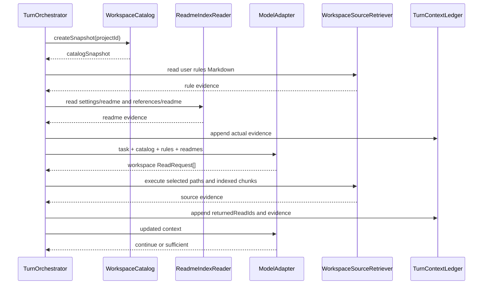
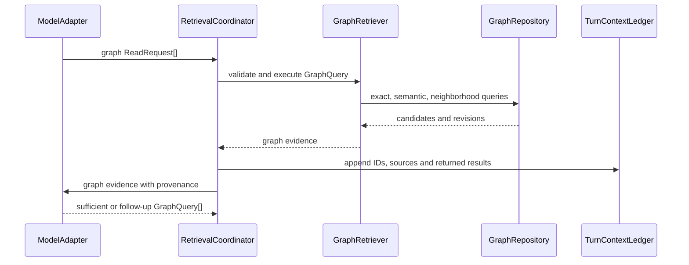

# Worldseed 动态上下文代码架构

> 项目设置只接受当前 `version: 2` 契约。系统不读取或迁移旧版设置；开发阶段的旧项目应直接重新创建。

## 1. 目的

本文定义 Worldseed 如何在一轮推演中动态读取资料和表现规则：

1. 依据 `readme.md`、目录快照和当前任务，选择性读取设定集与参考文件；
2. 读取用户本轮选择的描写规则、笔风规则和结构化字数约束；
3. 依据当前任务、已读取证据和图锚点，选择性读取世界图局部。

本文只规定代码模块、接口边界、数据流和资源预算，不规定人物、势力、地点、事件等领域类型。世界语义、身份复用、节点创建和连接含义由 AI 决定。

## 2. 核心原则

### 2.1 一个上下文账本

同一轮推演只创建一个 `TurnContext`。文件资料检索和世界图检索的结果都追加到同一个读取账本，不能分别创建互相隔离的上下文。

```text
用户输入
  -> TurnContext
  -> 动态读取编排器
       -> 工作区资料检索器
       -> 世界图检索器
  -> 证据写入读取账本
  -> AI 判断是否继续读取
  -> 正文或推演阶段
```

### 2.2 AI 决定查询意图，代码执行查询

AI 可以决定：

- 是否需要读取设定集、参考文件或世界图；
- 查询关键词、路径提示、语义描述和图锚点；
- 查询结果是否足够；
- 是否继续扩大查询范围；
- 如何解释证据并形成后续推演。

代码负责：

- 读取目录、Markdown、索引和图数据；
- 执行路径、全文、精确、语义和邻域查询；
- 限制读取深度、数量、字符数、token、耗时和并发；
- 保存版本、来源、读取原因和返回结果；
- 防止未返回的资料进入本轮上下文。

代码不根据文件内容判断它是人物、势力、地图或事件，也不替 AI 决定节点语义。

### 2.3 请求不等于已读取

AI 输出 `requestedReads` 只表示提出了读取意图。后端实际返回结果后，才将资料 ID 写入 `returnedReadIds`，并允许后续阶段引用。

```text
requestedReads
  -> 后端执行
  -> returnedReadIds
  -> EvidenceSegment
  -> ContextSegment
```

如果某轮读取执行后没有产生任何此前未见的 Evidence，代码立即记录一个不可引用的检索缺口并结束当前阶段的读取循环。已经读取过的文件再次命中、空结果和被预算拒绝的请求都不算新增证据；它们不能驱动相同阶段反复调用模型直到耗尽最大轮次。检索缺口只证明“本次查询没有获得新资料”，不冒充真实资料，也不能进入 `citedReadIds`。

### 2.4 表现规则每轮实际读取

描写规则和笔风规则不参加普通资料检索。每轮在第一次模型调用前直接读取用户选择的 Markdown；处于自动模式或未单独选择某一类规则时，读取该类的默认 Markdown。两类规则与结构化字数上下限共同进入本轮强调上下文，表现规则文件不能因为设定集或参考文件检索预算而被省略。

## 3. 模块分层

```text
apps/backend/src/
├── application/
│   ├── context/
│   │   ├── context-assembler.ts
│   │   ├── context-view-builder.ts
│   │   └── prompt-segment-assembler.ts
│   └── retrieval/
│       ├── retrieval-coordinator.ts
│       ├── workspace-source-retriever.ts
│       ├── graph-retriever.ts
│       ├── evidence-collector.ts
│       └── ports/
│           ├── workspace-source-port.ts
│           ├── graph-retrieval-port.ts
│           ├── catalog-port.ts
│           ├── retrieval-ledger-port.ts
│           ├── evidence-store.ts
│           ├── source-content-port.ts
│           ├── catalog-snapshot-repository.ts
│           ├── retrieval-budget-ledger-repository.ts
│           └── context-checkpoint-repository.ts
├── core/
│   ├── context/
│   │   ├── turn-context.ts
│   │   ├── context-compressor.ts
│   │   ├── context-checkpoint.ts
│   │   ├── context-budget.ts
│   │   └── retrieval-budget-ledger.ts
│   └── workspace/
│       ├── workspace-catalog.ts
│       ├── readme-index.ts
│       └── source-selection.ts
└── infrastructure/
    ├── filesystem/
    │   ├── workspace-catalog-adapter.ts
    │   ├── markdown-source-adapter.ts
    │   └── source-chunk-index-adapter.ts
    └── sqlite/repositories/
        ├── sqlite-source-index-repository.ts
        ├── sqlite-retrieval-ledger-repository.ts
        ├── sqlite-retrieval-budget-ledger-repository.ts
        ├── sqlite-evidence-store.ts
        ├── sqlite-catalog-snapshot-repository.ts
        └── sqlite-context-checkpoint-repository.ts
```

### 3.1 Core 层

Core 只定义不可变数据结构、预算计算和上下文压缩规则，不依赖 Electron、SQLite、模型 SDK 或文件系统。

### 3.2 Application 层

Application 负责单轮读取编排、阶段顺序、预算消耗和读取账本更新。它通过 port 访问文件索引和图仓储，不直接操作外部设施。

### 3.3 Infrastructure 层

Infrastructure 将 port 适配到本地文件系统、Markdown 索引、SQLite 和图数据库。它不参与世界语义判断。

### 3.4 Model Adapter 层

模型适配器只负责 Prompt 序列化、Thinking Mode、JSON 文本提取、响应校验和内部协议转换。模型适配器不能直接查询文件或图。

## 4. 核心接口

### 4.1 读取请求

```ts
type ReadRequest =
  | {
      requestId: string
      source: "workspace"
      reason: string
      expectedEvidence: string
      query: WorkspaceQuery
    }
  | {
      requestId: string
      source: "graph"
      reason: string
      expectedEvidence: string
      query: GraphQuery
    }

type WorkspaceQuery = {
  root: "settings" | "references"
  paths: string[]
  keywords: string[]
  semanticTexts: string[]
  maxFiles: number
  maxChunks: number
  maxChars: number
}

type GraphQuery = {
  anchorIds: string[]
  exactKeys: string[]
  semanticTexts: string[]
  directions: ("in" | "out" | "both")[]
  maxDepth: number
  maxCandidates: number
  maxEdges: number
  sourceKinds: ("graph" | "revision" | "source")[]
}
```

`paths`、`keywords` 和 `semanticTexts` 都是查询入口，不是领域 schema。方向、深度和候选数也只是无语义机械边界，不是出口定义、进入规则或停止规则。空查询不能被当作“读取所有资料”。

### 4.2 工作区资料检索器

```ts
interface WorkspaceSourceRetriever {
  retrieve(input: {
    projectId: string
    snapshot: WorkspaceCatalogSnapshot
    readme: ReadmeIndex
    query: WorkspaceQuery
    budget: WorkspaceRetrievalBudget
  }): Promise<WorkspaceEvidenceResult>
}
```

执行顺序：

```text
校验根目录
  -> 限定在 settings/references
  -> 解析精确路径
  -> 查询文件索引
  -> 查询 Markdown 片段索引
  -> 合并和去重
  -> 截断到字符与 token 预算
  -> 返回来源证据
```

`readme.md` 由上层在每轮强制读取。它的内容作为 AI 的索引依据，不作为程序脚本执行。

AI 可以根据 readme 提出路径和语义查询，但后端只能在对应根目录的实际目录快照中解析候选。请求路径必须存在、位于允许的根目录且扩展名为 `.md`；AI 发明的路径只会返回未命中证据，不能越过工作区边界。

第一阶段的工作区候选检索顺序固定为：

```text
精确路径
  -> readme 明确引用路径
  -> exactKeys 精确匹配
  -> 两个字符及以下的受限子串候选
  -> 三个字符及以上的 SQLite FTS5 trigram 候选
  -> AI 对候选片段复排和选择
```

第一阶段不引入向量数据库。未来需要 embedding 时，通过独立 `SourceSemanticIndexPort` 增加候选来源，不能修改 `RetrievalCoordinator`、`WorkspaceSourceRetriever` 或阶段业务流程。

### 4.3 世界图检索器

```ts
interface GraphRetriever {
  retrieve(input: {
    projectId: string
    scope: "committed" | "pending"
    query: GraphQuery
    budget: GraphRetrievalBudget
  }): Promise<GraphEvidenceResult>
}
```

`GraphRetriever` 通过三个独立端口组合证据：

```text
RetrievalRepository：精确与文本投影候选
GraphRepository：真实节点、连接、邻域和修订
SourceContentPort：sourceRefs 指向的不可变正文或资料原文
```

```ts
interface SourceContentPort {
  readSourceUnit(sourceRef: SourceRef): Promise<SourceEvidence | undefined>
}
```

`GraphRetriever` 不能直接访问文件系统、SQLite 或内部对象存储实现。

执行顺序：

```text
精确键查询
  -> 语义候选查询
  -> 根据投影 ownerId 读取真实节点或连接
  -> 读取当前有效修订
  -> 锚点直接邻接
  -> 按方向和深度扩展
  -> 按需读取正文来源和归档出口
  -> 合并节点、边、修订和来源
  -> 去重
  -> 截断到图预算
  -> 返回局部图证据
```

普通推演默认只读 `committed` 图。只有明确恢复 pending 任务时才允许读取对应的 `pending` 作用域。

### 4.4 动态读取编排器

```ts
interface RetrievalCoordinator {
  execute(input: {
    context: TurnContext
    requests: readonly ReadRequest[]
    budget: RetrievalBudget
    ledger: RetrievalBudgetLedger
  }): Promise<RetrievalOutcome>
}
```

编排器负责：

1. 生成目录快照；
2. 读取用户规则目录下全部 Markdown；
3. 读取设定集和参考文件的 `readme.md`；
4. 由 `source_retrieval` 模型阶段将规则、索引和当前任务交给 AI；
5. 接收并执行 AI 返回的工作区和图读取请求；
6. 将结果写入统一上下文；
7. 判断是否达到读取轮次或预算上限；
8. 将未解决依赖交给后续阶段，而不是伪造缺失事实。

`RetrievalCoordinator` 不调用模型。模型调用仍由 `TurnOrchestrator` 负责；编排器只执行已经通过协议解析的读取请求。这样模型生命周期和基础设施检索保持独立。

### 4.5 首轮动态读取决策

`source_retrieval` 必须是一个真正的模型阶段，不能由固定的 `mechanicalRetrieval()` 代替。它第一次调用时至少接收目录快照、全部用户规则、两个 readme、已选择的表现规则、结构化字数参数、用户输入和当前阶段产物，并输出第一批 `ReadRequest`。

```text
interpret
  -> rule_assembly
  -> source_retrieval AI 调用
       -> ReadRequest[]
       -> RetrievalCoordinator.execute
       -> Evidence[]
       -> source_retrieval AI 复核
       -> 足够或下一批 ReadRequest[]
  -> emergence_planning
```

`mechanicalRetrieval()` 只允许用于执行空请求后的协议收尾，不能负责选择资料。

`source_retrieval` 使用明确状态协议：

```ts
type RetrievalPhaseOutcome = "request_read" | "continue" | "blocked"
```

```text
plan
  -> request_read
  -> 后端执行并返回不可变 Evidence
  -> review
  -> request_read / continue / blocked
```

`request_read` 只表示中间状态，不能作为完成 artifact 传给后续阶段。只有 `continue` 表示当前证据足够，可以进入出现规划或正文；`blocked` 表示必要依据在预算和允许范围内仍无法取得。

### 4.6 上下文装配器

```ts
interface ContextAssembler {
  assemble(input: {
    baseRules: PromptResource
    phasePrompt: PromptResource
    context: TurnContext
    catalog?: WorkspaceCatalogSnapshot
    userRules: readonly Evidence[]
    readmeEvidence: readonly Evidence[]
    dynamicEvidence: readonly Evidence[]
    userTurn: UserTurnPrompt
    checkpoint?: ContextCheckpoint
  }): ModelContext
}
```

装配顺序固定为：

```text
system: 基础规则 + Prompt Contract + 阶段协议
dynamic: 目录快照 + 用户规则 + readme + 选择性资料 + 图证据 + 已选择表现规则正文
turn: 用户前置 + 用户输入 + 描写规则 + 笔风规则 + 字数 + 后置强调
append: 本轮阶段结果
```

所有模型阶段通过 `ContextAssembler` 获得上下文。`TurnOrchestrator`、模型适配器和检索器都不能自行拼接另一套 Prompt。

### 4.7 全局检索预算账本

```ts
type RetrievalBudgetLedger = {
  totalRounds: number
  workspaceRounds: number
  graphRounds: number
  totalRequests: number
  evidenceTokens: number
  startedAtMs: number
  elapsedMs: number
}
```

账本属于整个 `turnId`，由所有阶段共享，不能在每次 `executePhase()` 时重新初始化。阶段内可以有局部 attempt，但是否允许继续读取必须由全局账本判断。

轮次计数口径固定为：

```text
AI 每生成一批非空读取请求：totalRounds + 1
该批包含 workspace 请求：workspaceRounds + 1
该批包含 graph 请求：graphRounds + 1
每个请求：totalRequests + 1
实际注入证据：累计 evidenceTokens
```

工作区轮次耗尽后只禁止继续提出工作区请求；图轮次耗尽后只禁止继续提出图请求；总轮次、总请求、总证据 token 或总耗时任一耗尽后停止全部动态读取。

全局预算账本必须随 `TurnContext` 持久化和恢复：

```ts
interface RetrievalBudgetLedgerRepository {
  save(contextId: string, ledger: RetrievalBudgetLedger): Promise<void>
  read(contextId: string): Promise<RetrievalBudgetLedger | undefined>
}
```

任务重启不能把读取次数、token 或耗时回退为默认值。模型调用预算仍由 `ModelCallBudget` 统计；一次 `source_retrieval` 规划或复核调用同时消耗模型调用预算，不能作为免费机械阶段处理。

## 5. 工作区动态读取流程



目录快照至少包含：

```ts
type WorkspaceCatalogSnapshot = {
  snapshotId: string
  projectId: string
  generatedAt: string
  entries: {
    relativePath: string
    entryKind: "directory" | "file"
    extension?: ".md"
    version: string
    digest: string
  }[]
  digest: string
}
```

目录快照不是世界事实，只是当前资料入口。目录变化会产生新快照，并使受影响的索引缓存失效。

每个任务首次生成的目录快照必须不可变持久化：

```ts
interface WorkspaceCatalogSnapshotRepository {
  save(snapshot: WorkspaceCatalogSnapshot): Promise<void>
  read(snapshotId: string): Promise<WorkspaceCatalogSnapshot | undefined>
}
```

同一 pending 任务恢复时继续使用原 `snapshotId`。用户工作区已经变化时，新目录只对新任务或明确重启检索后的新快照生效，不能让运行中的任务静默切换资料集合。

## 6. 世界图动态读取流程



图检索返回结果必须至少包含：

```ts
type GraphEvidence = {
  evidenceId: string
  nodeIds: string[]
  linkIds: string[]
  revisionIds: string[]
  sourceRefs: string[]
  depth: number
  queryId: string
  content: string
}
```

AI 可以根据返回局部继续提出新的锚点或方向，但每次扩展都消耗本轮预算。AI必须理解已有局部图自身形成并持续演化的组织语义，自主决定后续路径和停止位置；代码不能把相似度排序或固定邻接方向当成完整查询规则。

## 7. 统一上下文与读取账本

```ts
type TurnContext = {
  contextId: string
  projectId: string
  turnId: string
  segments: ContextSegmentRef[]
  readLedger: ContextReadLedger
  budget: ContextBudgetSnapshot
  checkpoint?: ContextCheckpoint
}

type ContextReadLedger = {
  requestedReadIds: string[]
  returnedReadIds: string[]
  rejectedReadIds: string[]
  committedReadIds: string[]
  visiblePendingIds: string[]
  readReasons: Record<string, string>
}

type Evidence = {
  evidenceId: string
  sourceKind: "workspace" | "graph" | "revision" | "chapter"
  ownerId: string
  version: string
  digest: string
  locator: string
  content: string
  readReason: string
}
```

所有检索器都必须通过 `TurnContextLedger` 写入结果，禁止直接拼接模型 Prompt。

文件证据、图证据、图修订和正文来源使用同一套 `Evidence` 最小结构。领域专属信息放在 `content` 和 `locator` 中，不在代码中增加人物、势力或地点字段。

实际返回的证据正文必须在进入 `returnedReadIds` 前保存为不可变对象：

```ts
interface EvidenceStore {
  writeImmutable(input: EvidenceInput): Promise<Evidence>
  read(evidenceId: string): Promise<Evidence | undefined>
  listByContext(contextId: string): Promise<readonly Evidence[]>
}
```

用户之后修改、移动或删除原始 Markdown，不会改变已经写入 `EvidenceStore` 的历史证据。当前文件继续作为最新工作区资料；不可变证据负责任务恢复、规则快照审计和历史上下文重放。

建议内部表和对象：

```text
evidence_objects
evidence_versions
context_evidence_refs
```

证据写入顺序固定为：

```text
基础设施读取原始内容
  -> 计算版本和 digest
  -> EvidenceStore.writeImmutable
  -> TurnContextLedger.recordReturnedRead
  -> ContextAssembler 注入
```

未成功写入不可变证据存储的读取结果不能进入本轮事实依据。

只有以下内容可以进入本轮事实依据：

- 当前用户输入；
- 常驻基础规则；
- 用户规则实际读取内容；
- readme 实际读取内容；
- 设定集和参考文件实际返回片段；
- 世界图实际返回节点、边和修订；
- 本轮已经产生的阶段结果。

## 8. 上下文压缩架构

上下文分为三个区域：

```text
A. 常驻系统区：永不压缩
B. 当前回合保护区：当前回合完成前不压缩
C. 历史动态区：可压缩，但保留来源和返回路径
```

### 8.1 常驻系统区

平台锁定的基础规则 Markdown、Prompt Contract 和协议纪律始终作为稳定系统前缀发送。它们不进入普通动态摘要。

### 8.2 当前回合保护区

保护用户输入、用户前后置提示、表现规则、字数、当前时空锚点、未解决依赖和最新阶段结果。

### 8.3 历史动态区

历史资料、旧阶段结果、重复图邻域和已经闭合的依赖可以压缩为检查点：

```ts
type ContextCheckpoint = {
  checkpointId: string
  coveredSegmentIds: string[]
  retainedFactDigests: string[]
  retainedAnchorIds: string[]
  unresolvedDependencyIds: string[]
  sourceRefs: string[]
  summaryDigest: string
}
```

压缩后的摘要只是导航，不是新事实。需要精确原文时，AI 必须沿 `sourceRefs` 重新读取原始 Markdown、章节正文或图修订。

语义压缩不能由代码机械截断或自行总结。内部增加两个维护阶段：

```text
context_compaction
  -> AI 读取允许压缩的历史动态区
  -> 生成摘要、保留锚点、未解决依赖和来源引用
  -> AI 自审是否丢失当前有效状态

context_compaction_review
  -> 独立读取压缩提案和原始片段引用
  -> 检查时间、空间、状态、否定条件、认知边界和返回路径
  -> approve / revise / block
```

这两个阶段不创作世界事实，不修改图，只生成和复核上下文导航产物。

```ts
type ContextCompactionProposal = {
  coveredSegmentIndexes: number[]
  summary: string
  retainedFactDigests: string[]
  retainedAnchorRefs: string[]
  unresolvedDependencyRefs: string[]
  sourceRefs: string[]
  reason: string
  selfReview: string
}

type ContextCompactionReview = {
  decision: "approve" | "revise" | "block"
  missingFactDigests: string[]
  missingAnchorRefs: string[]
  missingSourceRefs: string[]
  reason: string
}
```

只有独立复核为 `approve` 时，代码才创建 `ContextCheckpoint`。复核失败时继续使用原片段、缩小可选资料，或停止当前任务；不能使用未批准摘要。

检查点必须持久化，不能只保存在内存：

```ts
interface ContextCheckpointRepository {
  save(checkpoint: ContextCheckpoint): Promise<void>
  readLatest(contextId: string): Promise<ContextCheckpoint | undefined>
  listCoveredSegments(checkpointId: string): Promise<readonly string[]>
}
```

建议内部表：

```text
context_checkpoints
context_checkpoint_segments
context_evidence_refs
```

压缩时只替换下一次模型请求的可见片段；原始 `ContextSegment`、读取账本、来源引用和文件/图版本继续保存。恢复时先加载最新检查点，再按未解决依赖和来源引用补充读取。

## 9. 可配置参数

模型上下文容量与整轮累计用量分开。项目默认声明 `contextWindowTokens = 1000000`、`contextCompactionThresholdRatio = 0.95`；下一次上下文装配预计达到 `950000` Token 时，必须先运行 `context_compaction -> context_compaction_review`。累计输入和输出 Token 只用于成本与诊断，不作为硬截止线；模型请求不固定 `max_tokens`，由供应商自身输出上限决定。

```ts
type RetrievalBudget = {
  maxRetrievalRounds: number
  maxWorkspaceRetrievalRounds: number
  maxGraphRetrievalRounds: number
  maxTotalReadRequests: number
  maxRequestsPerRound: number
  maxEvidenceTokens: number
  maxRetrievalExecutionMs: number
  maxRetrievalPhaseMs: number
  workspace: WorkspaceRetrievalBudget
  graph: GraphRetrievalBudget
}

type WorkspaceRetrievalBudget = {
  maxSettingFiles: number
  maxReferenceFiles: number
  maxChunksPerFile: number
  maxChunkChars: number
  maxTotalChars: number
  maxCandidates: number
  userRulesMode: "all_required"
  userRulesOverflow: "normalize_then_block" | "block"
}

type GraphRetrievalBudget = {
  maxDepth: number
  maxCandidates: number
  maxEdges: number
  maxAnchors: number
  maxSemanticTexts: number
  maxExactKeys: number
  maxArchivedEdges: number
}
```

推荐默认值：

```json
{
  "maxRetrievalRounds": 4,
  "maxWorkspaceRetrievalRounds": 2,
  "maxGraphRetrievalRounds": 3,
  "maxTotalReadRequests": 30,
  "maxRequestsPerRound": 10,
  "maxEvidenceTokens": 12000,
  "maxRetrievalExecutionMs": 15000,
  "maxRetrievalPhaseMs": 60000,
  "workspace": {
    "maxSettingFiles": 12,
    "maxReferenceFiles": 8,
    "maxChunksPerFile": 4,
    "maxChunkChars": 6000,
    "maxTotalChars": 30000,
    "maxCandidates": 30,
    "userRulesMode": "all_required",
    "userRulesOverflow": "normalize_then_block"
  },
  "graph": {
    "maxDepth": 2,
    "maxCandidates": 20,
    "maxEdges": 80,
    "maxAnchors": 12,
    "maxSemanticTexts": 8,
    "maxExactKeys": 20,
    "maxArchivedEdges": 10
  }
}
```

这些参数可以按“平台默认值 -> 项目配置 -> 本轮临时预算”三级覆盖。临时预算不能关闭基础规则、读取账本、来源追踪或 `readme.md` 强制入口。

用户规则目录下的 Markdown 必须全部读取并登记版本。用户规则禁止有损语义摘要；允许的规范化仅包括统一换行、移除无语义空白和消除字节级完全重复内容。若规范化后仍无法在当前上下文窗口内装配，阻止正式推演并报告规则预算不足，不能静默跳过规则文件或用摘要替代有效规则正文。

## 10. KV 缓存边界

```text
稳定前缀：基础规则 + Prompt Contract + 固定协议 Schema
动态后缀：目录快照 + readme + 选择性资料 + 图局部 + 用户回合内容
```

目录、readme 或图提交发生变化时，只使相关动态后缀和索引缓存失效，不修改常驻系统提示词。缓存命中只减少输入成本，不能扩大本轮事实权限。

缓存命中后的资料仍必须重新登记到当前 `TurnContext.readLedger.returnedReadIds`，缓存本身不能作为本轮事实依据。目录版本、readme 版本、图提交序列或查询范围变化时，相关缓存失效。

## 11. 失败处理

- 缺少 `设定集/readme.md` 或 `参考文件/readme.md`：项目校验失败，正式推演阻止启动；
- readme 指向不存在文件：记录索引错误，返回可用候选，不假定文件内容存在；
- 文件查询超时：保留已返回证据，未返回内容不得进入上下文；
- 图查询超时：保留已返回局部，并将未解决依赖标记为不确定；
- 达到读取轮次或 token 上限：停止扩展，要求 AI 基于已有证据继续或明确不确定性；
- 用户规则超过上下文预算：只允许无损规范化；仍然超限则阻止正式推演；
- 上下文压缩失败：降低可选资料范围，保留当前回合和时空锚点，不删除持久化原始资料。

## 12. 实现顺序

1. 实现不可变 `EvidenceStore`、目录快照仓储和预算账本仓储；
2. 实现工作区目录快照和两个强制 `readme.md` 入口；
3. 实现基于精确路径和 SQLite FTS5 的 Markdown 文件与片段索引；
4. 实现 `WorkspaceSourceRetriever` 和合法候选路径解析；
5. 实现 `SourceContentPort`，再将现有图搜索、邻域、修订和来源读取封装为 `GraphRetriever`；
6. 将 `source_retrieval` 改为 `request_read/continue/blocked` 的 AI 规划和复核阶段；
7. 实现全局 `RetrievalBudgetLedger` 和 `RetrievalCoordinator`；
8. 实现 `ContextAssembler`，统一三类上下文的装配顺序；
9. 将所有返回结果先写入不可变证据存储，再写入统一 `TurnContextLedger`；
10. 实现 AI `context_compaction`、独立 `context_compaction_review`、检查点数据库和恢复读取；
11. 增加读取轮次、深度、token、耗时和缓存指标；
12. 对“历史召回、跨文件召回、跨图局部召回、压缩后恢复”增加集成测试。

### 12.1 现有代码改造映射

| 现有位置 | 修改方式 |
|---|---|
| `application/turns/turn-orchestrator.ts` | 删除直接执行 `searchExact/searchText` 的职责，改为调用 `RetrievalCoordinator`；移除固定 `attempt >= 3` 作为唯一读取预算的做法 |
| `application/turns/ports/ai-model-port.ts` | 扩展 `TurnPhaseInput`，接收目录快照引用、统一证据、用户回合提示、预算快照和检查点引用 |
| `application/turns/ports/retrieval-repository.ts` | 保留底层投影索引职责，不扩展为业务编排器 |
| `application/turns/ports/graph-repository.ts` | 保留节点、连接、邻域和修订读取；由 `GraphRetriever` 组合调用 |
| `application/turns/ports/document-repository.ts` | 通过独立 `SourceContentPort` 适配正文原文读取，不让图检索器直接依赖内部对象存储 |
| `application/workspace/ports/workspace-port.ts` | 保留工作区机械读写能力；新增独立工作区资料检索 port，不把 AI 选择逻辑放入该接口 |
| `core/context/turn-context-ledger.ts` | 增加统一 Evidence 追加、全局检索预算快照和检查点引用操作 |
| `infrastructure/filesystem/node-workspace-adapter.ts` | 实现目录快照、受限 Markdown 读取和版本摘要，不解析世界语义 |
| `bootstrap/project-runtime.ts` | 组装工作区检索器、图检索器、检索编排器、上下文装配器和检查点仓储 |
| `packages/contracts` | 增加动态读取请求、证据、预算、目录快照和检查点的 Zod 契约 |
| `packages/config` | 保存默认检索、上下文压缩和超时参数，业务代码不得重复声明默认值 |

上述改造保持端口依赖方向：`core <- application <- infrastructure/bootstrap`。模型适配器、文件系统和 SQLite 之间不能相互直接引用。

## 13. 验收标准

- `source_retrieval` 首次调用能够根据目录快照、用户规则、两个 readme 和当前任务生成读取请求；
- `source_retrieval` 不再以固定机械结果代替 AI 的资料选择；
- `source_retrieval` 的中间 `request_read` 结果不会被后续阶段当作完成 artifact；
- 设定集和参考文件每轮先读取各自 `readme.md`，再选择性读取；
- readme 中不存在或越界的路径不能被执行，只能返回未命中或非法候选；
- 用户规则目录下全部 Markdown 都被读取和登记，超出预算时不会静默跳过；
- AI 可以在资料检索和图检索之间交替提出读取请求；
- 文件资料和图证据进入同一个上下文账本；
- 每个实际读取片段先保存为不可变证据，原 Markdown 修改或删除后仍可恢复当时内容；
- 运行中任务使用不可变目录快照，恢复时不会静默切换到最新目录；
- 图投影命中后可以返回真实节点、连接、有效修订和必要来源，而不只返回投影文本；
- 未返回的读取请求不能被正文阶段引用；
- 所有阶段共享同一份全局检索预算账本；
- 混合文件和图请求按照统一轮次口径计数，重启后预算不会回退；
- 达到任意预算后能够停止，并返回不确定性而不是伪造事实；
- 所有模型阶段都由同一个 `ContextAssembler` 构造系统区、动态区和用户回合区；
- 系统提示词不会被上下文压缩；
- 当前回合未完成前，用户输入、表现规则、时空锚点和未解决依赖不会被摘要替代；
- 用户规则只允许无损规范化，不能被有损摘要替代；
- 历史动态区由 AI 提出压缩方案并经过独立复核，代码不会机械生成语义摘要；
- 历史动态内容压缩后仍能通过来源 ID、版本和路径重新读取；
- 上下文检查点和覆盖片段关系持久化到内部数据库，重启后可以恢复；
- KV 缓存命中与否不改变查询结果和事实权限；
- 清空模型上下文后，可以从 `TurnContext`、目录索引、原始 Markdown 和持久化图恢复推演。
