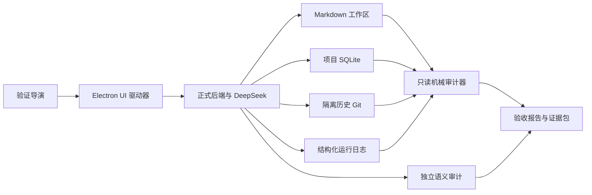

# Worldseed 全链路自动化验证

## 1. 目标

本验证用于证明 Worldseed 在真实 Electron、真实 DeepSeek、真实项目数据库和真实 Markdown 工作区中形成完整产品闭环。Fake 模型、单元测试、静态原型和模型自报审核结果只能作为辅助证据，不能把能力标记为通过。

全链路验收必须同时覆盖：

- 一句话启动世界并发布正式章节；
- 单一追加式模型上下文链和 DeepSeek KV 缓存；
- 选择性资料读取、图召回、图治理和真实验证探针；
- 长期正文、当前状态、历史事实、原文对白及时空连续性；
- 后台世界自主演化及其对后续正文的可追溯影响；
- 97%/50% 两阶段机械压缩及压缩后的事实库召回；
- 错误保留、额度重置、检查点恢复和 Finalization；
- 自动/手动历史、世界线切换、模型切换和进程重启恢复；
- UI 实时状态、持久化结果和性能指标。

## 2. 取证结构



证据优先级为：持久化结果和供应商用量 > 后端阶段记录 > UI 展示 > 模型自评。任何语义结论必须同时具有机械返回路径或独立审计证据。

## 3. 执行层级

| 入口 | 模型 | 用途 | 是否可作为最终验收 |
| --- | --- | --- | --- |
| `pnpm verify:baseline` | Fake/无模型 | 单元、契约、类型和构建门禁 | 否 |
| `pnpm verify:electron` | 当前 Electron | 项目打开、持久状态和 UI 恢复 | 仅 UI 项 |
| `pnpm verify:audit` | 无新增调用 | 只读审计已有真实运行 | 仅已运行场景 |
| `pnpm verify:real-turn` | DeepSeek | 真实单轮推演 | 仅单轮 |
| `pnpm verify:longrun` | DeepSeek | 20 至 30 章长期验收 | 是 |
| `pnpm verify:all` | DeepSeek | 长期、故障、历史、重启和审计全集 | 是 |

`verify:all` 是唯一允许给出“全链路通过”结论的入口。它依次运行基线、Electron UI、20 章真实长跑和只读审计，并把 FC-00 至 FC-13 聚合到 `manifest.json`。尚无真实场景执行器或证据文件的项目必须明确标记为 `not_implemented`，不能因其他测试通过而跳过。

真实入口必须显式设置 `WORLDSEED_ACCEPTANCE_REAL=1`，避免普通测试误耗 API。

## 4. 完整场景

### FC-00 环境与隔离

- 使用独立工作区、项目数据库、日志和证据目录。
- 验证 API Key 仅存在于 Electron 安全凭据库。
- 记录代码提交、工作树状态、模型、上下文容量、项目设置和运行时间。
- 验证用户 Markdown 工作区不存在内部数据库、对象库和内部 Git。

### FC-01 一句话完整推演

- 只输入一句世界起点，通过 UI 启动推演。
- 必须完成全部 AI 阶段、图治理探针、作用域提交、章节发布、章节登记和自动历史保存。
- 章节正文、Source、图节点、图连接、时空锚点和演化前沿必须可从正式存储读取。

### FC-02 单一上下文链与 KV

- 每条世界线只有一个活动 `ModelContextChain`。
- 活动链首条且仅首条消息允许使用 `system` 角色；此后所有阶段指令、协议、动态资料和用户强调均以 `user` 追加，模型结果以 `assistant` 追加。
- 读取旧版本链时，发送边界必须把首条之后遗留的 `system` 角色规范化为 `user`，不得为兼容旧数据创建第二条模型链。
- 同一模型、未压缩时，请求 N 的完整规范化消息必须是请求 N+1 的字节级严格前缀。
- 上一请求的消息摘要必须 100% 出现在下一请求开头；不得修改、排序或重建旧消息。
- 动态规则、资料、图 Evidence、用户输入、阶段请求和阶段响应只能追加到链尾。
- 压缩允许一次前缀重建；压缩后的下一次调用必须重新恢复严格追加。
- 模型切换继续使用同一剧情链，但新模型第一次调用视为缓存冷启动。
- FC-02 是组合硬门禁：数据库单链、字节级前缀、消息角色规范和供应商 KV 命中率四项必须同时通过；任何单项通过都不能替代其他项。

KV 指标按可复用前缀计算：

```text
effectiveKvHitRate = cacheHitInputTokens / reusablePrefixTokens
```

默认门禁：预热后有效平均命中率不低于 95%，最近连续三次平均不低于 98%，供应商整轮命中率应保持在 95% 以上。命中率计算必须限制在 0% 至 100%，不得用大于 100% 的结果掩盖统计口径错误。首次调用、模型切换后首次调用和压缩后首次调用不参与失败判定。供应商不返回缓存统计时标记为“证据不足”，不能算通过。

### FC-03 长期连续推演

- 使用同一世界线连续生成 20 至 30 章。
- 验证导演根据已提交局部图选择下一轮动作，不依赖人物、势力、地点等固定业务类型。
- 每章后抽取发生修订的节点、Source、时空锚点和前沿，形成下一章的通用检查问题。
- 中途必须发生时间推进、空间移动、状态变化、关系变化、局部冲突和长期影响，但验收器只检查通用事实、时空和因果不变量。

### FC-04 后台世界自主演化

- 用户连续关注一个局部时，系统自动选择其他已存在前沿进行演化，不由测试脚本直接调用 `world.evolve` 冒充自动调度。
- 后台演化必须产生正式任务、图修订、来源、时空依据、主体信息边界和下次访问条件。
- 后续正文接近受影响局部时，必须选择性召回该变化并产生自然影响。
- 无自动调度、只有静态 UI 或只有手动接口时，本场景直接失败。

### FC-05 图治理与归档

- 按变化量、度数、修订数和返回路径动态选择审计对象，不按题材类型选择。
- 验证正文中的事物具有图表达或 Source 返回入口。
- 验证治理探针由应用层真实执行，模型不能自报成功。
- 达到入度/出度预警和上限后，AI 必须执行复用、抽象、合并或归档并再次探测。
- 当前含义、历史含义和原始正文必须同时可返回；仍有追溯价值的内容不得物理删除。

### FC-06 远期事实和原文召回

- 在第 10、20 和最终章查询第一章及随机旧章。
- 分别查询当前状态、历史状态、具体事件、原文对白、当时参与节点及当时时空投影。
- 禁止读取章节目录时，仍须通过图和 Source 找到精确原文；图摘要不能代替对白。

### FC-07 用户矛盾输入

- 验证导演从当前图选取一项已提交事实，构造与其冲突的用户表达。
- 系统必须继续创作，并把输入解释为行动、意图、误解或提案；不能直接覆盖事实，也不能因资料不足拒绝正文。

### FC-08 两阶段机械压缩

- 使用独立测试 Profile 降低逻辑上下文容量，先触发 97% 阈值。
- 第一阶段只移出旧轮次非正文；仍超过 50% 时从最旧正式正文开始移出。
- 正文、Source、图、历史和原始阶段输出不删除。
- 压缩后再次执行 FC-06，并验证历史保存点可恢复压缩前完整链。

### FC-09 错误、额度和检查点

- 在模型、Schema、检索、工作区、提交、发布和登记边界执行可重复故障注入。
- 任意可捕获错误必须进入 `awaiting_user_decision` 或 `paused`。
- Electron 驱动器模拟用户显式点击单项重置、全部重置、继续、重试当前阶段和暂停。
- 已完成阶段、供应商用量、模型原始输出和 pending 内容不得丢失或重复执行。

### FC-10 Finalization

- 分别在 `scope_committed`、`chapter_published` 和 `chapter_registered` 后中断进程。
- 重启后只执行下一个未完成步骤；不得重新调用模型、重新治理图或生成重复章节。
- 每个完成 Turn 最终只能登记一条正式章节消息。

### FC-11 历史与世界线

- 每轮完成后验证自动保存；模型请求中手动保存时退到最近稳定检查点并保存为暂停。
- 从旧保存点建立分支 A/B，在两个分支分别生成新章节，反复切换并继续。
- 正文、图、上下文链、任务检查点和模型用量不得串线。
- 重启 Electron 后恢复当前分支、历史选择、图投影和暂停任务。

### FC-12 模型切换

- 在同一世界线切换 Flash/Pro，不创建隐式剧情分支。
- 上下文容量只来自当前模型 Profile；切换后重新执行压缩预检。
- JSON、思考模式、思考强度和 API Key 持久化分别验证。

### FC-13 UI 与性能

- 验证运行监控实时更新、阶段展开、AI 思考/输出折叠、图恢复和历史切换。
- 验证固定目录不可删除，只允许 Markdown，上传目录必须全部为 Markdown。
- 记录每轮模型调用、输入/输出 Token、KV、检索轮次、图增量、压缩代次、后台演化量和耗时。
- 本地查询、历史加载和图投影使用固定延迟门禁；供应商延迟单独统计，不与本地性能混合。

## 5. 通用机械断言

- 全部阶段完成，且没有未解释的 failed/running/pending 记录。
- 新正文和后台演化任务使用分步图治理：必须完成 `graph_structure_plan`、`graph_spacetime_settlement`、`graph_retrieval_design` 和 `graph_governance_review`；`graph_capacity_rewrite` 只在机械容量检测发现超限时出现。旧 `graph_governance` 和 `semantic_review` 记录只能作为历史审计，不能替代新阶段完成证据。
- 一个完成 Turn 对应一个完成 Finalization、一个正式章节、一个 Source 和一个自动历史保存点。
- 章节文件存在且摘要与 `canonical_chapter_messages` 一致。
- committed 图 head、图修订、Source 单元、时空绑定和前沿均可追溯到本轮作用域。
- 项目级 `node/link/source/evidence/revision` 计数器不小于已持久化最大编号，历史恢复不回退。
- 完整上下文消息日志序号连续，链头消息计数等于完整日志数量；链头 Token 估算只等于当前可见消息 Token 总和。历史快照必须同时恢复完整日志、隐藏状态和当前可见链，系统规则只出现一次。
- 每次非冷启动请求都必须复用紧邻上一次正式请求的完整前缀；审计报告合并时不得覆盖其他报告中的失败证据。
- 所有图治理验证探针都有应用层执行记录和返回摘要；验收只统计关联有效 `completed` 阶段的探针，最新有效 `graph_governance_review` 必须按 `probeIndex` 无遗漏、无重复、无额外项地逐一审核，已 `superseded` 的旧探针不得计入通过证据。
- 失败恢复不产生重复阶段、章节、节点、连接、Source 或历史入口。

## 6. 结果分类

- `pass`：机械证据和所需真实流程均满足。
- `fail`：有直接反证，例如 KV 低于门禁、缺少自动历史或后台演化没有任务记录。
- `insufficient`：缺少供应商统计、没有运行到目标规模或只存在间接证据。
- `not_implemented`：正式代码路径不存在；不能降级成 `insufficient`。

只有 FC-00 至 FC-13 全部通过，才允许把全链路目标标记为完成。

## 7. 证据包

每次运行写入 `.worldseed-data/acceptance/<run-id>/`：

- `manifest.json`：代码、模型、配置和场景；
- `ui.png`：Electron 最终状态；
- `audit.json`：数据库和日志机械审计；
- `scenario.json`：每一步输入、动作、状态和结果；
- `metrics.json`：Token、KV、调用、检索、压缩和耗时；
- `failures.json`：失败断言及定位证据。

统一执行命令：

```powershell
$env:WORLDSEED_ACCEPTANCE_REAL='1'
$env:WORLDSEED_ACCEPTANCE_WORKSPACE='<独立验收工作区>'
$env:WORLDSEED_ACCEPTANCE_DB='<项目 SQLite>'
$env:WORLDSEED_ACCEPTANCE_PROJECT_ID='<项目 ID>'
$env:WORLDSEED_ACCEPTANCE_LOG='<结构化运行日志>'
$env:WORLDSEED_ACCEPTANCE_CDP_URL='http://127.0.0.1:9230'
pnpm verify:all
```

真实任务进入可恢复暂停时，长期导演写入 `status: paused` 和 `resumableTaskId`，再次执行同一命令必须从该任务检查点继续。不得新建替代 Turn，也不得把已经消耗的模型调用和阶段结果丢弃。

## 8. 2026-08-14 第 24 章证据记录

验收对象：任务 `57107375-6c92-4712-a048-b4ae0969cc9b`，章节 `章节正文/第二十四章 清点.md`，数据库审计报告 `.worldseed-data/acceptance/current/ai-defined-probe-audit.json`。

| 验收项 | 真实证据 | 结论 |
| --- | --- | --- |
| AI 修改理由 | 9 项最终结构候选由 3 条决定记录全部覆盖；旧缺失产物被同 Task 恢复器 supersede | 通过 |
| 同轮 Evidence | 有效阶段输入从 445 条单调增加到 509 条 | 通过 |
| Source 返回 | 18 个 Source 单元、18 条唯一结算、全部非空图返回路径 | 通过 |
| 时空结算 | 3 个场景均有时间、地点和对应结构；5 个图修订均有时空结算 | 通过 |
| 身份分工 | 图 owner 为 `node_*` / `link_*`，读取证据为 `evidence_*` | 通过 |
| AI 验证探针 | AI 定义 1 个探针，应用返回 20 条证据，AI 对索引 0 审核通过；无 fallback 日志 | 通过 |
| Source 权威状态 | 结算只从 `settlement_records` 读取，状态均为 `settled` | 通过 |
| 图容量 | 230 个当前节点、328 条当前连接，最大直接入度/出度均为 12 | 通过 |
| Finalization | 1 个完成 Finalization、1 条正式章节消息、1 个自动历史保存点 | 通过 |
| 单链与 KV | 4,080 条完整消息、105 条当前可见消息、1 条系统规则；相邻有效前缀平均 99.32% | 通过 |

本轮同时给出反例边界：第 24 章把第 21 章的“昨天坐的”相对时间措辞继续带入，图随后忠实保存了该文本。故本证据可以证明分步图治理、真实探针、返回路径、恢复和提交功能成立，不能证明所有正文语义错误都会被图自动纠正。按照审核建议制原则，该问题应作为用户可见建议保存，不得通过拒绝正文或回滚整轮来处理。
