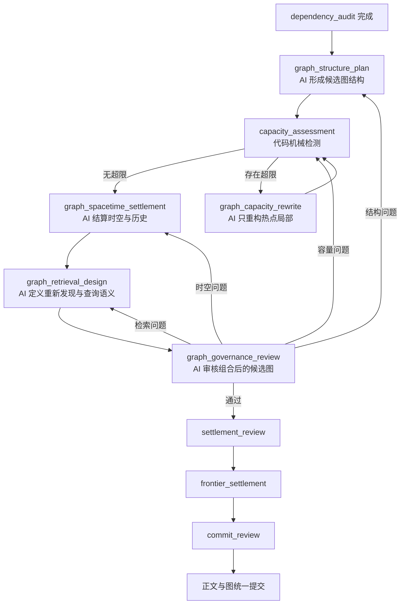

# 分步图治理后端与 UI 设计

状态：已实施并完成单轮真实恢复验收  
日期：2026-08-13  
适用范围：正文推演与后台世界演化中的 `pending` 图治理

后续降本、阶段投影和正文相对时间审查遵守 [图治理降本与正文连续性审查设计](superpowers/specs/2026-08-14-graph-governance-cost-continuity-design.md)。相关代码已经进入正式路径，但真实三组 A/B 和长期连续性门禁尚未完成，不能把单轮恢复验收外推为全部性能与长期效果已经达标。

> 本文描述的分步治理、容量重构、阶段组合、契约修复和阶段级恢复已经落地。2026-08-14 已使用真实 DeepSeek 后台演化任务完成从旧错误时空产物恢复到统一提交的验收。该结果证明本轮流程、恢复和提交闭环可用，不等同于已经证明几十章后的长期自洽效果。

## 1. 目标

当前 `graph_governance` 在一次模型请求中同时承担图结构修改、时空结算、原文返回、检索投影、容量治理和决定说明。真实验收虽然最终通过，但两轮治理各触发三次完整结果生成，图治理阶段消耗约十分钟。

本设计将图治理按治理责任拆分为多个独立 AI 阶段，同时保持以下原则不变：

1. 所有阶段继续追加到同一条模型上下文链，不能为各阶段创建互相失忆的子会话；
2. AI 继续自主决定节点、连接、信息载荷、局部组织、查询规则和重构方式；
3. 代码只负责稳定引用、局部读取、候选结果组合、机械容量计算、结构校验、检查点和统一提交；
4. 全部候选结果属于同一个 `pending scope`，只有整轮审查完成后才与正文共同提交；
5. 拆分依据是治理责任，不按人物、势力、地点、物品等领域类别拆分；
6. 正文中出现的万事万物仍必须进入图，不以“当前不重要”为由过滤；
7. 原始章节正文和不可变 Source 继续独立持久化，图只保存重新发现、状态演化和精确返回入口。

## 2. 当前代码结论

现有基础设施可以复用：

- `TurnOrchestrator` 已按 `AIPhase` 顺序执行阶段，并为每次阶段运行保存 `phase_runs`；
- 每个完成阶段已经保存任务检查点，失败、暂停和恢复不依赖 JavaScript 调用栈；
- `TurnPhaseInput.artifacts` 已支持后续阶段只读取明确依赖的前序 artifact；
- 模型上下文消息保存在同一 `model_context_chain`，后续阶段采用前缀追加；
- `pending scope`、Source、图修订、时空绑定、正文结算和最终化已经分离；
- 图容量画像和候选容量检测已经由代码机械计算；
- 右侧流程面板已经能显示动态阶段、耗时、Token、KV 缓存和检查点状态。

当前需要替换的集中责任：

- `graphGovernanceArtifactSchema` 同时包含 mutations、retrievalProjections、settlementRecords、sceneSpacetimeBindings、mutationSpacetimeSettlements、affectedFrontierRefs、archiveOutletRefs 和 decisionRecords；
- `TurnOrchestrator` 在完整 `graph_governance` 返回后检测容量，超限时读取热点邻域并重新执行整个阶段；
- Schema 或跨阶段校验失败时，模型适配器要求重新生成整个大型 artifact；
- 后续 `semantic_review`、`settlement_review` 和 `frontier_settlement` 都直接依赖这个单体 artifact。

## 3. 方案比较

### 3.1 保留单体，只缩短提示词

改动最小，但不能解决大型 artifact 内部字段相互牵连、容量超限全量重算和局部校验失败全量重生的问题，不采用。

### 3.2 固定五个 AI 阶段顺序执行

结构清楚，但容量治理如果放在时空和检索之后，局部重构会使后两者的引用失效；如果每次都全部重跑，仍然存在浪费。

### 3.3 结构先收敛，再派生结算与检索，最后统一审核

推荐方案。先让候选图结构和容量达到稳定，再生成依赖该结构的时空、历史与检索表达。审核发现问题时只回退到拥有该责任的阶段，并机械失效其下游结果。

## 4. 新流程



`capacity_assessment` 是应用层步骤，不调用模型，但仍生成可展示的运行记录和检查点摘要。

## 5. 阶段职责

### 5.1 `graph_structure_plan`

输入：

- 正式候选正文及 Source 单元；
- `dependency_audit` 的场景清单和连续性结论；
- 本轮实际读取的局部图和 Source 证据；
- 出现规划和用户输入；
- 当前图容量画像，但不要求此阶段解决尚未展开的热点。

AI 只决定：

- 复用、创建、编辑、重构或归档哪些节点与连接；
- 节点和连接保存的信息；
- 修改原因和必要的组合级自审；
- 候选结构影响的局部前沿；
- 哪些旧结构需要保留归档返回出口。

本阶段不返回场景绑定、逐修改时空结算、Source 单元映射和检索键。

每项候选修改必须由至少一条 AI 决定记录覆盖。`decisionRecords[].proposalRefs` 的并集必须覆盖全部 `proposals[].proposalRef`，且不得引用不存在的候选。该约束在 `graph_structure_plan` 响应边界立即校验；缺失时只能在当前阶段执行 Schema repair，不能等到最终提交时才发现修改没有 AI 原因。容量重写新增的候选由容量重写决定覆盖，删除候选后不再要求保留对应决定关联。

输出使用稳定提案引用，不使用数组索引关联：

```text
proposalRef: local:node:traveler-current-state
proposalRef: local:link:traveler-to-current-state
```

`proposalRef` 只在当前 pending scope 内有效。代码验证唯一性并在最终提交时物化为项目级永久 ID，但不猜测身份语义。

### 5.2 `capacity_assessment`

代码把已提交图与候选结构组合成只读 overlay，机械计算：

- 候选节点数和连接数；
- 每个节点候选入度、出度；
- 超限节点；
- 接近预警阈值的热点；
- 本轮候选结构对热点的增量影响。

代码不决定如何合并、抽象或归档。无超限时直接进入时空结算；超限时只为违规节点建立下一阶段输入。

### 5.3 `graph_capacity_rewrite`

这是条件阶段，可以执行零次或多次。输入严格限定为：

- 当前候选结构摘要；
- 超限节点与一层必要邻域；
- 与热点相交的候选 mutation；
- 入度、出度上限和预警阈值；
- 必要的 Source 返回入口，不重复注入无关证据。

AI 返回针对稳定 `proposalRef` 或永久图 ID 的局部补丁：

- 添加候选修改；
- 替换候选修改；
- 撤销尚未提交的候选修改；
- 编辑、抽象、合并或归档热点局部；
- 修改原因和自审。

代码把补丁应用到候选 overlay 后重新执行 `capacity_assessment`。达到配置的重构轮次上限仍超限时暂停任务，保留全部已完成阶段、候选补丁和检查点，由用户重置额度或选择恢复动作。

容量重构发生在时空结算和检索设计之前，因此不会使已经生成的大量下游引用失效。

### 5.4 `graph_spacetime_settlement`

输入是容量已经通过的稳定候选结构。AI 决定：

- 每个场景的时间、地点、前置场景和实际过渡路径；
- 每项候选修改在哪个场景生效；
- 当前入口、前置修订和历史返回路径；
- 哪些修改只是表示结构重构，哪些修改代表世界状态变化；
- 多世界、多时间参照和空间对应关系如何连接。

所有结算使用 `proposalRef` 或已读取永久 ID，不再使用 mutation 数组下标。代码只检查覆盖集合、引用存在性和场景索引机械一致性。

### 5.5 `graph_retrieval_design`

AI 定义：

- 相关查询应如何重新发现本轮节点与连接；
- 当前状态、历史过程和原文入口如何选择性展开；
- 出口当前含义、进入条件、下一层选择和停止方式；
- 局部重构后旧含义如何通过归档出口返回；
- 哪些正文片段应作为精确召回锚点连接到哪些图身份。

代码可以机械生成而不改变语义的内容：

- Source 单元 ID 与候选图引用的结算记录；
- AI 选中原句的完整文本、标准化标点变体和摘要 digest；
- 已存在永久 ID 和 `proposalRef` 的引用映射；
- 重复 exact key 去重。

代码不能自行决定查询含义、出口规则或哪些语义入口应连接到何处。

### 5.6 `graph_governance_review`

AI 阅读前述阶段组合后的候选图，但只返回审核结论和问题定位，不重复输出完整候选图：

- 正文中的全部事务是否得到表达；
- 当前有效状态是否覆盖旧状态而不抹除历史；
- 时间与空间是否连续；
- 历史和精确原文是否可返回；
- 图是否在有限预算内可发现且保持简洁；
- 容量重构是否改变原本语义；
- 归档出口和受影响前沿是否完整。

每个问题必须声明责任阶段：`structure`、`capacity`、`spacetime` 或 `retrieval`。执行器根据责任阶段回退，并只失效该阶段及其下游 artifact。

## 6. 后端结构

### 6.1 阶段枚举

新增模型阶段：

```text
graph_structure_plan
graph_capacity_rewrite
graph_spacetime_settlement
graph_retrieval_design
graph_governance_review
```

新增应用步骤标识：

```text
graph_capacity_assessment
```

应用步骤不进入 `AIPhase`，避免让模型端口承担非模型行为；它进入统一运行事件和检查点摘要。

旧 `graph_governance` 与 `semantic_review` 不再用于新任务。历史任务记录仍可只读展示；当前没有正式发布兼容要求，因此不为旧单体 artifact 增加双写或自动迁移路径。

### 6.2 聚合对象

应用层新增 `GraphGovernanceCandidate`，只由编排器组合，不作为单次模型输出：

```text
GraphGovernanceCandidate
  structure
  capacityAssessments[]
  capacityPatches[]
  spacetime
  retrieval
  review
```

它的作用是组合阶段成果并提供给最终提交，不承担世界语义判断。每个子 artifact 独立持久化在对应 `phase_run` 中。

### 6.3 服务边界

为避免继续扩大 `TurnOrchestrator`，新增以下应用层组件：

- `GraphGovernanceCoordinator`：编排五个治理阶段、容量循环和责任回退；
- `GraphCandidateOverlay`：把已提交图与候选 mutation 组合成只读候选视图；
- `GraphCapacityAssessmentService`：复用现有 `graph-capacity-policy` 完成机械检测；
- `GraphGovernanceAssembler`：组合各阶段 artifact，生成现有图仓储和提交端口需要的写入命令；
- `GraphGovernanceInvalidationPolicy`：根据审核问题计算需要失效的阶段集合；
- `GraphGovernanceProgressProjector`：生成前端实时状态，不让 Renderer 解析内部 artifact。

`TurnOrchestrator` 只负责调用 coordinator、累计预算、保存任务级检查点并继续后续阶段。图治理内部变化不会渗透到正文生成、资料召回和最终化模块。

### 6.4 artifact 依赖

```text
graph_structure_plan
  <- dependency_audit, draft, source_retrieval

graph_capacity_rewrite
  <- graph_structure_plan, capacity_assessment, hotspot evidence

graph_spacetime_settlement
  <- final structure, dependency_audit

graph_retrieval_design
  <- final structure, spacetime settlement, Source units

graph_governance_review
  <- final structure, capacity pass, spacetime, retrieval
```

前序阶段修改后的失效规则：

| 修改位置 | 必须失效 |
| --- | --- |
| structure | capacity、spacetime、retrieval、review |
| capacity patch | spacetime、retrieval、review |
| spacetime | retrieval、review |
| retrieval | review |
| review | 无；只决定回退或通过 |

### 6.5 检查点与恢复

- 每个 AI 阶段成功后保存现有 `TaskCheckpointRecord`；
- 每轮容量检测保存轻量运行记录，包含输入候选 digest、结果和热点摘要；
- 容量补丁成功后保存检查点，再进行下一次机械检测；
- 模型、网络、Schema、预算或进程错误只暂停当前阶段，之前的阶段结果保持可恢复；
- “继续执行”从当前稳定检查点进入下一动作；
- “重试本阶段”只重跑当前 AI 阶段；
- “从本轮重试”仍可回到本轮起点，但不作为普通错误的默认动作；
- 恢复历史保存点后，治理子阶段仍按原任务检查点恢复为暂停状态，不自动调用模型。

恢复阶段产物时遵守以下确定性规则：

1. 同一阶段可能存在多次完成、修复或恢复运行；执行器只恢复该阶段最新一条仍为 `completed` 且满足当前 Schema 的产物，不能按最早完成记录或任意记录恢复。
2. 已完成产物必须重新通过当前阶段 Schema。Schema 变化后旧产物无效，不允许仅因数据库状态仍是 `completed` 就继续使用。
3. 旧产物无效时，代码只机械地把该阶段及其下游运行标记为 `superseded`，保留原始输出、思考、用量和审计记录，然后从该阶段入口恢复。
4. 回退不能补造时空、节点、连接或查询语义。新的语义结果仍由该责任阶段的 AI 重新生成；有效上游阶段不重跑。
5. 新阶段产物通过后，下游阶段基于新产物重新执行，最终组合器只读取各阶段最新有效产物。

### 6.6 模型上下文与 KV 缓存

所有治理阶段继续使用同一 `modelContextChainId`：

```text
... dependency_audit
+ graph_structure_plan request/response
+ capacity result
+ graph_capacity_rewrite request/response（若需要）
+ graph_spacetime_settlement request/response
+ graph_retrieval_design request/response
+ graph_governance_review request/response
```

每个请求只追加本阶段差量和末尾输出契约。稳定系统规则、前序正文和已读证据保持字节级公共前缀，使 KV 缓存继续有效。

Schema 修复仍在当前阶段内进行，但只重新生成该阶段的小 artifact。修复消息只附加本阶段校验错误和本阶段 Schema，不重复其他治理阶段 Schema。

分阶段 Schema 与最终组合 Schema 必须复用同一业务不变量。特别是逐修改时空结算的 `world_effect` 必须在 `graph_spacetime_settlement` 阶段就满足“至少存在一个有效场景引用”，不能先接受无场景结果，再到最终组装时才失败。共享约束同时作用于首次输出和 Schema repair；修复只增加当前错误阶段的一次模型调用，不新增业务阶段。

### 6.7 提交

所有 AI 阶段完成后，`GraphGovernanceAssembler` 才把组合结果转换为：

- 图节点和连接修订；
- 检索投影；
- Source 结算记录；
- 场景时空绑定；
- 图修订时空记录；
- 决定记录；
- 受影响前沿。

这些内容继续写入同一 pending scope。`commit_review` 通过后沿用现有 finalization，统一提交图、Source、章节 Markdown 和正式上下文消息。

## 7. 前端 UI

### 7.1 总体原则

- 不增加新的顶层页面；继续使用右侧“推演流程”Tab；
- “图治理”显示为一个可折叠阶段组，内部显示分步进度；
- 默认只显示阶段名称、状态、耗时和关键数量，避免把复杂内部 Schema 暴露给普通用户；
- 点击子阶段后显示两个现有折叠面板：`AI 思考` 与 `AI 输出`；机械容量检测显示 `运行检查`，没有伪造 AI 思考；
- 运行数据一旦变化即通过现有任务状态轮询或后续事件推送更新，不等待整轮完成；
- 世界图画布继续只显示已提交图与当前 pending overlay，不允许用户直接编辑事实。

### 7.2 流程时间线

```text
图治理                                      进行中  4/6
  ✓ 候选结构规划     17 项修改               38s
  ✓ 容量检查         2 个热点                 0.1s
  ✓ 热点局部重构     第 1 轮，-3 条直连       42s
  ✓ 容量复检         0 个超限                 0.1s
  ● 时空历史结算     2 个场景 / 17 项修改     进行中
  ○ 查询投影设计     等待
  ○ 整体治理审核     等待
```

没有容量超限时，“热点局部重构”显示为“未触发”，不占用模型调用。

### 7.3 阶段详情

候选结构规划显示：复用、创建、编辑、归档和候选修改总数。  
容量检查显示：上限、热点节点、治理前后入度/出度和循环次数。  
时空历史结算显示：场景覆盖、当前入口、历史返回路径和未结算数量。  
查询投影显示：语义入口、精确原文锚点、Source 返回和重复键去重数量。  
整体审核显示：连续性、可发现性、简洁性、原文返回、容量和归档出口六项结论。

每个阶段详情同时显示：

- 本阶段输入 Token、输出 Token、耗时和 KV 缓存命中率；
- 本阶段模型调用和格式修复次数；
- 实际读取证据数量；
- pending artifact 摘要；
- 修改原因和审核建议；
- 若暂停，显示恢复到哪个阶段以及需要重置的指标。

### 7.4 容量热点交互

容量检测卡片按节点显示治理前后数字，例如：

```text
node_26  12 入 / 17 出  ->  12 入 / 12 出
node_59  14 入 /  2 出  ->  12 入 /  2 出
```

点击“在世界图中查看”切换到世界图 Tab，并以该热点为中心加载必要局部。该操作只读取和展示，不修改候选结构。

### 7.5 审核回退

若整体审核要求修改，时间线不把整个图治理标记为失败：

- 责任阶段显示黄色“需要修订”；
- 其下游阶段显示灰色“结果已失效”；
- 已完成且仍有效的上游阶段保持绿色；
- 流程自动回到责任阶段，除非额度耗尽或发生可恢复中断；
- 达到修订轮次上限后暂停，由用户在运行监控中重置指标并选择继续或重试。

### 7.6 API 投影

前端只接收展示 DTO：

```text
GraphGovernanceProgress
  status
  activeStep
  steps[]
    id, label, kind, status
    attempt, elapsedMs
    inputTokens, outputTokens, kvCacheHitRate
    evidenceCount, repairCount
    summary, metrics[], issueCount
  capacityRounds[]
  reviewSummary
```

Renderer 不读取模型 artifact，不自行计算容量，也不根据字段猜测治理是否通过。

## 8. 原型

交互原型位于：

`docs/prototypes/staged-graph-governance.html`

原型重点验证：

- IDEA 式右栏密度是否合适；
- 图治理阶段组能否清楚表达多次容量检测和局部重构；
- 阶段详情能否区分 AI 思考、AI 输出和代码运行检查；
- 审核回退时用户能否理解哪些结果保留、哪些结果失效；
- Token、耗时和 KV 指标是否能定位图治理性能问题。

## 9. 实施范围

后端预计修改：

- `packages/contracts`：阶段枚举、阶段结果和进度 DTO；
- `packages/prompt-contracts`：五个阶段 Prompt、Schema、引用和跨阶段契约；
- `apps/backend/application/turns`：新增 coordinator、候选 overlay、组合器和失效策略；
- `TurnOrchestrator`：把单体阶段替换为 coordinator 调用，保留外围预算、检查点和最终化；
- `apps/backend/infrastructure/sqlite`：复用 `phase_runs`，仅在需要查询机械容量轮次时增加运行记录；
- `DeepSeekAiModelAdapter`：保持通用，不增加图领域判断，仅加载新阶段 Schema；
- Fake adapter、验收脚本和测试 fixture：按新阶段生成最小合法 artifact。

前端预计修改：

- `RightRail`：支持阶段组和子步骤；
- 新增 `GraphGovernanceProgressPanel` 与 `CapacityRoundDetail`；
- API client 和 IPC contract：读取治理进度 DTO；
- 样式和 renderer 测试：阶段折叠、实时状态、回退和窄栏文本适配。

## 10. 测试与验收

### 10.1 单元测试

- 稳定 `proposalRef` 唯一且后续阶段引用有效；
- 容量 overlay 与最终候选图的度数一致；
- 容量补丁只修改声明的热点局部；
- 各阶段覆盖契约独立失败，错误只定位到所属阶段；
- 审核问题的责任阶段映射和下游失效正确；
- Source exact key 机械变体和去重不改变 AI 选择的语义锚点。

### 10.2 集成测试

- 无容量超限时跳过容量 AI 重构；
- 单热点和多热点可以经过若干轮局部补丁收敛；
- 任一阶段失败后只重试该阶段，前序结果和上下文链保持；
- 暂停、重启 Electron、继续后从相同检查点恢复；
- 同一 model context chain 持续追加且 KV 公共前缀不回退；
- 审核回退到 structure、spacetime、retrieval 时失效范围正确；
- 最终提交后的图、Source、章节和历史保存点保持一致。

### 10.3 真实模型验收

使用当前 20 章基线再次执行严格遗忘上下文续写：

- 禁止读取工作区章节 Markdown；
- 不继承旧事实 Evidence；
- 必须通过图和 Source 恢复当前状态；
- 必须触发至少一个可控容量热点场景；
- 最终入度、出度无超限；
- 图治理各阶段最多允许一次自动 Schema 修复；
- 单个图治理 AI 阶段输出 Token 不超过旧单体阶段最大值的 35%；
- 图治理总耗时目标低于旧基线 603 秒的 50%；
- 正文、图和 Source 均提交成功，恢复测试和历史切换测试通过。

性能目标是验收目标而不是语义降级许可。如果拆分后无法完整表达正文事务、当前状态、历史和原文返回路径，不能以更快为理由通过。

## 11. 风险与约束

- 模型调用次数会增加，但每次输出更小；必须用总 Token、总耗时和失败重算成本判断收益，不能只看调用次数；
- 结构审核回退可能形成循环，必须沿用可配置轮次和用户确认机制；
- 稳定提案引用必须替代数组索引，否则拆分后跨阶段关联仍然脆弱；
- 容量补丁不能由代码自动合并语义相似节点，代码只能应用 AI 明确返回的补丁；
- 机械 exact key 只生成文本变体，不能替 AI 决定应建立哪些查询入口；
- UI 不能把某个子阶段完成显示为图已经提交，整个阶段组在 `commit_review` 前始终标记为 `pending`。

## 12. 最终判断

拆分方案与现有架构兼容，且比继续扩展单体 `graph_governance` 更可靠。它复用现有阶段执行、上下文链、检查点、预算、pending scope 和最终化，不改变正文生成与资料召回流程。主要重构集中在图治理内部边界，能够降低修改其他业务时产生关联影响的风险。

### 12.1 2026-08-14 真实恢复验收

后台演化任务 `55fe6ee1-4f35-44fa-b6ce-9821f44f25f6` 从旧的无有效场景时空产物恢复。运行日志确认恢复入口为 `graph_spacetime_settlement`，结构规划阶段没有重跑，旧时空及下游阶段被 `superseded`，随后依次完成时空结算、查询设计、治理审核、结算审核、前沿结算和提交审核。

最终结果：

- 任务状态为 `completed`，提交序号为 `41`；
- 提交 6 个图修订，没有持久化 `local:*` 身份或引用；
- 产生 1 个当前有效验证探针和对应审核评估；
- 共 20 次模型调用，输入 Token 为 12,042,618，输出 Token 为 32,650，KV 缓存命中率为 98.48%；
- 后台演化没有章节正文 Source，因此 `sourceSettlements=0` 属于不适用，不是原文返回路径缺失。

第 23 章任务 `c8967c3a-d96d-4c49-bfc4-9d306a8b049d` 同时验证了正文路径：19 个 Source 结算均有图返回引用，10 个场景绑定和 10 个 `world_effect` 均有有效场景，容量重构后的稳定提案引用被下游阶段正确使用，正文、图和自动历史保存完成。审核仍可以给出时空修订建议，但按产品原则只有建议权，不阻止正文和图提交。

验收器只把关联 `completed` 且未被 `superseded` 的阶段运行所产生的探针视为当前有效探针，并要求最新有效 `graph_governance_review` 的 `verificationProbeAssessments` 与这些探针索引无遗漏、无重复、无额外项。第 23 章与上述后台演化任务均为 1 个有效探针对应 1 个审核评估；旧的 superseded 探针不再能够让验收误通过。

本次验收覆盖单轮真实恢复、阶段失效、Schema repair、容量补丁引用、Source 返回和提交闭环。长篇运行后的持续召回质量、复杂分支切换和几十章尺度的自洽稳定性仍需单独长期验收，不能由本次结果外推为已经完全证明。

### 12.3 2026-08-19 后台前沿恢复验收

后台演化任务 `b98addd2-a29a-404f-8276-b00e4b34beb9` 在旧 `frontier_settlement` 契约无法同时满足“只能使用本轮场景绑定”和“后台演化没有正文场景”的条件下暂停。修复后，后台演化阶段投影只携带本轮实际读取的同一前沿旧锚点；模型可以继承这些锚点，仍不能借用其他可读节点。恢复器沿用原 Task、原作用域和已完成上游阶段，最终恢复只执行存储提交，没有重跑模型阶段。

数据库与结构化日志的只读核对结果：

- 任务状态为 `completed`，作用域 `d1858e64-c279-4039-a2eb-dcb7720a846a` 为 `committed`，提交序号由 45 推进到 46；
- 本轮提交 3 个图修订：事件节点 `node_480` 以及连接 `link_675`、`link_676`；
- 前沿 `node_154` 结算为 `active`，继承场景/时间锚点 `node_277`、地点锚点 `node_154` 和对应连接 `link_411`；这些引用均来自已读的既有已提交图，不是本轮临时创造的时空用途；
- 日志记录 `world.evolve.committed`，治理后全图为 235 个当前节点、336 条当前连接，最大直接入度和出度均为 12，没有容量违规；
- 编排累计 25 次模型调用、12,059,797 输入 Token、14,511 输出 Token；`kv_usage` 保存 21 条成功供应商用量记录，二者口径不同，失败或未形成供应商用量记录的尝试不能伪装成成功调用；
- 演化任务不生成章节 Finalization 或历史保存点，因此这两项为空属于协议不适用，不是提交缺失。

该结果证明无正文后台演化能够在不发明固定领域类型的前提下，复用同一前沿的历史时空出口、提交新的局部变化并保留可继续调度的入口。它仍不能单独证明后台变化会在较晚正文中被自然召回，也不能替代长期自洽和成本验收。

## 13. 已发现问题的最小收敛方案

以下修改只修复真实运行暴露的问题，不增加本体服务、固定领域类型或新的模型阶段：

1. 正文场景的 `frontier_settlement` 只能从已经通过 `graph_spacetime_settlement` 和审核的场景绑定中选择最后场景、时间、地点和对应锚点；无正文后台演化则可以从阶段投影携带的同一前沿旧状态中继承本轮已读锚点。两种情况都不能在最后一步把任意可读节点临时提升为某种锚点。具体节点为什么能承担该用途仍由现有时空结算和审核 AI 判断。
2. `edit_node.next` 必须是自包含的最新当前投影。AI 编辑前读取当前修订，保留仍有效的稳定信息；只返回本轮变化量视为不完整修改。旧投影继续由修订链保存，代码不拼接自然语言。
3. 一轮内已经实际读取且仍在模型链可见范围的 Evidence 单调保留。阶段没有再次列入 `citedReadIds` 只影响审计，不得清除 Evidence；只有上下文压缩、图修订变化或预算按 owner 组裁剪才移出默认可见范围。
4. 每个 Source 单元必须有非空图返回路径，但可以复用所属场景，不要求一段正文创建一个节点。检索设计遗漏时，组合器从已经覆盖该 Source 单元的场景绑定补充场景锚点；最终仍为空则契约失败。
5. 当前状态和结构操作使用稳定 node/link owner ID；Evidence ID 只用于引用某次已读历史修订或原文证据。请求尾部继续只公开本阶段可用引用，不建立第二套永久身份。
6. 验证探针是审核内部的正常读取循环。探针目的、覆盖范围和查询由 AI 定义，应用只做契约验证、真实读取、结果冻结和回传；模型漏提时由同阶段 Schema repair 要求 AI 补提，代码不得替 AI 生成语义探针。等待和执行探针不记录为异常，也不新增模型阶段。
7. `settlement_records` 是 Source 结算的唯一权威状态，删除 `source_units.settlement_status`，避免两套状态分离。

图治理审核请求尾部必须明确说明 `verificationProbeExecutions` 是应用真实执行结果，并要求结合 `readEvidence`、返回引用和结果摘要审核。字段已经提供时，模型不得声称“未提供探针执行结果”；实际证据不足时仍可给出 `uncertain` 或 `fail`。该提示约束已有自动化测试，真实模型措辞改善需在下一次 DeepSeek 治理运行中继续验收。

如果选择性读取轮次达到 `maxRetrievalRounds`，应用会把尚未执行的探针与普通读取统一记录为 `system:retrieval-gap`，并继续后续审核、结算和提交。缺口不是执行结果：不创建探针执行检查点，不补造返回引用，也不生成 `pass`/`uncertain` 评估；只有实际执行完成的探针才进入逐项审核覆盖。Token、时间、模型调用或实际读取错误仍进入可恢复暂停流程。

调用约束：上述修改不固定增加模型阶段或正常模型调用数。只有模型漏提必要探针或现有审核发现错误时，才使用当前阶段已有的读取/修复循环。

### 12.2 2026-08-14 第 24 章真实提交验收

第 24 章任务 `57107375-6c92-4712-a048-b4ae0969cc9b` 首次完整执行到 `commit_review` 后，最终提交器发现第 0 项批准修改没有 AI 决定记录。根因不是恢复丢失，而是旧 `graph_structure_plan` Schema 只校验候选引用唯一，没有校验决定记录完整覆盖；该轮 11 项候选修改只有 4 项被决定记录覆盖。

修复后，恢复器在同一 Task 内识别旧结构产物不再满足新契约，将旧结构阶段及下游运行标记为 `superseded`，保留用户输入、资料读取、正文和其他有效上游阶段，从 `graph_structure_plan` 重新执行。重跑结构包含 9 项候选修改，3 条 AI 决定记录覆盖全部 9 项，随后完成容量重写、时空结算、检索设计、AI 探针审核、结算、前沿和最终提交。

只读审计结果为 15 项通过、0 项失败、0 项证据不足：

- 18 个 Source 单元对应 18 条唯一结算记录，全部具有非空图返回路径；
- 3 个场景均具有时间、地点和对应结构，5 个图修订均有时空结算；
- 同轮 Evidence 数量按阶段从 445 单调增加到 509，没有因未再次引用而丢失；
- AI 自主定义 1 个验证探针，应用真实返回 20 条证据，AI 以同一 `probeIndex=0` 审核通过，日志不存在 fallback 探针；
- 图 owner 使用稳定 `node_*` / `link_*`，读取引用使用独立 `evidence_*`；
- 第 24 章、5 个图锚点、唯一正式章节消息和唯一自动历史保存点完成 Finalization；
- 全图 230 个当前节点、328 条当前连接，最大直接入度和出度均为 12，没有超过配置上限。

正文人工对照仍发现一项语义残余：第 24 章沿用了第 21 章的“雾港到柳渡，昨天坐的”，但中间已经发生第 22、23 章。图把该正文事实忠实写入当前投影，因此结构、返回路径和时空绑定通过并不等于正文相对时间措辞已经被自动纠正。当前产品原则规定审核只有建议权并直接提交，所以该问题不能通过把审核重新变成拒绝门禁来掩盖；后续应单独设计“提交后仍不阻断、但把连续性建议明确呈现给用户”的正文修订交互。
