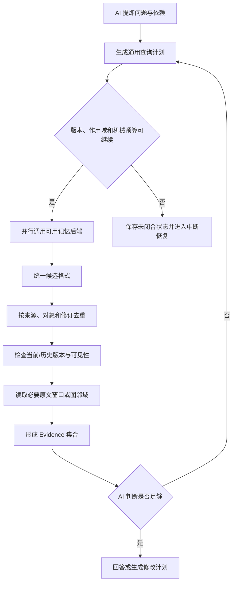
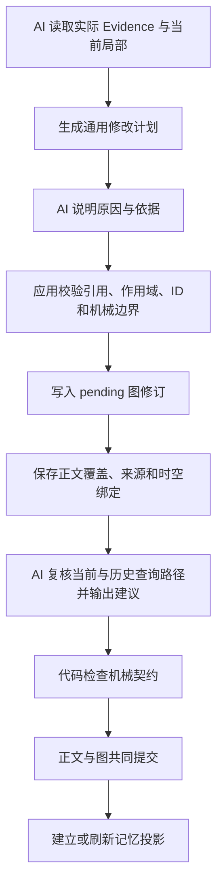

# Worldseed：通用记忆计划与多后端整合设计

> 本文冻结 AI 查询计划、修改计划和多记忆后端的职责边界。不定义人物、势力、地点、事件或其他领域类型。代码和验收状态以 [设计与实施状态](implementation-status.md) 为准。

## 1. 背景

Worldseed 需要从持久化正文、用户资料、图修订和历史记录中恢复长期世界状态。单一检索方式无法同时覆盖：

- 精确对白、标题和原文片段；
- 别名、模糊表达和同义说法；
- 当前状态与过去状态；
- 跨章节、跨节点和跨连接的多跳关系；
- 图局部重构后的旧结构追溯。

系统可以同时拥有全文、关键词、向量、图邻接、时序图和第三方记忆后端，但这些后端不能各自维护一套世界真相。

## 2. 核心原则

### 2.1 一个权威世界，三类内容

系统必须区分三类内容，不能把所有可读取内容都称为世界事实：

1. **权威来源材料**：用户规则、设定集、参考文件和用户输入记录。它们是不可冒充、可追溯的输入来源，但用户输入、设定或参考资料不会仅因被读取就自动成为已经发生的世界事实。
2. **权威世界事实**：已经共同提交的完整小说原文、图修订、时空绑定和历史记录。只有进入这一层的内容，才构成当前世界状态或其可恢复的历史状态；图摘要不能替代完整原文。
3. **派生记忆投影**：全文索引、关键词索引、向量索引、图检索索引、时序记忆和外部记忆。它们只为发现和加速查询服务，不能独立创造、覆盖或删除世界事实。

```text
权威来源材料与权威世界事实
          |
          +-- 全文/精确索引
          +-- 语义/向量索引
          +-- 图邻接与修订索引
          +-- 时序记忆投影
          +-- 第三方记忆投影
```

每个投影结果必须能够返回至少一个权威入口：正文原文单元、资料文件、图节点或连接的具体修订，或者产生它的已提交推演记录。用户输入和来源材料可以作为生成依据，但没有对应的已提交正文或图修订时，只能标记为输入/候选，不能被当作当前世界事实返回。

多个后端命中同一内容，只说明存在多个检索入口，不能以投票数量证明事实为真。

### 2.2 AI 负责语义计划，代码负责机械执行

AI 根据当前上下文、图和已读 Evidence 决定查询表达、展开方向、修改目标、出口含义和停止条件。代码只负责验证机械边界、执行操作、保存结果、维护版本和回传证据。

AI 可以决定：

- 使用哪些节点、连接、来源或语义表达作为入口；
- 查询当前修订、历史修订、原文窗口或图邻域；
- 复用、扩展、创建、编辑、归档或重构局部结构；
- 是否继续查询、改变入口、扩大局部或保留不确定性；
- 新出口和局部模式在当前上下文中的含义及查询原则。

代码固定的是机械动作，而不是世界语义：精确查找、文本查找、相似查找、身份定位、邻接展开、来源读取、修订读取，以及节点、连接、载荷和归档操作。

## 3. 通用查询计划

### 3.1 不按领域类型设计

查询计划不得拆成“人物查询”“势力查询”“地点查询”或“事件查询”。它只描述从哪里开始、如何找候选、沿哪些已有出口展开、读取什么版本和何时停止。

同一协议必须能处理过去发生的事情、当前状态、原文对白、物品位置、地点变化、势力关系和未命名的新对象。

### 3.2 计划的机械组成

```text
入口：已知节点、连接、来源、文件或语义表达
候选：精确键、关键词、文本表达、语义表达或原文片段
展开：方向、深度、候选数、原文邻域和历史范围
版本：当前头、指定历史修订或提交范围
约束：项目、世界线、作用域、可见性和预算
语义停止：AI 判断证据已足够、继续展开没有新增价值，或决定保留不确定性
机械边界：最大深度、候选数量、Token、调用次数、耗时和后端并发上限
```

系统不需要预先知道一个出口表示时间、地点、关系、状态还是其他含义；AI 先阅读该局部结构，再决定是否沿出口查询以及如何解释返回内容。

### 3.3 查询执行闭环



一次未命中不等于资料不存在。AI 可以换表达、换入口、扩大局部、查询原文或读取历史。AI 的语义停止只决定是否还有必要继续寻找；它不能绕过代码执行的机械边界。每次展开前后都必须检查深度、候选数、Token、调用次数、耗时和并发预算。预算耗尽时停止当前查询并保留未闭合、不确定或未同步标记，交由推演中断/恢复流程处理；不能通过扩大 QueryPlan 或伪造证据越过边界，也不能因没有查到就直接断言不存在。

## 4. 通用修改计划

### 4.1 修改目标不绑定领域对象

修改计划的目标可以是任意节点、连接、局部结构或新发现的内容。代码不判断目标属于人物、物品、势力、地点还是事件。

AI 可以自主选择：

- 复用已有节点或连接；
- 扩展已有节点、连接或局部模式；
- 创建新的节点、连接或局部模式；
- 编辑当前状态或连接信息；
- 合并相似结构为更高层含义；
- 把旧结构迁入归档出口；
- 重构局部连接，同时保留历史修订和原文返回路径。

### 4.2 最低机械动作

应用层只固定以下可执行动作，不固定动作的语义：

```text
create node / edit node / archive node
create link / edit link / archive link
stage revision
attach source
attach arbitrary payload
declare verification query
```

归档不是物理删除。旧修订、原文和来源路径必须继续保存，并作为可返回的历史结构。

### 4.3 修改执行闭环



AI 的自审只能提供连续性、时空一致性、历史路径和查询覆盖建议，不能成为正文或图的语义否决。资料不足时，AI 应在建议中说明不确定性并允许合理推演补全；只要机械契约满足，应用就直接把正文与图共同提交。用户是否修改正文属于后续操作，不是本轮提交前置条件。若复核建议指出需要调整，应用记录建议，但不会因此自动回到草稿或丢弃本轮结果；只有机械契约、权限、作用域、版本或安全边界不合法时，才进入中断/恢复流程。

## 5. 多记忆后端整合

### 5.1 统一记忆网关

AI 不需要知道计划最终由 SQLite、向量数据库、Graphiti、Mem0 还是其他实现执行。后端适配器负责翻译通用计划并返回统一候选。

```text
AI QueryPlan
      |
      v
MemoryGateway
  +-- FullTextAdapter
  +-- VectorAdapter
  +-- WorldGraphAdapter
  +-- TemporalMemoryAdapter
  +-- ExternalMemoryAdapter
      |
      v
NormalizedEvidence[]
```

后端不可用时，网关记录该后端未参与；不能把“后端失败”伪装成“没有资料”。

### 5.2 统一结果

候选结果至少应能说明：

- 来源后端；
- 权威来源入口；
- 对象或修订入口（如有）；
- 当前/历史角色；
- 版本或提交位置（如有）；
- 原文位置或图定位；
- 检索表达和机械分数（如有）；
- 是否需要继续展开。

应用层按权威来源、对象身份和修订机械去重，不能只按摘要文本去重。当前修订和历史修订必须保持可区分。

### 5.3 投影版本水位

每个记忆投影都必须记录自己基于哪个 Worldseed 权威提交版本建立或刷新，至少包括项目、世界线、权威提交版本/图修订水位、投影状态和最近同步错误。投影的状态至少能区分：

```text
current       已覆盖当前权威水位
stale         只覆盖较旧水位
sync_pending  已知有新提交，等待建立或刷新
unavailable   本次查询无法访问该后端
empty         已在对应水位完成查询，但没有候选
```

例如：

```text
Worldseed 图       revision 20 / current
全文索引            revision 20 / current
Graphiti            revision 19 / stale
向量索引            revision 20 / sync_pending
```

投影结果必须携带产生它的投影水位。`stale` 结果可以作为发现入口，但在形成当前世界的正式 Evidence 前必须回到权威正文或图修订验证；它不能覆盖当前修订，也不能让旧状态压过新状态。`empty`、`unavailable` 和 `stale` 不能统一转换为“没有资料”。多个投影出现冲突时，应用优先使用同一项目/世界线中水位最新且能够回到权威入口的结果；无法验证的结果只能标记为候选或不确定性。

### 5.4 外部记忆只能是派生投影

外部记忆可以提供语义候选、别名提示、时序候选、多跳候选和性能基线，但不能直接覆盖 Worldseed 正文、当前图头或历史修订，也不能决定正文与图是否共同提交。

正文和图提交后，外部投影可以异步建立或刷新。投影刷新失败不能回滚权威正文和图，但必须留下待同步状态。

投影待同步不会阻塞已经满足机械契约的正文与图提交，也不会把外部后端的旧结果写回权威层。后续同步任务必须从记录的权威提交水位补建；补建期间查询仍需返回该后端的 `sync_pending` 或 `unavailable` 状态，避免把暂时不可用误解为事实不存在。

## 6. AI 与代码职责

| 能力 | AI | 代码 |
|---|---|---|
| 生成搜索表达 | 决定 | 执行并返回候选 |
| 判断同一对象 | 提出判断和依据 | 保存引用，不猜测身份 |
| 选择展开方向 | 决定 | 执行深度、数量和预算 |
| 语义停止条件 | 决定是否还有查询价值、是否保留不确定性 | 强制执行最大深度、候选数、Token、调用、耗时和并发边界 |
| 理解出口含义 | 决定 | 保存出口信息并提供动作 |
| 创建、编辑、归档结构 | 提出计划和原因 | 校验机械契约并暂存 |
| 当前/历史适用性 | 解释 | 提供版本和可见性数据 |
| 原文保存 | 不替代保存 | 永久保存并建立索引 |
| 提交建议 | 提供连续性建议 | 执行统一提交 |

代码可以拒绝格式、权限、作用域、版本引用、容量和安全边界不合法的操作，但不能仅因资料不足而替 AI 拒绝合理的新世界补全。

## 7. 与现有后端的关系

现有 `RetrievalRepository`、`GraphRepository`、`DocumentRepository` 和 `EvidenceStore` 是本设计的底层基础。它们已经隔离 SQLite 存储与上层业务。

当前仍有一部分查询编排、证据合并、版本刷新、预算和多路检索逻辑位于推演编排器中。因此当前状态是：

```text
存储适配层隔离：已具备
基础检索接口：已具备
通用查询/修改语义：由 AI 计划表达
独立 MemoryGateway：尚未完整实现
多后端可插拔接入：尚未完整实现
```

目标边界是：

```text
application
  MemoryGateway
  QueryPlanExecutor
  MutationPlanExecutor
  EvidenceNormalizer

infrastructure
  SqliteMemoryAdapter
  GraphitiAdapter
  Mem0Adapter
  VectorMemoryAdapter
```

上层推演只提交通用计划并消费统一结果；权威正文、图、历史和世界线仍由 Worldseed 自己负责。

## 8. 成本与缓存

- 本地全文、图邻接和向量候选可以并行执行；
- 后端先返回有限候选和来源入口，不直接返回大量完整正文；
- 先去重、版本过滤，再组装 Evidence；
- 同一上下文链继续追加，只补充新证据，以保持 KV 缓存前缀稳定；
- AI 判断证据闭合后立即停止，不强制遍历所有后端；
- 只有语义抽取、消歧、重排序或后端自身需要时才增加 AI 调用；
- 记录各后端命中、去重、延迟、Token、失败和过期候选。

## 9. 验收标准

### 9.1 查询

1. 不提供人物、势力、地点、事件等固定查询 API；
2. 同一协议支持原文、当前状态、历史状态和多跳关系；
3. 多后端结果可以统一成 Evidence；
4. `current`、`stale`、`sync_pending`、`unavailable` 和 `empty` 可以区分；
5. 当前修订、历史修订和原文入口不会被错误合并；
6. 一次未命中不会被解释为不存在；
7. 每个投影结果都带有可核对的权威提交/修订水位；
8. 旧投影只能作为发现入口，不能覆盖已验证的当前修订；
9. AI 的语义停止不能绕过深度、候选数、Token、调用、耗时或并发预算。

### 9.2 修改

1. AI 可以复用、扩展、创建、编辑和归档任意节点或连接；
2. 修改原因、实际引用和复核计划可追溯；
3. 旧修订、原文和归档路径仍可查询；
4. 正文没有图治理结果时不能形成完整正式提交；
5. 外部记忆投影不能改变权威正文、图和历史；
6. 不因新对象类型增加专用结构；
7. 用户输入、设定集和参考资料在没有正式提交依据时不会被提升为当前世界事实；
8. AI 复核只形成建议，不能因资料不足或语义偏好拒绝正文与图共同提交；
9. 机械契约不合法时进入可恢复中断，不静默丢弃正文、图或复核结果。

### 9.3 场景测试

- 精确对白和标题返回；
- 压缩后旧章节原文返回；
- 当前状态与历史状态区分；
- 同一对象多别名复用；
- 多时间流和空间连续；
- 局部图重构后的旧结构返回；
- 多后端重复命中与冲突处理；
- 正文、图、索引和外部投影部分失败恢复。

## 10. 非目标

本文不规定节点类型、连接语义、外部记忆内部实现、AI 推理方式，也不允许通过多个后端投票决定世界真相。
