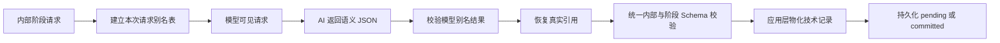

# 模型协议边界设计

## 目标

Worldseed 把职责分成两层：

- AI 决定世界语义：用户输入如何理解、资料如何选择、实体是否复用、图如何新增或重构、查询路径如何演化、修改原因和自审结论。
- 代码负责协议执行：请求封装、临时引用映射、JSON 解析、Schema 校验、技术 ID 生成、作用域隔离、持久化和错误恢复。

代码不能借协议层替 AI 判断人物、势力、地点、事件或局部图的含义，也不能因为格式处理而改变 AI 已作出的语义决定。

## 两种协议

应用层内部使用完整的 `PhaseRequestEnvelope` 和 `PhaseResultEnvelope`，其中包含项目、任务、上下文、读取、图和持久化所需的真实技术 ID。它们用于后端内部协作和数据库记录，不直接作为模型消息发送。

发送给模型前，DeepSeek 适配器建立本次请求专属的模型引用视图。该视图只保留阶段、协议版本、可读证据、剩余机械预算和语义输入；项目 ID、任务 ID、作用域 ID、阶段运行 ID、原文单元 ID、Prompt 引用等后端技术字段不发送给模型。

引用视图使用：

- 读取证据使用 `read-1`、`read-2` 这样的临时别名；
- 图节点使用 `node-1`、`node-2`；
- 图连接使用 `link-1`、`link-2`；
- 需要精确引用某次历史修订时使用对应读取证据的 `read-*`，由读取证据中的 owner、version 和 digest 唯一确定修订；不新增会与 owner 混淆的 `revision-*` 世界身份；
- 仅 `graph_governance` artifact 新建的局部语义身份使用 `local:*`；其他阶段不得提前声明局部句柄，新事物只以语义计划描述并将图引用留空；
- 工作区路径、正文、语义文本和 AI 自主定义的局部含义保持原文。

不存在 `owner-*`、`id-*` 或其他兜底身份。读取证据中的内部来源 ID、检索请求 ID、阶段运行 ID和未登记 UUID在发送给模型前移除；若仍有未映射 UUID残留，请求在本地失败而不是自动发明别名。

模型只能引用本次请求中出现过的别名，不能生成 UUID，也不能把读取别名当成图身份。

模型返回后，适配器先使用模型可见结果 Schema 校验别名形状，再将别名恢复为内部真实 ID，最后进入内部结果 Schema 和共享引用契约校验。别名不写入正文、图、修订、投影、结算记录或任务持久化数据。

## 引用职责

`readId` 只表示一次读取结果，`ownerId` 才表示被读取资料的实际拥有者。模型视图中分别使用 `read-*` 和 `node-*`/`link-*` 别名表达这两个概念；恢复后仍保持两者的区别。

- `citedReadIds` 只能引用模型可见的读取别名，恢复后必须属于本轮已读账本；
- 图复用、图编辑、图连接端点和图检索投影只能引用模型可见的图 owner 别名，恢复后必须属于本轮实际读取的 node/link owner；
- 前置修订只能引用模型可见的 `read-*` 读取证据，恢复后按该证据冻结的 owner、version 和 digest 解析具体修订；同一 owner 的多个版本因此保持可区分；
- `local:*` 只用于 `graph_governance` artifact 明确声明的新建语义身份，最终由应用层一次性生成 UUID；规划、草稿和审查阶段不得发明 `local:*`；
- 章节、来源、修订、投影、结算、决定、阶段运行和请求 ID全部由应用层生成，AI 不负责创建。

如果一个引用别名无法恢复、指向多个对象，或者出现在不允许的语义位置，适配器拒绝结果并返回结构错误；它不会猜测或自动选择一个对象。

## 通用协议处理

适配器只执行与阶段和世界领域无关的协议处理：

- 从供应商附加文字中提取唯一且完整的首个 JSON 对象；
- 校验模型结果只能使用本次请求展示的别名；
- 按本次请求的唯一映射恢复真实引用；
- 生成读取请求、依赖记录和其他后端技术 ID。

适配器不得移动 Draft 字段、把 `read-*` 猜成 `node-*`、从 metadata 推断别名、按名称选择相似实体，或为任一阶段添加专用修复。结构不符合契约时统一进入有限修复重试；仍失败则保留原始响应并终止该阶段。

模型配置中的思考开关、思考强度和 JSON Mode 是供应商协议参数，不是世界语义。它们由模型配置界面统一管理并持久化到应用数据库，每轮开始后不可中途变化。DeepSeek 思考强度仅允许 `low`、`high`、`max`；关闭思考时不发送强度。`reasoning_content` 作为独立观察数据展示和计量，不能冒充最终 `content`，也不能在最终正文为空时被直接解析为业务 JSON。

引用校验集中在共享 Prompt Contract中，只检查机械可见性：工作区路径是否实际读取、已有图引用是否来自本轮图 owner、`local:*`是否已在当前治理 artifact声明。它不比较出现规划与图治理的节点数量，不根据 `reuse`、`create_new`等语义动作推导强制操作，也不替 AI判断两个对象是否同一身份。

`semantic_review` 还必须机械覆盖本次 `graph_governance` 的全部修改索引。该检查不判断修改是否合理，只要求 AI 对每项修改明确批准或拒绝一次；遗漏、重复和越界统一进入有限 Schema 修复，不能留到持久化投影时才失败。

应用层不得替 AI 补检索语义或修改理由。AI 未返回检索投影时，代码不能从节点内容自动拼接投影；已批准修改缺少 AI 决定记录、理由或自审时，当前治理结果必须失败并回到 AI 修订，而不是写入后端默认话术。

阶段 envelope 的 `outcome` 为 `revise`、`reject` 或 `retire` 时，当前编排器必须显式停止并保留 AI 原因，不能把它静默当作继续。`commit_review.artifact.recommendation` 只是展示建议，不属于 envelope outcome，不能触发停止。后续回流实现需要连同 pending 原文单元和阶段产物一起重建，不能只重复某一次模型调用。

## 统一校验顺序

1. 解析唯一 JSON 对象，不解释其中世界语义。
2. 使用模型可见 Schema 校验顶层形状和别名类型。
3. 按本次请求映射恢复真实引用。
4. 校验公共内部结果和当前阶段唯一 artifact Schema。
5. 校验读取引用、图身份可见性、局部句柄、数组索引和阶段回流。
6. 将 AI 语义决定交给推演器执行，生成所有持久化技术 ID。

校验失败时保留原始模型输出、错误摘要和阶段日志，但不将未通过的内容写入 committed 世界。

## 设计边界

模型引用别名只是降低协议负担的传输层机制，不是新的世界数据结构，也不是对动态图出口含义的预定义。节点、连接、局部结构、查询规则、历史入口和重构方式仍由 AI 自主决定；系统只保证它们能够被持久保存、选择性查询和重新发现。

出现规划、语义审查和提交审查都是 AI 的自我约束阶段。代码只执行 AI 明确返回的审查结果和机械持久化条件，不把早期规划当作后续治理的硬上限；新证据出现后，AI可以在同一上下文链中重构局部，同时保持旧图引用必须先读取的证据边界。
