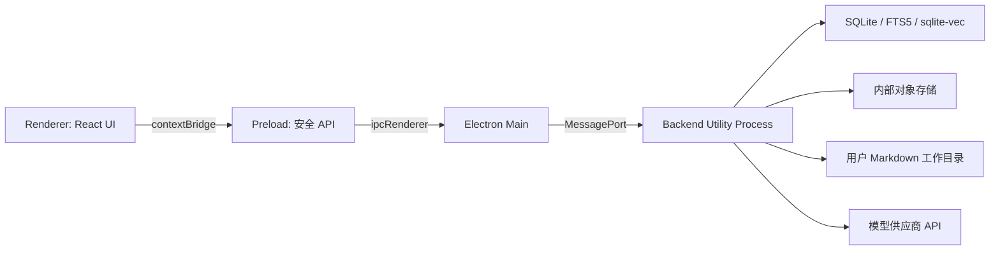

# Worldseed：项目代码架构

## 1. 技术基线

本项目固定采用以下 V1 技术路线：

| 层级 | 技术 |
| --- | --- |
| 桌面容器 | Electron |
| 前端 | React、TypeScript、Vite |
| Markdown 编辑器 | Monaco Editor |
| IDE 分栏 | `react-resizable-panels` |
| 世界图 | Sigma.js、Graphology |
| 前端状态 | Zustand、TanStack Query |
| UI 原语 | Radix UI、CSS Variables |
| 后端 | Node.js LTS、TypeScript |
| 协议校验 | Zod |
| 数据库 | SQLite WAL |
| SQL 访问 | Kysely、`better-sqlite3` |
| 全文检索 | SQLite FTS5 |
| 向量检索 | `sqlite-vec`，通过适配器接入；V1 首个闭环默认关闭 |
| 原文对象存储 | 本地文件系统，按摘要寻址 |
| 第一阶段 AI | DeepSeek API，OpenAI 兼容接口 |
| AI 客户端 | `openai` SDK，配置 DeepSeek `baseURL` |
| 日志 | Pino |
| 测试 | Vitest、Playwright |
| 构建与打包 | electron-vite、electron-builder |
| 包管理 | pnpm workspace |

架构设计以此为前提，不再同时维护 Electron、Tauri、Web 服务等多套 V1 实现。

第一阶段使用 [DeepSeek API](https://api-docs.deepseek.com/zh-cn/) 的 `chat/completions` 接口，默认配置名称为 `DeepSeek`，初始模型为 `deepseek-chat`；其他模型通过配置列表选择。默认地址、代理、超时、重试、普通文本 JSON 契约和缓存 token 字段见 [V1 编码前冻结基线](v1-freeze.md)。

DeepSeek 适配器使用 `DEEPSEEK_API_KEY`，密钥只从运行环境或操作系统安全存储读取，不能写入项目 Markdown、SQLite、日志或前端代码。

开发模式允许 Electron Main 从仓库根目录 `.env` 加载 `DEEPSEEK_API_KEY`，随后仅通过子进程环境注入 Backend Utility Process。没有密钥时正式推演必须返回模型配置错误，不得静默使用 Fake AI；Fake 适配器只允许由自动化测试显式注入。

## 2. 运行进程



进程职责：

- **Renderer**：只负责界面、交互和局部展示状态；
- **Preload**：只暴露经过白名单约束的类型化 IPC 方法；
- **Main**：只负责窗口、应用生命周期、权限、菜单和 Backend Utility Process 管理；
- **Backend Utility Process**：负责所有项目用例、SQLite、检索、文件、AI 调度和任务状态。

Renderer 必须启用：

```ts
webPreferences: {
  contextIsolation: true,
  nodeIntegration: false,
  sandbox: true,
}
```

Renderer、Preload 和 Main 都不能直接读写项目数据库。Main 只转发协议消息和管理后端进程。

## 3. Monorepo 总目录

```text
worldseed/
├── apps/
│   ├── desktop/
│   │   ├── electron.vite.config.ts
│   │   ├── electron-builder.yml
│   │   ├── package.json
│   │   └── src/
│   │       ├── main/
│   │       │   ├── index.ts
│   │       │   ├── window-manager.ts
│   │       │   ├── backend-process.ts
│   │       │   ├── ipc-router.ts
│   │       │   └── security.ts
│   │       ├── preload/
│   │       │   ├── index.ts
│   │       │   └── worldseed-bridge.ts
│   │       └── renderer/
│   │           ├── index.html
│   │           └── src/
│   │               ├── app/
│   │               ├── features/
│   │               ├── components/
│   │               ├── hooks/
│   │               ├── state/
│   │               ├── styles/
│   │               └── main.tsx
│   └── backend/
│       ├── package.json
│       ├── migrations/
│       └── src/
│           ├── bootstrap/
│           ├── application/
│           ├── core/
│           ├── infrastructure/
│           └── transport/
├── packages/
│   ├── contracts/
│   ├── prompt-contracts/
│   ├── ui/
│   ├── config/
│   └── test-fixtures/
├── tests/
│   ├── e2e/
│   ├── integration/
│   └── long-run/
├── docs/
├── tooling/
│   ├── eslint/
│   └── typescript/
├── package.json
├── pnpm-workspace.yaml
├── tsconfig.base.json
├── eslint.config.mjs
└── vitest.workspace.ts
```

V1 不建立独立 Web 前端、云端 API、微服务目录或领域插件目录。

## 4. Desktop 应用

### 4.1 Main

```text
apps/desktop/src/main/
├── index.ts                 # Electron 启动入口
├── window-manager.ts        # 项目选择窗口和工作台窗口
├── backend-process.ts       # 启动、监控、重启 Utility Process
├── ipc-router.ts            # Renderer 与 Backend 的协议转发
├── menu.ts                  # 文件/编辑/查看/推演
├── app-paths.ts             # AppData、日志和应用资源路径
└── security.ts              # 导航、下载、权限和外链限制
```

Main 不导入 `apps/backend/src/application`，也不实例化仓储。后端通过独立入口构建，Main 只管理其生命周期。

### 4.2 Preload

```text
apps/desktop/src/preload/
├── index.ts
└── worldseed-bridge.ts
```

`worldseed-bridge.ts` 只暴露 `packages/contracts` 中声明的接口：

```ts
contextBridge.exposeInMainWorld("worldseed", {
  invoke: (request: ClientRequest) => ipcRenderer.invoke("worldseed:request", request),
  subscribe: (listener: (event: BackendEvent) => void) => subscribe(listener),
})
```

不暴露 `fs`、`path`、`child_process`、SQLite 连接或任意 IPC channel。

### 4.3 Renderer

```text
apps/desktop/src/renderer/src/
├── app/
│   ├── App.tsx
│   ├── router.tsx
│   ├── providers.tsx
│   └── query-client.ts
├── features/
│   ├── projects/
│   ├── workspace-tree/
│   ├── markdown-editor/
│   ├── chapter-editor/
│   ├── turn-composer/
│   ├── process-monitor/
│   ├── world-graph/
│   ├── world-evolution/
│   └── status-bar/
├── components/
│   ├── layout/
│   ├── primitives/
│   └── feedback/
├── hooks/
├── state/
│   ├── layout-store.ts
│   ├── editor-store.ts
│   └── selection-store.ts
├── styles/
│   ├── tokens.css
│   ├── theme.css
│   └── global.css
└── main.tsx
```

前端模块按用户工作流组织，不按后端数据库表组织。

状态边界：

- TanStack Query：项目、文件、章节、任务、图局部等后端权威状态；
- Zustand：面板宽度、打开 Tab、选中节点、编辑器视图等本地 UI 状态；
- Monaco model：当前未保存文本；
- Backend Event：使对应 Query 失效或增量更新，不直接成为长期权威状态。

### 4.4 世界图

Sigma.js 只显示后端返回的局部 `GraphSlice`。Graphology 保存当前画布内的临时图结构，不缓存整张世界图，也不向后端提交拖拽位置以外的世界修改。

布局坐标属于 UI 偏好，可以单独保存；节点、连接及其语义只能通过后端只读接口获取。

## 5. Backend Utility Process

```text
apps/backend/src/
├── bootstrap/
│   ├── utility-entry.ts
│   ├── container.ts
│   ├── project-runtime.ts
│   └── shutdown.ts
├── application/
│   ├── projects/
│   ├── workspace/
│   ├── turns/
│   ├── queries/
│   ├── chapters/
│   ├── graph-read/
│   ├── evolution/
│   └── operations/
├── core/
│   ├── graph/
│   ├── revisions/
│   ├── scopes/
│   ├── documents/
│   ├── retrieval/
│   ├── rules/
│   └── budgets/
├── infrastructure/
│   ├── sqlite/
│   ├── filesystem/
│   ├── fts/
│   ├── vector/
│   ├── models/
│   │   └── deepseek/
│   └── telemetry/
└── transport/
    └── message-port/
```

具体模块、仓储端口、作用域、执行管线和错误恢复见 [后端代码架构设计](backend-architecture.md)。

### 5.1 Bootstrap

`utility-entry.ts` 接收 Main 传入的 MessagePort 和应用路径，建立应用容器。`container.ts` 只负责依赖装配：

```text
Kysely database
  -> repository adapters
  -> application services
  -> Backend Facade
  -> MessagePort transport
```

业务模块不能从全局变量获取数据库、模型客户端或当前项目。

### 5.2 项目运行时

同一后端进程可以打开一个当前项目，并保留最近项目注册表。`ProjectRuntime` 管理：

- 当前 `projectId`；
- 项目数据库连接；
- 项目级单写者队列；
- 模型和检索配置；
- 活跃任务与事件订阅；
- 项目关闭时的资源释放。

切换项目必须先停止或暂停当前项目任务，再关闭数据库和索引句柄。

## 6. 共享 Packages

### 6.1 contracts

```text
packages/contracts/src/
├── requests/
├── responses/
├── events/
├── errors/
├── schemas/
├── ids.ts
└── index.ts
```

包含 Zod schema 和从 schema 推导的 TypeScript 类型。Renderer、Preload、Main 和 Backend 都可以依赖它，但它不能依赖任一 app。

### 6.2 prompt-contracts

```text
packages/prompt-contracts/
├── manifests/
├── prompts/
├── schemas/
└── versions/
```

该包只由 Backend 使用。平台基础提示词构建后作为只读资源打包，用户不能从工作目录覆盖。

### 6.3 ui

```text
packages/ui/src/
├── primitives/
├── icons/
├── theme/
└── index.ts
```

只保存无业务状态的 Radix UI 包装、图标和主题 token。具体工作台组件仍放在 Renderer feature 中，避免形成庞大的通用组件包。

### 6.4 config

保存构建时公共常量和纯 schema，不保存供应商密钥或可变项目配置。运行时配置由 Backend 从安全存储和项目数据库读取。

## 7. IPC 契约

### 7.1 请求响应

```ts
type ClientRequest = {
  protocolVersion: "worldseed.v1"
  requestId: string
  method: BackendMethod
  payload: unknown
}

type ClientResponse =
  | { protocolVersion: "worldseed.v1"; requestId: string; ok: true; data: unknown }
  | { protocolVersion: "worldseed.v1"; requestId: string; ok: false; error: BackendError }
```

Preload 在发送前校验请求，Backend Transport 再校验一次。Renderer 不传函数、类实例、文件句柄或不可序列化对象。

### 7.2 长任务

`turn.start`、`world.query`、`world.evolve` 和章节提交立即返回 `TaskHandle`。阶段变化、token、耗时、文件操作和完成结果通过事件流发送。

UI 断线重连后使用 `task.status`、`operation.listActive` 和 `chapter.list` 恢复，不依赖丢失的历史事件。

### 7.3 协议版本

每个请求包含协议版本。Desktop 和 Backend 启动时握手，不兼容时阻止打开工作台并显示明确升级错误，不能尝试忽略未知字段继续运行。

## 8. 数据访问

### 8.1 SQLite

Backend 使用 Kysely 定义查询和 migration，`better-sqlite3` 只存在于 `infrastructure/sqlite`。应用层不能执行 SQL 字符串。

每个项目独立连接：

```text
AppData/Worldseed/registry.sqlite
AppData/Worldseed/projects/<projectId>/project.sqlite
```

数据库启用 WAL、外键和 busy timeout。SQLite 调用只发生在 Backend Utility Process，不阻塞 Renderer 或 Electron Main。

### 8.2 混合检索

```text
Kysely / SQLite 精确索引
    + FTS5
    + sqlite-vec
    + 图双向邻接
    -> RetrievalIndex
    -> ContextAssembler
```

`sqlite-vec` 封装在 `VectorIndexPort` 适配器后。关闭向量能力时系统仍能使用精确索引、FTS5 和图入口运行，但需要在任务状态中标记检索能力降级。

### 8.3 对象存储

大段原文、pending 章节、不可变章节版本、提示词原文和外部摘录按摘要保存：

```text
objects/<前两位摘要>/<完整摘要>.md
```

数据库保存摘要、长度、媒体类型、引用计数和逻辑来源。对象内容不能通过 Renderer 路径直接读取，只能经过 Backend 权限检查。

## 9. 依赖规则

```text
desktop renderer -> contracts + ui
desktop preload  -> contracts
desktop main     -> contracts
backend transport -> contracts + application
backend application -> core
backend infrastructure -> application ports + core
backend core -> no app/package dependency
prompt-contracts -> no app dependency
```

禁止：

- Renderer 导入 Backend 源码；
- Main 导入 SQLite 仓储；
- Core 导入 Electron、React、Kysely、模型 SDK 或文件系统；
- Infrastructure 反向调用 Renderer；
- Contracts 包含世界领域类型；
- UI package 访问 Backend Facade。

这些规则通过 ESLint import boundary 和 TypeScript project references 检查。

## 10. 构建与打包

开发模式：

```text
pnpm dev
  -> electron-vite 启动 Main / Preload / Renderer
  -> Renderer 使用 Vite 开发地址，启用 React Fast Refresh / HMR
  -> 构建并启动 Backend Utility Process
  -> Renderer HMR
```

开发模式必须通过 `pnpm dev` 或 `pnpm --filter @worldseed/desktop dev` 启动。不要使用
`electron .`、`electron apps/desktop` 或直接打开 `apps/desktop/out/renderer/index.html`，
这些方式会加载构建产物，不会建立 Renderer HMR 连接。开发 CSP 同时放行 localhost 和
127.0.0.1 的 Vite HTTP / WebSocket 地址，避免回环地址变化导致 HMR 被浏览器拦截。

生产构建：

```text
pnpm build
  -> packages
  -> backend utility bundle
  -> desktop main/preload/renderer
  -> electron-builder package
```

`better-sqlite3` 和 `sqlite-vec` 属于原生依赖：

- 按 Electron ABI 重建；
- 从 ASAR 解包；
- Windows、macOS、Linux 分平台构建；
- 打包后执行数据库启动、FTS5 和向量扩展冒烟测试。

## 11. 测试目录

```text
tests/
├── integration/
│   ├── ipc/
│   ├── sqlite/
│   ├── workspace/
│   └── model-adapters/
├── e2e/
│   ├── project-lifecycle.spec.ts
│   ├── chapter-generation.spec.ts
│   ├── chapter-revision.spec.ts
│   └── task-recovery.spec.ts
└── long-run/
    ├── fixtures/
    ├── evaluators/
    └── world-continuity.spec.ts
```

单元测试与源码相邻，跨模块测试进入根 `tests`。Playwright 启动打包前的 Electron 应用执行桌面 E2E。

## 12. 根脚本

```json
{
  "scripts": {
    "dev": "pnpm --filter @worldseed/desktop dev",
    "build": "pnpm -r build",
    "typecheck": "pnpm -r typecheck",
    "lint": "eslint .",
    "test": "vitest --workspace vitest.workspace.ts",
    "test:e2e": "playwright test",
    "package": "pnpm build && pnpm --filter @worldseed/desktop package",
    "db:migrate": "pnpm --filter @worldseed/backend db:migrate"
  }
}
```

根脚本只负责协调 workspace，不包含具体数据库路径或供应商密钥。

## 13. 实施顺序

1. 创建 pnpm workspace、共享 TypeScript 和 ESLint 边界；
2. 建立 Electron Main、Preload、空 Renderer 和 Backend Utility Process；
3. 完成 contracts 握手和 MessagePort 请求响应；
4. 接入 registry SQLite、项目 SQLite 和 migration；
5. 实现工作目录、项目入口和底部任务状态；
6. 实现 scope、图修订、章节版本和混合检索；
7. 实现 AI Prompt Contract 与正式正文管线；
8. 实现世界图、自洽演化和长篇测试。

## 14. 验收标准

1. Renderer 无 Node.js 权限，无法直接访问文件系统和数据库；
2. Main 只负责桌面生命周期和协议转发，不包含推演逻辑；
3. Backend Utility Process 独占数据库、索引、文件和模型调用；
4. contracts 是跨进程唯一公共协议来源；
5. 用户工作目录与内部 AppData 数据完全分离；
6. 前端只加载局部世界图，不缓存整张持久化图；
7. 后端模块不存在人物、势力、地点或事件的固定服务；
8. 原生 SQLite 和向量扩展在打包产物中通过冒烟测试；
9. 所有长任务可通过事件观察，并可在 UI 重连后恢复；
10. 依赖边界由 TypeScript 和 ESLint 自动检查。
