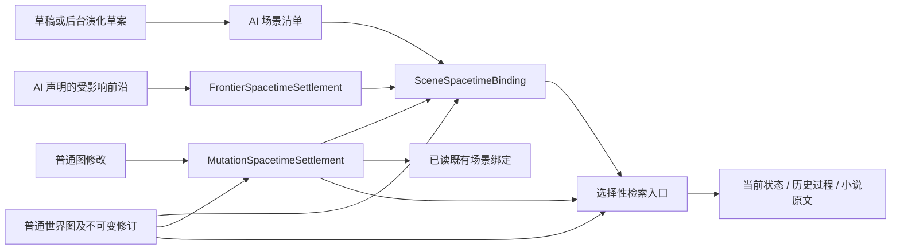
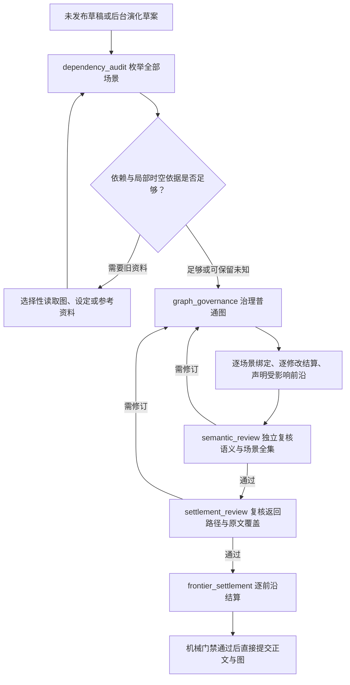

# Worldseed：通用时空锚点设计

## 1. 目标

本文在“万事万物都是节点、图语义由 AI 自主演化”的前提下，定义正式场景、跨场景移动、多世界不同时间流速、动态空间和演化前沿所需的时空连续性协议。

时空锚点不是人物、地点、时间或事件的领域 schema。实际世界含义仍由普通节点、连接、携带信息、修订和 AI 决定的局部查询组织表达。本文只规定 AI 在提交正式正文或世界变化时，必须声明哪些已有或本轮新建的图结构承担本轮时空定位与返回职责。

设计目标：

- 正文顺序、数据库写入时间和世界内部时间彻底分离；
- 不假设唯一全局时钟、统一历法、统一坐标或固定空间层级；
- 支持多个世界、区域或局部具有不同且可变化的时间流速；
- 支持移动空间、传送、并行场景、倒叙、时间循环、时间停止和无法精确换算的局部；
- 每个正式场景都能恢复“何时、何地、如何从上一场景到达”；
- 每个当前状态和历史变化都能返回其生效时空与小说原文；
- 每轮只加载当前任务需要的局部时空结构，不把完整时间线和地图装入上下文。

## 2. 不变原则

### 2.1 不建立唯一绝对时间

项目不维护能够强制比较所有事物的唯一世界时间值。每个具有独立时间语义或流速的局部，可以由 AI 复用或建立自己的时间参照结构。精确日期、相对先后、范围、周期、纪元、主观经历或其他世界特有表达都可以成为普通图内容。

“当前”只能解释为某个场景、叙事分支或演化前沿在其局部参照结构中的当前位置。不同局部之间没有已读对应路径时，AI 不得伪造全局先后或精确比例。

### 2.2 不建立唯一绝对空间

项目不要求经纬度、笛卡尔坐标、行政区划或固定包含关系。地点、区域、移动载体、异空间、梦境、网络空间以及其他可定位结构仍由 AI 使用普通图自主表达。

“位于何处”必须相对于本轮已读的空间参照结构成立。一个空间自身移动、变形、拆分、合并或只在特定时间可达时，其位置和可达关系也必须沿图修订保留生效时空。

### 2.3 时间与空间必须联合结算

正式场景不能只声明时间或只声明地点。时间正确但空间不可达、地点正确但采用错误年代，都属于时空连续失败。

每个正式场景必须形成一个可返回的场景锚点，并由本轮 AI 声明该场景实际采用的时间参照、时间锚点、空间参照、地点锚点和到达路径。场景锚点本身仍是普通图节点；代码不根据载荷推断它是不是场景。

### 2.4 语义由 AI 决定，角色由协议声明

“场景锚点”“时间锚点”“地点锚点”“参照结构”和“对应路径”只是本轮提交协议中的技术角色，不是持久化世界类型。同一个节点可以在一个局部承担时间锚点，在另一个局部承担其他含义；是否合理由 AI 审批。

代码只验证角色声明中的引用是否属于本轮实际读取图或本轮明确创建的局部结构，不判断节点载荷是否像时间或地点。

## 3. 场景时空绑定

### 3.1 先形成稳定场景清单

`dependency_audit` 必须先按草稿实际形成的场景给出从 `0` 开始、连续且唯一的 `sceneIndex`。这里的“场景”不是代码预定义的领域类型，而是 AI 对本轮正文或后台演化中需要独立保持时空连续的局部划分。无正文后台演化仍须为每个独立生效时空局部形成索引，只是不产生用户可见章节来源。

每个场景清单项同时由 AI 声明：

- 它是否必须继承一个已存在或本轮较早形成的场景，以及原因；
- 它是否跨越了时间参照、空间参照或两者，因此是否必须读取或建立对应结构，以及原因；
- 草稿中的时间连续、空间连续和跨参照连续是否通过、需要修订或只能保留未知。

代码不识别正文中的场景边界，只检查 AI 给出的 `sceneIndex` 是否连续、唯一。独立审查阶段负责确认该清单确实覆盖草稿中的全部实际场景；图治理阶段必须按同一索引逐项绑定，不能重新解释或省略场景。

“本轮第一个场景”不自动等于“没有前置场景”。续写、倒叙、插叙、并行场景和重新进入旧局部时，本轮 `sceneIndex = 0` 仍可能必须继承已提交场景。只有 AI 明确声明该场景没有可继承前置，并在独立审查中通过时，前置引用才可以为空。

### 3.2 绑定普通图角色

每个场景清单项提交时必须产生 `SceneSpacetimeBinding`；正式正文场景和无正文后台演化使用同一协议：

```ts
type SceneSpacetimeBinding = {
  sceneIndex: number
  sceneAnchorRef: GraphRef
  sourceUnitIndexes: number[]
  temporalReferenceRefs: GraphRef[]
  timeAnchorRefs: GraphRef[]
  spatialReferenceRefs: GraphRef[]
  locationAnchorRefs: GraphRef[]
  predecessorSceneIndexes: number[]
  predecessorSceneAnchorRefs: GraphRef[]
  transitionPathRefs: GraphRef[]
  correspondenceRefs: GraphRef[]
  explanation: string
  selfReview: string
}
```

这些数组保存的是 AI 选定的普通图引用：

- `sceneIndex`：对应 `dependency_audit.sceneContinuity` 中同索引的场景，只用于全集覆盖；
- `sceneAnchorRef`：本场景在图中的可返回入口；
- `sourceUnitIndexes`：本场景直接覆盖的不可变原文单元；正式正文场景非空，无正文后台演化为空；
- `temporalReferenceRefs`：解释本场景局部时间所需的图结构；
- `timeAnchorRefs`：本场景在这些时间结构中的实际位置；
- `spatialReferenceRefs`：解释本场景局部空间所需的图结构；
- `locationAnchorRefs`：本场景发生位置；
- `predecessorSceneIndexes`：本轮场景清单中被本场景实际继承的场景；
- `predecessorSceneAnchorRefs`：本场景实际继承的已读前置场景，不等同于上一段文字；
- `transitionPathRefs`：时间经过、空间移动或其他到达过程所依赖的普通图路径；
- `correspondenceRefs`：跨时间或空间参照结构时使用的同步点、换算关系、通道、边界或明确不确定性结构；
- `explanation` 与 `selfReview`：AI 说明为何这些引用足以支持连续推演和后续查询。

每个绑定都必须具有时间和地点锚点。`predecessorRequired = true` 时，前置场景和过渡路径均不能为空；`correspondenceRequired = true` 时，对应结构不能为空。倒叙、插叙、并行场景和补写过去必须指向它实际继承的场景或历史局部，不能把最近生成的章节误当作前置世界时间。

## 4. 多时间流与动态比例

### 4.1 局部时间参照

不同世界或局部不共享默认流速。AI 只在正文或查询实际需要区分时间语义时建立新的局部时间参照结构；普通单线场景继续复用已有结构，不为每段文字创建新时钟。

### 4.2 同步点优先

跨参照结构优先保存实际发生过的同步点，例如某次离开与抵达、通信、观测或再次相遇。同步点提供直接事实，避免 AI 每轮重复进行长距离比例换算。

稳定比例、换算方法、适用范围和不确定性都可以由连接携带信息或其他普通图结构表达。代码不预设公式字段，也不执行世界时间数学。

### 4.3 比例变化保留修订

时间比例、流速或可比较性发生变化时，AI 必须建立新的当前表达和生效范围，并保留旧规则的修订与原文返回路径。后续查询先确定目标局部和目标时间，再选择当时有效的对应结构，不能用最新比例反算全部历史。

### 4.4 无法换算时保留未知

跨参照结构没有足够同步证据时，AI 可以保存范围、相对先后或明确未知，但必须把该不确定性建立为可返回图结构并加入 `correspondenceRefs`。没有精确值不是提交失败；伪造精确对应才是连续性失败。

## 5. 动态空间与跨空间移动

### 5.1 空间是带历史的局部图

地点的包含、邻接、距离、可达条件或其他组织语义由 AI 自主形成。空间结构变化时必须产生修订，不能用当前位置覆盖历史位置，也不能因为地图重构切断旧地点和原文。

### 5.2 跨参照移动同时结算两端

跨世界、传送、进入异空间或离开移动载体时，至少需要能够返回：

- 离开场景的本地时间和地点；
- 移动或跨越过程；
- 抵达场景的本地时间和地点；
- 两端时间与空间参照之间的对应或不确定性结构。

通道只在特定时期有效、入口位置变化或抵达点不确定时，这些条件必须连接相应时间锚点，不能保存为永久无条件空间连接。

### 5.3 移动空间不覆盖历史

飞船、列车、移动城市或其他自身可作为空间参照的事物，其不同位置通过带生效时空的后续修订表达。查询当前位置读取当前有效修订；查询过去位置沿历史修订与场景绑定返回。

## 6. 当前状态与修订生效

任何改变后续推演应采用内容的图修订，都必须通过 `MutationSpacetimeSettlement` 绑定到一个或多个本轮场景，或者绑定到本轮实际读取的既有场景时空局部：

```ts
type MutationSpacetimeSettlement = {
  mutationIndexes: number[]
  effectDisposition: "world_effect" | "representation_only"
  effectiveSceneBindingIndexes: number[]
  effectiveExistingSceneAnchorRefs: GraphRef[]
  currentEntryRefs: GraphRef[]
  predecessorRevisionRequired: boolean
  predecessorRevisionReadRefs: ReadEvidenceRef[]
  historicalReturnRefs: GraphRef[]
  reason: string
  selfReview: string
}
```

`effectDisposition` 只是 AI 对本次修改所承担技术责任的声明，不是世界领域类型：

- `world_effect` 表示修改会改变后续推演应采用的世界内容，必须至少绑定一个本轮场景或已读既有场景，并提供新的当前入口和历史返回路径；存在被继承或替代修订时，AI 必须声明 `predecessorRevisionRequired = true` 并提供具体修订读取引用；
- `representation_only` 表示修改只重组查询、抽象、投影或归档表达，不改变所表达的当前世界含义；它仍必须保留被重构资料和原文的返回路径。

`predecessorRevisionReadRefs` 引用本轮实际读取证据，而不是节点或连接 owner。每条读取证据同时冻结 owner、revision/version 和 digest，应用层据此解析并持久化具体前置修订 ID；同一 owner 的多个历史版本不能共用一个无法区分版本的引用。

每个图修改索引必须恰好进入一条 `MutationSpacetimeSettlement`，不能遗漏、重复或越界。两种 `effectDisposition` 都必须具有非空 `historicalReturnRefs`；`world_effect` 还必须具有非空 `currentEntryRefs`。AI 的连续性证明至少说明：

- 修改继承哪些已有修订；
- 在哪个局部时间和空间条件下生效；
- 离开该时间或空间条件后是否仍然有效；
- 历史状态如何继续返回；
- 后续查询从哪个场景或局部入口优先恢复当前结果。

代码不判断婚姻、领土、位置、规则或其他内容是否需要哪些字段，也不判断修改是否真的只改变表达。代码只检查修改索引全集覆盖、AI 声明的门禁、引用和修订链完整性；`semantic_review` 负责复核 `effectDisposition`、生效时空和历史返回是否符合正文与世界含义。

## 7. 演化前沿时空结算

演化前沿不再共享单一世界时间锚点列表。每个受影响前沿必须分别结算：

```ts
type FrontierSpacetimeSettlement = {
  frontierAnchorRef: GraphRef
  disposition: "active" | "deferred" | "archived"
  lastSceneAnchorRefs: GraphRef[]
  lastTimeAnchorRefs: GraphRef[]
  lastLocationAnchorRefs: GraphRef[]
  correspondenceRefs: GraphRef[]
  reason: string
  revisitCondition?: string
}
```

`disposition` 是调度状态，不是世界语义。每个仍活跃或推迟的前沿必须具有自己的最后时空位置和非空 `revisitCondition`；归档前沿可以省略重访条件。后台推进只在该局部与目标场景之间存在足够对应路径时比较进度；不能用某个主角节点、章节序号或数据库时间代替前沿的世界时间。

归档前沿仍保留最后时空位置和返回路径，只是不再参与默认后台候选。

图治理必须先声明本轮 `affectedFrontierRefs`，语义审查对该集合逐项批准或退回治理；只有全部批准的稳定集合才能进入 `frontier_settlement`。代码按批准集合检查每个受影响前沿恰好结算一次；哪些前沿实际受影响仍由 AI 判断。

## 8. 统一时空索引

统一时空索引是普通图之上的无语义机械投影，不是第二套世界事实。

索引保存：

- 场景索引与场景绑定所引用的普通图身份；
- 每个图修订对应的生效场景、前置修订和历史返回身份；
- 每个前沿最后结算的局部时空身份；
- 对应图记录的载荷摘要、检索投影和小说来源；
- `pending`、`committed` 和 `retired` 可见性；
- 系统处理时间与世界时间引用的严格分离。

数据库的 `created_at`、`updated_at`、`last_processed_at` 和 `next_attempt_at` 只用于系统排序、调度和诊断，永远不能参与世界时空推理。



箭头表示引用和返回关系，不表示时空记录拥有世界事实。世界含义仍只存在于普通图、修订和原文中；三类结算记录只是把 AI 已决定的局部角色变成可快速读取、可机械核对的入口。

## 9. 选择性读取

每轮默认只加载：

1. 当前任务直接相关的场景绑定；
2. 该场景的局部时间和空间锚点；
3. 实际前置场景及必要过渡路径；
4. 本轮涉及状态的生效时空、当前入口和具体前置修订；
5. 发生跨参照查询时才加载的对应结构。

查询不涉及跨世界、历史比较或移动空间时，不加载其他时间参照和地图。跨参照路径需要多跳组合时，仍受候选、深度、访问节点、访问连接、token 和耗时预算限制；预算不足时保留局部结论与不确定性。

## 10. AI 治理闭环

AI 在每次正式场景或世界变化提交前执行：



1. 恢复本轮实际前置场景，而不是仅看最近文本；
2. 读取其时间、地点、当前状态和必要参照结构；
3. 判断本轮是否继续复用局部时空结构；
4. 仅在现有结构无法表达本轮变化时新增或重构局部；
5. 为跨参照变化建立同步、对应或不确定性结构；
6. 建立本轮场景锚点、到达路径和状态生效时空；
7. 对全部场景绑定和修改时空结算执行结构化查询探针，记录当前恢复、历史返回和原文返回的实际读取证据；
8. 给出修改原因、自审和可审计建议后直接进入正常提交门禁。

AI 负责语义判断和自审批。代码负责引用可见性、作用域、不可变修订、索引、全集覆盖、容量预算和持久化，不替 AI 发明时间或空间含义。

## 11. 机械提交门禁

代码必须检查：

1. `dependency_audit` 给出的场景索引从 `0` 开始连续且唯一，并由独立审查确认覆盖全部实际场景；
2. 每个场景索引恰好有一条本轮有效的场景时空绑定，不得遗漏、重复或越界；正式正文全部原文单元至少被一个场景直接覆盖；
3. 绑定中的时间锚点和地点锚点均非空；
4. 所有图引用来自本轮实际读取身份或本轮明确创建身份；
5. AI 声明需要前置场景时，前置场景和过渡路径均非空；
6. AI 声明需要跨参照对应时，对应结构非空；未知对应必须引用 AI 建立的不确定性结构；
7. 每个图修改索引恰好有一条时空结算；所有结算具有历史返回入口，`world_effect` 还具有生效场景和当前入口；AI 声明存在前置修订时，其具体修订读取引用非空；
8. 每个场景绑定和修改时空结算均被实际读取结果支持的查询探针覆盖，失败探针不能被布尔自评掩盖；
9. 语义审查批准的 `affectedFrontierRefs` 中每个引用恰好有一条互斥结算，且活跃或推迟前沿具有最后场景、时间、地点锚点和重访条件；
10. 系统时间字段未被写入世界时间引用；
11. 场景绑定、修改时空结算、查询探针、前沿结算、相关图修订、检索投影、原文单元和决定记录处于同一 `scopeId`；
12. AI 审批已覆盖全部场景绑定、修改时空结算、受影响前沿和相关图修改。

代码不能判断引用节点是否“真的像时间”或“真的像地点”。该语义正确性由 AI 的独立复核阶段负责。

## 12. 典型查询

### 12.1 某人在某时做了什么

```text
人物入口
→ 目标时间所在局部参照
→ 当时有效的场景绑定
→ 地点、参与局部和状态修订
→ 原文单元与章节正文
```

### 12.2 某地点当时有什么

```text
地点入口
→ 目标时间或范围
→ 当时连接该地点的场景绑定
→ 场景中的事物及当时有效状态
→ 原文
```

### 12.3 不同世界过去了多久

```text
两端局部时间锚点
→ 已读同步点与对应结构
→ 选择目标时期有效的修订
→ 返回精确值、范围、相对先后或未知
```

### 12.4 当前状态是否回退

```text
当前场景绑定
→ 当前局部时空
→ 状态当前入口
→ 前置修订与生效时空
→ 检查是否存在无原因回退
```

## 13. 验收场景

至少覆盖：

1. 单一时间和空间参照下的连续场景；
2. 两个世界具有不同稳定流速；
3. 跨世界比例在中途发生变化；
4. 两个世界只能确定同步点，不能精确换算；
5. 人物离开一个世界后在另一个世界经历较短主观时间；
6. 地点自身移动且能够查询过去和当前位置；
7. 通道只在特定时期和位置可达；
8. 倒叙、插叙、并行场景和补写过去不覆盖当前场景；
9. 上下文清空后仍能恢复早期场景的时间、地点、参与事物和原文；
10. 无关世界和无关地图不进入普通单场景上下文；
11. 一轮草稿包含多个连续、并行和倒叙场景时，场景清单连续唯一，图治理逐索引覆盖且能解析本轮前置与旧图前置；
12. 新建、编辑、重构和归档修改均恰好具有一条修改时空结算，当前查询、历史查询和原文查询采用同一权威映射；
13. 无正文后台演化仍具有场景清单和时空结算，但不会伪造章节来源。
