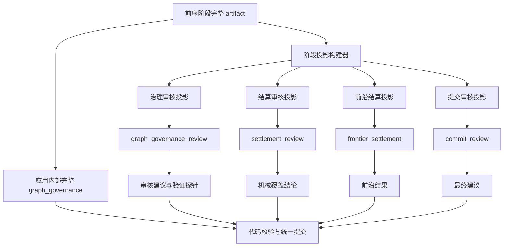

# 图治理降本与正文连续性审查设计

状态：待实施  
日期：2026-08-14  
适用范围：正文推演与后台演化的分步图治理、模型上下文输入、时空连续性建议

## 1. 背景

当前分步图治理已经完成真实单轮提交、Source 返回、时空结算、验证探针、检查点恢复和历史保存验收，但真实运行仍暴露两个问题：

1. 图治理阶段输入 Token 很高。`graph_governance_review` 同时读取分阶段 artifact 和应用重新组装的完整 `graph_governance`，后续 `settlement_review`、`frontier_settlement`、`commit_review` 又继续读取完整聚合结果，形成重复输入。
2. 场景级时空审查无法定位正文中的具体相对时间表达。第 24 章沿用了第 21 章的“昨天坐的”，图忠实保存了正文，但现有契约只有场景级连续性结论，没有“正文表达、参照事件、时间流、时空锚点、审核结果”的逐项映射。

本设计同时解决这两个问题，但不改变以下已冻结原则：

- 每条活动世界线只有一条追加式 `ModelContextChain`；
- AI 自主决定图语义、局部组织、出口规则和时空含义；
- 代码不按人物、势力、地点、物品或时间词表判断语义；
- 图、Source、完整阶段 artifact 和历史快照继续持久化；
- AI 审核只有建议权，不能拒绝正文和图提交；
- 缺少旧资料时允许依据已知上下文合理推演补全；
- 性能优化不能减少正文事务、当前状态、历史演化和原文返回的表达能力。

## 2. 目标与非目标

### 2.1 目标

1. 消除模型输入中同一图治理信息的重复聚合副本。
2. 保持严格单链、字节级稳定前缀、KV 缓存、暂停恢复和历史切换能力。
3. 让不同下游阶段只读取其职责所需的自包含投影。
4. 以事实版本而不是本次读取 ID 复用 Evidence。
5. 通用识别正文中依赖时间关系成立的表达，并绑定到 AI 选择的参照事件、时间流和时空锚点。
6. 在不新增固定 AI 阶段的前提下给出具体正文连续性建议。
7. 用配对真实运行证明成本变化，不预先承诺固定降幅。

### 2.2 非目标

- 不设计时间词词典或正则分类器；
- 不由代码计算“昨天”必然等于多少世界时间；
- 不新建时间专用图、本体服务或第二套事实库；
- 不把 digest、JSON Pointer 或内部 ID 当成模型可自动解引用的内容；
- 不删除完整 `graph_governance`、阶段 artifact、Source 或章节正文；
- 不立即降低全局 reasoning 强度；
- 不因连续性建议为 `conflict` 或 `uncertain` 阻断提交。

## 3. 方案比较

### 3.1 只压缩提示词和 Schema

改动小，但完整聚合 artifact 仍在上下文中重复，无法解决主要输入成本，不采用为首要方案。

### 3.2 只传 phaseRunId、路径和 digest

Token 最少，但模型不能从 ID 自行读取数据库。上下文压缩、历史恢复或阶段失效后，相关旧消息也可能不在当前模型可见范围，因此无法保证审核完整，不采用。

### 3.3 自包含、语义无损的阶段投影

采用该方案。代码保存完整 artifact，并为每个模型阶段生成职责明确的只读投影。投影不重复长文本和应用可机械派生的数据，但直接包含该阶段完成判断所需的完整业务关系。

## 4. 总体流程

完整 `graph_governance` 是应用内部提交候选，不再作为模型阶段的默认输入。模型阶段只读取自己的自包含投影。

## 5. Evidence 事实版本复用

### 5.1 当前问题

`uniqueTurnReadEvidence` 当前按 `readId` 去重。同一事实被不同请求重新读取时会得到不同 `readId`，因此仍可能作为两条 Evidence 进入上下文。

### 5.2 事实版本身份

应用层增加统一的 Evidence 版本键：

- 图或修订 Evidence：`ownerKind + ownerId + revisionId`；
- 不可变 Source 单元：`ownerKind + ownerId + digest`；
- 工作区 Markdown：`ownerKind + ownerId + version/digest`；
- pending 候选：`ownerKind + ownerId + scope + digest`。

`readId` 继续保存为审计身份、引用身份和阶段调用记录，不承担事实相等判断。

同一事实版本可能先后产生多个 `readId`。应用层必须形成稳定的版本聚合结果：

- `canonicalReadId`：该版本第一次进入活动链时选定的稳定引用；
- `readIdAliases`：后来读取到的同版本 `readId`；
- `versionKey`：上述事实版本身份；
- `evidence`：唯一的模型可见内容。

模型只看到 `canonicalReadId`。旧阶段 artifact、恢复数据或审计记录中的任一 alias 在进入投影和引用校验前，都由代码机械归一到 `canonicalReadId`。`readIdAliases` 只保存在应用请求、阶段运行和恢复数据中，`model-reference-view` 必须将其从模型语义输入中移除。

### 5.3 合并规则

1. 相同版本键只保留一个模型可见 Evidence；
2. 新 Evidence 带来新的来源定位、相关 owner 或精确键时，机械合并这些非语义字段；
3. 同 owner 出现新 revision 时，旧 revision 保留为 `historical`，新 revision 标记为 `current`；
4. head revision 未变化时不刷新图正文和邻域；
5. 需要前置修订或历史查询时仍可显式返回旧 revision；
6. 代码不得根据 semanticText 相似度合并不同 owner 或不同版本。
7. 同版本合并不得改变已经进入活动链的 `canonicalReadId`；恢复时按有效 phase run 和首次出现顺序重建同一选择。
8. 引用归一只改变技术引用，不改变 Evidence 内容、版本、当前/历史角色或来源定位。

## 6. 图治理阶段投影

### 6.1 共同约束

每个投影都包含：

- 投影版本；
- pending scope 和候选 digest；
- 所引用阶段名称与 artifact digest；
- 投影自身 canonical digest；
- 直接可读的业务内容；
- 机械覆盖结果与未解决问题。

phaseRunId、路径和 digest 仅用于审计、恢复和一致性检查，不能替代业务内容。

有效 phaseRun 身份由应用在构建投影前校验并保存在原始 phase request 中，不作为模型必须理解的业务字段。模型可见投影不得携带未注册的技术 UUID；确需进入请求的技术引用必须先经过 `model-reference-view` 转换或被剥离。

投影字段使用稳定 `proposalRef`、永久 node/link ID、Source 单元索引和场景索引。不得在投影中提前转换为可能漂移的 mutation 数组下标；完整聚合阶段需要数组下标时由代码使用稳定映射生成。

### 6.2 治理审核投影

`graph_governance_review` 必须直接看到：

- 最终候选 mutation 的操作、目标、before 和 next；
- mutation 与 proposal、AI 决定记录、修改原因和自审的关联；
- mutation 与场景、时间、地点、前置修订和历史返回路径的关联；
- 场景与 Source 单元、前置场景、过渡路径和跨参照对应的关联；
- 检索 owner、exact keys、semantic text 和 Source 返回入口；
- Source 单元是否具有非空图返回路径；
- 容量检测和容量重构后的结果；
- 受影响前沿和归档出口；
- 正文时间断言及其结算；
- 验证探针执行结果与未解决问题。

以下内容不重复进入投影：

- 正文章节全文；
- 已通过 Source Evidence 提供的重复原文；
- 同一修改原因在多个派生结构中的重复副本；
- 应用可从稳定映射机械计算的技术 ID；
- 完整请求 envelope、预算和目录快照。

### 6.3 结算审核投影

`settlement_review` 只读取：

- Source 单元全集；
- Source 到图 owner 的覆盖矩阵；
- scene 到 Source 的覆盖矩阵；
- proposal/mutation 到时空结算的覆盖矩阵；
- 检索投影覆盖；
- 未覆盖索引和机械校验结果。

它不再读取完整 mutation payload、全文 semanticText 或完整 `graph_governance`。

### 6.4 前沿结算投影

`frontier_settlement` 只读取：

- 审核通过的受影响前沿；
- 每个前沿对应的最后场景、时间和地点锚点；
- 跨参照对应；
- 归档出口；
- 现有 disposition 和 revisit condition 所需依据。

它不得从无关可读节点重新选择时空锚点。

### 6.5 提交审核投影

`commit_review` 只读取：

- 候选 digest；
- 阶段链完整性；
- 治理审核、结算审核和前沿结算结论；
- 正文连续性建议；
- pending 写入摘要；
- 机械不变量报告；
- 尚未解决但不阻断提交的风险。

它继续只给建议，不拥有拒绝提交权限。

## 7. 正文时间断言

### 7.1 定义

正文时间断言是 AI 从正文中提炼出的“其真实性依赖某种时间关系成立”的表达。它不是预定义时间类型，也不限于某组词语。

例如“昨天坐的”“十年后”“一直没有离开”“回到战争开始之前”是否属于时间断言，由 AI 根据正文语境决定。代码不维护词表。

### 7.2 依赖审计

`dependency_audit` 在现有请求中为每个场景返回时间断言，至少表达：

- 稳定 `claimRef`；
- 所在 `sceneIndex` 和 Source 单元索引；
- 可定位原文片段；
- AI 判断的参照事件或参照状态；
- 本轮已读证据引用；
- AI 选择的时间流或时间参照引用；
- 自由文本关系解释；
- 当前判断为一致、不确定或冲突；
- 判断原因和仍需读取的资料。

一致、不确定和冲突是审核状态，不是图语义类型。具体关系仍由 AI 自由表达。

### 7.3 时空结算

`graph_spacetime_settlement` 必须恰好覆盖全部时间断言，并将其绑定到：

- 实际场景；
- 参照事件或状态；
- 时间锚点；
- 时间流或跨时间流对应；
- 需要的历史返回路径。

无法准确换算时允许保存不确定对应，不得伪造数值。

### 7.4 治理审核

`graph_governance_review` 对每个时间断言返回逐项 assessment：

- 是否具有足够证据；
- 正文表达与当前场景时空是否一致；
- 是否属于叙述、引用、回忆、人物认知或其他 AI 判断的语境；
- 是否需要用户后续修改正文；
- 支持结论的 Evidence；
- 对应问题责任阶段。

代码只校验 claim 全覆盖、引用存在和跨阶段对应，不判断自然语言含义。

### 7.5 缺少历史证据

1. 证据已经在当前模型链可见：直接审核，不增加读取；
2. Evidence 存在但 revision 已变化：刷新相关 owner 当前版本；
3. 历史正文或事件不在可见上下文：复用 `requestedReads` 执行一次有界图、修订和 Source 联合读取；
4. 仍无命中：标记为不确定，并依据当前上下文继续提交；
5. 不新增固定 AI 阶段，读取返回后使用当前阶段已有续答循环。

## 8. 上下文链和压缩

阶段投影作为新的 user 尾部消息追加到现有唯一 `ModelContextChain`。不创建第二条治理链或审核链。

同一投影用 canonical digest 标识。`ModelContextAppender` 根据 digest 判断该投影是否已经在可见链中表示，不能只根据是否存在同名 `phase_response` 判断。

压缩后不能假设模型记得被隐藏内容。每个阶段投影必须自包含当前阶段完成判断所需业务关系；指向被隐藏消息的 pointer 仅作审计，不作语义输入。

完整 artifact、投影、阶段响应和 Source 都进入历史快照。恢复后只使用未被 `superseded` 的最新有效阶段和投影。

## 9. Reasoning 与输出契约

第一阶段不修改 reasoning 行为。当前 reasoning 是模型配置级别，直接降低可能增加 Schema repair、责任回退和漏审。

完成 Evidence 去重与投影降重后，再增加可选阶段级 reasoning 策略：

- 默认继承模型配置；
- 只允许显式阶段覆盖；
- `off` 不作为治理审核默认候选；
- 使用同模型、同输入、同持久化起点执行 `high` 与 `low` 配对 A/B；
- 只有语义门禁、Schema 修复率、责任回退率和最终图结果均不劣时才能调整默认值。

输出契约压缩同样放在后续批次。关键本阶段约束仍必须保留在请求尾部，不能为了减少少量 Token 牺牲 JSON 稳定性。

`graph_spacetime_settlement` 的请求尾部必须由代码根据本次有效 `dependency_audit` 与 `graph_structure_plan` 机械生成精确检查清单，至少直接列出：

- 实际场景索引，以及每个场景应原样保留的前置场景索引；
- 哪些场景必须具有外部前驱入口、实际过渡路径或跨参照对应；
- Source 单元索引的恰好一次覆盖要求；
- 待结算 `proposalRef` 的恰好一次覆盖要求；
- 每个 `claimRef` 及其原始 `sceneIndex` 的恰好一次覆盖要求。

这份清单只转述上游 AI 已经给出的机械约束，不定义时间、空间、人物、地点或出口的业务语义。`predecessorSceneRefs` 可能已经是图引用、已声明局部引用或 Evidence 引用；只有 Evidence 引用才通过模型引用映射转换为图 owner，不能把所有前驱引用一律解释为 Evidence。

## 10. 错误与恢复

- 投影构建失败：停留在当前阶段前，不调用模型；
- 投影 digest 与内部候选不一致：任务暂停并保留检查点；
- 时间断言未被时空结算或审核覆盖：当前阶段 Schema repair；
- 必要历史证据不可见：使用现有读取循环；
- 达到读取或修复上限：进入用户可恢复暂停，不丢弃已完成结果；
- 审核给出冲突：保存建议并继续提交；
- 阶段回退：失效责任阶段及其下游投影，保留上游有效 artifact；
- 重启恢复：重新构建并校验投影 digest，不重跑已经完成且仍有效的 AI 阶段。

## 11. 代码修改设计

### 11.1 Contracts 与阶段输入

修改 `apps/backend/src/application/turns/ports/ai-model-port.ts`：

- 为 `TurnPhaseInput` 增加可选的 `stageProjection`；
- 投影与 `artifacts` 分离，避免把应用派生视图伪装成 AI 阶段 artifact；
- 为 Evidence 版本聚合补充 `versionKey`、`canonicalReadId` 和 `readIdAliases`，模型仍只引用规范化后的单一 read ID；
- 将引用 alias 归一能力放在应用层组件中，不让编排器或 Prompt 自行解释。

第一批不修改 `packages/contracts` 的公共 Task/IPC 结构。当前 `turn.status` 已通过 `phaseRuns[].result.artifact` 返回阶段结果，桌面端可在该既有边界内展示连续性建议。内部图审核投影不进入公共 IPC 契约；只有后续把阶段结果改为强类型公共 API 时，才单独新增 DTO。

### 11.2 Prompt contracts

新增 `packages/prompt-contracts/src/stage-projections.ts`：

- 定义四类投影的 Zod 运行时 Schema 和 TypeScript 类型；
- 使用 `kind + version` 判别治理审核、结算审核、前沿结算和提交审核投影；
- 校验 source artifact digest、projection digest、pending scope、覆盖矩阵和未解决问题的结构；
- 不在 Schema 中枚举人物、势力、地点、物品、事件类型或 AI 自定义出口含义。

修改 `packages/prompt-contracts/src/phase-schemas/artifacts.ts`：

- 扩展 `dependencyAuditArtifactSchema`，增加场景时间断言；
- 扩展 `graphSpacetimeSettlementArtifactSchema`，增加断言结算并要求全集覆盖；
- 扩展 `graphGovernanceReviewArtifactSchema`，增加逐断言审核；
- 扩展 `commitReviewArtifactSchema`，保存用户可见连续性建议摘要；
- 保持建议不阻断提交。

修改以下 Prompt：

- `dependency-audit.md`：要求 AI 自主提炼时间断言，不使用固定词表；
- `graph-spacetime-settlement.md`：要求绑定时间流、参照事件和不确定对应；
- `graph-governance-review.md`：逐项审查并允许一次选择性读取；
- `commit-review.md`：汇总建议但不拒绝提交。

修改 `reference-contract.ts`：

- 校验 claimRef 唯一；
- 校验断言、结算和审核恰好覆盖；
- 校验每个时间断言结算保持原 `claimRef` 对应的 `sceneIndex`，禁止在阶段间把断言机械错绑到其他场景；
- 校验 Evidence、场景、时间和对应引用属于当前可读集合；
- 校验 alias 归一后引用属于当前可读集合，禁止把同版本旧 alias 当成新事实重复注入；
- 不校验自然语言关系是否正确。

### 11.3 Evidence 复用组件

新增 `apps/backend/src/application/context/evidence-version-key.ts`：

- 生成统一版本键；
- 合并同一事实版本的审计引用和机械来源字段；
- 固定 canonical read ID 并维护 alias 到 canonical 的映射；
- 为投影构建、引用契约和恢复提供同一个归一函数；
- 保留不同 revision；
- 不比较 semanticText 相似度。

将 `turn-orchestrator.ts` 中的 `uniqueTurnReadEvidence`、`reconcileCurrentGraphEvidence` 和读取后合并调用迁移到该组件。编排器只负责调用，不继续保存去重细节。

### 11.4 阶段投影组件

新增 `apps/backend/src/application/turns/graph-governance-stage-projection.ts`：

- 构建治理审核投影；
- 构建结算审核投影；
- 构建前沿结算投影；
- 构建提交审核投影；
- 生成 canonical digest；
- 将投影中的 Evidence 引用统一改写为 canonical read ID；
- 校验每个投影引用的是最新有效 artifact。

投影构建器只做确定性结构转换和覆盖矩阵，不新增语义结论。

保留 `graph-governance-assembler.ts`，但把它限制为应用内部完整候选组装和最终提交使用。它不再生产模型输入。

### 11.4.1 提交检索投影归一

模型可同时通过提案引用和既有图引用描述同一个事物。两种引用在模型阶段可以并存，但提交前必须先解析为永久 `ownerKind + ownerId + ownerRevisionId`，再按该最终事实版本键归一：

- 同一最终事实版本的 `exactKeys`、`semanticText` 和 `sourceRefs` 按首次出现顺序合并去重，只暂存一条检索投影；
- 不同 revision 始终保持独立，不按文本相似度合并；
- 投影 digest 根据归一后的完整投影生成，不根据模型使用的临时引用形式生成；
- Finalization 恢复再次写入完全相同的 pending 投影时复用已存在记录，不重复写入精确键和全文索引；
- 相同最终事实版本键但内容不同的恢复写入属于状态冲突，必须返回明确领域错误，不能使用 `ON CONFLICT DO NOTHING` 隐藏差异；
- SQLite 唯一约束保留为最后防线，归一和恢复幂等由应用层与仓储契约共同完成。

### 11.5 TurnOrchestrator

修改 `phaseArtifactDependencies`：

- 拆分为内部依赖与模型可见 artifact 依赖；
- 从 `graph_governance_review`、`settlement_review`、`frontier_settlement`、`commit_review` 的模型输入中移除完整 `graph_governance`；
- 在进入对应阶段前构建 `stageProjection`；
- 阶段完成或回退时保存、失效相应投影；
- 验证探针继续读取治理审核投影中的真实候选引用；
- commit 前仍组装并校验完整 `graph_governance`。

具体采用两张依赖表：

- `phaseInternalDependencies`：保持完整依赖，用于恢复失效、机械校验、投影构建和最终提交；
- `phaseModelArtifactDependencies`：只决定本次 `TurnPhaseInput.artifacts`，四个投影阶段不再携带完整聚合 `graph_governance`，其职责输入由 `stageProjection` 提供。

不能直接删除现有依赖表，否则阶段回退、`materializeStagedGraphGovernanceArtifacts`、验证探针和 Finalization 会失去完整候选。

`TurnOrchestrator` 已超过四千行，本次只抽取 Evidence 版本和阶段投影两个新组件，不进行无关重构。

### 11.6 ModelContextAppender

修改 `model-context-appender.ts`：

- 按 Evidence 版本键判断新事实，不扫描完整 JSON 字符串；
- 追加新的 `stageProjection`；
- 按 projection digest 防止同一投影重复表示；
- 保持已有消息顺序和旧消息字节不变；
- 不在此处判断图语义或时间含义。

修改 `apps/backend/src/infrastructure/models/deepseek/model-reference-view.ts`：

- 不把 `readIdAliases` 暴露给模型；
- 注册投影中真正需要模型引用的 canonical read ID、永久图 ID 和 Source ID；
- 剥离内部 phaseRun UUID，或在确需出现时使用现有引用注册表转换；
- 保持 `assertNoTechnicalUuids` 门禁有效，不能为接入投影而放宽该检查。

### 11.7 模型适配器

`deepseek-model-adapter.ts` 第一批仅做：

- 在阶段尾部明确投影是当前阶段权威输入；
- 更新时间断言覆盖提醒，并为时空结算生成场景、前驱、过渡、对应、Source、proposal 与 `claimRef -> sceneIndex` 的精确机械清单；
- 保持现有 JSON mode、reasoning 和修复策略不变；
- 增加投影字符数、Evidence 新增字符数和重复消除量日志。

同时修改 `profileModelRequestSections`，把 `stageProjectionCharacters`、`stageProjectionKind`、`stageProjectionDigest`、`deduplicatedEvidenceCharacters` 单独计量，避免继续混在 `coreInputCharacters` 中而无法比较 A/B。

阶段 reasoning 和输出契约压缩属于后续独立批次。

### 11.8 持久化和恢复

优先把 stage projection 作为 phase request 的确定性部分保存，不新建第二套可变状态。如果恢复性能要求证明需要独立缓存，再增加以 `task + phase + sourceDigest` 唯一的派生缓存表；缓存永远可以从有效 artifact 重建，不能成为权威事实。

历史快照继续保存完整 `phase_runs`、ModelContextChain、图、Source 和检查点，不单独发明不可恢复的投影状态。

第一批不需要数据库迁移：stage projection、Evidence alias 和投影 digest 都随现有 `phase_runs.request_json` 持久化；完整 artifact 仍在 `result_json`，上下文消息仍走现有不可变文档和消息表。只有真实恢复性能数据证明重建成为瓶颈时，才评审派生缓存表。

### 11.9 UI

复用现有阶段展开面板，在治理审核和最终提交阶段增加“连续性建议”分组：

- 原文定位；
- 审核结论；
- 参照事件和时间流摘要；
- 实际使用的 Evidence；
- 建议修改方向；
- 不确定原因。

默认折叠，不显示为错误，不改变当前流程状态。

第一批直接修改：

- `apps/desktop/src/renderer/src/features/status/RightRail.tsx`：在现有 `PhaseDetails` 基础上增加连续性建议专用分组；
- `apps/desktop/test/renderer-ui.test.ts`：覆盖 `pass`、`uncertain`、`conflict`、默认折叠以及“建议不改变任务完成态”；
- `apps/desktop/src/renderer/src/api/client.ts`：仅在需要时为本地 `PhaseRunSnapshot.result` 增加窄化辅助类型，不改 IPC payload。

### 11.10 Fake 模型与验收工具

修改 `apps/backend/src/infrastructure/models/fake-ai-model-adapter.ts`：

- `dependency_audit` fixture 返回可确定验证的时间断言；
- `graph_spacetime_settlement` 恰好覆盖全部断言；
- `graph_governance_review` 返回逐断言 assessment；
- `commit_review` 返回连续性建议摘要；
- fixture 只表达契约最小闭环，不写死人物、势力或时间词分类。

修改现有验收工具而不是另建平行测试框架：

- `scripts/acceptance/full-chain-run.mjs`：记录每阶段投影字符、输入 Token、KV 命中和调用数；
- `scripts/acceptance/lib/full-chain-audit.mjs`：增加单链字节前缀、投影降重和阶段完整性审核；
- `scripts/acceptance/forgotten-context-continuation.mjs`：按 Evidence 版本键审计压缩后召回，不再按 `readId` 误计重复事实；
- `apps/backend/acceptance/audit-project.mjs`：增加时间断言覆盖、投影 digest 和建议不阻断提交检查；
- `apps/backend/acceptance/lib/graph-audit.mjs`：继续审核验证探针，并增加断言 assessment 的恰好覆盖。

### 11.11 明确不改范围

首批不得修改以下权威行为：

- 图节点、边、修订、Source、章节正文和历史快照的存储模型；
- `graph-governance-assembler.ts` 的完整候选语义和最终提交输入；
- Finalization 的准备、scope commit、章节发布、章节登记和完成顺序；
- 用户可恢复暂停、阶段重试、整轮继续和历史切换语义；
- AI 自主定义图节点、出口、查询规则、时空含义和局部重构的权限；
- JSON mode、reasoning effort、模型输出上限和现有 Schema repair 策略。

因此本批高风险修改集中在 `TurnOrchestrator` 的“模型输入选择”路径，而不是“事实提交”路径。若最终内部 `graph_governance`、Source settlement、图 revision 或章节 digest 与基线不一致，视为回归，不以 Token 降低为理由接受。

## 12. 测试设计

### 12.1 Evidence

- 同 owner、同 revision、不同 readId 只形成一个模型可见 Evidence；
- 同 owner、新 revision 同时保留 current 与 historical；
- 相同文本但不同 owner 不合并；
- Source 和工作区版本变化后重新进入上下文；
- 旧 evidence 仍可被历史查询引用。
- 同版本旧 alias 可归一到 canonical read ID，恢复后选择不漂移；
- 模型输入不出现 `readIdAliases`，应用审计数据仍完整保留。

### 12.2 阶段投影

- 模型请求不再包含完整聚合 `graph_governance`；
- 治理投影覆盖全部 mutation、决定、时空、Source、检索、归档和前沿；
- 结算、前沿和提交投影不携带职责外字段；
- 投影 digest 可确定性重建；
- 回退后旧投影被 supersede；
- 压缩和重启后投影不依赖隐藏消息才能完成审核；
- 完整内部聚合和提交结果与优化前相同。
- 投影通过 Zod 运行时 Schema，而不是只通过 TypeScript 编译；
- 投影经过模型引用转换后不含裸技术 UUID。
- 提案引用与既有图引用解析到同一 owner revision 时只形成一条合并后的检索投影；
- 完全相同的 Finalization 恢复写入保持幂等，不重复精确键或全文索引；
- 相同 owner revision 的不同内容恢复写入显式失败，不退化为 SQLite 唯一键异常。

### 12.3 时间断言

- 第 24 章把第 21 章事件称为“昨天”时给出冲突建议并正常提交；
- 同义改写仍能识别；
- 章节相隔多章但故事时间确实只过一天时不误报；
- 倒叙、回忆、引用和人物误解由 AI 说明语境；
- 不同世界时间流通过各自 timeline refs 审核；
- 无法换算时返回不确定，不伪造数值；
- 历史证据已可见时不增加读取；
- 历史证据不可见时只使用现有有界读取循环。

### 12.4 恢复和原子提交

- Schema repair 后只保存有效阶段结果；
- 责任回退只失效责任阶段及下游投影；
- 暂停、重启、继续后不重复章节、图修订、Source 和历史保存；
- 连续性建议不会改变 Finalization 原子性；
- AI 返回 revise 或 conflict 仍按现有建议权规则提交。
- Fake 模型完整单轮、暂停恢复单轮和历史切换后的恢复单轮均通过新增契约。

### 12.5 性能与 KV

使用相同模型、相同设置、相同历史保存点和相同用户输入执行至少三组配对 A/B，记录：

- 模型调用次数；
- 每阶段输入和输出 Token；
- 图治理阶段总 Token；
- 每阶段 wall time；
- Schema repair 次数；
- 检索续答次数；
- provider KV 命中率；
- 相邻请求字节级公共前缀；
- 投影字符数与被移除重复字符数；
- 最终图、Source、章节和建议结果差异。

单轮使用 `scripts/acceptance/graph-cost-ab-run.mjs` 生成机器可读报告。有效配对必须同时满足：

- 基线与优化侧各恰好一份报告，模型、用户输入、项目设置、历史保存点、上下文 digest、工作区 digest 和章节数完全一致；
- 两侧都完成正文、非零图修订、Source、四段治理、Finalization 和自动历史保存；
- 优化侧四类阶段投影审计通过且真实移除了重复 Evidence 字符；
- 优化侧至少产生一条正文时间断言，结算、审核和连续性建议恰好覆盖全部断言；
- 优化侧相邻成功请求保持上一请求的完整字节前缀；
- 格式修复、暂停和恢复可以发生，但不能遗失已完成阶段或形成重复提交。

至少三组有效配对完成后，使用 `scripts/acceptance/graph-cost-ab-compare.mjs` 汇总。完成门禁要求优化侧中位数总输入 Token、图治理输入 Token 和 provider 延迟均低于基线，Schema repair 中位数不增加，provider KV 命中率不低于 90% 且相对基线下降不超过 2 个百分点。模型调用数和输出 Token 只记录，不为了降本强制减少。

在配对 A/B 完成前，不承诺固定调用数、固定 Token 降幅或固定耗时降幅。

### 12.6 本地测试执行矩阵

按以下顺序执行，前一层失败时不进入真实模型测试：

1. `pnpm --filter @worldseed/prompt-contracts test`：Schema、引用覆盖和 Prompt 资源；
2. `pnpm --filter @worldseed/backend test`：Evidence、投影、编排、Fake 模型、恢复和 Finalization；
3. `pnpm --filter @worldseed/desktop typecheck` 与根级 `pnpm test`：UI 窄化、展示和跨包回归；
4. `pnpm verify:baseline`：全仓测试、类型检查和构建；
5. `pnpm verify:forgotten-continuation`、`pnpm verify:recovery`、`pnpm verify:history`：压缩召回、暂停恢复和历史切换；
6. 相同历史保存点执行至少三组真实模型配对 A/B，运行 `pnpm verify:graph-cost-ab-compare -- <reports...>` 通过后，再运行 `pnpm verify:audit` 和 `pnpm verify:all`。

## 13. 实施顺序

1. 增加基线日志和配对运行记录格式；
2. 定义投影运行时 Schema 和时间断言契约；
3. 抽取 Evidence 版本键、canonical 引用与 alias 归一组件；
4. 更新 Fake 适配器并先跑契约测试；
5. 实现治理审核投影及等价性测试；
6. 从治理审核输入移除完整聚合 artifact；
7. 实现结算、前沿和提交最小投影；
8. 接入模型引用转换、上下文追加和专用日志；
9. 接入连续性建议 UI；
10. 执行单元、集成、恢复和真实回归；
11. 完成至少三组配对 A/B；
12. 根据结果单独评审阶段 reasoning 和输出契约压缩。

## 14. 验收门禁

全部满足后才能宣称本批完成：

- Evidence 以事实版本去重，审计引用不丢失；
- 模型输入中不存在重复完整 `graph_governance`；
- 阶段投影自包含且与内部候选 digest 对齐；
- mutation、场景、Source、检索、决定、时间断言、归档和前沿均完整覆盖；
- 所有引用可以解析到当前有效或明确历史内容；
- 压缩、暂停、重启和历史恢复后结果一致；
- 相对时间真实反例被发现，合法多时间流不误报；
- 建议不阻断正文和图提交；
- Schema repair、责任回退、pending scope 和 Finalization 测试通过；
- KV 字节级前缀没有因字段重排或上下文重建退化；
- 真实 A/B 证明成本下降，且语义和恢复门禁不劣于基线。

## 15. 最终判断

本设计优先消除确定存在的重复输入，不通过减少事实、减少审核责任或降低思考质量换取性能。它保留单一上下文链、AI 自主演化图结构、选择性检索、历史恢复和建议权原则，并把相对时间问题纳入现有分步治理流程。

第一批实现只涉及 Evidence 版本复用、时间断言契约和阶段投影。阶段 reasoning 与通用输出契约压缩必须在真实 A/B 后单独决定。
