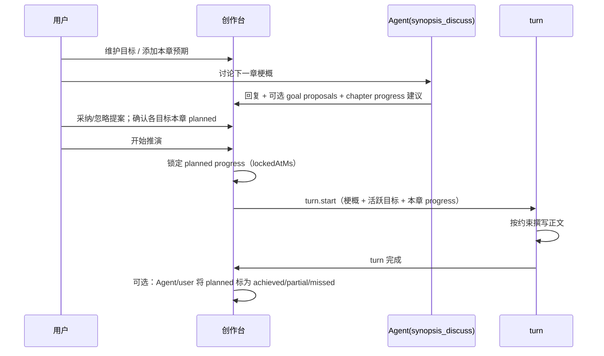

# 创作台推演目标设计

> **状态：** 设计草案（2026-08-27）  
> **终稿 brief：** [最终设计方案](./2026-08-27-creation-desk-deduction-goals-final-brief.md)（三 Agent 代码梳理 + 可行性/价值评估）  
> **范围：** 创作台右侧「推演目标」工具栏及其与梗概讨论、正式推演的衔接；目标按 **章节粒度** 记录完成情况，用于约束推演漂移。  
> **关联：** [剧情梗概讨论设计](./2026-08-27-plot-synopsis-discussion-design.md) · [章节修改协调](../../chapter-modification-coordination.md) · [UI 设计](../../ui-design.md)  
> **当前实现：** 仅前端原型（localStorage、勾选完成、Agent 待采纳）；**不含** 章节进度、删除确认、后端持久化。

---

## 1. 用户目标

在创作台与 Agent 讨论下一章、并进入正式推演时，用户需要一组 **可追踪的叙事目的（目标）**，而不是零散的聊天意图：

- **目标** 表示趋势性约束：某角色当前动机、某势力走向、某剧情线的预期发展等；
- 每个目标下挂 **按章节划分** 的 **目标完成情况**，粒度与 `chapterSequence` 对齐；
- 与 Agent **讨论梗概时**，就应明确 **「本轮推演结束后，各目标应达到什么完成状态」**；
- 正式推演须 **参照活跃目标及其本章预期完成情况**，降低正文偏离讨论结论的漂移；
- 目标可 **完成**、可 **移除**；用户可随时删除；Agent 提议删除须 **用户确认**；
- 目标 **随时可调整**：用户可直接修改表述与本章预期；Agent 修改须 **用户采纳** 后生效；
- Agent 对目标的 **新增 / 修改 / 完成 / 移除** 均属于 **待采纳变更**，不得静默生效。

---

## 2. 核心概念

### 2.1 目标（Goal）

**定义：** 跨章节的叙事目的或趋势约束，不是单次对话里的临时想法。

| 属性 | 说明 |
| --- | --- |
| `content` | 目标表述，如「林序查清雾港站夜班名单来源」 |
| `source` | `user` \| `agent`（创建来源，**不限制**后续谁可改；编辑权限见 §2.4） |
| `lifecycle` | `active` → `completed` 或 `removed` |
| `scope` | 项目级；默认作用于 **当前及后续章节**，历史章节进度只读 |
| `updatedAtMs` | 最后一次 **生效** 的 content 变更时间（用户直改或采纳 Agent 提案） |

**非目标：** 目标不是梗概全文、不是单条审核意见、不是图节点 ID。

### 2.2 目标完成情况（Goal Progress）

**定义：** 某一目标在 **某一章** 上的预期或实际完成描述；**最小粒度 = 一章**。

```ts
type GoalProgressStatus =
  | "planned"      // 梗概讨论期拟定，推演前锁定
  | "achieved"     // 本章已达成该预期
  | "partial"      // 部分达成
  | "missed"       // 未达成（复盘标记）
  | "superseded"   // 被后续讨论修订取代

type DeductionGoalProgress = Readonly<{
  progressId: string
  goalId: string
  chapterSequence: number
  chapterId?: string              // 正式章发布后回填
  summary: string                 // 本章对该目标的完成/推进描述
  status: GoalProgressStatus
  source: "synopsis_discuss" | "turn_review" | "user"
  lockedAtMs?: number             // 用户确认「开始推演」时锁定 planned
  recordedAtMs: number
}>
```

**示例：**

| 目标 | 章序 | summary | status |
| --- | --- | --- | --- |
| 林序查清名单来源 | 2 | 获得夜班登记簿副本，但未确认幕后主使 | `planned` → 推演后 `partial` |
| 东侧渡口势力坐大 | 2 | 渡口帮会首次与主角发生正面接触 | `planned` |

### 2.3 目标变更提案（Goal Proposal）

Agent **不得** 直接改写目标库；须产出 **提案**，由用户 **采纳 / 忽略**。

```ts
type GoalProposalKind = "create" | "update_content" | "complete" | "remove" | "set_chapter_progress"

type DeductionGoalProposal = Readonly<{
  proposalId: string
  kind: GoalProposalKind
  goalId?: string
  payload: unknown                // 依 kind 结构化
  status: "pending" | "approved" | "rejected"
  createdAtMs: number
}>
```

| kind | 用户确认后效果 |
| --- | --- |
| `create` | 新增 `active` 目标 |
| `update_content` | 修改目标表述（保留 progress 历史） |
| `complete` | 目标 `lifecycle → completed` |
| `remove` | 目标 `lifecycle → removed`（软删除，可分页查看） |
| `set_chapter_progress` | 新增或更新某章 `planned` progress |

**硬规则：**

- 用户手工 **修改 content / progress** → 立即生效，**无需** 二次确认；
- 用户手工 **删除** → 立即 `removed`，无需二次确认；
- Agent **任意变更**（含 `update_content`）→ 仅生成提案，须用户 **采纳** 才写入；
- 用户 **忽略** Agent 提案 → 提案丢弃，目标库不变。

### 2.4 目标可调整性（Mutability）

目标在 **整个创作周期内持续有效**，不是「讨论定稿后冻结」的一次性条目。

| 变更对象 | 用户 | Agent |
| --- | --- | --- |
| 目标表述 `content` | **随时** 直改，立即生效 | `update_content` 提案 → 须 **采纳** |
| 本章 progress `summary` | **随时** 直改（锁定前）；锁定后见下 | `set_chapter_progress` 提案 → 须 **采纳** |
| 完成 / 移除 | 勾选完成、单击删除，立即生效 | `complete` / `remove` 提案 → 须 **采纳** |

**与推演的边界：**

- **锁定前**（未点「开始推演」）：用户与 Agent（经采纳）对 `content`、本章 `planned` 的修改 **即时反映** 于创作台与下一轮讨论上下文。
- **锁定后**（已 `lockForTurn`）：本轮 turn 使用 **快照** 中的目标 bundle，运行中改库 **不 retroactive** 影响进行中的推演；修改作用于 **下一轮** 讨论/推演。
- 已锁定章的 progress 行只读展示；若用户要在章后调整叙事约束，应编辑 **下一章** planned 或修改仍 `active` 的目标 `content`（不 rewrite 历史 locked 行，必要时旧行标 `superseded` 并新建 planned）。

**审计：** 每次生效的 content 变更写入 `updatedAtMs`；可选 P2 增加 `contentRevision` 简史（非版本树 UI）。

---

## 3. 与梗概讨论、推演的时序



### 3.1 讨论阶段（synopsis_discuss）

- 模型上下文除梗概文件/对话外，注入：
  - 全部 `active` 目标；
  - 当前 `chapterSequence` 上已有 `planned` / 历史 progress；
- Agent 可在 `send` 结果中附带 **`goalProposals[]`**（含 `set_chapter_progress`；**不再** 使用独立 `suggestedProgress[]`）；
- **用户点「开始推演」前**，UI 应展示 **本章各目标的 planned 摘要**；缺失时允许推演但显示弱提示（可配置为阻断）。

### 3.2 推演阶段（turn）

- `resolveTurnBootstrapInput` 扩展为结构化包：

```ts
type TurnDeductionGoalBundle = Readonly<{
  activeGoals: readonly DeductionGoal[]
  chapterProgress: readonly DeductionGoalProgress[]  // 当前章 locked planned
}>
```

- Prompt 硬规则：**正文推进不得违背已锁定的本章目标完成情况**；若冲突须在 `review` 阶段暴露，而非静默改写目标。

### 3.3 推演后

- 默认：将 locked `planned` 保留，待用户在创作台或章节页 **确认复盘**（`achieved` / `partial` / `missed`）；
- 可选 P2：turn 的 `review` phase 自动建议 progress 状态，仍须用户确认或显式采纳。

---

## 4. 数据模型（项目级）

```ts
type DeductionGoalLifecycle = "active" | "completed" | "removed"

type DeductionGoal = Readonly<{
  goalId: string
  content: string
  source: "user" | "agent"
  lifecycle: DeductionGoalLifecycle
  createdAtMs: number
  completedAtMs?: number
  removedAtMs?: number
  removedBy?: "user" | "agent"   // agent 仅在被采纳 remove 提案后
}>

type DeductionGoalsSnapshot = Readonly<{
  projectId: string
  goals: readonly DeductionGoal[]
  progress: readonly DeductionGoalProgress[]
  pendingProposals: readonly DeductionGoalProposal[]
  updatedAtMs: number
}>
```

**存储：**

| 层 | 方案 |
| --- | --- |
| **P1** | SQLite 表 `deduction_goals`、`deduction_goal_progress`、`deduction_goal_proposals` |
| **P0 原型** | localStorage（已实现，待替换） |

**索引：**

- `(projectId, lifecycle)` 列表活跃目标；
- `(projectId, goalId, chapterSequence)` 唯一 progress（同章同目标至多一条当前有效 planned；历史用 `superseded`）。

---

## 5. UI：创作台右侧工具栏

### 5.1 布局（已实现骨架）

```text
┌──────────────────────────────┬──┐
│ 梗概讨论线程                  │🎯│  ← 目标图标，气泡向左弹出
│                              │  │
├──────────────────────────────┤  │
│ 输入区                        │  │
└──────────────────────────────┴──┘
```

### 5.2 气泡面板 — 主视图（进行中）

- 列表：**active** 目标 + **pending** Agent 提案卡片；
- 每条 active 目标：
  - **点击表述** 或 `[编辑]` → 行内修改 `content`，**即时保存**；
  - 勾选 → **完成**（`completed`，主列表隐藏）；
  - **删除** → 立即 `removed`；
  - 展开 → **本章 planned progress** 一行摘要 + **可编辑**；
- Agent **`update_content` 提案**：展示删改 diff（原文 → 建议文），**采纳 / 忽略**；
- 底部：添加目标；**全部列表**（分页，含 completed / removed）。

### 5.3 Agent 提案卡片

| 提案类型 | 操作 |
| --- | --- |
| 新增目标 | 采纳 / 忽略 |
| **修改表述** | **diff 预览** → 采纳 / 忽略 |
| 标记完成 | 采纳 / 忽略 |
| **移除目标** | **采纳 / 忽略**（须显式文案，如「Agent 建议移除此目标」） |
| 设置本章 progress | 采纳 / 忽略 |

### 5.4 全部列表

- 分页展示所有 `lifecycle`；
- `removed` / `completed` 只读，可展开历史 progress；
- 不提供「彻底物理删除」（与完成一致，软状态）。

### 5.5 开始推演前确认条（待实现）

当存在 active 目标且当前章存在未锁定 planned：

```text
本章目标预期：3 条已确认 · 1 条未填写  [查看] [开始推演]
```

---

## 6. 后端契约（拟定）

| 方法 | 说明 |
| --- | --- |
| `deduction.goals.list` | 返回 snapshot（含 pending proposals） |
| `deduction.goals.create` | 用户新增目标 |
| `deduction.goals.update` | 用户改 content / 手工 complete / remove |
| `deduction.goals.progress.set` | 用户设置某章 progress |
| `deduction.goals.proposal.approve` | 批量或单条采纳 Agent 提案 |
| `deduction.goals.proposal.reject` | 忽略提案 |
| `synopsis.conversation.send` | **扩展** 返回 `goalProposals` + `suggestedProgress[]` |
| `synopsis.conversation.resolveTurnInput` | **扩展** 返回 `TurnDeductionGoalBundle` |
| `deduction.goals.lockForTurn` | `开始推演` 时锁定当前章 planned（**内部**，由 `resolveTurnInput` / `beginTurn` 调用） |
| `synopsis.conversation.beginTurn` | **（推荐）** 原子：`resolveTurnInput` + lock + snapshot + 返回 turn 启动参数 |

**原子性：** 禁止 UI 分步调用 lock 与 turn.start；失败时整体 rollback（见 §14.2）。

**Phase：** 可在 `synopsis_discuss` 的 execute 中解析 structured output；`turn` 的 `rule_assembly` 注入目标 bundle。

---

## 7. Prompt 与结构化输出

### 7.1 synopsis_discuss

模型须被告知：

1. 活跃目标列表及历史 progress；
2. 可输出 `goalProposals`，但 **不得** 假定已生效；
3. 讨论下一章时，应协助用户拟定 **各目标在本章的 planned summary**；
4. 不得在未获用户确认的情况下 **修改、删除或完成** 目标。

### 7.2 turn / drafting

注入：

```markdown
## 推演目标约束（第 N 章）

- [目标 A] 本章预期：……（locked）
- [目标 B] 本章预期：……（locked）
```

---

## 8. 防漂移策略

| 机制 | 作用 |
| --- | --- |
| 讨论期锁定 planned | 推演前双方对「本章各目标达成何状态」有显式共识 |
| turn 输入携带 bundle | 模型撰写时有硬约束文本 |
| progress 复盘 | 章后对比 planned vs 实际，供下一章讨论引用 |
| 提案门禁 | Agent 不能单方面删改目标，避免对话中「口头作废」 |

**不做：** 目标不自动触发章节重写；目标完成不自动删图节点。

---

## 9. 与现有实现差距

| 能力 | 原型 | 本设计 |
| --- | --- | --- |
| 目标 CRUD | 用户 add；无 remove | + 用户 **随时 edit** content/progress；remove；Agent 变更走提案 |
| 完成 | 勾选 → completed | 同左 + Agent complete 提案 |
| 章节 progress | 无 | **核心增量** |
| 讨论期拟定 planned | 无 | synopsis_discuss 结构化输出 |
| 推演锁定 | 无 | lockForTurn |
| 持久化 | localStorage | SQLite |
| 全部列表 | 有，分页 | 含 removed |

---

## 10. 实施分期

| 期 | 内容 |
| --- | --- |
| **P0** | 设计评审 + 契约草案（本文） |
| **P1** | SQLite + `deduction.goals.*`；桌面 UI：remove、progress 行、提案卡片 |
| **P2** | `synopsis.conversation.send` 结构化 goal 输出；讨论期 progress 编辑 |
| **P3** | `resolveTurnInput` / `turn.start` 注入 bundle；lockForTurn |
| **P4** | 推演后 progress 复盘 UI；可选 review 自动建议 |
| **P5** | 章节正文页只读查看「该章目标完成情况」 |

---

## 11. 验收标准

1. 用户可添加、**随时修改**、完成、**删除** 目标；删除后主列表不可见，全部列表可查；
2. Agent 提议 **修改 / 删除 / 完成** 时，仅展示提案；**采纳后才生效**；
3. 每个 active 目标可绑定 **当前章** 的 planned progress；讨论期可编辑；
4. 「开始推演」锁定当前章 planned；turn 输入含目标 bundle；
5. 推演后 progress 状态可复盘，并出现在下一章讨论上下文；
6. Agent 新增/修改/完成/移除/progress 均走提案门禁。

---

## 12. 开放问题

- 同一目标同章是否允许多条 progress 历史（建议：**一条当前有效**，旧记录 `superseded`；DDL 见 §14.2 partial unique index）；
- 用户跳过 progress 填写是否允许推演（建议：**警告可跳过，默认可继续**）；
- **梗概全文 vs 目标 bundle 冲突时**（建议 P1 决标）：梗概优先 / 目标优先 / 阻断推演 — 须写入 turn phase 行为；
- 修订已提交章节时，是否回写 progress（建议：**P5 再议**，先只读展示）；
- 目标是否支持优先级/标签（建议：**非 P1**）；
- 用户误删 removed 目标是否可恢复（建议：**P2** 提供 un-remove 或 re-create 并关联历史 progress）。

---

## 13. 变更记录

| 日期 | 说明 |
| --- | --- |
| 2026-08-27 | 初稿：目标 + 章节 progress + 删除/提案门禁 + 防漂移 |
| 2026-08-27 | §2.4 增补：目标随时可调整（用户直改 / Agent 提案确认） |

---

## 14. 多 Agent 设计评审摘要

> 评审对象：本文 v1 · 对照 [梗概讨论设计](./2026-08-27-plot-synopsis-discussion-design.md) 与 `creation-desk-goals.ts` 原型。

### 14.1 共识（三份评审一致）

| 结论 | 说明 |
| --- | --- |
| 方向正确 | 「讨论对齐 → 锁定 planned → turn 约束 → 章后复盘」是防漂移的合理闭环 |
| 章节 progress 是核心 | 仅有扁平 Goal 列表无法约束推演；必须在 UI/API 中一等公民化 |
| 删除须非对称 | 用户 instant remove；Agent remove 走提案 + **「采纳移除」** |
| 提案与 Goal 分离 | 原型 `status=pending` 在 Goal 上应废弃，改为 `deduction_goal_proposals` 或 message 挂载 |
| P1 不宜全开 | SQLite + 用户 CRUD/progress 先行；Agent 结构化输出与 turn 注入分 P2/P3 |
| 推演前须 inline 确认 | Footer **本章目标预期** 确认条 + 「开始推演」主路径外露；Popover 仅负责维护 |

### 14.2 架构评审 — 关键发现

| 严重度 | 发现 | 处置建议 |
| --- | --- | --- |
| **critical** | 梗概 vs 目标双源真相无 reconciliation | §12 开放问题 **决标**：冲突时梗概优先 / 目标优先 / 阻断推演；turn 某 phase 产出可观测 artifact |
| **critical** | turn 违反目标无 enforcement phase | 新增或扩展 `goal_compliance_review`（或 `semantic_review`），非仅 Markdown 注入 |
| **critical** | `payload: unknown` 不可出 IPC | 为每种 `GoalProposalKind` 定义 zod discriminated union |
| **major** | 「开始推演」非原子 | 合并 `resolveTurnInput` + `lockForTurn` + snapshot + `turn.start` 为 **单一事务**（如 `synopsis.conversation.beginTurn`） |
| **major** | 双通道 Agent 输出 | `goalProposals` 为 progress 建议 **唯一通道**；取消独立 `suggestedProgress[]` |
| **major** | progress 唯一索引未决 | DDL：`UNIQUE (projectId, goalId, chapterSequence) WHERE status != 'superseded'` |

**更简备选（资源紧张时）：** 方案 B（Goal 表 + 单字段 `currentChapterExpectation`）+ 方案 C（提案挂 message，对齐 revision）。

### 14.3 UX 评审 — P0 建议

1. Footer **确认条** + 「开始推演」与「发送」并列（不再仅藏 `⋯` 菜单）
2. Popover **分区**：顶部「Agent 待处理」sticky + 下方「活跃目标」
3. 每目标 **当前章 progress 默认展开**，历史 progress 折叠
4. Agent remove：**warning 卡片** + 按钮文案 **「采纳移除」**
5. 用户删除：**单次点击 + 300ms undo toast**（无 modal，防误触）
6. Toolbar **badge**：pending 提案数 / 未填 progress 数

### 14.4 后端契约评审 — API 与分期

**API 划分：**

- **持久化：** `deduction.goals.list/create/update/progress.set/proposal.approve/reject`
- **梗概集成：** 扩展 `synopsis.conversation.send`（返回 proposals）、`resolveTurnInput`（返回 bundle + 内部 lock）
- **`lockForTurn`：** 不暴露公开 IPC；内聚于 `resolveTurnInput` 或 `beginTurn`

**推荐 P1（用户侧闭环）：** Migration 032 + 6 个 IPC + UI 接后端 + localStorage 一次性 import。

**P2：** `synopsisDiscussArtifactSchema` 扩展 + send 写 proposals + 讨论上下文注入。

**P3：** bundle 注入 `TurnPhaseInput`（建议 **interpret** 阶段）+ 确认条锁定。

**localStorage 迁移：** `pending` goal → `create` proposal；`active/completed` → goal 行；导入后清 key。

### 14.5 实施前必改项（评审合并 Top 5）

1. **原子 beginTurn** — 梗概 resolve、progress lock、goal snapshot、turn 启动同一事务
2. **Typed proposals** — zod schema 替代 `unknown`；对齐前端 Proposal 卡片 kind
3. **梗概/目标冲突策略 + turn enforcement phase** — 否则防漂移仅为 prompt 愿望
4. **P1 范围压缩** — 用户 CRUD + 本章 progress；Agent/turn 闭环单独里程碑
5. **原型语义迁移** — 废弃 Goal.status=`pending`；删除 UI + progress 行 + 后端 snapshot 字段同步后再写 migration
