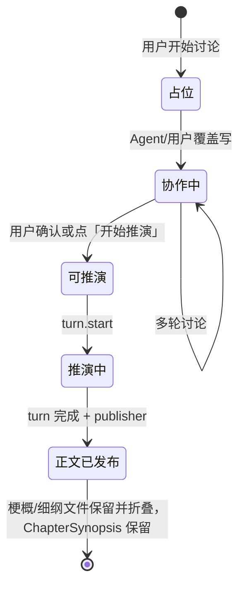

# 创作台剧情梗概讨论设计

> **状态：** 设计草案（2026-08-27，§11 增补梗概文件与推演触发）  
> **范围：** 创作台中央区由「静态首页 + 单次推演输入」演进为 **章节前 Agent 梗概讨论**；梗概落盘于 **`章节正文/*[剧情梗概].md`**，无版本树。  
> **关联：** [UI 设计](../../ui-design.md) · [章节修改协调](../../chapter-modification-coordination.md) · [上下文与 KV 缓存](../../context-and-kv-cache.md)

---

## 1. 用户目标

在 **正式推演撰写章节之前**，于创作台与 Agent 讨论下一章如何进行：

- 讨论开始时在 **`章节正文/`** 生成占位文件：`第{序号}章 {标题}[剧情梗概].md`；
- Agent 与用户 **直接覆盖更新** 该文件（**无版本概念**）；
- 用户可手工编辑同一文件；**非 Agent 写入的变动一律视为用户修改**；
- 定稿后进入正式推演：**Agent 不得自行触发**；须给确认选项，或用户点击 **「开始推演」**；
- 推演输入：**有梗概文件 → 以文件为准**；**无梗概文件 → 以对话内容为准**。

平台引导见 `世界推演规则/基础规则/plot-synopsis-guide.md`。

---

## 2. 与现有入口的分工

| 入口 | 时机 | 梗概/正文存储 | 版本 |
| --- | --- | --- | --- |
| **创作台梗概讨论**（本文） | 章节 **前** | `章节正文/…[剧情梗概].md`（推演前） | **无**，覆盖写 |
| **本轮推演** | 梗概确认后 | 正式 `章节正文/…md` + `ChapterSynopsis` 关联 | 链上 canonical |
| **章节 Agent 修订** | 章节 **已提交** 后 | revision 任务 + 草稿版本树 | 有 |

梗概讨论采用 `revision_assist` 式服务：对话在 SQLite；**读**活动链；**定稿开始推演时**可追加一条 `synopsis_brief` 到链（可选审计）。讨论期不向链追加多轮消息。

---

## 3. 梗概文件规范

### 3.1 命名

```text
章节正文/第{阿拉伯或中文序号}章 {标题}[剧情梗概].md
```

示例：`章节正文/第二章 雾港站的末班车[剧情梗概].md`

- `[剧情梗概]` 为固定后缀标记，用于与工作区策略、UI、推演路由识别；
- 序号/标题与即将撰写的正式章节一致；推演完成后正式章为 `第N章 标题.md`（**无** `[剧情梗概]`），见 §3.5。

### 3.5 推演完成：正文落盘与梗概关联

> **2026-09-02 修订：** 工作区 `[剧情梗概].md` **不再删除**。发布后与 `[剧情细纲].md` 一并**留盘并树折叠**到正式正文下。权威说明见 [章细纲生命周期](./2026-09-02-chapter-outline-lifecycle-design.md)。

推演成功、`chapter_publisher` 写入正式章节后：

1. **归档梗概文本**：将当前梗概全文写入 **`ChapterSynopsis` 关联记录**（按 `chapterId` / `chapterSequence` 绑定正式章路径）；若存在细纲，按章细纲设计冻结或保留文件；
2. **保留工作区前档文件**：`…[剧情梗概].md` / `…[剧情细纲].md` **不删除**；树上不再作为默认主入口，折叠关联到正式章；
3. **正式章成为表面文件**：`章节正文/第N章 标题.md` 为树默认入口；梗概/细纲内容 **不** 合并进该文件，经关联 UI / 右侧栏查看。

```ts
type ChapterSynopsisSource = "synopsis_file" | "conversation" | "turn_input"

type ChapterSynopsis = Readonly<{
  chapterId: string
  chapterSequence: number
  chapterPath: string              // 正式章路径
  synopsisMarkdown: string         // 冻结的梗概全文
  source: ChapterSynopsisSource
  originalSynopsisPath?: string    // 若曾存在 [剧情梗概].md
  turnBootstrapInput?: string      // 无梗概文件时的推演引导原文（兜底展示）
  linkedAtMs: number
}>
```

**归档优先级**（与 `turn.start` 输入一致；有细纲时主输入为细纲，见章细纲设计 §7）：细纲全文（若有）> 梗概文件全文 > 对话汇总 > `turn.start` 的 `userInput`。

### 3.2 生命周期



1. **开始讨论**：`synopsis.conversation.start`（或首条 `send`）→ 创建占位 `.md`（空或 `# 第N章 … 剧情梗概`）；
2. **协作中**：Agent `send` 可带 `synopsisBody` → 覆盖写文件；用户编辑器 `save` → 同样覆盖；
3. **无版本**：不创建 v0/v1；历史仅保留在对话表 + 可选文件 git 历史（若用户启用备份），产品层不展示版本列表。

### 3.3 编辑归因

| 来源 | 判定 |
| --- | --- |
| Agent 上一轮 `send` 写入后的内容 | Agent 修改 |
| 文件 digest 与 Agent 上次写入不一致，且非本次 `send` 触发 | **用户修改** |
| 用户明确说「我改了大纲第三段」 | 用户修改 |

实现要点：

- 服务端记录 `lastAgentSynopsisDigest`（每会话/每梗概路径）；
- 每次 `send` 前将磁盘文件全文与 digest 注入模型，并注明「自你上次写入后用户是否改过」；
- Prompt 硬规则：非 Agent 改动 **必须** 视为用户意图，不得覆盖回去除非用户要求。

### 3.4 工作区策略（待实现）

当前 `workspace-policy.ts` 规定 `章节正文/*` 仅 `chapter_publisher` 可写。梗概文件需 **例外**：

```text
章节正文/*[剧情梗概].md  →  user + synopsis_service（platform）可写
章节正文/*[剧情细纲].md  →  user + synopsis/outline 服务（platform）可写
章节正文/*.md（无上述后缀）→  仍仅 chapter_publisher（正式章）
```

---

## 4. 上下文链策略

- **读**：每次 `send` — `ensureModelContextChain` + `hydrateNarrativeMessages` + **当前梗概文件全文**；
- **写（讨论期）**：梗概 → 文件覆盖；对话 → `synopsis_conversation_messages`；**不写链**；
- **写（开始推演时）**：可选链上一条 `synopsis_brief`；`turn.start` 的 `userInput` 见 §6。

---

## 5. 进入正式推演

### 5.1 Agent 侧（禁止自动触发）

- Agent **不得**调用或暗示已启动 `turn.start`；
- 用户表示「可以写正文了」「梗概定了」时，回复须包含 **确认选项**，例如：  
  - 「按当前梗概开始正式推演」  
  - 「再修改梗概」  
- 即使用户口头指令像开始写作，仍须先出选项；**不得**代替用户确认。

### 5.2 用户侧（两种触发，等价）

1. 点击对话区旁的 **「开始推演」** 按钮（与发送并列）；
2. 点击 Agent 给出的 **「按当前梗概开始正式推演」** 选项（等价于确认后触发同一动作）。

### 5.3 「开始推演」按钮可用性与输入来源

按钮 **始终可点**（只要不在已有 running turn 中）；内容由应用解析：

| 条件 | `turn.start` 的引导内容 |
| --- | --- |
| 存在 `…[剧情细纲].md` | **细纲全文为主** + 梗概附录（冲突以细纲为准）；见 [章细纲生命周期 §7](./2026-09-02-chapter-outline-lifecycle-design.md) |
| 仅有 `…[剧情梗概].md` | **梗概文件当前全文**（含用户手工编辑） |
| 不存在梗概文件 | **对话线程汇总**（应用将 `synopsis_conversation_messages` 拼为结构化 `userInput` 前缀） |

优先级：**文件 > 对话**。有文件时即使对话更长，也以文件为准。

```ts
// 伪代码
function resolveTurnBootstrapInput(session): string {
  const synopsisPath = findSynopsisFile(session.chapterSequence)
  if (synopsisPath !== undefined) {
    return readMarkdown(synopsisPath)
  }
  return summarizeConversation(session.messages)
}
```

### 5.4 推演后

- 正式章节由 `turn` + `chapter_publisher` 写入 `章节正文/第N章 标题.md`；
- 梗概全文写入 **`ChapterSynopsis`** 后与正式章关联；工作区 `…[剧情梗概].md` / `…[剧情细纲].md` **保留并树折叠**（见 §3.5 与 [章细纲生命周期](./2026-09-02-chapter-outline-lifecycle-design.md)）；
- 用户打开正式章时，可通过右侧栏查看关联梗概/细纲（及冻结快照若有）。

---

## 6. UI

### 6.1 创作台中央区

```text
┌─────────────────────────────────────────────┐
│ 创作台 · 第 N 章剧情梗概                     │
│ 文件：章节正文/第N章 …[剧情梗概].md  [在树中打开] │
├─────────────────────────────────────────────┤
│ [Agent 对话]                                 │
│  · 选项按钮                                  │
│  · 「按当前梗概开始正式推演」确认项（Agent出）  │
├─────────────────────────────────────────────┤
│ [输入框]  [发送]  [开始推演]                  │
└─────────────────────────────────────────────┘
```

- **开始推演**：主按钮，逻辑见 §5.3；与底部旧 `TurnComposer` 合并或取代其「开始推演」；
- 左侧树在讨论开始后应出现梗概占位文件；
- 用户可双击梗概文件在中央 Monaco 编辑（与 Agent 写同一文件）。

### 6.2 章节正文 · 右侧工具栏「剧情梗概」

用户打开 **`章节正文/第N章 标题.md`**（正式章，非 `[剧情梗概]`）时：

- 在 **编辑区右侧栏**（`ChapterWorkspaceRail` 顶栏或 Agent 对话区工具条）新增 **「剧情梗概」** 按钮；
- 点击后在右侧展开 **只读梗概面板**（可折叠/再次点击关闭），不占用中央编辑器。

```text
┌──────────────────────────┐
│ Agent 对话    [剧情梗概] │  ← 新增按钮
├──────────────────────────┤
│ （对话线程 或 梗概面板）   │
│ 梗概面板：只读 Markdown    │
└──────────────────────────┘
```

**面板内容解析**（按优先级）：

| 条件 | 展示内容 |
| --- | --- |
| 存在 `ChapterSynopsis.synopsisMarkdown` | 冻结的梗概全文 |
| 无关联记录，但存在历史 `turnBootstrapInput` | 当年「开始推演」使用的用户/对话引导原文 |
| 均无 | 空状态：「本章无剧情梗概记录」 |

- 梗概面板 **只读**；修改梗概仅在推演前的创作台讨论阶段进行；
- 修订正式正文仍走章节 Agent / 草稿流程，与梗概面板独立。

---

## 7. 后端契约（修订）

| 方法 | 说明 |
| --- | --- |
| `synopsis.conversation.start` | 分配 `chapterSequence`，创建 `…[剧情梗概].md` 占位，打开会话 |
| `synopsis.conversation.list` | 当前活跃梗概会话 + 关联路径 |
| `synopsis.conversation.send` | 用户消息 → 模型 → 可选 `synopsisBody` **覆盖写文件** + choices |
| `synopsis.conversation.resolveTurnInput` | 返回本次 `turn.start` 将使用的正文（文件或对话汇总） |
| `chapter.synopsis.get` | 按 `chapterId` 或章节路径返回 `ChapterSynopsis`（正文页梗概按钮） |
| `chapter.synopsis.linkOnTurnComplete` | turn 完成时归档梗概（及细纲若启用），**保留**工作区前档并切换表面为正文（内部） |
| `synopsis.mutation.preview` / `apply` | 设定/图变更（P4） |

**Phase：** `synopsis_discuss`（独立 execute，同 `revision_assist`）。

**SQLite：** `synopsis_conversation_messages`；**`chapter_synopsis`**（`chapterId`、`synopsisMarkdown`、`source`、`turnBootstrapInput`、`linkedAtMs`）。

---

## 8. 实施分期

| 期 | 内容 |
| --- | --- |
| **P0** | `plot-synopsis-guide.md` + 工作区投影 ✅ |
| **P0.5** | 工作区策略：`[剧情梗概].md` 可写例外 |
| **P1** | 创作台 UI + `开始推演` 双源逻辑（可先 mock 文件） |
| **P2** | `SynopsisConversationService`：start 建占位、send 覆盖写、digest 归因 |
| **P3** | 只读图/设定查询 |
| **P4** | 设定/图变更门禁 |
| **P5** | `turn.start` 衔接；turn 完成 → `ChapterSynopsis` 归档 + **保留**梗概/细纲 md 并折叠 |
| **P6** | 章节正文右栏「剧情梗概」只读面板 |

---

## 9. 验收标准

1. 开始讨论后，左侧出现 `章节正文/…[剧情梗概].md` 占位；
2. Agent 更新梗概后文件内容被**整篇覆盖**，无版本 UI；
3. 用户手工改文件后，下一轮 Agent 承认为用户修改；
4. Agent 不会自行开始推演；定稿场景须出现确认选项；
5. 用户点「开始推演」：有细纲则以细纲为主+梗概附录；仅有梗概则用梗概；皆无则用对话；
6. 推演完成后工作区 **仍保留** `[剧情梗概].md`（及若有的 `[剧情细纲].md`），树折叠到正文下；`ChapterSynopsis` 可查；
7. 打开正式章时，右侧栏可展示关联梗概/细纲（及冻结快照）；无文件时展示当年推演引导输入。

---

## 10. 开放问题

- 一章是否允许多个 `[剧情梗概].md`（建议：**每序号仅一个**，start 时校验）；
- ~~推演完成后是否保留梗概文件~~（已决：**保留文件并树折叠**；见 [章细纲生命周期](./2026-09-02-chapter-outline-lifecycle-design.md)）；
- 用户跳过讨论、无文件无对话时是否禁用「开始推演」（建议：禁用并提示）。

---

## 11. 变更记录

| 日期 | 说明 |
| --- | --- |
| 2026-08-27 | 初稿 + 架构评审（讨论期不写链） |
| 2026-08-27 | §3.5–§6.2 推演后归档 `ChapterSynopsis`、移除梗概 md；正文右栏梗概只读按钮 |
| 2026-09-02 | 与章细纲生命周期对齐：发布后**保留**梗概/细纲文件并折叠；推演输入支持细纲为主 |
