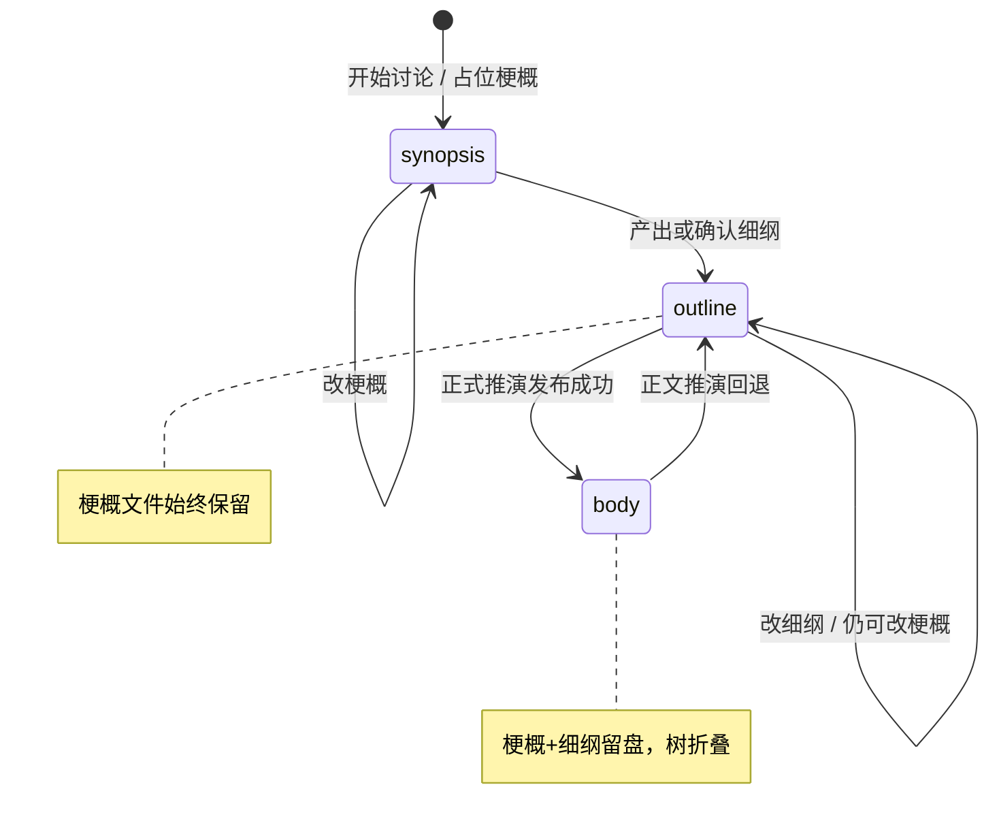

# 章细纲生命周期与章工件折叠设计

> **状态：** 已确认可实施（2026-09-02）  
> **范围：** 在剧情梗概之上增加同名系谱的 **`[剧情细纲]`**；工作区文件不删前档，树折叠 + 右侧栏关联；正式推演以细纲为主、梗概为附录；正文回退回到细纲级。  
> **关联：** [剧情梗概讨论](./2026-08-27-plot-synopsis-discussion-design.md) · [章节意图与弧线规划](./2026-08-31-chapter-intent-and-arc-planning-design.md) · [叙事目标分类](./2026-09-02-narrative-goal-taxonomy-design.md) · [暂存区](./2026-08-30-synopsis-staging-area-design.md)  
> **取代：** 旧设计「发布后删除工作区 `[剧情梗概].md`」——改为**保留文件 + 树折叠**（见本文 §6、§10）。

---

## 1. 用户目标

作者按阶段设计每一章：

1. 先写 **`第N章 标题[剧情梗概].md`**（摘要级：基调、目的、戏核、粗场景链）；
2. 再写 **`第N章 标题[剧情细纲].md`**（详细设计：分场、人际关系、势力消长、信息边界、与推演目标交叉引用）；
3. 两份对外都是同卷同序号同标题的 Markdown；**前档永不因进入后档而被删除**；
4. 树上默认只显示当前「表面」文件，前档**折叠关联**；右侧栏可查看关联的梗概/细纲；
5. 正式推演完成后表面变为 **`第N章 标题.md`**，梗概与细纲一并折叠关联到正文；
6. 若**正文推演被回退**，表面回到 **细纲级**（不是仅梗概）。

---

## 2. 决策记录（已锁定）

| 议题 | 选择 |
| --- | --- |
| 隐藏方式 | **树上折叠**（同目录留盘；侧栏只露表面文件，可展开看前档） |
| 右侧栏 | 展示当前章关联的梗概 / 细纲（及有则正文入口） |
| 推演权威输入 | **细纲为主 + 梗概附录**（冲突以细纲为准） |
| 正文回退 | 回到 **`outline`（细纲）** 级 |
| 元数据 | **章工件包**（SQLite / 会话记 stage + 三路径；纯文件名聚类作兜底） |
| 细纲存放 | 与梗概同目录 `章节正文/{卷}/`，**不**进 `暂存区/` |

---

## 3. 文件命名

```text
章节正文/{第N卷 标题}/第{序号}章 {标题}[剧情梗概].md
章节正文/{第N卷 标题}/第{序号}章 {标题}[剧情细纲].md
章节正文/{第N卷 标题}/第{序号}章 {标题}.md
```

- `[剧情梗概]` / `[剧情细纲]` 为固定后缀标记（允许标题与标记之间有或无空格，解析时归一）；
- 三文件 **共享同一** `chapterSequence` + 卷文件夹 + 标题主干；
- 每序号每标记至多一个文件；重命名标题时三者（若存在）应一并改名或由服务维护路径字段。

**工作区写权限扩展：**

```text
章节正文/*[剧情梗概].md  →  user + synopsis/outline 服务
章节正文/*[剧情细纲].md  →  user + synopsis/outline 服务
章节正文/*.md（无上述后缀）→ 仍仅 chapter_publisher（正式正文）
```

---

## 4. 章工件包与 stage

```ts
type ChapterArtifactStage = "synopsis" | "outline" | "body"

type ChapterArtifactBundle = Readonly<{
  projectId: string
  chapterSequence: number
  volumeFolderName: string
  title: string
  stage: ChapterArtifactStage
  synopsisPath?: string    // …[剧情梗概].md
  outlinePath?: string     // …[剧情细纲].md
  bodyPath?: string        // …标题.md（无标记）
  updatedAtMs: number
}>
```

| stage | 树表面入口 | 折叠关联 | 创作台默认打开 |
| --- | --- | --- | --- |
| `synopsis` | 梗概 | — | 梗概 |
| `outline` | 细纲 | 梗概 | 细纲 |
| `body` | 正文 | 梗概 + 细纲 | 正文 |

**表面解析规则：** 若存在正文且 stage=`body` → 正文；否则若存在细纲 → 细纲（stage 至少 `outline`）；否则梗概。

磁盘兜底：无 DB 行时，按同卷同序号扫描三后缀重建 bundle（兼容旧项目）。

---

## 5. 生命周期



1. **开始讨论**：创建/挂接 `[剧情梗概]`（现有行为）；`stage=synopsis`。
2. **细纲就绪**：Agent（主路径）或用户写出 `[剧情细纲]` 后 `stage=outline`；梗概**不删**，树折叠到细纲下。
3. **开始推演**：须用户确认；注入见 §7。无细纲时允许仅用梗概（兼容），UI 可弱提示「建议先写细纲」。
4. **发布成功**：写入正式正文；`stage=body`；**不再删除**梗概/细纲文件；DB 仍可冻结快照（`ChapterSynopsis` + 新增 outline 快照可选）。
5. **正文回退**：撤销「正文为表面」——`stage=outline`；树主入口回到细纲；正文文件处理见 §8（不回到仅梗概）。

---

## 6. 树 UI 与右侧栏

### 6.1 工作区树

- 默认只渲染各章的 **表面路径**；
- 表面节点可展开「关联文稿」子项：按存在性列出梗概 / 细纲 / 正文（非表面项带弱样式）；
- 选中关联子项仍可在编辑器打开全文（可编辑性：`body` 阶段时前档默认只读或可编辑由实现定，推荐 **仍可编辑前档**，但 badge 标明「非当前表面」）。

### 6.2 右侧栏（章关联）

当选中某章系谱中任一文件或处于该章创作台会话时，右侧栏展示：

| 块 | 内容 |
| --- | --- |
| 当前阶段 | `梗概` / `细纲` / `正文` |
| 剧情梗概 | 路径 + 打开；可截断预览 |
| 剧情细纲 | 同上（无则「尚未创建」+ 引导） |
| 正文 | 有则打开；无则隐藏 |

---

## 7. 正式推演注入

`beginTurn` / `turn.start` 引导内容：

| 条件 | 主输入 | 附录 |
| --- | --- | --- |
| 存在细纲 | **细纲全文** | 梗概全文，标题标明「剧情梗概（附录·冲突以细纲为准）」 |
| 仅有梗概 | 梗概全文 | — |
| 皆无 | 对话汇总 / 显式 `userInput`（现有兜底） | — |

归档冻结（发布时）：

- 继续写 `ChapterSynopsis`（梗概快照）；
- 建议并行 `ChapterOutline` 快照（细纲全文 + `originalOutlinePath`）；若 v1 省略 DB 表，至少保证工作区文件留存 + bundle 路径正确。

**修订旧规则：** [剧情梗概讨论 §3.5 / §5.3](./2026-08-27-plot-synopsis-discussion-design.md) 中「发布后移除工作区梗概文件」作废，改以本文为准。

---

## 8. 正文回退（回到细纲级）

**触发：** 用户明确「回退本章正文推演 / 撤销本章发布表面」（具体入口可挂历史恢复、章菜单或创作台；v1 至少定义语义，UI 入口可 P1）。

**效果：**

1. `stage = outline`（若无细纲文件则降级 `synopsis`，属异常兜底并告警）；
2. 树表面 = 细纲；
3. 正式正文：
   - **推荐：** 工作区正文文件移出表面（删除或改名为内部回收名，如加 `[已回退]` 后缀且不参与表面解析），图/世界线恢复策略仍服从既有 history 规则，**本文不扩大为整库 checkout 设计**；
4. 梗概与细纲文件内容保留；
5. 创作台会话重新挂接细纲路径为默认编辑目标。

**不做：** 回退时自动清空细纲；回退直接跳回「仅梗概」作为默认。

---

## 9. 讨论 Agent 与细纲内容

### 9.1 主路径

- 梗概戏核收窄后，Agent **主动**产出/更新 `[剧情细纲]`（经 artifact 字段，如 `outlineBody` + 可选 `outlineTitle`），用户可继续改；
- 细纲不是手填主路径；与推演目标一样：**Agent 写、用户审**。

### 9.2 细纲推荐结构（提示词模板，非硬 schema）

```markdown
# 第N章 {标题}（剧情细纲）

## 章定位
（承接 / 本章必须改变什么 / 结束状态）

## 人物与关系
（出场人物；性格差异如何在本章行动中体现；关系张力）

## 势力与格局
（本章势力消长、资源/话语权变化）

## 分场节拍
### 场 1 …
（地点、在场人物、冲突、信息进出、结束钩子）

## 信息边界
（可揭示 / 不可揭示）

## 与推演目标
（相关 foreshadow/climax goal 引用或文字交叉）

## 风险与待决
```

可含 mermaid（关系/势力）——可选，非门禁。

### 9.3 提示词触点

- `synopsis-discuss.md` / `plot-synopsis-guide.md`：梗概后进入细纲；有细纲后讨论默认改细纲；开推前提示以细纲为准；
- `draft.md`：已注入细纲时按细纲分场与人物性格行事。

---

## 10. 与旧行为差异

| 旧（梗概设计） | 新（本文） |
| --- | --- |
| 发布后删除工作区 `[剧情梗概].md` | **保留**；树折叠到正文下 |
| 推演输入 = 梗概全文 | 有细纲时 **细纲为主 + 梗概附录** |
| 仅两态：梗概 ↔ 正文 | 三态：`synopsis` → `outline` → `body`，回退 `body`→`outline` |

---

## 11. 验收标准

1. 同章可同时存在梗概与细纲文件，发布正文后二者仍在磁盘。
2. 树默认只显示表面文件；展开可见关联前档；右侧栏可打开梗概/细纲。
3. 有细纲时 beginTurn 主输入为细纲，且带梗概附录说明。
4. 发布后表面为正文；正文回退后表面为细纲（有细纲时）。
5. 工作区策略允许用户与讨论服务写 `[剧情细纲].md`。
6. 旧项目仅有梗概时可仍开推；不强制迁移细纲。

---

## 12. 非目标（v1）

- 细纲版本树 / diff 回退；
- 把细纲权威放到 `暂存区/`；
- 自动 NLP 校验细纲是否覆盖梗概全部要点；
- 整库世界历史 checkout 与「正文回退」绑死（回退正文表面 ≠ 自动整库回滚）；
- 批量预建多章完整细纲。

---

## 13. 实施触点（预告）

- contracts：bundle / stage / beginTurn 附录形状；
- backend：路径解析、发布后不删梗概、细纲写入、beginTurn 组装、回退 stage；
- desktop：树折叠、右侧栏章关联、创作台默认打开表面；
- prompt-contracts：细纲结构 + 讨论/draft 规则；
- 修订：`2026-08-27-plot-synopsis-discussion-design.md` §3.5 / 验收条；`2026-08-31-chapter-intent…` 中「发布后移出工作区」表述。

---

## 14. 开放实现细节（计划阶段定）

- 正文回退时正文文件删除 vs `[已回退]` 重命名；
- `ChapterOutline` 是否 v1 就落表，或仅文件 + bundle；
- artifact 字段名 `outlineBody` 最终命名。
