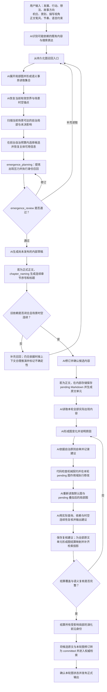
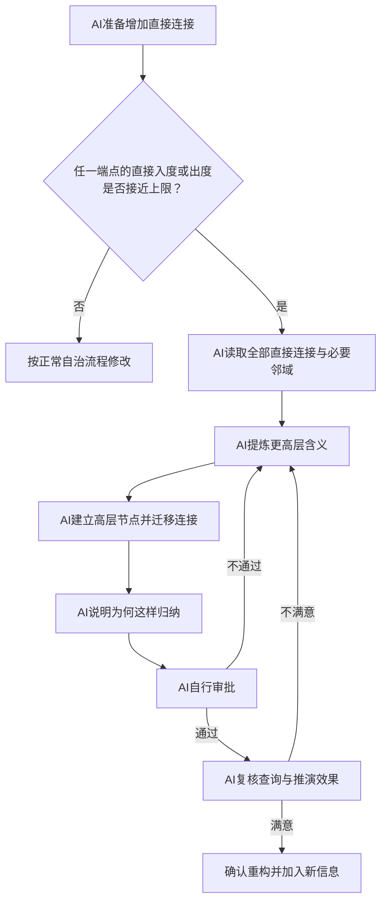
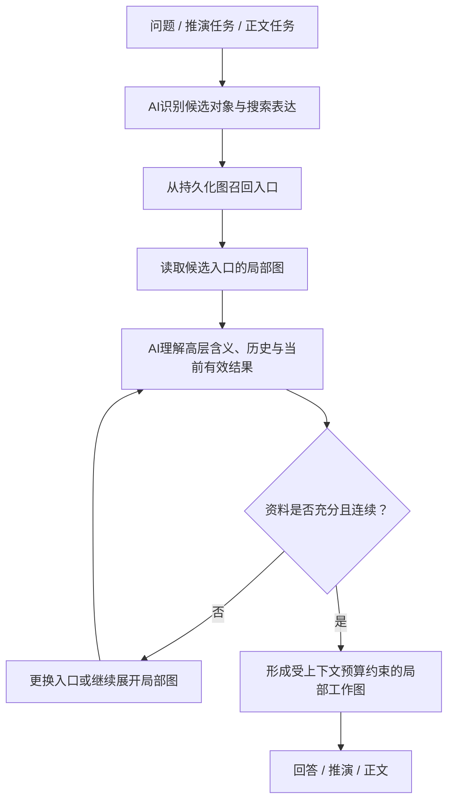
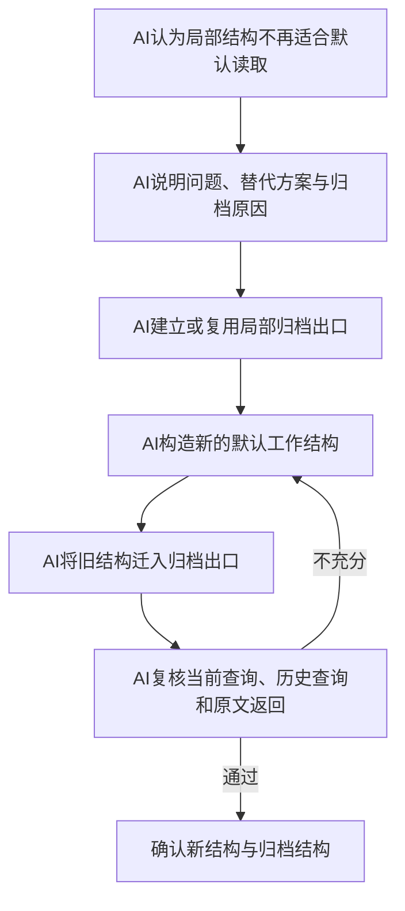
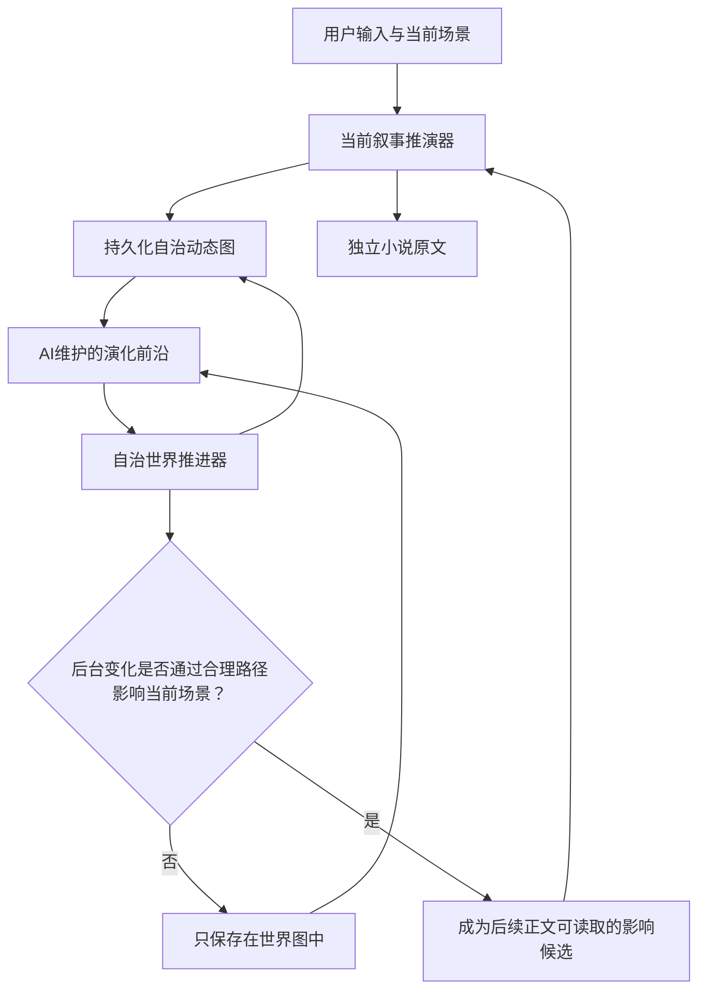
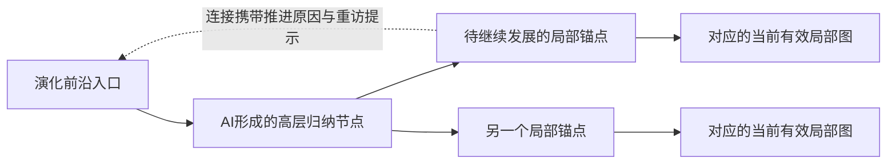
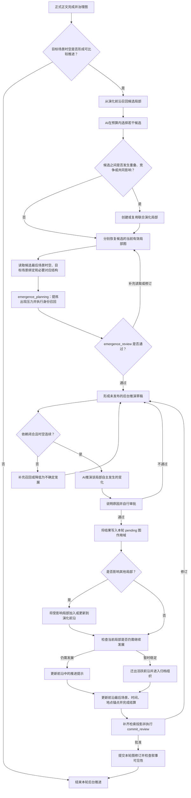
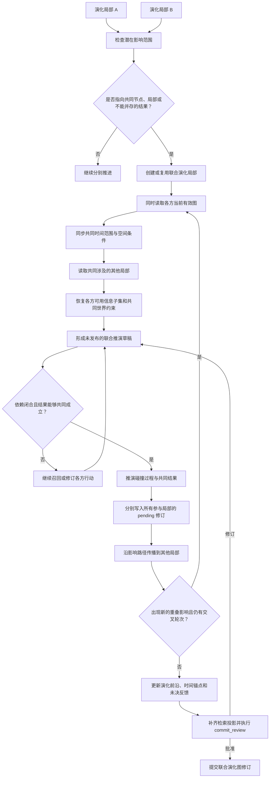
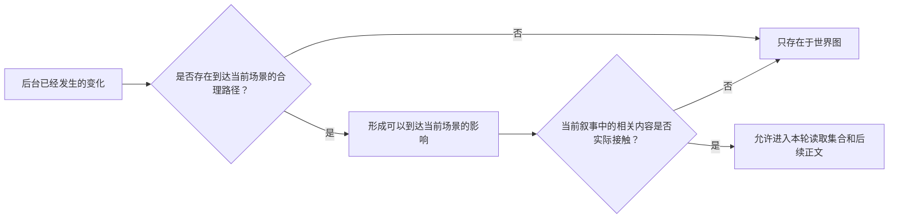
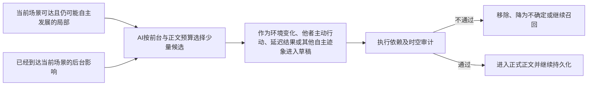

# Worldseed：AI 自治动态图设计

> 本文描述目标设计，不代表代码已经实现。当前每项能力的设计、代码和验收状态统一以 [设计与实施状态](implementation-status.md) 为准；历史计划、原型图、Schema 或局部测试均不能替代该状态表。

## 1. 目标

Worldseed 是一个由 AI 自主管理的动态世界模拟内核。

它不预先规定人物、地点、势力、时间、空间、状态、事件、记忆等领域模型，也不要求所有作品服从固定 schema。系统只提供一张可持续演化的图；万事万物均可成为节点，节点之间的含义由 AI 根据上下文、已有图结构和推演需要自主建立。

代码不理解世界，不审批语义，也不判断图是否合理。代码只是无语义的存储与操作介质。AI 拥有图的完整权限，并通过“说明原因、依据原则自审、修改后复核”的自治闭环维持图的干净、简洁、动态和逻辑一致。通用查询计划、修改计划和多记忆后端整合见 [通用记忆计划与多后端整合设计](memory-plan-and-backend-integration.md)。

正式场景、多世界不同流速、动态空间和跨参照移动的统一协议见 [通用时空锚点设计](spacetime-anchor-design.md)。该协议只声明普通图结构在本轮承担的时空角色，不增加时间、地点或世界领域 schema。长时间推演遇到任意异常时的成果保留、用户确认和检查点恢复见 [推演中断、确认与恢复设计](turn-interruption-recovery.md)。用户保存、返回过去完整世界、浏览历史并从旧状态分叉继续的长期版本机制见 [推演历史、世界线与版本恢复设计](world-history-versioning.md)。

核心目标：

- 从一句话开始，仅建立当前推演需要的最小图。
- 随正文、用户输入和推演结果持续扩展世界。
- 用户可以随时改变故事走向和表现方式，但用户输入不天然等于世界真相。
- AI 可以新增、编辑、合并、拆分和归档任意节点与连接；不再适合默认读取的旧结构进入相关局部结构的归档出口，不进行物理删除。
- AI 优先在已有结构上生长，不因新说法不断创造同义结构。
- 图不仅表达静态信息，还表达变化、因果、过程、认知、创作控制以及 AI 自己形成的新语义。
- 查询从相关节点出发，逐层展开需要的信息，不加载整张图。
- 每个节点两个方向的直接邻接都有上限；任一方向达到上限时，AI 必须自主提炼更高层含义并递归重构。

### 1.1 需求验收基线

本设计及其后续实现必须以以下需求作为统一验收标准。后续章节负责说明如何实现这些要求，不能用原则性描述代替实际闭环。

#### 完整需求总表

1. 系统从一句话或最小初始点开始，能够扩展任意题材、任意规则和非常规世界；
2. 万事万物都可以成为节点，代码不预定义人物、势力、地点、事件或其他领域 schema；
3. 连接可以携带任意信息，节点、连接、局部模式、高层抽象和查询路径的语义都由 AI决定；
4. 正文中实际出现的全部内容自动获得持久表达，同时完整保存连续小说原文；
5. 编辑当前结构不能销毁历史，过去事实、具体话语、任意历史时点和变化过程都能够恢复；
6. 当前有效内容必须沿前置修订、完整生效场景时空、历史返回路径和当前入口连续，不能因上下文压缩、旧资料相似或长期未出现而回退；
7. 每轮只选择性读取真正需要的持久化局部图，不能把整张世界图一次装入模型上下文；
8. 用户可以推动事件、行动、想法和故事方向，也可以独立控制机位、景别、描写视角和正文笔风；
9. 用户输入与当前世界矛盾时不拒绝用户，但也不自动把用户输入当作已经发生的世界真相；
10. AI负责世界语义、身份解析、修改原因、自审、审批、复核、查询方向和图治理，代码只负责无语义基础设施；
11. 图优先复用既有结构，通过双向直接邻接上限、递归抽象和局部归档保持长期简洁与可发现；
12. 当前场景和用户视野外的任意局部都可以自主发展、相互碰撞并通过合理路径影响正文，世界不能只围绕用户即时输入响应；
13. 任意主体的自主判断只能使用其实际可获得的信息，不能因为全局 AI知道某事就让局部主体获得全知；
14. 后台不要求事实俱备，但正式正文必须持续呈现少量可追溯、非完全由用户当前输入造成的自主变化，使读者感到世界在运行；
15. 主推演、后台推进、召回、上下文、图治理和自审都必须具有可调的调用、token、耗时、容量及循环预算；
16. 新人物、新势力、新事件或其他新内容不按领域类型和章节配额触发，而由已读取世界无法被现有局部合理承担的出现压力统一决定；
17. 上述能力必须通过长期固定测试集、量化门槛和正文效果评估验证，不能以文档中出现过相关原则代替实际满足；
18. 基础规则、用户规则、设定集和参考资料分层管理；基础规则作为锁定的常驻系统提示词，用户规则每轮读取全部 Markdown，设定集和参考文件先读取各自不可删除的 `readme.md` 再选择性读取，其余内容均记录来源；
19. 项目工作目录、固定入口、允许的 Markdown 文件和文件任务进度都由持久化工作区协议提供；任何用户界面都不能绕过基础规则直接修改世界事实，具体工作台布局与交互见 [UI 设计](ui-design.md)；
20. 每次正式正文推演都由 AI生成连续章节序号和章节名，按 `第一章 xxxx.md` 写入固定的 `章节正文` 目录，标题同时属于正文内容并参与图结算。
21. 每个 AI 阶段只有一套语义 artifact 契约；已有对象由模型和数据库共同使用项目级永久 ID，新图对象使用 `local:*`，代码通过按前缀独立递增的项目计数器一次性分配永久 ID；已有图引用必须来自当前模型可见的实际读取证据。

以下分类基线展开上述总表，并作为设计与实现的逐项检查入口。

#### 通用世界推演

- 系统从一句话或一个最小初始点开始，由 AI持续推演和扩展世界；
- 世界可以属于任何类型，也可以具有非常规规则，底层不绑定特定题材；
- 长期发展必须保持逻辑连续，不能因为模型上下文压缩而遗忘、回退或重新创造另一套世界。

#### AI 自治动态图

- 万事万物都可以成为节点，不预定义人物、势力、地点、事件或其他领域类型；
- 连接可以携带任意信息，不规定必须表示某种关系；
- AI自行决定节点、连接、局部模式、高层抽象和查询路径的语义；
- AI可以新增、编辑、合并、拆分、迁移、抽象和归档图结构；
- 代码只负责保存、索引、读取、容量控制和执行，不参与世界语义判断；
- AI对重要修改说明原因、自行审批，并在修改后重新读取和复核。
- AI通过版本化、分阶段 Prompt Contract 执行理解、草稿、依赖审计、图治理、语义复核、正文结算、前沿结算和提交复核。

#### 完整持久化与原文

- 正文中实际出现的全部内容都必须获得持久表达，不设置重要度过滤；
- 全部持久化不等于每次出现都创建新节点，AI必须优先进行身份解析和结构复用；
- 每轮正式正文另外以连续小说形式完整保存，不能用图节点、摘要或高层抽象代替；
- 每轮正式正文以 AI生成的章节序号和章节名写入 `章节正文/<章节名>.md`，章节名同时属于正文首个原文单元；
- 候选正文和图修订在闭环完成前只存在于同一 `pending` 作用域，不能进入普通世界召回；
- 图通过原文引用返回相关章节、段落和具体话语；
- 每个不可变原文单元都必须具有 AI生成的图结算映射，正文不能只靠一句“已经全部读取”证明完成回写；
- 每次图修改都机械保留不可变的修改前后修订，编辑当前节点不能覆盖并销毁历史；
- 当前设计不物理删除旧图结构，过时结构迁入相关局部结构的归档出度；
- 归档内容仍能通过当前图、全局索引和小说原文重新找到。

#### 推演依赖

- 每轮推演只能依赖本轮实际读取的持久化旧图、用户输入和本轮新产生的内容；
- 这里的事务只表示语义读取和依赖范围，当前不讨论存储原子性；
- 生成内容如果依赖过去，相关依据必须先进入本轮读取集合；
- 无法召回依据时，只能将相关内容作为新引入、不确定说法、用户意图或世界修改处理；
- AI不能用本轮尚无依据的输出反向证明它过去已经存在。

#### 用户创作控制

- 用户可以输入事件发展、人物行动、想法、计划和故事方向，影响接下来的世界推演；
- 用户可以独立指定描写视角、人称、观察距离、机位和景别，控制正文如何观察与呈现场景；
- 用户可以独立指定正文笔风、节奏、句式、语言习惯和其他写作约束，控制正式正文的表达方式；
- AI必须区分推动世界变化的输入与只控制正文表现的输入；机位、景别、描写视角和笔风约束不自动成为世界事实。
- 用户可以用 Markdown 编写作品级用户规则，规定人物、势力或其他内容的出场条件、发展优先级、禁止提前揭示的内容和大纲方向；用户规则在明确适用范围内优先于平台默认创作建议，范围外或无法判断时回退默认规则，且不能改变基础规则。
- 用户可以维护设定集，内容可以包含任意人物、势力、世界观、大纲、术语和其他资料；设定集以 Skill manifest 加选择性片段进入上下文，不默认全文加载。
- 用户可以挂载第三方文献、同人作品和其他参考资料；`参考文件/readme.md` 是不可删除但可编辑的固定索引入口，AI 必须先读取索引，再按任务选择性检索；缺少索引时项目校验失败，不允许用任意查询替代索引。

#### 时间与空间连续性

- 持久化图与模型上下文分离，上下文压缩不能修改世界；
- 已确认内容持续有效，直到 AI建立明确的后续变化或主动修订；
- 任何改变当前有效内容的修改都必须由 AI连接前置修订、完整生效场景时空、历史返回路径和新的当前入口；
- 历史继续存在，但不能覆盖长期发展后的当前有效结果；
- 每个正式场景必须形成一个场景锚点，并声明本轮采用的局部时间参照、时间锚点、空间参照和地点锚点；
- 场景切换必须能够恢复时间经过、空间移动、实际前置场景和连续路径；
- 不假设唯一全局世界时间或绝对空间；多个局部通过 AI建立的同步点、对应关系、通道或明确不确定性结构按需连接；
- 每个演化前沿分别保存自己的最后场景、时间和地点锚点，数据库处理时间不得冒充世界时间；
- 倒叙、插叙、并行场景和补写过去不能因为文本顺序较晚而覆盖当前场景。

#### 选择性召回

- 所有节点、连接、携带信息、不可变修订、正文结算记录和小说原文都必须进入全局检索；
- 查询先进行全局候选召回，再围绕候选入口展开局部图，不把整张图装入上下文；
- 一次未命中不等于不存在，AI必须在预算内更换表达、入口或继续召回；
- 精确话语和早期细节必须返回小说原文，不能用摘要冒充；
- AI可以建立多入口、直接路径和高层节点，提高历史内容的重新发现效率。
- 任意连接都必须能够从两个端点通过有界局部结构重新发现，高入度不能成为反向查询盲区。
- 任意可提交记录都必须具有与原载荷摘要匹配的统一检索投影，同时支持精确键和 AI生成的语义检索文本。

#### 性能与容量

- 每个节点具有可调整的直接入度和出度上限，任一方向达到上限后由 AI递归抽象和重构；
- 双向直接邻接、展开深度、候选数量、访问节点数、访问连接数、节点内容、上下文 token、召回轮数和延迟目标都必须具有合理默认值并允许调整；
- 正文召回、草稿、审计、图治理、结算和复核共同受整轮模型调用、输入 token、输出 token、耗时和循环次数上限约束；
- 预算耗尽但依赖仍未闭合时，AI不能编造确定事实。

#### 正文生成闭环

- AI先生成不对用户发布的内部草稿；
- AI审计草稿中的历史依赖、时间锚点、地点锚点和连续路径；
- 正文草稿前必须在预算内扫描当前场景可达的自治局部，不能只响应用户明确提到的对象；
- 审计发现矛盾、缺少必要时空锚点或存在可继续消解的既有指代时继续召回并修订；仅仅资料不足不构成拒绝正文的理由，模型应在连续性允许的范围内完成推演并标记不确定性；
- 正文完整保存后，AI自动将本轮实际出现的全部内容回写动态图；
- 只有候选原文、图修订、检索投影、正文结算和前沿结算的机械契约全部完成后，正文和图作用域才共同进入权威可见范围；AI提交复核只产生连续性与查询建议，不拥有语义否决权；
- 长期推演不依赖人工逐章整理人物、势力或其他设定。

#### 世界自治演化

- 用户没有关注的局部世界也可以继续发展，世界不能只围绕当前主角和当前场景响应；
- AI维护一个由普通节点和连接组成的演化前沿，记录哪些局部仍值得在未来继续推演；
- 正式场景的局部时空发生有效推进后，自治世界推进器在可调预算内选择少量可通过已读对应结构比较的局部进行后台推演，不遍历和更新整张图；
- 后台结果直接进入持久化世界图，但只有沿合理影响路径到达当前场景后才允许进入正文或人物认知；
- 长期未推进的局部在重新进入或查询前执行惰性追赶，从该局部最后场景时空恢复到目标场景时空；没有已读对应结构时保留未知，不强制换算；
- 自治推进器只规定任意局部结构如何继续演化，不预定义人物、情感、势力、经济或其他领域规则。
- 自治演化不追求让所有后台事实完整就绪，而是在正文预算内持续呈现少量具有图中依据、并非只由用户当前输入直接造成的变化，使读者能够感到世界在自主运行。
- 每轮正文和后台图治理结束时都必须结算受影响局部的演化前沿身份，不能依靠 AI偶尔想起后再登记；
- 自主行动只能依据行动主体通过现有图路径实际能够获得的信息，同时必须读取约束该变化成立范围的已有世界结构。

#### 逻辑投影

- 地图、关系网络、历史回顾、长期发展统合和普查都从相关局部图临时形成，不成为代码中的固定领域模块；
- 投影必须与本轮实际读取的事实一致，不能与过去和当前有效内容矛盾；
- 资料不足时可以给出大致范围、规模和趋势，不要求没有依据的精确数字。

### 1.2 当前范围边界

以下内容属于上层大纲、推演策略或后续实现阶段，不作为当前底层动态图的职责：

- 情节节奏、大纲规划、类型化创作和领域推演策略；
- 图存储、索引与正文保存的原子提交机制；
- 缺少持久化依据时的精确数值模拟。

底层动态图只负责让已经出现、已经发生和已经形成的世界内容长期可保存、可召回、可追溯，并在后续推演中保持时间、空间和逻辑连续。

自治世界推进器作为底层图之上的通用运行层纳入本设计，提供演化前沿、有限后台推进、影响传播和惰性追赶机制。新人物、新势力、新事件或其他内容何时形成、复用、扩展、揭示、延后或拒绝，由 [世界内容出现与生成规则](world-emergence-rules.md) 统一约束；该规则仍不负责具体情节节奏、作品大纲或领域类型设计。

---

## 2. 根本立场

### 2.1 万事万物都是节点

系统不预设哪些东西才有资格成为实体。只要 AI 认为某个对象、变化、概念、说法、意图或局部结构需要被独立引用、演化或查询，就可以建立节点。

一个节点可能表示某个人，也可能表示一段经历、一种未证实说法、一次推演结果、一组被 AI 提炼出的更高层含义，甚至表示 AI 在图中形成的局部组织方式。

节点的含义不由代码中的类型枚举决定，而由节点自身资料、周围连接、来源和演化历史共同表达。

### 2.2 图的语义由 AI 决定

代码不预设出口类型、边类型、领域维度或对象分类。AI 每轮读取相关局部图，自主决定：

- 复用已有节点或连接；
- 编辑已有节点或连接；
- 创建新节点；
- 创建新的局部连接模式；
- 合并、拆分或重构局部子图；
- 将不再适合默认读取的结构迁入局部归档出口。

所谓“新的局部连接模式”，仍然使用相同的节点与连接原语，只是 AI 在既有图的基础上形成了新的组合方式，而不是要求代码增加一种新 schema。

平台不规定每个出口必须具有何种含义、何时进入、如何展开、何时停止或如何随世界变化而重构。这些都属于 AI 自主形成并持续演化的局部图语义。AI可以把查询提示写入连接携带的信息，也可以通过节点、连接、高层结构、多入口或其他普通图组合让组织方式本身表达查询方法；设计不要求每个出口填写统一说明。

平台只规定效果标准：图必须完整表达正文实际出现的全部事务、演化过程和当前有效状态；相关当前查询、历史查询和原文追溯必须能够在有限预算内准确、选择性地完成；局部结构长期保持简洁，重构不能切断旧资料和原文返回路径。具体怎样达到这些标准、怎样判断停止展开以及怎样修改已有查询语义，全部由 AI依据当前任务和已读局部图决定。

### 2.3 AI 有任意权限

系统不设置语义层面的硬门禁。AI 可以修改整张图，包括它自己过去建立的结构。当前设计不包含物理删除；AI通过归档和局部重构保持默认工作图简洁，同时保留旧结构的返回路径。

自由并不来自缺少治理，而来自治理也由 AI 完成：

1. AI 提出修改；
2. AI 解释修改原因；
3. AI 根据自治原则审批；
4. AI 执行修改；
5. AI 重新读取修改后的图；
6. AI 判断是否确认、继续重构、回退或转入归档重构。

这些阶段可以由同一个模型分阶段执行，也可以由多个 AI 角色执行，但所有语义决定都属于 AI。

### 2.4 代码没有世界治理权

代码只负责：

- 保存节点、连接和资料；
- 不可变保存小说原文、原文单元、图修订、AI决定记录和正文结算记录；
- 根据 AI 指令执行新增、编辑、读取和归档重构；
- 在每次图修改时机械记录修改前后值、操作顺序和引用完整性；
- 维护 `pending`、`committed` 和 `retired` 作用域，阻止未提交内容进入普通世界召回；
- 保存并索引每个持久化记录的统一检索投影；
- 返回 AI 请求读取的局部数据；
- 提供不带世界语义的基础索引、双向邻接、覆盖清单核对、容量计数和存取能力。

代码不负责：

- 判断节点或连接是否合理；
- 判断用户输入是否是真相；
- 判断两个节点是否重复；
- 判断图是否简洁；
- 判断重构是否成功；
- 判断哪些信息应当保留在默认工作图、迁入归档或重新组织；
- 判断抽象节点应当表达什么；
- 判断查询应当沿哪些语义方向展开；
- 判断正文结算映射是否在语义上完整。

代码始终保留基础设施修订历史，但是否把某次修订解释为世界变化、是否建立新的当前入口、何时回退、回退到哪里，仍由 AI决定。

---

## 3. 最小数据原语

固定的不是世界类型，而是极小的存储形状。

### 3.1 Node

```ts
type Node = {
  id: string
  content: unknown
  metadata?: Record<string, unknown>
  sourceRefs?: SourceRef[]
}
```

`content` 与 `metadata` 的语义由 AI 定义和解释。代码不验证其中是否为人物、地点、过程或其他概念。这里的 `unknown` 只表示世界语义未知，不表示可以保存任意不可序列化运行时对象；载荷必须能够由存储适配器无损规范化，或者保存为具有摘要和读取接口的外部内容引用，否则不能进入 `committed`。

### 3.2 Link

```ts
type Link = {
  id: string
  fromNodeId: string
  toNodeId: string
  content?: unknown
  metadata?: Record<string, unknown>
  sourceRefs?: SourceRef[]
}
```

连接可以只负责连通，也可以携带任意信息。信息是否存在、表示关系、状态、过程、查询提示还是 AI 自创的其他内容，完全由 AI 根据上下文决定。代码不要求每条连接必须解释关系，也不维护边类型枚举。

### 3.3 Mutation

```ts
type GraphMutation =
  | { operation: "create_node"; node: Node }
  | { operation: "edit_node"; nodeId: string; next: unknown }
  | { operation: "create_link"; link: Link }
  | { operation: "edit_link"; linkId: string; next: unknown }
```

合并、拆分、迁移、归档、压缩和局部重构都由 AI 组合这些基础操作完成。归档时，AI建立或复用局部归档节点与连接，并把旧结构迁移到归档出口之下；代码不需要理解“归档”或“合并”本身意味着什么。

任何 `GraphMutation` 都不能抹去它发生前的资料。代码应用修改时先把结果写入本轮待结算图作用域，并机械保存不可变修订记录；AI可以在该作用域内重新读取和复核，但普通世界查询仍只读取已经提交的默认图。这项职责只隔离可见性并保存前后值和操作顺序，不判断修改是否符合世界语义。

### 3.4 GraphRevision

```ts
type GraphRevision = {
  id: string
  scopeId: string
  sequence: number
  turnId: string
  targetKind: "node" | "link"
  targetId: string
  before: unknown | null
  after: unknown | null
  sourceRefs?: SourceRef[]
  worldTimeAnchorIds?: string[]
  decisionRecordId: string
  visibility: "pending" | "committed" | "retired"
}
```

`GraphRevision` 是基础设施历史，不是世界 schema。`sequence` 只表示存储操作顺序，不替代世界内部时间；`worldTimeAnchorIds` 的选择和含义完全由 AI决定。代码必须保留每次创建和编辑的 `before`、`after`，并让节点、连接、决定记录和原文能够返回相应修订。新修订先为 `pending`，与同一 `turnId` 的候选正文共同完成复核后才转为 `committed`；放弃的候选修订转为 `retired`，只在恢复和审计范围可见。

当前默认图只物化 `committed` 修订中的最新有效资料；历史查询、回退、自审和状态连续性复核则沿已提交修订恢复修改前后的表达。即使 AI选择在同一个钥匙节点上更新位置，也不会因此丢失它此前位于旧桥下的资料。`pending` 和 `retired` 修订不能作为世界历史依据。

### 3.5 RetrievalProjection

`content: unknown` 表示代码不理解内容的世界语义，不表示内容可以绕过索引。每个准备进入持久化系统的记录都必须具有统一检索投影：

```ts
type RetrievalProjection = {
  id: string
  scopeId: string
  ownerKind: "node" | "link" | "revision" | "source" | "source_unit" | "settlement" | "decision"
  ownerId: string
  ownerRevisionId?: string
  canonicalDigest: string
  exactKeys: string[]
  semanticTexts: string[]
  sourceRefs?: SourceRef[]
  visibility: "pending" | "committed" | "retired"
}
```

代码通过存储适配器把原始载荷规范序列化，生成 `canonicalDigest` 并建立精确内容索引；AI根据该记录当前实际含义生成一个或多个 `semanticTexts` 和补充 `exactKeys`，代码据此建立全文与相似内容索引。`semanticTexts` 只是检索入口，不替代原始载荷，也不规定人物、地点、状态或其他领域字段。

节点、连接携带信息、修订、原文、原文单元、结算记录和决定记录在转为 `committed` 前，都必须具有与当前载荷摘要匹配的检索投影。没有自然语言内容的纯连接仍可通过端点、标识和双向邻接发现；只要记录携带需要将来按含义重新发现的信息，AI就必须提供非空语义检索文本。

检索投影与所有者共享可见性和 `scopeId`。普通世界召回只读取 `committed` 投影；恢复待结算任务时才显式读取同一 `scopeId` 的 `pending` 投影。AI负责投影是否充分表达原内容，代码只验证摘要、引用、非空要求和索引是否已经更新。

同一节点或连接存在多个不可变修订时，检索必须先根据当前图头返回当前修订投影，再返回仍可见的历史修订投影；候选上限不能让历史投影遮蔽当前状态。当前修订优先只影响候选排序，不删除历史资料，因此询问过去时仍能通过历史投影、修订链和原文索引返回当时的事实。

### 3.6 SourceRef

```ts
type SourceRef = {
  sourceId: string
  locator?: unknown
}
```

`SourceRef` 只负责从图返回独立保存的小说原文。正式正文的用户可见载体是 `章节正文` 下的 Markdown 文件；`locator` 可以表示章节、段落、位置范围或作品自行采用的其他定位方式，代码不解释它的叙事含义。

### 3.7 章节 Markdown 与独立小说原文

每轮正式正文都必须由 AI生成一个连续章节序号和章节名，并以 `章节正文/<章节名>.md` 保存。正文第一行必须是与文件名一致的 `第一章 xxxx` 形式标题；该标题是正文的一部分，必须进入第一个 `NarrativeSourceUnit` 和图结算映射。章节序号和章节名由 AI根据上一章、当前规则快照、目标场景时空绑定和本轮内容决定，代码只保存文件、检查路径冲突并维护索引。

候选章节第一次保存为应用内部的 `pending` 原文，不能在用户文件树中显示为 Markdown 文件；只有完成依赖及时空审计、图治理、原文单元结算、自审复核和 `commit_review` 后，才成为 `committed` 正式小说原文并发布到用户的 `章节正文` 目录。原文保存顺序表示作品文本顺序，不自动等于世界内部时间顺序。只读查询、后台演化和失败任务不生成正式章节文件。

```ts
type NarrativeDocumentRecord = {
  sourceId: string
  scopeId: string
  chapterId: string
  turnId: string
  contentRef: string
  workspacePath: string
  chapterHeading: string
  chapterNumberText: string
  predecessorSourceId?: string
  revisionReason?: string
  digest: string
  visibility: "pending" | "committed" | "retired"
}
```

`visibility` 是基础设施可见性，不表示故事真假。候选正文第一次保存时为 `pending`，只进入应用内部存储及恢复与结算专用索引，不在用户文件树中伪装成 Markdown 文件。普通世界召回、后续推演依赖和正式小说阅读默认只能读取 `committed`。完成依赖及时空审计、待结算图治理、不可变修订、正文单元结算、自审复核和演化前沿结算的机械契约后，代码把候选正文及同一 `scopeId` 的待结算图修订转为 `committed`，并将该正文版本发布到用户工作目录。被用户放弃或被后续版本替代的候选及图修订转为 `retired`，继续不可变保留，但不能成为世界事实依据。

代码只按可见性和 `scopeId` 隔离检索范围，不判断正文或图修改是否合理；AI的复核结果作为连续性、时空和查询建议保存，不拥有拒绝正文与图共同提交的权限。预算耗尽或结算失败时记录保持 `pending`，下一次只能在显式恢复该任务时读取，不能污染普通世界查询。该设计规定语义可见范围，但不承诺正文、索引和图存储的原子耐久提交；原子性仍属于后续实现范围。

图负责理解、推演和查询，`章节正文` 下的 Markdown 原文负责保留实际写出的完整内容。节点和连接通过 `sourceRefs` 返回相关章节文件和定位；只有 `committed` 章节原文与图中有效资料共同进入权威全局检索。图的合并、抽象和归档不得改写或替代章节原文。

`chapterId` 表示稳定章节身份，`sourceId` 表示某次不可变正文版本。用户可以编辑已经提交的章节 Markdown，但这不是普通文本覆盖：系统为同一 `chapterId` 创建新的 `sourceId`，通过 `predecessorSourceId` 连接前一版本，并为新版本创建正文修订任务。修订任务重新切分原文单元、更新图结算映射并审计世界事实变化；审核只提供建议，不能拒绝用户提交。用户可以修改表达，也可以明确强制改变当前作品事实；此时旧正文和旧图状态仍作为历史保留，新正文成为当前用户选择的正式版本，变化原因记录为用户直接提交或用户强制修改。

章节修订的正文提交与图同步是两个可恢复阶段。直接提交或审核后提交都先把用户最终正文建立为新的正式 `sourceId`，再以该 `sourceId` 作为最高优先级事实启动图同步。图同步失败不能回滚或隐藏用户正文，只能把图标记为待同步并允许继续、重试或暂停。完整状态机、审核建议、用户决定和并发规则见 [正文修订与用户最高权限设计](chapter-revision-and-user-authority.md)。

代码为完整原文生成机械定位清单：

```ts
type NarrativeSourceUnit = {
  id: string
  scopeId: string
  sourceId: string
  locator: unknown
  digest: string
}
```

单元边界可以按稳定段落、句子范围或实现选择的固定长度形成，但一经正式保存就不可改变。`digest` 用于确认结算引用的仍是同一份原文；单元切分不表达人物、事件、事实或重要度。

### 3.8 NarrativeSettlementRecord

小说原文保存后，代码把它机械切分为稳定、不可变、可定位的原文单元。切分只为覆盖检查和定位服务，不判断单元中包含什么世界语义。AI必须为每个原文单元形成结算映射：

```ts
type NarrativeSettlementUnit = {
  sourceUnitId: string
  sourceRef: SourceRef
  graphAnchorIds: string[]
  decisionRecordIds: string[]
  explanation: string
}

type NarrativeSettlementRecord = {
  id: string
  scopeId: string
  turnId: string
  sourceId: string
  sourceDigest: string
  units: NarrativeSettlementUnit[]
  selfReview: string
  visibility: "pending" | "committed" | "retired"
}
```

`graphAnchorIds` 可以指向本轮新建结构，也可以指向复用、编辑、合并或归档后的已有结构。一个原文单元可以连接多个锚点，多个原文单元也可以复用同一锚点。`explanation` 由 AI说明该单元中的实际出现内容如何在图中获得表达；它不是固定抽取标签。

代码只检查 `NarrativeSourceUnit` 清单中的每个单元是否恰好进入本轮结算记录、摘要是否匹配、引用目标是否存在、记录是否可以返回原文，不判断映射语义是否完整。AI在自审时负责检查单元内部是否遗漏对象、变化、说法、动作、细节或其他实际出现内容。结算记录未覆盖全部原文单元，或者 AI复核发现语义遗漏时，本轮不能发布为正式正文。

### 3.9 AI Decision Record

每次有意义的改图都由 AI 同时留下可审计的决定记录：

```ts
type AIDecisionRecord = {
  id: string
  scopeId: string
  turnId: string
  executionEnvelopeId: string
  task: string
  reason: string
  observedProblem?: string
  affectedNodeIds: string[]
  affectedLinkIds: string[]
  mutations: GraphMutation[]
  mutationSpacetimeSettlementIds: string[]
  expectedResult: string
  selfReview: string
  decision: "approve" | "revise" | "reject" | "revert"
  followUp?: string
  visibility: "pending" | "committed" | "retired"
}
```

决定记录不是代码审批证明，而是 AI 对自身治理过程的解释和后续复核依据。

任何修改只要改变了后续推演应采用的当前有效内容，AI就必须通过 `mutationSpacetimeSettlementIds` 引用权威的修改时空结算。结算说明本次变化继承或替代哪些既有修订、在哪些完整场景时空或已读既有时空局部生效、历史如何返回，以及为什么变化前后能够连续。决定记录只保存治理理由和对结算的引用，不复制第二套时空事实。字段本身不规定状态类型；婚姻、位置、统治、比赛结果、规则变化或任何其他内容都使用同一证明方式。

### 3.10 ProjectWorkspace

用户文件树由一个内部项目清单维护。项目清单不是用户可编辑的 Markdown，也不属于世界图语义；它只描述工作目录、固定入口和文件操作权限。

```ts
type ProjectManifest = {
  id: string
  protocolVersion: string
  manifestVersion: number
  predecessorManifestId?: string
  displayName: string
  workspaceRootRef: string
  fixedEntries: Array<{
    key: string
    role:
      | "world_rules"
      | "base_rules"
      | "user_rules"
      | "settings"
      | "references"
      | "chapters"
      | "presentation"
      | "description_rules"
      | "prose_style_rules"
    relativePath: string
    entryKind: "directory" | "file"
    immutablePath: boolean
    allowedExtensions: string[]
    allowUserFolders: boolean
    allowUserMarkdown: boolean
  }>
  internalStoreRef: string
  manifestDigest: string
}
```

`fixedEntries` 的顶级目录角色必须包含且只包含五个固定路径：`世界推演规则`、`设定集`、`参考文件`、`章节正文`、`表现输出`。代码负责创建、校验、索引和保护这些路径，不判断 Markdown 中的世界含义。`基础规则`、`用户规则`、`描写规则`和`笔风规则`使用同一结构登记为固定子目录；平台基础 Markdown 也可以登记为固定只读文件。用户内容只能在允许的位置创建文件夹和 `.md` 文件。

新建项目时，代码创建清单、五个顶级目录、固定子目录和平台基础规则文件。`internalStoreRef` 必须解析到 `workspaceRootRef` 之外，图数据库、索引、pending 内容、不可变历史和任务日志不能写入用户 Markdown 工作目录。打开项目时，代码校验清单版本、固定路径、基础规则摘要和用户文件扩展名：缺少固定路径时只提供明确的修复操作，不静默覆盖用户内容；发现不允许的根目录或文件类型时拒绝将其作为有效用户文件读取，并提示用户移出或转换。协议升级通过新清单版本和备份迁移完成。

### 3.11 WorkspaceOperation

文件保存、章节写入、索引更新、软删除和归档都通过通用工作目录任务记录。该记录为 UI 或其他客户端提供真实的任务状态和进度，不允许客户端自行伪造进度：

```ts
type WorkspaceOperation = {
  id: string
  projectId: string
  kind: "create_project" | "save_markdown" | "write_chapter" | "index" | "archive" | "restore"
  targetPaths: string[]
  totalUnits: number
  completedUnits: number
  status: "queued" | "running" | "paused" | "completed" | "failed" | "cancelled"
  error?: string
  startedAt?: string
  finishedAt?: string
}
```

代码只更新文件任务的数量、状态、错误和进度，不决定归档是否符合世界语义。新章节提交由结构、图修订、原文结算、检索投影和时空连续性机械契约决定；`commit_review` 只提供 AI 的连续性审查建议，不拥有拒绝提交的权限。已提交章节的用户修订另行遵守正文修订协议：用户可以直接提交或先审核后提交，正文先按用户决定成为新的正式版本，图同步随后以该正文为最高优先级事实执行。`write_chapter` 只能把对应最终化记录中的内容写入或转换为可见性，不能绕过章节修订服务。

---

## 4. AI 自治原则

这些原则不规定世界里有哪些类型，只规定 AI 如何长期治理自己的图。

### 4.1 复用原则

面对新信息，AI 必须先检查相关局部图和全局候选。已有节点、连接或局部模式可以表达时，优先复用、编辑或组合，不创建同义结构。

正文中同一对象、过程、说法或其他内容再次出现时，AI 应继续发展已有局部图，而不是因为称呼变化、上下文压缩或间隔过久重新创建一份。暂时无法确认是否相同时，AI可以保留不确定的局部结构，待后续信息充分后再合并或拆分。

### 4.2 出现即持久化原则

凡正文中实际出现的内容，都必须在持久化图中获得表达。AI不能因为某个对象当前看似不重要、只出现一次、属于背景细节或短期内不会再出现而跳过持久化。

“获得表达”不等于每次出现都创建新节点。AI先进行身份解析：

- 已有结构足以表达时，复用并更新已有局部图；
- 已有主体存在但局部不足时，在其基础上扩展；
- 图中确实没有对应结构时，创建新节点和必要局部图；
- 相同内容多次出现时，保存到同一持续演化的结构中。

容量问题通过递归抽象和局部重构解决，而不是通过忽略、遗忘或按重要度筛除解决。

### 4.3 图权威与上下文分离原则

持久化图是世界长期连续性的依据。模型上下文只是本轮临时加载的工作集；上下文压缩、清空、遗漏或模型自身记忆变化，都不能修改图中已经形成的世界。

压缩后的对话可以帮助 AI理解用户当前意图，但不能代替对持久化图的查询。涉及既有对象、过去内容或当前有效结果时，AI必须重新读取相关图，而不是依靠压缩摘要重建世界。

### 4.4 推演事务与依赖闭包原则

每轮回答、规划或正文推演都是一个独立的语义事务。这里的“事务”只表示本轮推演的读取与依赖边界，不讨论图存储、索引或正文保存的原子提交问题；存储原子性留待后续实现设计。

语义事务至少包含本轮从持久化图实际读取的局部工作集、用户输入、AI拟生成的内容以及本轮完成后写回的图变化。

AI拟生成的内容只要依赖既有世界，其依赖对象和必要依据就必须已经进入本轮读取集合。这里的“依赖”由 AI根据语义自行识别，不由代码枚举；“进入读取集合”也不要求正文展示引用，只要求 AI在作出事实性使用前实际取得相关持久化资料。

AI在生成前检查依赖是否闭合：

- 依赖已经位于读取集合中时，可以继续推演；
- 依赖尚未加载时，必须先执行全局召回和局部展开；
- 经过合理召回仍无依据时，只能将相关内容作为本轮新引入、不确定说法、用户意图或世界修改处理，不能伪装成已经存在的事实；
- 本轮较早建立的内容可以成为同一事务后续内容的依据；
- AI不能用本轮尚无依据的输出反过来证明它在过去已经存在。

本轮治理完成后，实际出现的内容和变化进入持久化图，成为后续语义事务可以重新读取的依据。

### 4.5 场景时空连续原则

每个进入正式推演或正文的场景都必须形成一个可返回的场景锚点，并由 AI声明本轮已经读取和理解的局部时间参照、时间锚点、空间参照与地点锚点。锚点仍是普通图节点，连接仍可携带任意信息；代码不预设历法、时间比例、坐标体系、空间层级、世界类型或出口含义。

系统不维护能够强制比较全部世界局部的唯一绝对时间或绝对空间。不同局部只有在本轮实际读取同步点、换算关系、通道、边界或明确不确定性结构后，才能进行跨参照比较。具体设计见 [通用时空锚点设计](spacetime-anchor-design.md)。

场景发生变化前，AI必须：

1. 重新读取本场景实际继承的前置场景，而不是仅使用最近生成的文本；
2. 恢复前置场景采用的局部时间、空间和当前状态；
3. 确定新场景发生在何时、何地；
4. 理解两个场景之间经过了什么时间、空间或参照结构变化；
5. 检查本轮涉及的既有内容是否能够在该变化后合理到达或继续存在；
6. 将新场景、两端锚点、连续路径和必要对应结构写回图中；
7. 在依赖审计中为全部实际场景形成连续唯一的 `sceneIndex`，声明前置和跨参照门禁；
8. 按索引逐项声明 `SceneSpacetimeBinding`，使代码可以无语义地校验引用、作用域、全集覆盖和完整性。

无法获得精确时间、地点或跨参照对应时，AI可以保留合理范围、相对位置或明确不确定性，但必须将该不确定性建立为可返回的普通图结构。不能在没有任何时空锚点和到达路径的情况下把场景变化当作自然连续。倒叙、插叙、并行场景和补写过去必须保留各自锚点，不得因为文本生成顺序较晚就覆盖当前有效场景。

### 4.6 连续有效原则

图中已经形成并被 AI确认的内容持续有效，直到 AI明确建立后续变化、主动修订或完成重构。未进入当前上下文、长期未出现、当前看似不重要或一次查询未命中，都不能成为内容失效或状态回退的理由。

AI若准备生成一个与已有效内容不同的结果，必须先在图中找到已有后续发展，或通过本轮推演建立能够解释变化的新结构。上下文压缩本身永远不是世界变化的原因。

### 4.7 未命中不等于不存在原则

一次查询没有找到内容时，AI不能直接推断它不存在。AI应根据任务自主决定更换关键词、锚点、称呼、正文来源或相关节点继续查询，也可以扩大局部图或使用全局召回。

经过合理查询仍无充分资料时，AI应表达未知或不确定，而不是创建一个与旧世界冲突的新版本。

### 4.8 必要生长原则

只有当现有结构不足以支持当前表达、推演或查询时，AI 才扩展图。扩展多少由 AI 决定，但必须说明现有结构为何不足。

### 4.9 最小充分原则

AI 只建立足以支撑当前推演并兼顾合理后续发展的结构，不因想象力一次性生成整个世界，也不为尚未出现的问题预建大量空结构。

### 4.10 动态逻辑原则

图不是静态百科。AI 必须让结构能够表达世界如何变化、某种结果如何产生、旧结构为何失效以及当前推演如何继承过去。

具体如何表达由 AI 自主形成，不由代码规定固定模型。

### 4.11 用户输入非真相原则

用户输入是必须被吸收的创作信号，但不天然是图中的已确认事实。AI 根据上下文自主判断它更适合作为：

- 故事走向；
- 某人的行动、想法或愿望；
- 一种说法、误解或可能性；
- 对世界的直接修改要求；
- 正文表现控制；
- 已经发生并应当写入图的内容。

上述类别不是代码枚举，而是 AI 为当前任务作出的解释。用户输入与当前世界矛盾时，AI 不拒绝用户，也不盲目覆盖现有结构，而是寻找能同时保留用户意图与当前逻辑的表达和推演路径。

### 4.12 原因原则

AI 每次新增、编辑、合并、拆分、迁移、归档或重构重要结构，都必须说明：

- 看到了什么问题或新信息；
- 为什么现有结构不能保持不变；
- 为什么选择当前修改方式；
- 修改后期望获得什么推演或查询能力；
- 可能失去什么。

### 4.13 自审原则

AI 在执行修改前自行审批，至少反思：

- 是否可以复用现有结构；
- 是否创建了重复或同义节点；
- 是否把推断误当成确定信息；
- 是否把用户表现要求污染进世界事实；
- 是否为了当前问题制造了不必要的复杂度；
- 是否会破坏仍有价值的历史、逻辑或查询路径；
- 是否因当前上下文缺失而无原因改变了已有效内容；
- 是否遗漏了正文中实际出现但未来可能再次被查询的内容；
- 是否应复用已有身份，而不是创建重复节点；
- 自主行动是否使用了行动主体实际无法获得的信息；
- 是否遗漏了约束当前变化成立范围的已有世界结构；
- 是否达到更干净、更简洁、更有推演价值的结果。

### 4.14 复核原则

修改后，AI 必须提出能够检查当前查询、历史返回和原文返回效果的通用验证探针。探针只是查询计划，不是 AI 自己声明已经执行或通过。应用层必须通过与普通召回相同的无领域语义检索端口真实执行探针，并把不可由模型改写的执行结果重新交给 AI。AI 只能根据这些结果作出复核建议，再决定：

- 确认当前结构；
- 继续编辑；
- 进一步合并或拆分；
- 回退；
- 进入归档重构流程。

验证协议固定为：

```text
AI 提出 ProbePlan
  -> 应用层执行真实检索
  -> 持久化 ProbeExecutionResult 与证据
  -> AI 阅读结果并提交 ProbeAssessment
  -> 记录审核建议并继续正式提交
```

AI 自行定义每个探针要验证的局部含义、查询表达、入口和停止条件；探针用途是本次验证的自由文本，不是平台预设的领域枚举。代码不预定义人物、势力、地点、关系或其他领域查询。代码只校验探针引用、执行预算、检索结果来源和阶段顺序。模型输出中的 `pass` 不能代替应用执行记录，没有执行记录的探针一律视为未执行。探针语义判断是审核建议，不拥有拒绝正文或图提交的权限；只有检索执行本身被预算、外部错误或进程中断阻塞时，才按任务检查点协议暂停。

### 4.15 有界直接连接原则

每个节点的有效直接入度和出度都不得长期超过当前作品配置的对应上限。任一方向接近或达到上限时，AI 需要主动重新理解该节点周围的结构，并提炼更高层含义。

上限只限制直接可见的局部复杂度，不规定图的总规模，也不规定高层含义是什么。

### 4.16 局部行动可用信息与约束原则

AI可以读取较大的世界局部来协调推演，但当某个局部主体形成判断、选择或主动行动时，必须另外形成该主体实际可用的读取子集。行动理由只能依赖该子集中的资料；全局图中存在但尚未通过合理路径到达该主体的信息，只能影响外部环境和实际结果，不能直接成为其决策依据。

“主体”由 AI根据当前局部语义识别，不要求代码预定义人物或行动者类型。主体可用信息也不要求固定知识字段，而由已有观察、接触、传播、记忆或其他 AI形成的图路径证明。

任何变化在推演前还必须识别并读取当前图中约束其成立范围的已有结构。约束具体表示什么由 AI理解；系统不枚举物理规则、资源规则、制度规则或其他领域类别。无法确认是否遗漏关键约束时，AI应继续召回、缩小变化范围或保留不确定性。

### 4.17 当前有效内容连续性原则

AI准备让新的资料替代、扩展或改变后续推演应采用的当前有效内容时，必须同时恢复被继承或替代的修订，并形成通用连续性证明。证明至少回答：

- 当前变化建立在哪些既有修订之上；
- 变化在什么完整场景时空或相对时空条件中生效；
- 变化前的内容如何继续作为历史返回；
- 后续查询应从哪些局部入口优先恢复新结果；
- 为什么这次变化不会无原因回退到更早状态。

这些问题不要求固定状态字段或领域边类型。AI可以继续在原节点上更新当前位置、关系或其他资料，也可以建立新的局部结构；无论选择哪种表达，代码都机械保留 `GraphRevision`，AI都必须通过 `MutationSpacetimeSettlement` 给出生效时空、前置修订和历史返回连续性，并由 `AIDecisionRecord` 引用该结算。

### 4.18 双向可发现原则

连接方向可以具有 AI赋予的任意含义，但任意连接携带的信息都必须能够从两个端点通过有界局部图重新发现。可发现不要求创建含义相反的镜像关系；AI可以复用原连接、建立高层入口、组织反向摘要或采用其他局部图结构。

当某个节点的直接入度或出度接近容量上限时，AI都必须治理相应方向。这样大量地点指向同一局部、许多对象共享同一经历或其他高扇入结构，不会因为反向邻接被截断而变成普查和历史查询盲区。

---

## 5. 每轮推演闭环

每轮语义事务可以抽象为：

```text
语义事务 = 持久化图读取集合 + 用户输入 + 本轮生成内容 + 本轮写回的图变化
```

生成内容中明确指向既有世界的部分，优先返回读取集合中的依据。未能闭合的旧依赖不能冒充已经确认的历史事实；在不违反已知时空连续性和当前状态的前提下，可以作为本轮推演补全进入正文，并在复核建议中标记为推演、不确定或新引入内容。



闭环不是“生成后自动写入固定字段”，而是 AI 在每轮开始前从持久化图恢复本轮依赖和场景时空锚点，完成当前场景自治扫描后，对出现压力执行独立规划与审查，再形成不对用户发布的草稿。草稿如果引入了计划外新内容，必须返回出现规划与身份召回；如果发现矛盾、缺少必要时空锚点或存在可继续消解的既有指代，则继续召回和修订。资料不足本身不禁止正文生成，但无依据的新身份和无锚点场景不能伪装成已确认事实；它们只能在连续性允许时作为推演补全并标记不确定性。

审计完成后，完整候选正文首先以 `pending` 状态单独保存，再由 AI重新理解全部实际出现内容并在同一待结算作用域治理图。AI完成图治理复核并记录建议后，必须为每个不可变原文单元形成 `NarrativeSettlementRecord` 映射并执行语义覆盖自审，然后对所有受影响局部执行演化前沿结算；这些机械契约全部完成后，候选正文和本轮图修订共同转为 `committed`、进入权威检索并发布正式输出。AI复核不因资料不足或语义判断不满意而拒绝本轮正文。正文内容不会因为没有预定义字段、当前看似不重要或未来上下文压缩而丢失；AI 可以在既有图基础上为它们建立适合当前世界的表达。

---

## 6. 正文前的用户控制

用户在正文生成前可以输入：

- 希望某件事如何发展；
- 希望某人采取什么行动；
- 某人的想法、倾向或计划；
- 希望调整的故事方向；
- 描写视角、人称、观察距离、机位、景别；
- 正文笔风、节奏、句式、语言习惯和附加提示。

AI 读取用户输入和当前图后，自主决定哪些信息影响世界推演，哪些信息仅影响本轮正文表现，哪些信息是用户明确要求修改世界本身。

这里不存在由代码维护的输入分类表。分类只是 AI 为了正确推演而形成的临时理解。表现要求是否需要长期保存、保存在哪里、何时失效，也由 AI 根据后续复用价值决定。

当用户要求与当前图矛盾时：

- AI 不拒绝用户；
- AI 不默认把用户说法视为已经发生；
- AI 解释用户真正希望推动的结果；
- AI 在当前世界逻辑中安排尝试、误解、修订、分支或其他合适结构；
- 如果用户明确要求重写世界，AI 有权重构相关局部图。

### 6.1 规则与资料分层

规则和资料的优先级、Skill 注入方式、规则快照与冲突处理见 [规则与资料分层](rule-and-source-layers.md)。底层原则是：基础规则始终生效；用户规则在明确适用范围内优先作为创作决策依据，范围外或 AI无法判断时使用平台默认规则；设定集提供用户世界材料；参考资料提供可追溯的外部依据。用户规则、设定集和参考资料都不能通过上下文注入绕过本轮实际读取、主体认知、时空连续、图治理和提交复核。

用户规则中的“必须出现”表示未来推演约束，不表示相关内容已经在过去发生。设定集中的资料也只有在本轮实际读取后才能作为本轮事实依据；参考资料被查询后仍需 AI解释和提交，才可以进入作品世界。

---

## 7. 正文后的图治理

通过依赖与时空审计的候选正文必须先作为连续文本单独完整保存为 `pending`，并立即进入恢复与结算专用索引，但不能进入普通世界召回。图治理不承担原文存档职责，也不能用摘要或节点代替原文。

候选原文保存后，AI 必须再次阅读本轮完整正文和当前局部图，将本轮实际出现的全部内容纳入持久化治理。这里不存在“当前不重要所以不保存”的过滤阶段；AI只决定如何复用和组织，而不决定是否遗忘。即使本轮图治理需要继续修订，完整候选原文仍然存在并可重新用于建图，但在提交前不具有权威世界可见性。

原文同时被机械划分为稳定定位单元。AI治理图时逐单元建立图锚点映射，并在全部图修改完成后重新检查：每个单元是否已经结算、单元内部的所有实际出现内容是否都获得表达、引用锚点是否能够返回该单元、改变当前有效内容的修改是否具有连续性证明。机械覆盖完整但语义仍有遗漏时不能通过 AI自审。

AI 自主处理：

- 本轮出现的内容对应图中哪些已有节点和局部结构；
- 哪些内容应复用、编辑或扩展已有局部图；
- 图中没有对应结构时需要创建的节点和局部连接；
- 已有节点资料的变化；
- 改变当前有效内容时所继承的修订、完整生效场景时空、历史返回路径和新的当前入口；
- 新建立、变化或失效的连接；
- 正文中形成的因果、过程和后续影响；
- 正文、原话和其他原始资料与相关局部图之间的可返回路径；
- 每个不可变原文单元对应的复用、新建或重构后图锚点；
- 新场景的时间、地点以及它与上一场景之间的连续路径；
- 本轮受影响局部是否应新增、更新、复用或退出演化前沿；
- 所有本轮新增或修改记录是否具有与当前载荷一致的精确键和语义检索投影；
- 与旧图不一致但需要通过局部重构解决的内容；
- 已经冗余、错误或不再合理的旧结构。

AI 不需要把正文套入固定抽取 schema。它只需使用统一图结构表达本轮实际出现的内容，并通过身份复用、原因说明、自审与复核完成闭环。

如果某段信息已经存在，AI应把本轮出现连接到已有结构；如果不存在，AI应创建足以让它在未来被重新发现的局部图。无论经过多少轮上下文压缩，本轮内容的存在性都由持久化图决定，而不是由模型是否还记得决定。

---

## 8. 直接邻接上限与递归抽象

### 8.1 目的

如果节点可以无限增加任一方向的直接连接，局部读取成本、上下文规模和 AI 理解难度会持续增长。系统因此分别设置可配置的直接出度上限 `maxDirectOutDegree` 和直接入度上限 `maxDirectInDegree`。

这些上限是性能和认知容量参数，不是语义规则。代码可以按照 AI 指令返回两个方向的连接数量，但“哪些连接相似、应提炼成什么更高层含义、如何迁移”完全由 AI 决定。

### 8.2 达到上限时的处理

当 AI 准备新增连接，并意识到任一端点的直接入度或出度将达到或超过上限时，必须先治理局部图：

1. 读取相关端点在受影响方向的直接连接及必要邻域；
2. 理解这些连接分别表达什么；
3. 判断哪些内容可以被共同提炼；
4. 创建一个或多个由 AI 命名和解释的高层节点；
5. 将相关直接连接迁移到高层节点之下；
6. 调整局部连接，使原端点能够通过少量高层入口在相应方向重新发现这些资料；
7. 说明分组依据和预期查询方式；
8. AI 自行审批并复核；
9. 完成重构后再加入新信息。



每条新连接都对两个端点执行方向检查。物理方向不要求镜像，但两个端点都必须保留有界返回路径。

### 8.3 抽象不是删除细节

默认情况下，原连接和细节节点被迁移到更深层，而不是删除。上层节点保存 AI 提炼的整体含义，下层保留可展开的具体资料。

因此抽象损失的是默认可见性，而不是历史本身。精确查询时，AI可以继续向下展开。

### 8.4 递归适用

高层节点同样受双向直接邻接上限约束。当任一方向继续增长时，AI再次提炼更高层含义。图因此形成由 AI 自主组织的多分辨率结构，而不是无限扁平增长。

### 8.5 不强行归类

邻接上限不是要求 AI 把所有连接机械均分。无法形成合理共同含义的连接可以保留为直接连接，其他连接则通过新的局部锚点保持可达。AI 可以：

- 重组已有高层节点；
- 合并近似高层节点；
- 拆分含义过宽的高层节点；
- 调整某些连接的锚点；
- 在必要时重构更大的局部子图。

目标是让有限直接连接承载最高的理解和查询价值，而不是追求形式整齐。

### 8.6 参数

第一版采用一组偏保守的默认值，作品可以根据模型上下文、图规模、章节长度和实际命中率调整：

```ts
type GraphCapacityProfile = {
  maxDirectOutDegree: number
  maxDirectInDegree: number
  mergeWarningThreshold: number
  preferredExpansionDepth: number
  maxExpansionDepth: number
  maxVisitedNodes: number
  maxVisitedLinks: number
  maxNodeContentTokens: number
  contextTokenBudget: number
  recallTopKPerExpression: number
  maxRecallCandidates: number
  maxRecallRounds: number
  maxSearchExpressionsPerRound: number
  targetMechanicalRecallP95Ms: number
  targetContextAssemblyP95Ms: number
}

const defaultGraphCapacityProfile: GraphCapacityProfile = {
  maxDirectOutDegree: 12,
  maxDirectInDegree: 12,
  mergeWarningThreshold: 10,
  preferredExpansionDepth: 2,
  maxExpansionDepth: 4,
  maxVisitedNodes: 96,
  maxVisitedLinks: 192,
  maxNodeContentTokens: 512,
  contextTokenBudget: 12000,
  recallTopKPerExpression: 20,
  maxRecallCandidates: 80,
  maxRecallRounds: 3,
  maxSearchExpressionsPerRound: 6,
  targetMechanicalRecallP95Ms: 500,
  targetContextAssemblyP95Ms: 3000,
}
```

这些值是原型起点，不是所有作品的永久最佳值。容量参数限制一次读取和局部组织规模，不决定节点语义；达到任一方向的边界后如何组织结构、是否继续召回以及如何缩小任务，仍由 AI 决定。

`targetMechanicalRecallP95Ms` 只衡量索引候选召回，`targetContextAssemblyP95Ms` 衡量从发起检索到形成局部工作图，不包含正文生成时间。时间目标在不同设备和索引规模下可以调整。

---

## 9. 查询与上下文读取

查询不依赖预设模块，也不依赖固定维度。它的目的不是把整张图放入模型上下文，而是在有限上下文中恢复当前任务真正需要的持久化世界局部。

### 9.1 全局召回与局部展开

图自身通过节点、连接、高层抽象和多入口结构承担主要的语义索引。代码必须对所有节点、连接、它们可选携带的信息、不可变修订、正文结算记录以及持久化原始资料提供无语义的全局机械检索，至少能够支持精确内容、相似内容和邻接入口的候选召回。精确召回使用规范载荷、`canonicalDigest` 和 `exactKeys`，相似召回使用 AI生成的 `semanticTexts`；代码不从这些文本推断世界类型。任何内容写入或重构后，都必须在提交前处于可检索状态，但普通语义事务只召回 `committed` 投影；显式恢复任务才读取同一作用域的 `pending` 投影。代码只返回候选入口和受限邻域，不把机械的全局召回、入向/出向和深度参数解释为完整查询规则；AI必须阅读局部图自身形成的组织语义，决定候选价值、后续路径、展开边界和最终解释。

内部 `source` 检索来源表示从已提交不可变原文单元建立的选择性投影，不是用户工作目录中的章节 Markdown 文件读取。关闭工作区章节读取只隔离 `章节正文/*.md` 文件接口，不能让内部原文索引失效。对于具有非空 `exactKeys` 且同时查询 `graph`、`revision` 或 `source` 的请求，应用层机械去重并确保包含 `source`；该规则不理解人物、话语或其他领域含义，也不作用于仅查询规则、参考文件或普通语义内容的请求。

原文语义命中只表示找到了连续资料的入口。为避免场景入口、动作和后续对白被切成多个原文单元后只能返回第一段，应用层仅在请求的 `sourceKinds` 只包含 `source` 时，围绕当前请求的首个高相关 source unit，按相同 `sourceId` 与相邻 `sequence` 返回有界连续窗口。混合 `graph`、`revision` 与 `source` 的请求不展开连续窗口，避免图入口检索的早期噪声耗尽累计原文证据预算；窗口大小由候选预算机械推导，并继续受累计 `maxEvidenceTokens` 限制。代码不得根据人物、事件、对白或领域类型决定展开方向，也不得因为窗口展开而绕过可见性、作用域和工作区章节读取禁令。AI仍负责判断这段连续资料是否足够、是否需要提出下一次读取以及如何解释其含义。

所有内部原文投影必须携带同一不可变来源内的机械位置 `sourcePosition`，包含来源引用、当前分块序号、首末序号、单元数量与首尾标记。语义命中不代表来源末端，只有 `isEnd=true` 才能确认已经返回来源最后分块。AI需要延续已识别来源而当前证据不在末端时，应使用该来源引用请求 `sourceBoundary=end` 的有界窗口；需要来源开篇时可请求 `sourceBoundary=start`。代码只按来源身份、可见性和分块顺序执行，不理解章节、人物、地点或剧情语义；来源分块顺序也不能替代图中的故事时间、空间和演化关系。

source 证据可以同时返回由原文结算记录机械得到的 `relatedOwnerRefs` 及受限图投影摘要。它是原文单元到图主体的通用返回路径，供 AI 从精确原文继续恢复对应局部的时间、空间、状态和演化；它不是领域字段，也不替代 AI 对局部图规则的自主判断。AI 应先核对这些已关联摘要，再评估其他相似候选；摘要足够时不再重复展开全部入口，避免因同一人物或术语在后续章节重复出现而串入错误时空。

原文投影进入证据账本时必须保留原文来源身份，不能统一记成图证据。账本使用 `chapter` 表示内部不可变原文证据、`graph` 表示图证据、`revision` 表示修订证据，使最终回答、运行检查和历史审计能够机械区分逐字原文与图摘要。

完整查询分为两步：

1. AI根据用户问题、正文任务或当前推演生成搜索表达，从持久化图中召回可能的入口；
2. AI读取候选节点的局部图，通过连接和高层结构逐层恢复相关内容、当前有效结果和必要历史。

全局召回解决“从哪里进入”，局部展开解决“这部分世界到底意味着什么”。

### 9.2 既有内容使用前重新挂载

AI准备让一个既有对象、过去内容或已发生过程在回答、规划或正文中承担事实性作用时，必须先从持久化图重新挂载相关局部结构。

重新挂载得到的资料构成本轮事务读取集合。生成内容中的既有指代、延续、判断和其他历史依赖都必须能够返回该集合中的依据，但具体哪些内容构成依赖由 AI自行理解，不要求代码识别语言形式或领域类型。

如果生成过程中临时涉及尚未加载的既有内容，AI应暂停该部分推演，补充查询后再继续。经过合理召回仍无依据时，AI可以将其作为本轮新引入、不确定说法、用户意图或世界修改处理；不能仅凭当前上下文中没有提到就重新创造，也不能使用暗示它早已存在的表达把本轮输出变成自己的历史依据。

### 9.3 当前有效局部图

AI读取局部图时，不只寻找语义相似资料，还要理解相关内容经过长期推演后的当前有效形态。较早内容可以继续作为历史存在，但不能因为更容易被召回就覆盖后续变化。

相似度、写入顺序和文本出现顺序都不能单独决定当前有效内容。AI必须优先恢复相关当前入口、图修订及其 `MutationSpacetimeSettlement`，沿前置修订引用理解变化链，并用生效场景绑定或已读既有场景入口判断该结果是否适用于当前问题。若当前入口、修订链和完整时空条件不能闭合，AI只能继续召回或保留不确定性，不能从相似候选中任选一个状态。

AI需要从局部结构中归纳：

- 当前应采用哪些内容；
- 哪些内容属于较早阶段；

检索入口必须区分“身份锚定”和“文本召回”。已知节点或连接身份通过 owner ID 直接解析当前头，不经过精确文字索引。文本召回命中历史修订时，同一 owner 的当前头必须作为一个不可拆分的证据闭包一并返回，并向 AI明确标识当前与历史角色；候选预算不足时裁掉整个残缺历史组，不能让旧状态因缺少当前头而单独进入上下文。
- 哪些内容后来被扩展、改变、合并或重构；
- 当前问题是否需要继续向下追溯原始资料。
- 当前入口是否能够返回被替代修订、完整生效时空和历史原文。

具体如何表达“当前有效”和“历史变化”由 AI自治形成，不要求固定字段或边类型。

### 9.4 精确内容与原始资料

询问具体话语、早期细节或原始过程时，AI不能用高层摘要冒充原文。AI应沿高层结构、不可变修订和正文结算记录向下展开，或通过全局内容检索找到独立小说原文中的相应位置。

抽象和归档只改变默认可见层级，不修改独立保存的小说原文。精确查询始终可以通过 `sourceRefs` 或全局内容检索重新找到原始内容。

### 9.5 查询步骤

AI 收到问题或生成任务后：

1. 理解任务需要回答什么；
2. 识别可能涉及的已有对象、过去内容和原始资料；
3. 使用图结构和无语义检索召回候选入口；
4. 读取候选节点的直接连接和资料；
5. 理解这些连接所代表的局部含义与长期演化；
6. 选择与当前任务相关的方向继续展开；
7. 检查是否已经恢复当前有效局部图；
8. 信息不足或首次未命中时更换入口并继续查询；
9. 达到上下文预算或已有充分依据时停止；
10. 检查拟生成内容对既有世界的依赖是否都已进入本轮读取集合，未闭合时返回第 2 步；
11. 正文涉及场景时，检查时间锚点、地点锚点及场景变化路径是否已经恢复；
12. 形成内部草稿并审计草稿中实际出现的依赖和场景锚点，缺失时返回第 2 步；
13. 修订草稿后回答或生成正式正文。



所谓地图、人际关系网、某人的过去、某势力长期发展、某件物品可能所在位置、某日发生的事情等，都不是预建模块。它们是 AI 面对具体任务时，从相关节点和连接中临时形成的逻辑投影。

逻辑投影必须与本轮实际读取的持久化事实保持一致，并能够说明自身覆盖的局部范围。它可以给出大致规模、范围、趋势和合理归纳，但在图中没有完整数值依据时不承诺精确计数，也不把估计伪装成普查真值。投影的合格标准是能够统合已读取事实、保持内部逻辑并且不与过去和当前有效内容矛盾，而不是对整个世界提供数学完备的统计。

如果图中缺少足够资料，AI 应当说明未知、不确定或需要继续推演，而不是把未读取到的内容伪装成图中已有事实。一次未命中不能作为不存在的证明。

### 9.6 上下文压缩与世界连续性

上下文压缩只处理模型一次能够接受的临时输入，与图持久化没有同一性。压缩前后，持久化图本身不因模型上下文变化而发生变化。

每轮推演的优先依据为：

1. 本轮重新读取并理解的持久化局部图；
2. 用户当前明确表达的意图和修改要求；
3. 压缩后的对话摘要；
4. 模型自身未经过图验证的记忆或猜测。

若压缩摘要与重新查询到的图不一致，AI必须重新理解差异。摘要不能无原因恢复旧状态、抹去已发生内容或覆盖图中后续发展。

---

## 10. AI 自审批闭环

“AI 自己审批”不是一句简单的“通过”，而是一个可重复的语义过程。

### 10.1 建构阶段

AI 根据任务和局部图形成修改方案，包括新增、编辑、合并、拆分、迁移、归档或局部重构。

### 10.2 原因阶段

AI明确说明：

- 当前局部图存在什么不足；
- 为什么需要修改；
- 为什么选用当前结构；
- 如何利用已有节点和连接；
- 修改将如何帮助后续推演或查询。

### 10.3 审批阶段

AI依据自治原则重新审视方案。审批上下文应突出旧图、提案、修改原因和原则，减少被最初创作冲动牵引。该阶段用于形成或调整本轮修改计划，不是最终正文与图提交的语义否决门。

### 10.4 执行阶段

AI形成最终修改计划后，指示代码在本轮 `pending` 作用域应用它决定的新增、编辑、迁移和归档重构。代码忠实执行，不作语义裁决。

### 10.5 复核阶段

AI重新读取新图，并尝试完成实际问题、继续一小步推演或回答关键查询。AI记录结构是否更清晰、更简洁、更有逻辑和更可用，以及仍存在的连续性风险。

### 10.6 回流阶段

复核意见随本轮记录保存；只要依赖、时空、结算映射、检索投影和其他机械契约完整，本轮图与正文仍共同提交并成为下一轮的基础。后续用户或下一轮 AI 可以依据该建议继续修改、恢复旧结构、换一种抽象或进入归档重构流程。

### 10.7 AI Prompt Contract

上述阶段必须通过版本化的执行协议调用，不能只把整份原则附在一个提示词后要求模型自行记住所有步骤。协议只固定工作阶段、实际读取集合、输出证据和回流方式，不固定任何世界领域语义。

```ts
type AIExecutionEnvelope = {
  protocolVersion: string
  protocolRef: string
  scopeId: string
  phase:
    | "interpret"
    | "rule_assembly"
    | "source_retrieval"
    | "emergence_planning"
    | "emergence_review"
    | "draft"
    | "chapter_naming"
    | "dependency_audit"
    | "response_review"
    | "graph_governance"
    | "semantic_review"
    | "settlement_review"
    | "frontier_settlement"
    | "commit_review"
  taskId: string
  turnId: string
  committedReadIds: string[]
  visiblePendingIds: string[]
  sourceUnitIds: string[]
  currentTimeAnchorIds: string[]
  currentLocationAnchorIds: string[]
  ruleSnapshotId?: string
  principleDigest: string
  promptRef: string
  promptDigest: string
  budgetSnapshot: Record<string, number>
  visibility: "pending" | "committed" | "retired"
}

type AIPhaseResult = {
  envelopeId: string
  phase: AIExecutionEnvelope["phase"]
  outcome: "continue" | "request_read" | "approve" | "revise" | "reject"
  requestedReads: string[]
  producedArtifactIds: string[]
  decisionRecordIds: string[]
  unresolvedDependencies: string[]
  reason: string
  selfReview: string
  visibility: "pending" | "committed" | "retired"
}
```

每个阶段只能使用 `committedReadIds`、当前 `turnId` 明确允许的 `visiblePendingIds`、用户输入和本阶段新产生内容。`requestedReads` 必须先由检索层实际返回并加入下一次执行包，才能成为后续事实依据。`reason` 和 `selfReview` 保存可审计的结论与理由，不要求模型输出隐藏思维链。

最小阶段职责如下：

1. `interpret` 区分用户世界意图、行动、说法与表现控制，形成任务和候选依赖；
2. `rule_assembly` 注入锁定的基础规则，读取用户规则目录下全部 Markdown，并读取设定集与参考文件的强制 `readme.md`，形成不可变 `RuleSnapshot`；
3. `source_retrieval` 是真实的 AI 规划与复核阶段：首次调用读取目录快照、全部用户规则和两个资料目录的 `readme.md`，生成工作区与图读取请求；代码执行请求并把实际来源加入统一读取账本，AI 再判断证据是否足够或继续请求；缺少任一索引时停止正式推演；
4. `emergence_planning` 只依据实际读取集合提炼出现压力，先召回复用身份，再提出复用、扩展、揭示、创建、延后或拒绝方案；
5. `emergence_review` 独立检查既有结构是否足够、因果及时空入口、主体信息边界、最小生成、可见性和预算，不继承规划阶段的通过结论；
6. `draft` 基于实际读取集合、时空锚点、当前场景自治候选和已批准出现计划形成未发布草稿；
7. `chapter_naming` 只对正式正文执行，读取最后已提交章节、当前草稿、规则快照和作品文本顺序，由 AI生成连续的章节序号与章节名，并把标题作为正文首个原文单元；
8. `dependency_audit` 独立检查草稿和章节标题中的既有依赖、计划外新内容、主体信息边界、世界约束和时空连续性，不继承 `draft` 阶段的通过结论；
9. `response_review` 对只读回答或即将展示的文本检查依据闭合、用户控制和信息泄漏，不执行图提交；只读查询若返回 `revise`、证据未闭合、泄漏未观察信息或要求升级工作流，编排器必须把完整审核结论显式交回 `draft` 重写并再次复核，不能返回已经被审核否决的旧答案。重写次数达到配置上限时进入可恢复暂停，由用户决定是否继续；该闭环只约束只读查询，正式正文的审查结论仍是提交后的建议，不能据此拒绝正文与图提交；
10. `graph_governance` 读取候选原文单元和已提交局部图，在 `pending` 作用域形成修订、连续性证明、检索投影和结算映射；
11. `semantic_review` 使用旧图、提案、修改原因、自治原则和当前任务重新审批，不能只接收“已经通过”的摘要；
12. `settlement_review` 检查全部原文单元、图锚点、来源返回、当前状态连续性和检索投影；
13. `frontier_settlement` 按图治理声明的受影响前沿全集，结算各自最后场景、时间、地点、对应结构和推迟记录；
14. `commit_review` 汇总前述阶段证据，给出连续性审查建议；只要提交门禁完整，代码直接提交正文与图，用户后续可自行修改正文。

上下文压缩不是 AI 业务阶段。业务层在发送请求前计算完整输入 Token，达到模型窗口的 97% 时执行确定性的两阶段机械压缩：先移出旧轮次非正文，再按从旧到新的顺序移出完整已提交章节，直到不超过 50%。系统规则、当前有效用户规则和完整当前轮始终保留；压缩不生成摘要、复核或压缩检查点。详细规则以 [模型上下文链、KV 缓存与机械压缩设计](context-and-kv-cache.md) 为准。

不同任务复用同一阶段原语，但只执行该任务必需的固定工作流：

- 只读查询：`interpret -> rule_assembly -> source_retrieval -> draft -> response_review`；审核失败时在同一追加式上下文链内执行 `draft -> response_review` 修订循环；
- 正式正文：`interpret -> rule_assembly -> source_retrieval -> emergence_planning -> emergence_review -> draft -> chapter_naming -> dependency_audit -> graph_governance -> semantic_review -> settlement_review -> frontier_settlement -> commit_review`；
- 无正文后台演化：`interpret -> rule_assembly -> source_retrieval -> emergence_planning -> emergence_review -> draft -> dependency_audit -> graph_governance -> semantic_review -> frontier_settlement -> commit_review`；
- 独立图治理：`graph_governance -> semantic_review -> frontier_settlement -> commit_review`，并继承触发治理任务的实际读取集合。

`chapter_naming` 的提示词必须要求 AI：读取最后一个 `committed` 章节的标题和文本顺序；结合当前规则快照、目标场景的局部时间、地点和草稿内容；生成唯一且适合文件名的 `第一章 xxxx` 形式标题；把完全相同的标题写入章节文件名和正文第一行；说明标题与上一章的延续依据；不能使用 `pending` 或已废弃章节作为正式历史依据。若标题包含文件系统保留字符，AI必须自行重新命名，代码只负责拒绝非法路径、保存合法 Markdown 路径、维护文件版本和索引，不替 AI决定标题含义。

如果只读查询在回答过程中产生了需要成为世界事实的新内容，它不再是只读任务，必须切换到包含图治理和提交复核的工作流。代码可以检查阶段结果链是否完整，但不能判断任务在语义上应属于哪个工作流；该选择由 `interpret` 阶段说明理由，并由后续审查阶段复核。

同一个模型可以在隔离上下文中分阶段执行，也可以使用多个 AI角色；无论采用哪种方式，阶段包、阶段结果、协议版本、完整提示词引用和提示词摘要都必须持久化。`protocolRef` 和 `promptRef` 指向不可变协议与提示词原文，摘要用于核对调用时实际使用的版本。任何阶段返回 `request_read` 或 `revise` 时只能回到允许的前置阶段，并受主推演循环预算约束；缺少必要阶段结果时不能直接进入 `commit_review`。具体后端模块、端口、持久化和调度结构见 [后端代码架构设计](backend-architecture.md)。

所有阶段提示词都必须包含同一组不可修改的基础规则摘要：万事万物可为节点、优先复用、出现压力而非类型配额、出现即结算、用户输入非真相、只使用实际读取依据、当前状态连续、正式场景时空锚定、主体信息边界、修改说明原因、AI自审、归档不删除、双向可发现以及预算不足不编造。随后按 `RuleSnapshot` 注入用户规则和当前任务实际读取的设定集/参考资料。用户规则在明确适用范围内优先作为创作决策依据，范围外或无法判断时使用平台默认规则；设定集和参考资料不能冒充规则。出现阶段的完整协议见 [世界内容出现与生成规则](world-emergence-rules.md)，来源层协议见 [规则与资料分层](rule-and-source-layers.md)。

同一轮推演只维护一个 `TurnContext`，阶段之间通过追加上下文片段共享本轮实际读取集合和本轮新产生内容，不创建互相失联的事实上下文。上下文窗口压缩只能替换默认可见文字，不能删除原始资料、读取账本或返回路径。DeepSeek 的 KV 缓存只复用稳定提示前缀，命中与否不改变事实权限、检索结果或 AI提交决定。详细的上下文片段、压缩检查点、缓存前缀和指标定义见 [单轮上下文与 KV 缓存设计](context-and-kv-cache.md)。

---

## 11. AI 自治归档与局部重构

当前设计不物理删除节点、连接或小说原文。AI认为旧结构重复、错误、粒度不合适或不再适合默认推演时，将它从当前工作路径迁入相关局部结构的归档出口。

### 11.1 局部归档出口

每个发生重构的局部结构都必须建立或复用一个稳定、可直接发现的归档出口。该出口是当前局部锚点的一条直接出度，指向由 AI组织的归档局部图。

“归档出口”是治理原则，不是代码中的固定边类型。连接可以携带 AI对归档范围、进入条件和查询方式的说明。旧结构进入归档后不再作为默认当前结果展开，但仍参与全局索引，并可从当前局部结构返回。

### 11.2 第一阶段：标记待归档

AI先说明：

- 旧结构为什么不再适合默认读取；
- 哪些新结构将承担当前推演；
- 旧结构应进入哪个局部归档出口；
- 归档会如何影响当前查询和历史查询。

### 11.3 第二阶段：建立替代结构

AI 在当前局部位置新增、编辑、合并或拆分节点与连接，形成更合理的默认工作图。

### 11.4 第三阶段：迁入归档出口

AI把被替代的旧节点、连接、解释和返回路径迁移到归档出口之下，并保留它们的 `sourceRefs`。归档出口自身达到出度上限时，同样使用递归抽象形成更深层归档结构，而不是丢弃旧内容。

### 11.5 第四阶段：AI 复核

AI分别测试当前问题和历史问题：默认查询应进入新结构，追溯查询应能通过归档出口或全局索引恢复旧结构和小说原文。复核失败时继续重构，不确认归档完成。



归档改变默认可见性，不改变旧内容已经存在过的事实。

---

## 12. 动态性与逻辑性

系统必须让 AI 模拟一个会变化的世界，而不是维护一堆互不相干的静态节点。

每轮推演时，AI不仅检索“有什么”，还应理解：

- 当前结构从何而来；
- 相关节点之间为什么形成现在的连接；
- 本轮行动在当前条件下可能造成什么；
- 哪些变化已经实际发生；
- 哪些只是用户意图、人物想法、未经证实的说法或 AI 推断；
- 当前结果会如何改变后续可行性。

正式场景还必须理解当前局部时间、当前地点以及从实际前置场景到本场景的连续路径。文本顺序、图写入顺序和世界内部时间不是同一概念；AI必须依据场景锚点判断先后与位置，不能用较晚写入代替较晚发生。

这些区别不由固定字段保证，而由 AI 在局部图中的表达、理由、自审和后续推演持续维持。

当 AI 发现过去的表达方式已经妨碍逻辑推演，它有权重构相关局部结构，并把被替代内容迁出默认工作图、纳入可返回的局部归档。动态图的稳定性来自持续治理，不来自永久冻结。

---

## 13. 性能和上下文控制

性能控制同样不应演化为领域规则。系统只提供容量参数，AI 负责语义上的取舍和组织。

### 13.1 局部读取

AI 每次先通过持久化图结构和无语义检索找到少量候选入口，再读取直接邻域。需要时沿相关高层节点向下或向外展开，不把整图装入模型上下文。

邻接定位必须同时支持入向和出向候选。局部展开维护已访问集合，重复节点和循环连接不重复占用预算；两个方向的可见邻接都不等于一次全部加载，所有方向共同受 `maxVisitedNodes`、`maxVisitedLinks` 和 `contextTokenBudget` 约束。

### 13.2 多分辨率结构

双向直接邻接上限迫使 AI 把细节提炼成更高层含义，使常规任务先看到粗粒度图；精确问题再向下展开。

直接邻接数量不是越大越好。上限过小会增加层级深度，上限过大会增加每层候选和上下文成本。AI根据作品运行情况和查询效果决定是否调整容量参数及局部组织方式。

### 13.3 上下文预算

代码根据可调参数限制一次返回的节点数、连接数、节点内容长度、遍历深度和上下文 token。AI根据任务挑选方向，并在预算内组织最有价值的上下文。节点原始 `content` 超过 `maxNodeContentTokens` 时，默认只返回 AI建立的较短表示和原文定位；精确需要时再按范围读取独立小说原文。

预算耗尽但既有依赖仍未闭合时，AI不能直接生成依赖该资料的确定事实。它应缩小问题、改变入口、进入下一轮受限召回，或保留未知和不确定性。

### 13.4 无语义检索底座

代码必须通过 `RetrievalProjection` 对所有节点、连接、它们可选携带的信息、不可变修订、正文结算记录以及独立小说原文建立不理解世界语义的全局基础索引，包括精确内容检索、相似内容召回和双向邻接定位。图的写入、合并、迁移、归档与重构必须维护索引可达性；记录尚无有效检索投影或新状态尚不可检索时，不得提交该作用域，也不得开始依赖该状态的下一轮推演。AI决定搜索表达、候选价值、后续展开方向和最终解释。

图结构是主要的长期语义索引；无语义索引用于快速找到入口。索引不能替代 AI正确建图，AI建图也不应要求从当前节点遍历整张世界才能找到早期资料。

每轮召回最多生成 `maxSearchExpressionsPerRound` 个搜索表达，每个表达取得 `recallTopKPerExpression` 个候选，各路候选去重合并后最多保留 `maxRecallCandidates` 个。首次未命中时最多执行 `maxRecallRounds` 轮；这些限制都可以调整。多轮结束仍无依据时，遵循“未命中不等于不存在”和依赖闭包原则，不把检索失败改写成确定事实。

### 13.5 分阶段推演

大型章节或复杂问题可以由 AI 主动拆成多个局部回合：理解、局部读取、内部草稿、依赖与时空审计、修订、正文确认、改图和复核。内部草稿在审计通过前不向用户发布。拆分方式由 AI决定。

### 13.6 运行成本记录

代码必须记录每轮机械召回耗时、上下文组装耗时、候选数量、访问节点数、访问连接数、上下文 token、召回轮数和模型调用量等无语义指标。AI或用户根据这些记录调整双向邻接上限、候选预算、上下文预算、时间目标或局部组织方式。

### 13.7 主推演总预算

局部读取预算只能限制单次上下文，不能限制整轮草稿、补充召回、自审和图治理反复循环。系统因此为从接收用户输入到正式发布之间的主推演设置统一总预算：

```ts
type TurnExecutionProfile = {
  maxTurnModelCalls: number
  maxTurnWallTimeMs: number
  maxDraftAuditRounds: number
  maxGraphGovernanceRounds: number
  maxSettlementReviewRounds: number
  maxForegroundAutonomyCandidates: number
  foregroundAutonomyContextTokenBudget: number
}

const defaultTurnExecutionProfile: TurnExecutionProfile = {
  maxTurnModelCalls: 400,
  maxTurnWallTimeMs: 7_200_000,
  maxDraftAuditRounds: 3,
  maxGraphGovernanceRounds: 3,
  maxSettlementReviewRounds: 2,
  maxForegroundAutonomyCandidates: 6,
  foregroundAutonomyContextTokenBudget: 6000,
}
```

正文依赖召回、当前场景自治扫描、内部草稿、依赖及时空审计、图治理、决定记录、原文结算覆盖、自审、复核和前沿结算共同消耗该预算。代码只累计调用、token 和实际耗时，不判断哪项语义更重要；AI负责在预算内安排工作。

接近预算时，AI依次减少可选的自治迹象、缩小非必要展开、降低本轮正文范围，并保留未决前沿。历史依赖闭包、正式场景时空锚点、正文单元结算、当前状态连续性证明和已写内容的图治理不能作为降级项。任何总预算或循环上限耗尽后这些条件仍未完成，本轮不得发布为正式正文；未完成正文和图修订只能在同一 `pending` 作用域作为内部待续材料保留，下一次从已保存依据继续处理，不能进入默认图或伪装成已经完成的世界事实。

输入和输出 Token 继续累计计量，但不作为整轮硬截止线。单次模型上下文窗口由模型配置声明，默认 `1000000` Token；本次完整请求输入达到 `97%` 即 `970000` Token 时，由业务层先执行两阶段机械压缩，不能继续扩张后把截断交给模型供应商。应用默认不向模型请求传入 `max_tokens`，由模型服务决定单次输出上限；应用只持续监控实际 Token、时间和调用次数，并在指标触发时暂停交由用户选择。正文长度通过用户字数提示词约束，不转换成 API 输出上限。后台推进继续使用独立的 `WorldEvolutionProfile` 总预算，防止后台工作挤占用户当前正文的主预算。

---

## 14. 自治世界推进器

### 14.1 定位

底层动态图能够保存和恢复世界，但不会自行决定哪些局部在用户视野之外继续变化。自治世界推进器运行在持久化图之上，在目标场景时空相对某些局部具有可读对应变化时，选择有限数量的局部图执行独立语义推演，并把结果写回同一张图。



世界“活着”不表示每轮精确模拟整张图，而表示任何被 AI判断为仍在发展的局部都可以脱离用户视野继续变化，并在以后通过因果和传播路径重新影响故事。

### 14.2 演化前沿

系统配置一个 `evolutionFrontierRootId`，指向由 AI治理的演化前沿入口。该入口是基础设施锚点，不是人物、势力、事件或其他领域类型。

AI认为某个局部结构尚未稳定、仍有后续发展或需要未来重新检查时，使用普通节点和连接把它组织到演化前沿。连接可以携带 AI形成的推进原因、上次评估位置、重访条件、查询提示、可能影响范围或其他有助于后续推演的信息，但代码不解释这些内容。



前沿入口及其高层节点同样遵守双向直接邻接上限。候选过多时，AI递归建立更高层组织结构，而不是把所有待推进局部直接挂在同一节点上。

### 14.3 每轮演化前沿结算

每次正式正文图治理、后台推进、联合演化或惰性追赶完成后，AI必须检查本轮所有受影响局部，并完成一次演化前沿结算：

1. 已经位于前沿且仍需发展的局部，复用原有身份并更新推进原因和重访提示；
2. 尚未位于前沿但仍可能自主发展的局部，连接到合适的前沿局部结构；
3. 当前已经暂时稳定的局部，从活跃前沿迁入归档组织；
4. 重复指向同一局部的前沿身份优先合并或复用；

这里的“前沿”是可独立继续、暂停或归档并能被重新发现的局部演化边界，不是本轮图修改、节点或连接的逐项清单；一个前沿可以承载多项修改。`affectedFrontierRefs` 由 AI 按当前图自主收敛，代码只保证后续结算不会增加、遗漏或替换已批准的前沿锚点。
5. 为每个受影响局部分别声明最后场景、时间和地点锚点，以及与本轮目标局部之间必要的对应结构；
6. 活跃、推迟和归档判断各自留下原因；推迟局部还要保留可执行的重访条件。

最后场景、时间和地点锚点是每个活跃或推迟前沿必须满足的结构条件，不再是共享列表或可选提示。每个局部的时空含义仍由 AI使用普通节点和连接表达；代码不规定格式、比例、坐标或边类型。不同时间流速或空间参照之间只有在存在已读对应结构时才比较进度。

结算时即使 AI判断某个受影响局部不需要进入前沿，也必须留下判断原因。这样演化前沿不会依赖模型偶然记起，而是每轮图治理的固定语义步骤。

### 14.4 触发与候选选择

正式场景完成后，AI根据新提交的 `SceneSpacetimeBinding` 判断哪些相关局部发生了有效时空推进。只有该推进能够通过本轮已读对应结构影响某个前沿，或某次图变化明确要求其他局部重新评估时，才触发后台推进。系统不把所有前沿强制换算到一个全局当前时间。

推进器从演化前沿和全局索引召回候选，由 AI在预算内选择最值得继续推演的局部。选择目标是尽量减少世界冻结、因果中断和长期未更新造成的不合理，而不是优先选择离主角最近的内容。

独立后台演化不能从空白模型上下文盲搜整个世界。应用先从 committed 前沿记录中机械选取有界的活动或推迟候选，注入每个候选自己的推进原因、重访条件、最后场景、时间、地点和对应结构引用；AI再沿这些身份锚点读取局部图并自主选择本轮演化对象。代码只负责提供候选入口，不解释其语义，也不规定人物、势力、地点或事件优先级。

当项目已经存在 committed 图和可用前沿时，独立演化提交前必须证明本轮实际读取了至少一个持久前沿及其可达时空锚。检索未命中时任务保留在可恢复状态并继续调整入口，不能把与旧世界脱节的新局部当作成功演化提交。只有尚无 committed 图和可用前沿的空世界允许无前驱种子演化。

每个未入选候选都必须在原有前沿身份上记录本次考虑位置、连续推迟次数和 AI给出的推迟原因。候选选择必须同时考虑局部因果压力、与目标场景时空的可比较差距、连续推迟次数和本轮影响价值；这些含义由 AI解释，但不能只反复选择最熟悉或最靠近主角的局部。

当存在连续推迟达到 `maxConsecutiveFrontierDeferrals` 的可推进候选时，本轮有效活跃前沿名额中至少保留 `minOverdueFrontierShare` 的尝试份额。尝试份额只要求重新读取并作出推进、继续推迟或调整前沿的有依据判断，不强迫 AI编造变化；若候选仍不可推进，AI更新原因和重访条件后保留它。

AI为每个选中局部说明：

- 为什么该局部现在值得推进；
- 本轮实际读取了哪些依据；
- 本轮最多推进到什么程度；
- 推演结果可能影响哪些其他局部；
- 为什么没有继续展开更多内容。

### 14.5 有限后台推进



后台推演不生成需要展示给用户的完整小说正文。它只形成有依据的世界变化、过程和当前结果，并按正常图治理流程写入 `pending` 作用域；完成依赖审计、语义复核、前沿结算、检索投影和 `commit_review` 后自动提交到持久化默认图，不需要人工确认。

### 14.6 联合演化与多尺度反馈

当两个或多个正在演化的局部可能影响同一节点、同一局部结构，或者准备产生不能同时成立的变化时，AI必须创建或复用一个联合演化局部。各方不能继续使用彼此隔离的读取集合分别写回冲突结果。

联合演化局部仍由普通节点和连接组成。AI同时读取各参与方的当前有效局部图，在共同时间范围和空间条件下理解它们如何相互影响，再形成一次共同语义事务。

联合事务可以读取全局相关资料来协调实际结果，但必须为每个形成判断或行动的参与方分别恢复其可用信息子集。某一方不知道的内容可以影响环境和最终结果，不能直接成为该方选择行动的理由。AI还必须识别并加载共同约束这次碰撞成立范围的已有世界结构。



高层局部的变化可以沿已有路径影响更细的局部，细节局部的行动结果也可以反向改变高层结构。所谓高层和细节只是 AI当前形成的图组织，不是代码中的势力层、城市层或人物层。

没有实际接触路径的局部不自动受到影响。联合演化只推演当前碰撞所需的范围；缺少资料时可以保留大致结果、未决过程和后续前沿，不要求一次生成所有参与方的完整事实。

交叉影响最多执行 `maxCrossImpactRounds` 轮。每一轮都重新读取受影响局部的最新有效状态，不能继续使用上一轮的旧副本。达到上限后仍未传播完成的影响必须作为未决反馈保留在演化前沿；相关局部不能被误标记为已经稳定，也不能为了结束本轮而补造完整结果。

联合演化的所有参与方修订共享同一 `pending` 作用域，只有共同结果、未决反馈、前沿结算和检索投影一起通过 `commit_review` 后才提交，不能让某一方先进入默认图而另一方仍停留在旧状态。

### 14.7 影响传播与叙事可见性

后台已经发生不等于当前人物已经知道。后台变化默认只存在于世界图中；只有 AI找到能够把影响带到当前场景的合理局部路径，并确认当前叙事中的相关内容确实接触到该影响后，它才可以进入正文或人物认知。

影响路径、接触过程和认知结果仍使用普通节点与连接表达。系统不增加固定的消息、知识或关系模块。



### 14.8 正文前自治扫描与活力投影

自治世界推进的用户价值主要体现在正式正文，而不是后台图中存在多少变化。每轮内部草稿生成前，AI必须以当前场景的时间、地点和已恢复局部图为入口，执行一次有界自治扫描。扫描同时寻找当前局部自身仍可能主动发展的结构，以及已经沿合理路径到达当前场景的外部影响；不能只围绕用户本轮明确提到的节点构造草稿。

当前局部候选不要求预定义人物意图、关系、任务或其他领域类型。只要 AI从持久化图中判断某个可达局部在当前时空与约束下具有独立于用户即时输入的下一步可能，就可以进入候选。AI为会形成判断或行动的主体恢复其实际可用信息子集，并在 `maxForegroundAutonomyCandidates`、`foregroundAutonomyContextTokenBudget` 和主推演总预算内选择少量候选。候选随后进入 `emergence_planning` 与 `emergence_review`；只有已批准的复用、扩展、揭示或最小创建方案才能进入草稿。

自治扫描不要求强行制造动作。AI可以基于时空不可达、主体信息不足、已有动机不成立、因果强度过低或正文预算不足而不采用候选，但必须保留原局部状态和必要前沿，不能因为本轮没有展示就把它判定为不存在或已经结束。

每个进入正式正文的自主变化信号都必须关联一个或多个由 AI选定的持久化来源锚点，并记录到普通图结构组成的近期信号历史中。来源锚点不是固定领域类型，只表示 AI认为哪一处局部最能解释这次自主迹象来自哪里。

选择候选时，AI必须同时读取最近 `recentSignalWindowChapters` 章的信号来源历史。在因果强度相近时，优先选择尚未充分展示的来源锚点，使读者从不同人物、地点、组织或其他局部感到世界在运行，而不是连续依赖同一处局部制造活力。上述人物、地点和组织只是可能表现，不形成代码分类。



图中的表现形式不受上述示例限制。正文活力投影只要求：展示的变化具有持久化依据或在本轮形成了合法的新内容；它的直接原因不完全等于用户当前输入；它通过合理路径进入当前场景；它不会泄露当前人物尚未接触的信息。

同一来源锚点在近期窗口内达到 `maxRepeatedSignalsPerAnchor` 后，默认不再继续入选。若该来源当前具有明显更强的因果支配性，AI可以继续使用，但必须记录重复原因，并说明为什么换用其他已到达场景的候选会损害连续性。`targetDistinctSignalAnchorsPerWindow` 是多样性软目标；候选不足时不为凑数创造无依据变化。

后台没有完整推演的部分不需要为了制造“宏大世界”而补齐。AI可以通过少量连续、可追溯的自主变化让读者感到其他局部仍在运行，同时保留未展示部分的粗粒度和不确定性。

### 14.9 惰性追赶

后台预算不可能持续更新整个世界。用户准备进入、使用或查询一个长期未加载的局部时，AI必须先读取该局部最后有效状态、其最后场景与时空锚点、目标场景时空绑定以及期间可能影响它的其他变化，再在预算内批量推演缺失时期。两端属于不同参照结构时，必须同时读取同步、对应或不确定性结构。


惰性追赶不要求逐日、逐人或逐事件模拟。AI可以压缩长时间过程，但必须保持已有事实、时间顺序、空间条件和外部影响之间的逻辑连续。预算不足时保留大致结果和不确定性，不伪造精确过程。

### 14.10 运行参数

```ts
type WorldEvolutionProfile = {
  evolutionFrontierRootId: string
  spacetimeIndexRootId: string
  narrativeSignalHistoryRootId: string
  enabled: boolean
  worldAutonomy: number
  maxFrontierCandidates: number
  maxActiveFrontiersPerTurn: number
  maxConsecutiveFrontierDeferrals: number
  minOverdueFrontierShare: number
  maxBackgroundStepsPerFrontier: number
  backgroundContextTokenBudget: number
  maxBackgroundModelCalls: number
  maxBackgroundWallTimeMs: number
  maxBackgroundTotalTokens: number
  lazyCatchUpTokenBudget: number
  maxJointFrontiersPerTurn: number
  maxJointParticipants: number
  maxCrossImpactRounds: number
  targetAutonomousSignalsPerChapter: number
  maxAutonomousNarrativeShare: number
  recentSignalWindowChapters: number
  maxRepeatedSignalsPerAnchor: number
  targetDistinctSignalAnchorsPerWindow: number
}

const defaultWorldEvolutionProfile: WorldEvolutionProfile = {
  evolutionFrontierRootId: "world-evolution-frontier",
  spacetimeIndexRootId: "spacetime-index",
  narrativeSignalHistoryRootId: "narrative-signal-history",
  enabled: true,
  worldAutonomy: 0.6,
  maxFrontierCandidates: 24,
  maxActiveFrontiersPerTurn: 4,
  maxConsecutiveFrontierDeferrals: 6,
  minOverdueFrontierShare: 0.25,
  maxBackgroundStepsPerFrontier: 3,
  backgroundContextTokenBudget: 32000,
  maxBackgroundModelCalls: 80,
  maxBackgroundWallTimeMs: 3600000,
  maxBackgroundTotalTokens: 400000,
  lazyCatchUpTokenBudget: 48000,
  maxJointFrontiersPerTurn: 2,
  maxJointParticipants: 8,
  maxCrossImpactRounds: 2,
  targetAutonomousSignalsPerChapter: 2,
  maxAutonomousNarrativeShare: 0.25,
  recentSignalWindowChapters: 6,
  maxRepeatedSignalsPerAnchor: 2,
  targetDistinctSignalAnchorsPerWindow: 4,
}
```

`worldAutonomy` 先被限制到 `[0, 1]`，记作 `a`。`enabled = false` 或 `a = 0` 时，本轮不执行用户视野外的主动后台推进，可选的当前场景自治候选数和正文自主信号软目标也为 `0`；已经沿因果路径到达当前场景、不能合理忽略的变化及人物对用户行动的必要反应仍按正常连续性进入叙事。正文图治理后的前沿结算、用户当前场景推演和按需惰性追赶仍然执行。`a > 0` 时，下列整数容量统一使用 `scaleInt(limit, a) = min(limit, max(1, ceil(limit * a)))`：

- 有效候选数：`scaleInt(maxFrontierCandidates, a)`；
- 有效活跃前沿数：`scaleInt(maxActiveFrontiersPerTurn, a)`；
- 每个前沿的有效后台步数：`scaleInt(maxBackgroundStepsPerFrontier, a)`；
- 有效后台模型调用数：`scaleInt(maxBackgroundModelCalls, a)`；
- 有效当前场景自治候选数：`scaleInt(maxForegroundAutonomyCandidates, a)`；
- 每章自主信号软目标：`scaleInt(targetAutonomousSignalsPerChapter, a)`。

token 和耗时容量使用 `scaleBudget(limit, a) = min(limit, floor(limit * a))`，分别得到有效的 `backgroundContextTokenBudget`、`maxBackgroundTotalTokens`、`maxBackgroundWallTimeMs` 和 `foregroundAutonomyContextTokenBudget`。如果缩放后的单次上下文预算不足以完成一次可靠推演，AI本轮不启动该候选，并把它保留在演化前沿，而不是突破预算或草率写回。

使用默认配置和 `worldAutonomy = 0.6` 时，有效上限为 15 个后台候选、3 个活跃前沿、每个前沿 2 步、5 次后台模型调用、单次 4800 token、每轮总计 14400 token、9000 毫秒、4 个当前场景自治候选、3600 个前台自治上下文 token 和每章 2 个自主信号软目标。它们仍是上限或软目标，不要求 AI机械用满。

`backgroundContextTokenBudget` 是单次后台模型调用的上下文上限；`maxBackgroundTotalTokens`、`maxBackgroundModelCalls` 和 `maxBackgroundWallTimeMs` 是一轮后台推进的总上限。候选选择、普通后台推进和联合演化共同消耗这些总预算，任何一个总上限先到即停止继续调用。尚未完成的候选和传播必须保留在演化前沿，不能被标记为稳定。`lazyCatchUpTokenBudget` 属于用户即将进入、使用或查询局部时的按需恢复预算，不计入主动后台推进总预算。

`minOverdueFrontierShare` 先限制到 `[0, 1]`。存在达到连续推迟阈值的候选时，保留尝试名额为 `min(effectiveActiveFrontiers, max(1, ceil(effectiveActiveFrontiers * minOverdueFrontierShare)))`；没有逾期候选时，这些名额回到普通候选选择。该规则防止长期局部永久饥饿，但不赋予代码判断局部应发生什么的权力。

`worldAutonomy` 只机械缩放推进规模，不决定什么内容应当变化，也不降低依赖闭包、行动主体信息边界、世界约束、时空连续或 AI自审要求。联合演化数量、参与方数量和交叉影响轮数仍受各自硬上限约束，并在有效活跃前沿与后台总预算之内执行。

`targetAutonomousSignalsPerChapter` 是正文活力的软目标，不要求每章机械插入固定数量的后台变化。`maxAutonomousNarrativeShare` 控制自主变化在正式正文中的最大建议占比，避免后台世界反过来淹没用户正在推动的主线。近期窗口、单锚点重复上限和不同锚点目标共同约束信号来源多样性，但都不能越过因果路径和人物认知边界。

### 14.11 通用性

该机制不需要为“人物主动寻找主角、关系从陌生发展为熟悉、推荐某种东西、讨论最近消息”等场景建立专用字段。AI只需读取相关局部历史，判断它是否仍有发展可能，在时间、地点和依赖闭合的条件下推演下一步，再把行动和反馈写回同一局部图。

同一机制也适用于任何其他可演化局部。系统约束的是“任意局部结构如何在有限预算内继续发展”，而不是穷举世界中可能发生什么。

### 14.12 能力边界

自治推进器提供的是有限、选择性和可追溯的世界演化，不是对整张世界进行实时精确模拟，也不以后台事实俱备作为成功标准。未被选中的局部通过惰性追赶恢复；没有足够资料的长期变化只能形成合理范围和趋势；任何后台结果仍需接受依赖闭包、时空连续、原因、自审和复核原则。最终效果主要通过正文中持续出现的少量自主变化、延迟影响和多局部反馈来评估。

---

## 15. 系统闭环检查

以下条件全部成立，才算符合本设计：

1. 万事万物都可以成为节点，代码不要求领域类型。
2. 每条连接都可以选择携带任意信息，但代码不要求它必须表示关系或遵循固定格式。
3. AI可以新增、编辑、合并、拆分、迁移和归档任意节点与连接。
4. 当前设计不物理删除节点、连接或小说原文；旧结构通过相关局部结构的一条归档出度继续可达。
5. 每轮正式正文都作为连续小说原文单独完整保存，不由图摘要替代。
6. 图中由原文产生的节点和连接能够通过 `sourceRefs` 返回相应原文。
7. 正文中实际出现的全部内容都在持久化图中获得表达，不设置重要度保存门槛；凡可被用户精确复述、追问或再次指代的原文片段，还必须保留可精确检索的文字入口，并连接到能够恢复主体、场景、时空和演化路径的局部结构，不能只存在于章节来源或上下文。
8. 同一内容再次出现时，AI先进行身份解析并优先复用已有局部图。
9. 用户输入必须被 AI理解；事件发展与人物行动可以推动推演，机位、景别、描写视角和正文笔风可以独立控制表现，但都不自动成为世界真相。
10. 持久化图与模型上下文分离；上下文压缩不能修改世界。
11. 图中已形成并被 AI确认的内容持续有效，直到 AI明确建立后续变化或主动修订。
12. 一次检索未命中不能被解释为内容不存在。
13. 所有节点、连接、携带信息、不可变修订、正文结算记录和独立小说原文都通过 `RetrievalProjection` 进入对应可见性范围的机械索引，并在提交后可被普通语义事务检索；可精确复述的正文片段必须同时进入图投影的精确键，并通过图局部返回其主体、场景、时空和演化路径。
14. 既有内容在承担事实性作用前，AI必须重新挂载相关持久化局部图。
15. 每轮推演都形成明确的持久化图读取集合；这里的事务只表示语义依赖范围，不包含存储原子性设计。
16. 生成内容中依赖既有世界的部分必须能够返回本轮读取集合中的依据。
17. 无法召回依据的内容只能作为新引入、不确定说法、用户意图或世界修改处理，不能伪装成已经存在的事实。
18. AI先生成内部草稿，再审计草稿中实际出现的依赖；审计通过前不发布正式输出。
19. AI先为正式正文中的全部实际场景形成连续唯一的场景索引，再由 `SceneSpacetimeBinding` 按索引恰好覆盖一次；绑定能够返回局部时间参照、时间锚点、空间参照、地点锚点、实际前置场景和连续路径。
20. 倒叙、插叙、并行场景和补写过去不能因文本顺序较晚而覆盖当前场景。
21. 正文生成后，AI必须重新阅读完整正文、治理图，并为每个不可变原文单元形成可审计的结算映射。
22. 每次重要修改都由 AI说明原因，并经过 AI依据原则自审。
23. 修改后由 AI重新读取图并进行实际复核。
24. 新信息优先在现有结构上表达，必要时才扩展。
25. 节点直接入度或出度达到上限时，AI先提炼更高层含义并重构相应方向。
26. 抽象和归档保留下一层细节、原文引用和返回路径。
27. 查询先全局召回入口，再从候选锚点局部展开；方向由 AI根据现有图和任务决定。
28. AI查询局部图时必须理解长期演化后的当前有效结果，不能让较早资料无原因覆盖后续变化。
29. 地图、关系网、历史回答、普查和回忆等都由临时逻辑投影产生，不成为代码中的专用模块。
30. 逻辑投影必须与已读取事实一致；没有完整数值依据时只提供大致范围或趋势，不承诺精确统计。
31. 双向直接邻接、展开深度、访问规模、节点内容、上下文、候选数量、召回轮数和耗时目标都有合理默认值并可调整。
32. 所有语义判断、依赖识别、审批、复核、回退和归档决定都由 AI完成。
33. 代码只保存、读取和执行 AI的决定，并提供覆盖全部持久化资料、不参与语义判断的作用域隔离、统一检索投影、强制全局检索和容量控制能力。
34. 系统存在由普通图节点构成的演化前沿入口，代码不为前沿内容规定领域类型。
35. 场景时空推进后，AI只对能够通过已读对应路径受其影响的少量局部执行后台推演，而不是遍历整张图或强制换算到唯一世界时间。
36. 每个后台推演都形成自己的读取集合，并遵守依赖闭包、时空连续、原因、自审和复核原则。
37. 后台结果通过 AI复核后自动提交到世界图，但不会因为全局 AI已经知道就自动进入当前人物认知或正文。
38. 后台变化只有沿合理影响路径到达当前场景并被实际接触后，才成为后续正文可用内容。
39. 长期未加载的局部在重新进入、使用或查询前执行惰性追赶，并在预算内从自己的最后时空位置恢复到目标场景可比较的局部位置。
40. `worldAutonomy`、前沿候选数、每轮推进数量、局部步数、后台 token、惰性追赶 token 和交叉影响轮数都有默认值并可调整。
41. 多个演化局部指向共同节点、共同局部或不能并存的结果时，AI必须创建或复用联合演化局部，不能分别写回冲突结论。
42. 联合演化在共同读取集合和统一时空范围内形成结果，并分别更新所有参与局部。
43. 高层变化可以沿实际路径影响细节局部，细节行动也可以反馈高层；没有接触路径的局部不自动变化。
44. 自治演化不要求后台事实俱备，正式正文只选择少量有依据并已到达当前场景的自主变化形成世界活力感。
45. 正文活力投影不能泄露当前人物尚未接触的信息，也不能超过配置的建议正文占比。
46. 联合局部数量、参与局部数量、正文自主迹象软目标和正文占比都有默认值并可调整。
47. 每次正文图治理、后台推进、联合演化和惰性追赶结束后，都对本轮受影响局部完成演化前沿结算；即使不进入前沿也留下 AI判断原因。
48. 每个活跃或推迟前沿都能分别返回最后场景、时间和地点锚点；跨参照比较还能返回同步、对应或明确不确定性结构。
49. 任意局部主体的自主判断和行动只依赖该主体实际可用的信息子集；全局已知但尚未到达该主体的信息不能成为其行动理由。
50. 每次变化都读取约束其成立范围的已有世界结构；资料不足时继续召回、缩小范围或保留不确定性。
51. `worldAutonomy` 按统一公式机械缩放候选数、活跃前沿数、局部步数、后台调用、token、耗时和正文信号目标；`0` 不执行主动后台推进。
52. 单次后台上下文和每轮后台总调用、总 token、总耗时分别有默认值并可调整，任何总预算耗尽后都保留未完成前沿。
53. 正文自主信号记录持久化来源锚点，并在近期窗口内优先分散来源；重复超过上限只能由 AI基于更强因果理由说明后继续。
54. 每次节点或连接创建、编辑都产生不可变 `GraphRevision`，保存修改前后资料；默认工作图更新不能覆盖并销毁历史。
55. `NarrativeSourceUnit` 清单中的每个原文单元都恰好进入 `NarrativeSettlementRecord`，AI还必须复核单元内部的实际出现内容没有语义遗漏。
56. 每个图修改都恰好进入一条 `MutationSpacetimeSettlement`；改变当前有效内容的修改连接前置修订、完整生效场景时空、历史返回路径和新的当前入口，纯表达重构不得偷改世界含义。
57. 任意连接携带的信息都能从两个端点通过受容量约束的局部结构重新发现，高入度和高出度都触发递归组织。
58. 每轮内部草稿前都执行当前场景自治扫描，在预算内读取可达的自主局部和已到达影响，而不是只读取用户明确提到的对象。
59. 整个主推演受总模型调用、输入 token、输出 token、耗时和各阶段循环上限控制；必要闭环未完成时不能发布正式正文。
60. 演化前沿记录连续推迟次数和原因，并为达到阈值的可推进候选保留尝试份额，不能让同一批局部永久占据后台预算。
61. `pending` 正文、图修订、决定记录和检索投影只能在同一待结算作用域中恢复，不能被普通世界查询或其他轮次无授权读取；提交后才共同成为 `committed`。
62. 每个可提交记录都有摘要一致、可精确检索且包含 AI语义检索文本的 `RetrievalProjection`，任意载荷不能因为 `unknown` 而失去入口。
63. 每个 AI阶段都遵守版本化 Prompt Contract，阶段只能使用实际读取集合，缺少阶段结果或依赖时不能跳过审计直接提交。
64. 固定测试中的机位、景别、视角和笔风控制具有独立评估结果；矛盾用户输入不能无依据提升为已确认世界事实。
65. 正文自主变化具有可追溯图依据、符合人物认知边界，并通过独立评估达到配置的世界活力门槛，而不是只满足后台扫描次数。
66. 新内容不按人物、势力、事件等领域类型或章节配额触发，只在已读取世界产生出现压力时进入统一出现决策。
67. 每个 `create_new` 都先执行身份复用召回，并具有既有结构不足、因果入口、时空入口、最小生成、可见性和后续前沿依据。
68. 出现计划和审查结果保持 `pending`；草稿产生计划外新内容时必须回到出现规划，不能通过正文事实倒逼图承认其已存在。
69. 回溯性世界构造不能循环证明新内容过去已经存在，也不能凭空赋予主体旧知识。
70. `worldNovelty` 只缩放可选新内容；因果必需和用户明确要求的新内容优先使用硬预算，但仍不能突破总预算和提交门禁。
71. 基础规则以不可修改的只读版本向用户公开，并在每个相关 AI阶段注入；用户规则、设定集和参考资料不能修改其内容、版本或优先级。
72. 用户规则以 Markdown 维护，优先于平台默认创作层规则，可以规定人物、势力和其他内容的出现条件，但不能绕过底层连续性和审计门禁。
73. 设定集和参考资料通过 Skill manifest、索引和按需片段选择性注入；未读取的文件不能成为本轮事实依据。
74. `参考文件/readme.md` 是参考资料的强制索引入口；AI 必须先读取索引再选择性查询并保存实际来源，索引缺失时不得启动正式推演；外部内容不会因查询而自动成为作品世界事实。
75. 每轮保存不可变 `RuleSnapshot`，记录基础规则版本、用户规则版本、设定/参考片段、冲突决定和注入原因。
76. `pending`、`committed`、历史和归档具有明确的基础设施可见性；内部图数据库、索引和任务日志不属于可任意编辑的用户文件。
77. 项目固定包含 `章节正文` 顶级目录，正式正文只能以 Markdown 章节文件作为用户可见小说载体写入其中。
78. `chapter_naming` 只返回独立的纯文本 `heading`；正式章节文件名、Markdown 首行和章节索引均由代码使用同一字段派生或装配，正文编辑输入不包含标题行。
79. `chapter_naming` 读取最后已提交章节和当前规则快照生成标题；只读查询、后台演化和失败任务不生成正式章节。
80. 用户编辑已提交章节时必须生成正文修订、保留旧版本并重新执行原文结算和图治理，不能直接覆盖已提交版本；审核只提供建议，用户可以直接提交或在忽略建议后强制提交，变化原因必须记录为用户决定。
81. 项目固定目录、允许的 Markdown 文件和内部存储入口由不可变版本化 `ProjectManifest` 描述，打开项目时必须校验而不能静默修复或读取非法内容。
82. 文件保存、章节写入、索引、归档和恢复通过 `WorkspaceOperation` 记录真实进度，UI 不得显示没有对应任务记录的假进度。
83. 工作区协议向客户端提供固定目录、Markdown 权限、章节状态、任务进度和内部资料的只读投影；具体客户端布局、菜单、Tab 和交互不属于底层动态图职责。

任何一条不成立，都意味着系统重新滑向固定 schema、功能穷举、无审查写入或不可持续的扁平图。

---

## 16. 最小可验证原型

第一版无需先实现完整小说产品，只需验证自治图能否持续工作：

1. 输入一句话，AI建立最小初始图；
2. 连续输入用户行动、想法、故事方向、机位、景别、描写视角和正文笔风约束；
3. AI基于局部图形成内部草稿，完成依赖与时空审计后再生成正式正文；
4. 检查每轮候选正文是否先保存为 `pending`，完成全部结算后才作为连续小说原文转为 `committed` 并进入权威全文检索；
5. AI在正文后把全部实际出现内容纳入图，通过 `sourceRefs` 返回原文，并优先复用已有身份；
6. AI在正文后自主新增、编辑、迁移和重构图并说明原因；
7. 人为设置较低入度和出度上限，观察 AI能否在两个方向形成递归高层节点；
8. 让 AI发现重复或不合理结构，自主建立局部归档出口、重构默认结构并保留旧结构返回路径；
9. 连续切换场景，检查 AI是否先形成连续唯一的场景清单，图治理是否逐项建立时间、地点、实际前置和过渡绑定，移动、等待、倒叙和并行场景是否连续；
10. 多次压缩或清空模型上下文，再次使用早期节点，检查 AI是否先查询持久化图；
11. 随机询问早期原话、过去过程、当前有效结果和复杂关联；
12. 故意让首次查询未命中，检查 AI是否继续查询而不是判定不存在；
13. 在当前上下文中移除早期内容，再生成依赖该内容的后续发展，检查旧依赖是否先进入语义事务读取集合；
14. 提供一个无法在旧图中找到依据的既有指代，检查 AI是否继续召回或将其改为新引入、不确定内容或世界修改；
15. 检查任意新写入、归档和重构后的资料是否在下一轮开始前能够通过全局索引召回；
16. 检查内部草稿中新出现的旧依赖是否会触发补充召回和修订，而不是直接发布；
17. 检查 AI是否只展开相关局部图，并能在需要时深入独立小说原文；
18. 使用默认容量参数运行压力测试，再调整参数观察召回率、耗时和上下文成本变化；
19. 对长期发展生成逻辑投影，检查结果是否与已读取事实一致，并在资料不足时避免伪造精确数值；
20. 连续运行足够多轮，检查已发生内容是否无原因消失、回退或被重复创建；
21. 检查图是否保持可理解、简洁和可继续推演；
22. 建立多个彼此分离但仍可能发展的局部，只让用户关注其中一个，并检查相关场景时空推进后其他局部是否只在具有对应路径时按预算自主变化；
23. 建立一个具有持续互动历史的角色局部，不再由用户直接驱动，检查 AI是否能在合理时间、地点和信息条件下自主形成或放弃后续行动；
24. 让后台局部产生当前人物尚未接触的信息，检查它是否只保存在世界图中而不会直接污染人物认知；
25. 建立一条能够把后台影响传到当前场景的路径，检查该影响是否只在实际到达并被接触后进入正文；
26. 长时间不推进某个局部，再从同一或不同参照结构重新进入它，检查惰性追赶是否从该局部最后场景与时空锚点恢复到目标场景；
27. 分别使用 `worldAutonomy` 为 `0`、默认值和 `1` 运行同一输入序列，比较后台发展数量、上下文成本和对当前叙事的影响；
28. 降低前沿、后台步数和交叉影响预算，检查系统是否减少推进规模并保留不确定性，而不是编造完整发展；
29. 让两个或多个局部准备改变同一个对象或区域，检查 AI是否建立联合演化局部而不是分别形成冲突结果；
30. 让高层碰撞沿图影响若干细节局部，再让细节行动反馈高层，检查未连接局部是否保持不变；
31. 故意让联合演化资料不完整，检查 AI是否保留大致结果和后续前沿，而不是一次补齐全部事实；
32. 连续生成多章正文，检查是否持续出现少量不完全由用户即时输入造成、但具有图中依据的自主变化迹象；
33. 调整 `targetAutonomousSignalsPerChapter` 和 `maxAutonomousNarrativeShare`，检查世界活力感是否变化且不会淹没用户主线；
34. 对正文治理、后台推进、联合演化和惰性追赶分别制造受影响局部，检查每次结束后是否都复用、加入或归档其前沿身份，并留下判断原因；
35. 人为移除一个活跃前沿的最后场景、时间或地点锚点，检查 AI是否拒绝无时空基准推进，并在结算中修复每个前沿自己的可返回锚点；
36. 让某个行动主体无法接触一条全局已知信息，检查其自主判断是否只使用实际可用信息子集，而外部结果仍可受真实世界状态影响；
37. 让某次变化依赖一个初始召回未包含的既有世界约束，检查草稿审计是否补充读取该约束，或缩小结果并保留不确定性；
38. 对 `worldAutonomy` 取 `0`、接近 `0`、默认值和 `1`，逐项核对有效候选、前沿、步数、调用、token、耗时和信号目标是否符合统一公式；
39. 分别耗尽后台总调用、总 token 和总耗时预算，检查推进是否立即停止，并把未完成候选和传播留在前沿；
40. 连续生成超过 `recentSignalWindowChapters` 的正文，检查自主信号是否记录来源锚点、优先覆盖不同局部，并只在具有记录理由时超过单锚点重复上限；
41. 在同一节点和连接上连续执行多次编辑，检查每次修改前后资料是否都能通过 `GraphRevision` 恢复，并能回答任一历史时点和当前状态；
42. 故意遗漏一个 `NarrativeSourceUnit` 的结算映射，检查结构覆盖门禁是否阻止发布；再让单元内遗漏一个已知测试事实，检查 AI语义复核是否发现缺口；
43. 为同一局部写入多个高度相似但时间不同的状态，检查当前查询是否沿连续性证明选择有效结果，历史查询是否仍能恢复旧结果；
44. 构造超过 `maxDirectInDegree` 十倍的高扇入局部，从目标端执行反向查询和统合投影，检查 AI是否形成递归入口并恢复完整测试集合；
45. 建立两个具有不同时间流速的局部，通过若干同步点往返，检查 AI是否只在需要时读取对应结构并保持两端场景连续；
46. 在跨局部时间比例中途建立后续变化，检查历史查询采用旧对应结构、当前查询采用新结构，且不能用最新比例覆盖过去；
47. 建立移动空间与仅在特定时期有效的跨空间通道，检查人物离开、移动和抵达两端的时间、地点与路径均可返回；
48. 让两个局部没有足够时间或空间换算依据，检查 AI是否建立明确不确定性结构而不是伪造精确结果；
49. 在当前场景放置一个仍可能自主发展的局部，同时让用户输入与它无关，检查正文草稿前是否仍执行自治扫描并采用候选或留下有依据的不采用原因；
50. 分别耗尽主推演模型调用、输入 token、输出 token、耗时和各阶段循环次数，检查系统是否先削减可选扩展，并在必要闭环未完成时停止正式发布；
51. 连续推迟同一批前沿超过 `maxConsecutiveFrontierDeferrals`，检查后续轮次是否保留逾期尝试份额，同时不强迫资料不足的局部编造变化；
52. 在固定长篇测试集上统计正文结算覆盖、修订保留、历史召回、当前状态回退、重复身份、预算超限、延迟和自主信号多样性，并与量化门槛比较。
53. 在结算前尝试从普通世界查询读取 `pending` 正文、图修订和决定记录，检查它们不会进入权威候选；显式恢复同一任务时检查它们能够继续使用。
54. 为节点、连接、修订、原文和结算记录提供不同结构的任意载荷，检查规范摘要、精确键、语义文本和可见性都能建立并完成召回。
55. 删除或伪造一个 Prompt Contract 阶段结果，检查后续阶段不能直接提交；让依赖审计发现未读取资料，检查它只能请求实际召回或保留不确定性。
56. 使用固定机位、景别、视角和笔风约束生成正文，并由独立评估器逐项评分；再输入与世界矛盾的用户说法，检查 AI保留用户意图但不无依据提交为真相。
57. 对有充分自治候选和无自治候选的章节分别进行盲评，检查前者的世界运行感、因果依据、人物认知边界和主线占比达到量化门槛，后者不为凑指标强行制造变化。
58. 连续生成多轮正式正文，检查每轮都在 `章节正文` 生成唯一 Markdown 文件，并且文件名和正文首行由同一独立 `heading` 字段派生或装配；
59. 清空上下文后继续生成下一章，检查 `chapter_naming` 能从最后已提交章节和规则快照恢复章节顺序与命名连续性；
60. 在章节生成的不同阶段暂停、失败和恢复，检查 `pending` 章节文件不会进入普通正文阅读或世界事实召回；
61. 编辑已经提交的章节 Markdown，检查旧版本、原文单元、图结算映射和世界状态都保留，并且新版本必须重新审计后才能提交；
62. 尝试在项目根目录创建第六个顶级目录或写入非 Markdown 文件，检查工作区协议和存储层都拒绝该操作。
63. 删除、归档、恢复和章节写入各产生 `WorkspaceOperation`，检查进度字段与真实完成单元一致，失败后能够记录原因并恢复；
64. 删除或损坏 `ProjectManifest` 中的固定目录，检查打开项目时进入明确诊断/修复流程，不静默生成替代目录或读取不明文件；
65. 编辑已提交章节后只执行普通保存，检查正式章节和世界图不变；点击“提交章节修订”后才进入完整结算流程；

### 16.1 原型量化门槛

第一版使用包含早期细节、重复改名、长期状态变化、并行场景、高扇入关联、上下文清空和后台自治局部的固定测试集。测试集至少包含 100 章、10000 个原文单元、1000 次跨轮状态变化、1000 个历史与当前查询、200 条精确原话、200 组正文表现约束、100 组矛盾用户输入、100 个具有充分自治候选的章节、100 个任意结构检索载荷以及 20 个达到十倍入度上限的局部。测试答案来自预先写入的原文、图修订和时间锚点，不由被测模型临时生成。默认门槛如下，作品可提高但不能在未记录原因时降低：

| 指标 | 默认通过门槛 |
| --- | --- |
| 原文单元结构结算覆盖率 | `100%` |
| 正式正文章节 Markdown 持久化率 | `100%` |
| 章节文件名与正文首行由同一 `heading` 派生率 | `100%` |
| 已提交章节序号重复或无依据跳变数 | `0` |
| 预埋正文测试事实结算召回率 | `100%` |
| 图修改前后修订保留率 | `100%` |
| 具有完整依据的已确认当前状态无原因回退数 | `0` |
| 具有完整依据的旧依赖被当作新事实重造数 | `0` |
| 历史事实候选召回率 | 在 `maxRecallRounds` 内 `>= 99%` |
| 精确原话定位命中率 | 前 `20` 个候选内 `>= 99%` |
| 任意结构检索载荷测试集召回率 | `100%` |
| 已知同一性测试集无依据重复创建数 | `0` |
| 高扇入固定测试集完整恢复率 | `100%` |
| 主推演与后台硬预算超限次数 | `0` |
| 符合条件的正文前自治扫描执行率 | `100%` |
| `pending` 内容泄漏到普通世界召回次数 | `0` |
| Prompt Contract 阶段跳过或缺证据提交次数 | `0` |
| 固定测试中的硬性正文表现约束违规数 | `0` |
| 固定测试中的软性正文表现约束遵循率 | `>= 95%` |
| 矛盾用户输入被无依据提交为已确认事实次数 | `0` |
| 自主变化因果来源和认知边界审计通过率 | `100%` |
| 充分候选章节的盲评世界活力 | 平均 `>= 4/5` 且通过率 `>= 80%` |
| 机械召回与上下文组装 P95 | 不超过当前配置目标 |
| 近期自主信号来源多样性 | 候选充分时达到配置软目标 |

历史事实召回率允许在一次候选召回中未命中，但最终语义事务仍遵守“未命中不等于不存在”：没有闭合依据时不得编造。身份重复率由带已知同一性答案的测试集统计，不要求代码在运行时理解实体。正文单元语义完整性使用预埋测试事实和独立 AI复核共同评估，机械 `100%` 覆盖不能替代语义检查。

### 16.2 正文效果评估

正文效果评估不是新增世界模块，而是对已经提交的小说原文、用户输入、表现约束和 `sourceRefs` 做独立复核。评估器只能读取 `committed` 内容及其依据，不能读取生成模型的未发布草稿或隐藏思维链。

表现约束评估逐项检查用户明确指定的机位、景别、描写视角、人称、笔风、节奏和句式。硬性禁止项一次违规即失败；软性表达项按固定测试集统计遵循率。用户输入矛盾评估检查两件事：用户希望推动的意图是否被保留为合理尝试、分支或世界修改路径，以及未经明确世界重写和连续性证明的用户说法是否被错误提交为已确认事实。

世界活力盲评向评估器隐藏本轮用户输入中的非必要部分，只提供正文和已提交依据，要求评分：是否存在不完全由即时用户输入造成的变化、变化是否有因果返回路径、是否符合主体信息边界、是否与长期状态连续、是否压过用户主线。只有测试集确实存在可达自治候选时才要求正文表现自主迹象；没有候选时，保持克制属于通过，不为凑目标虚构变化。

评估记录自身也使用 `RetrievalProjection` 和可见性隔离，但不成为世界事实。它只用于比较不同提示协议、容量参数和模型配置对需求的满足程度。

原型成功的标准不是预定义问题全部命中固定接口，而是 AI能够在没有领域 schema的情况下，持续用同一图原语构造、修正、压缩、查询和推演一个不断生长的世界。

---

## 17. 最终定义

Worldseed 的本质不是知识图谱、世界设定表或规则引擎，而是：

> 一张由 AI完全自治治理、能够在有限预算内持续自主演化、可动态重写和递归抽象的世界图。

代码提供节点、连接、不可变修订、小说原文与结算记录保存、作用域隔离、统一检索投影、全局索引、双向邻接和容量控制能力；AI通过版本化 Prompt Contract 决定世界中存在什么、它们如何连接、何时变化、如何重构、如何查询以及何时归档。

图的干净与简洁来自三重 AI闭环：

1. 提示词中的自治原则；
2. 每次修改必须给出原因；
3. AI自行审批并在修改后复核。

双向直接邻接上限进一步把性能压力转化为语义抽象压力，使图在长期增长中自然形成由粗到细的多分辨率结构。

自治世界推进器通过演化前沿、有限后台推进、联合演化、影响传播和惰性追赶，使用户视野之外的局部世界也能够继续变化；叙事推演器在正文前同时扫描当前场景可达的自治局部与已经到达的外部影响，并以少量正文活力投影呈现，因此世界可以独立发展而不会把全局信息直接灌入主角视角，也不要求所有后台事实提前完备。

不可变修订保证编辑当前结构不会销毁过去，当前有效连续性证明保证历史不会无原因覆盖现在，正文单元结算记录保证每轮实际出现内容都有可审计的图表达。三者都使用通用基础原语，不引入人物、势力、地点、事件或其他领域 schema。
