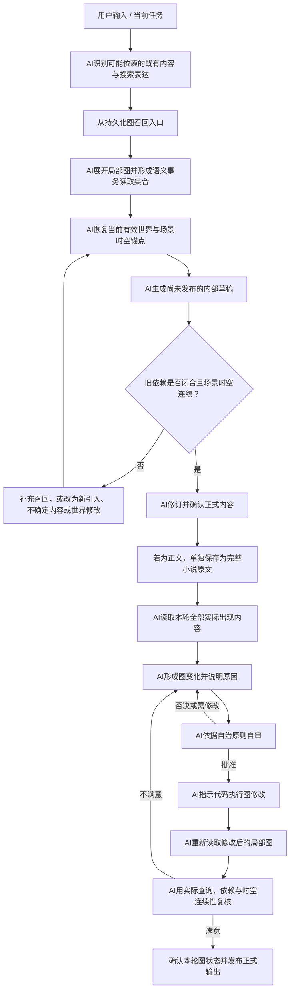
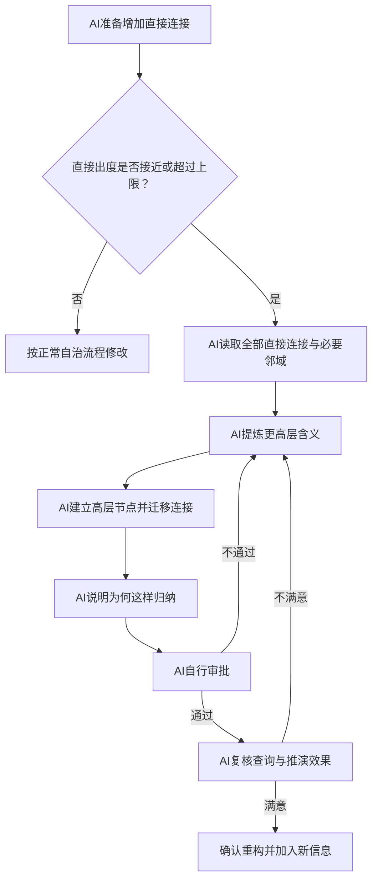
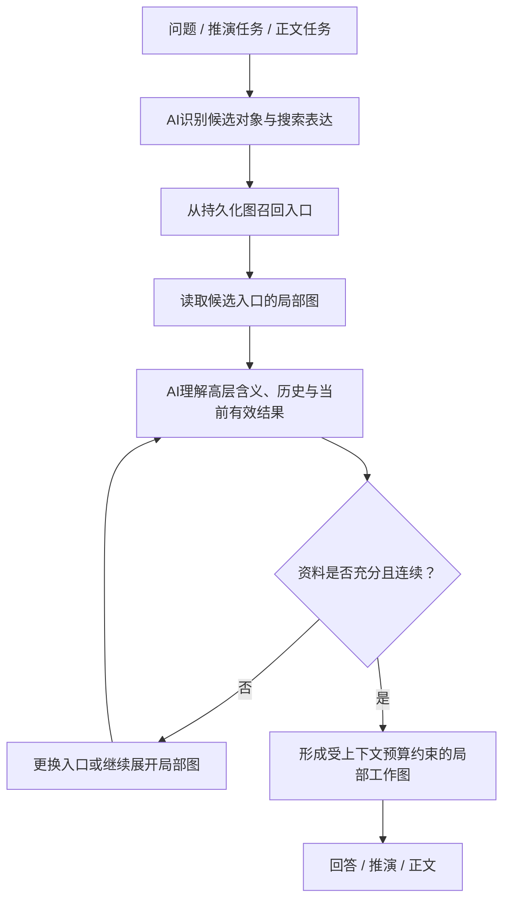
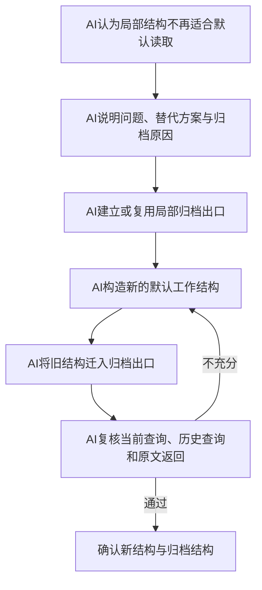

# Worldseed：AI 自治动态图设计

## 1. 目标

Worldseed 是一个由 AI 自主管理的动态世界模拟内核。

它不预先规定人物、地点、势力、时间、空间、状态、事件、记忆等领域模型，也不要求所有作品服从固定 schema。系统只提供一张可持续演化的图；万事万物均可成为节点，节点之间的含义由 AI 根据上下文、已有图结构和推演需要自主建立。

代码不理解世界，不审批语义，也不判断图是否合理。代码只是无语义的存储与操作介质。AI 拥有图的完整权限，并通过“说明原因、依据原则自审、修改后复核”的自治闭环维持图的干净、简洁、动态和逻辑一致。

核心目标：

- 从一句话开始，仅建立当前推演需要的最小图。
- 随正文、用户输入和推演结果持续扩展世界。
- 用户可以随时改变故事走向和表现方式，但用户输入不天然等于世界真相。
- AI 可以新增、编辑、合并、拆分和归档任意节点与连接；不再适合默认读取的旧结构进入相关局部结构的归档出口，不进行物理删除。
- AI 优先在已有结构上生长，不因新说法不断创造同义结构。
- 图不仅表达静态信息，还表达变化、因果、过程、认知、创作控制以及 AI 自己形成的新语义。
- 查询从相关节点出发，逐层展开需要的信息，不加载整张图。
- 每个节点的直接出度有上限；达到上限时，AI 必须自主提炼更高层含义并递归重构。

### 1.1 需求验收基线

本设计及其后续实现必须以以下需求作为统一验收标准。后续章节负责说明如何实现这些要求，不能用原则性描述代替实际闭环。

#### 通用世界推演

- 系统从一句话或一个最小初始点开始，由 AI持续推演和扩展世界；
- 世界可以属于任何类型，也可以具有非常规规则，底层不绑定特定题材；
- 长期发展必须保持逻辑连续，不能因为模型上下文压缩而遗忘、回退或重新创造另一套世界。

#### AI 自治动态图

- 万事万物都可以成为节点，不预定义人物、势力、地点、事件或其他领域类型；
- 连接可以携带任意信息，不规定必须表示某种关系；
- AI自行决定节点、连接、局部模式、高层抽象和查询路径的语义；
- AI可以新增、编辑、合并、拆分、迁移、抽象和归档图结构；
- 代码只负责保存、索引、读取、容量控制和执行，不参与世界语义判断；
- AI对重要修改说明原因、自行审批，并在修改后重新读取和复核。

#### 完整持久化与原文

- 正文中实际出现的全部内容都必须获得持久表达，不设置重要度过滤；
- 全部持久化不等于每次出现都创建新节点，AI必须优先进行身份解析和结构复用；
- 每轮正式正文另外以连续小说形式完整保存，不能用图节点、摘要或高层抽象代替；
- 图通过原文引用返回相关章节、段落和具体话语；
- 当前设计不物理删除旧图结构，过时结构迁入相关局部结构的归档出度；
- 归档内容仍能通过当前图、全局索引和小说原文重新找到。

#### 推演依赖

- 每轮推演只能依赖本轮实际读取的持久化旧图、用户输入和本轮新产生的内容；
- 这里的事务只表示语义读取和依赖范围，当前不讨论存储原子性；
- 生成内容如果依赖过去，相关依据必须先进入本轮读取集合；
- 无法召回依据时，只能将相关内容作为新引入、不确定说法、用户意图或世界修改处理；
- AI不能用本轮尚无依据的输出反向证明它过去已经存在。

#### 时间与空间连续性

- 持久化图与模型上下文分离，上下文压缩不能修改世界；
- 已确认内容持续有效，直到 AI建立明确的后续变化或主动修订；
- 历史继续存在，但不能覆盖长期发展后的当前有效结果；
- 每个正式场景必须具有时间锚点和地点锚点；
- 场景切换必须能够恢复时间经过、空间移动和连续路径；
- 倒叙、插叙、并行场景和补写过去不能因为文本顺序较晚而覆盖当前场景。

#### 选择性召回

- 所有节点、连接、携带信息和小说原文都必须进入全局检索；
- 查询先进行全局候选召回，再围绕候选入口展开局部图，不把整张图装入上下文；
- 一次未命中不等于不存在，AI必须在预算内更换表达、入口或继续召回；
- 精确话语和早期细节必须返回小说原文，不能用摘要冒充；
- AI可以建立多入口、直接路径和高层节点，提高历史内容的重新发现效率。

#### 性能与容量

- 每个节点具有可调整的直接出度上限，达到上限后由 AI递归抽象和重构；
- 出度、展开深度、候选数量、访问节点数、访问连接数、节点内容、上下文 token、召回轮数和延迟目标都必须具有合理默认值并允许调整；
- 预算耗尽但依赖仍未闭合时，AI不能编造确定事实。

#### 正文生成闭环

- AI先生成不对用户发布的内部草稿；
- AI审计草稿中的历史依赖、时间锚点、地点锚点和连续路径；
- 审计不通过时继续召回并修订，通过后才形成正式正文；
- 正文完整保存后，AI自动将本轮实际出现的全部内容回写动态图；
- 长期推演不依赖人工逐章整理人物、势力或其他设定。

#### 逻辑投影

- 地图、关系网络、历史回顾、长期发展统合和普查都从相关局部图临时形成，不成为代码中的固定领域模块；
- 投影必须与本轮实际读取的事实一致，不能与过去和当前有效内容矛盾；
- 资料不足时可以给出大致范围、规模和趋势，不要求没有依据的精确数字。

### 1.2 当前范围边界

以下内容属于上层大纲、推演策略或后续实现阶段，不作为当前底层动态图的职责：

- 新人物、新势力或其他新内容在故事中的具体出现时机；
- 情节节奏、大纲规划、类型化创作和领域推演策略；
- 图存储、索引与正文保存的原子提交机制；
- 缺少持久化依据时的精确数值模拟。

底层动态图只负责让已经出现、已经发生和已经形成的世界内容长期可保存、可召回、可追溯，并在后续推演中保持时间、空间和逻辑连续。

---

## 2. 根本立场

### 2.1 万事万物都是节点

系统不预设哪些东西才有资格成为实体。只要 AI 认为某个对象、变化、概念、说法、意图或局部结构需要被独立引用、演化或查询，就可以建立节点。

一个节点可能表示某个人，也可能表示一段经历、一种未证实说法、一次推演结果、一组被 AI 提炼出的更高层含义，甚至表示 AI 在图中形成的局部组织方式。

节点的含义不由代码中的类型枚举决定，而由节点自身资料、周围连接、来源和演化历史共同表达。

### 2.2 图的语义由 AI 决定

代码不预设出口类型、边类型、领域维度或对象分类。AI 每轮读取相关局部图，自主决定：

- 复用已有节点或连接；
- 编辑已有节点或连接；
- 创建新节点；
- 创建新的局部连接模式；
- 合并、拆分或重构局部子图；
- 将不再适合默认读取的结构迁入局部归档出口。

所谓“新的局部连接模式”，仍然使用相同的节点与连接原语，只是 AI 在既有图的基础上形成了新的组合方式，而不是要求代码增加一种新 schema。

### 2.3 AI 有任意权限

系统不设置语义层面的硬门禁。AI 可以修改整张图，包括它自己过去建立的结构。当前设计不包含物理删除；AI通过归档和局部重构保持默认工作图简洁，同时保留旧结构的返回路径。

自由并不来自缺少治理，而来自治理也由 AI 完成：

1. AI 提出修改；
2. AI 解释修改原因；
3. AI 根据自治原则审批；
4. AI 执行修改；
5. AI 重新读取修改后的图；
6. AI 判断是否确认、继续重构、回退或删除。

这些阶段可以由同一个模型分阶段执行，也可以由多个 AI 角色执行，但所有语义决定都属于 AI。

### 2.4 代码没有世界治理权

代码只负责：

- 保存节点、连接和资料；
- 根据 AI 指令执行新增、编辑、读取和归档重构；
- 保存 AI 指定的图版本或操作记录；
- 返回 AI 请求读取的局部数据；
- 提供不带世界语义的基础索引和存取能力。

代码不负责：

- 判断节点或连接是否合理；
- 判断用户输入是否是真相；
- 判断两个节点是否重复；
- 判断图是否简洁；
- 判断重构是否成功；
- 判断哪些信息应当保留或删除；
- 判断抽象节点应当表达什么；
- 判断查询应当沿哪些语义方向展开。

即使代码可以保存版本，是否建立版本、何时回退、回退到哪里，也由 AI 决定。

---

## 3. 最小数据原语

固定的不是世界类型，而是极小的存储形状。

### 3.1 Node

```ts
type Node = {
  id: string
  content: unknown
  metadata?: Record<string, unknown>
  sourceRefs?: SourceRef[]
}
```

`content` 与 `metadata` 的语义由 AI 定义和解释。代码不验证其中是否为人物、地点、过程或其他概念。

### 3.2 Link

```ts
type Link = {
  id: string
  fromNodeId: string
  toNodeId: string
  content?: unknown
  metadata?: Record<string, unknown>
  sourceRefs?: SourceRef[]
}
```

连接可以只负责连通，也可以携带任意信息。信息是否存在、表示关系、状态、过程、查询提示还是 AI 自创的其他内容，完全由 AI 根据上下文决定。代码不要求每条连接必须解释关系，也不维护边类型枚举。

### 3.3 Mutation

```ts
type GraphMutation =
  | { operation: "create_node"; node: Node }
  | { operation: "edit_node"; nodeId: string; next: unknown }
  | { operation: "create_link"; link: Link }
  | { operation: "edit_link"; linkId: string; next: unknown }
```

合并、拆分、迁移、归档、压缩和局部重构都由 AI 组合这些基础操作完成。归档时，AI建立或复用局部归档节点与连接，并把旧结构迁移到归档出口之下；代码不需要理解“归档”或“合并”本身意味着什么。

### 3.4 SourceRef

```ts
type SourceRef = {
  sourceId: string
  locator?: unknown
}
```

`SourceRef` 只负责从图返回独立保存的小说原文。`locator` 可以表示章节、段落、位置范围或作品自行采用的其他定位方式，代码不解释它的叙事含义。

### 3.5 独立小说原文

每轮正式正文都必须以连续小说的形式单独完整保存，不把图节点或摘要当作原文存档。原文保存顺序表示作品文本顺序，不自动等于世界内部时间顺序。

图负责理解、推演和查询，独立小说原文负责保留实际写出的完整内容。节点和连接通过 `sourceRefs` 返回相关原文；原文与图中资料共同进入全局检索。图的合并、抽象和归档不得改写或替代小说原文。

### 3.6 AI Decision Record

每次有意义的改图都由 AI 同时留下可审计的决定记录：

```ts
type AIDecisionRecord = {
  id: string
  task: string
  reason: string
  observedProblem?: string
  affectedNodeIds: string[]
  affectedLinkIds: string[]
  mutations: GraphMutation[]
  expectedResult: string
  selfReview: string
  decision: "approve" | "revise" | "reject" | "revert"
  followUp?: string
}
```

决定记录不是代码审批证明，而是 AI 对自身治理过程的解释和后续复核依据。

---

## 4. AI 自治原则

这些原则不规定世界里有哪些类型，只规定 AI 如何长期治理自己的图。

### 4.1 复用原则

面对新信息，AI 必须先检查相关局部图和全局候选。已有节点、连接或局部模式可以表达时，优先复用、编辑或组合，不创建同义结构。

正文中同一对象、过程、说法或其他内容再次出现时，AI 应继续发展已有局部图，而不是因为称呼变化、上下文压缩或间隔过久重新创建一份。暂时无法确认是否相同时，AI可以保留不确定的局部结构，待后续信息充分后再合并或拆分。

### 4.2 出现即持久化原则

凡正文中实际出现的内容，都必须在持久化图中获得表达。AI不能因为某个对象当前看似不重要、只出现一次、属于背景细节或短期内不会再出现而跳过持久化。

“获得表达”不等于每次出现都创建新节点。AI先进行身份解析：

- 已有结构足以表达时，复用并更新已有局部图；
- 已有主体存在但局部不足时，在其基础上扩展；
- 图中确实没有对应结构时，创建新节点和必要局部图；
- 相同内容多次出现时，保存到同一持续演化的结构中。

容量问题通过递归抽象和局部重构解决，而不是通过忽略、遗忘或按重要度筛除解决。

### 4.3 图权威与上下文分离原则

持久化图是世界长期连续性的依据。模型上下文只是本轮临时加载的工作集；上下文压缩、清空、遗漏或模型自身记忆变化，都不能修改图中已经形成的世界。

压缩后的对话可以帮助 AI理解用户当前意图，但不能代替对持久化图的查询。涉及既有对象、过去内容或当前有效结果时，AI必须重新读取相关图，而不是依靠压缩摘要重建世界。

### 4.4 推演事务与依赖闭包原则

每轮回答、规划或正文推演都是一个独立的语义事务。这里的“事务”只表示本轮推演的读取与依赖边界，不讨论图存储、索引或正文保存的原子提交问题；存储原子性留待后续实现设计。

语义事务至少包含本轮从持久化图实际读取的局部工作集、用户输入、AI拟生成的内容以及本轮完成后写回的图变化。

AI拟生成的内容只要依赖既有世界，其依赖对象和必要依据就必须已经进入本轮读取集合。这里的“依赖”由 AI根据语义自行识别，不由代码枚举；“进入读取集合”也不要求正文展示引用，只要求 AI在作出事实性使用前实际取得相关持久化资料。

AI在生成前检查依赖是否闭合：

- 依赖已经位于读取集合中时，可以继续推演；
- 依赖尚未加载时，必须先执行全局召回和局部展开；
- 经过合理召回仍无依据时，只能将相关内容作为本轮新引入、不确定说法、用户意图或世界修改处理，不能伪装成已经存在的事实；
- 本轮较早建立的内容可以成为同一事务后续内容的依据；
- AI不能用本轮尚无依据的输出反过来证明它在过去已经存在。

本轮治理完成后，实际出现的内容和变化进入持久化图，成为后续语义事务可以重新读取的依据。

### 4.5 场景时空连续原则

每个进入正式推演或正文的场景都必须具有本轮已经读取并理解的时间锚点和地点锚点。锚点的具体结构由 AI根据世界自行建立，可以是精确值、相对顺序、范围、层级位置或世界特有表达，代码不预设时间格式、坐标体系或地点类型。

场景发生变化前，AI必须：

1. 重新读取上一场景当前有效的时间与地点；
2. 确定新场景发生在何时、何地；
3. 理解两个场景之间经过了什么时间和空间变化；
4. 检查本轮涉及的既有内容是否能够在该变化后合理到达或继续存在；
5. 将新场景及其与上一场景的连续路径写回图中。

无法获得精确时间或地点时，AI可以保留合理范围、相对位置或明确的不确定性，但不能在没有任何时空锚点的情况下把场景变化当作自然连续。倒叙、插叙、并行场景和补写过去必须保留各自锚点，不得因为文本生成顺序较晚就覆盖当前有效场景。

### 4.6 连续有效原则

图中已经形成并被 AI确认的内容持续有效，直到 AI明确建立后续变化、主动修订或完成重构。未进入当前上下文、长期未出现、当前看似不重要或一次查询未命中，都不能成为内容失效或状态回退的理由。

AI若准备生成一个与已有效内容不同的结果，必须先在图中找到已有后续发展，或通过本轮推演建立能够解释变化的新结构。上下文压缩本身永远不是世界变化的原因。

### 4.7 未命中不等于不存在原则

一次查询没有找到内容时，AI不能直接推断它不存在。AI应根据任务自主决定更换关键词、锚点、称呼、正文来源或相关节点继续查询，也可以扩大局部图或使用全局召回。

经过合理查询仍无充分资料时，AI应表达未知或不确定，而不是创建一个与旧世界冲突的新版本。

### 4.8 必要生长原则

只有当现有结构不足以支持当前表达、推演或查询时，AI 才扩展图。扩展多少由 AI 决定，但必须说明现有结构为何不足。

### 4.9 最小充分原则

AI 只建立足以支撑当前推演并兼顾合理后续发展的结构，不因想象力一次性生成整个世界，也不为尚未出现的问题预建大量空结构。

### 4.10 动态逻辑原则

图不是静态百科。AI 必须让结构能够表达世界如何变化、某种结果如何产生、旧结构为何失效以及当前推演如何继承过去。

具体如何表达由 AI 自主形成，不由代码规定固定模型。

### 4.11 用户输入非真相原则

用户输入是必须被吸收的创作信号，但不天然是图中的已确认事实。AI 根据上下文自主判断它更适合作为：

- 故事走向；
- 某人的行动、想法或愿望；
- 一种说法、误解或可能性；
- 对世界的直接修改要求；
- 正文表现控制；
- 已经发生并应当写入图的内容。

上述类别不是代码枚举，而是 AI 为当前任务作出的解释。用户输入与当前世界矛盾时，AI 不拒绝用户，也不盲目覆盖现有结构，而是寻找能同时保留用户意图与当前逻辑的表达和推演路径。

### 4.12 原因原则

AI 每次新增、编辑、合并、拆分、重构或删除重要结构，都必须说明：

- 看到了什么问题或新信息；
- 为什么现有结构不能保持不变；
- 为什么选择当前修改方式；
- 修改后期望获得什么推演或查询能力；
- 可能失去什么。

### 4.13 自审原则

AI 在执行修改前自行审批，至少反思：

- 是否可以复用现有结构；
- 是否创建了重复或同义节点；
- 是否把推断误当成确定信息；
- 是否把用户表现要求污染进世界事实；
- 是否为了当前问题制造了不必要的复杂度；
- 是否会破坏仍有价值的历史、逻辑或查询路径；
- 是否因当前上下文缺失而无原因改变了已有效内容；
- 是否遗漏了正文中实际出现但未来可能再次被查询的内容；
- 是否应复用已有身份，而不是创建重复节点；
- 是否达到更干净、更简洁、更有推演价值的结果。

### 4.14 复核原则

修改后，AI 必须重新读取受影响的局部图，并用当前任务或典型问题实际推演。AI 根据结果决定：

- 确认当前结构；
- 继续编辑；
- 进一步合并或拆分；
- 回退；
- 进入归档重构流程。

### 4.15 有界直接连接原则

每个节点的有效直接出度不得长期超过当前作品配置的上限。出度接近或达到上限时，AI 需要主动重新理解该节点周围的结构，并提炼更高层含义。

上限只限制直接可见的局部复杂度，不规定图的总规模，也不规定高层含义是什么。

---

## 5. 每轮推演闭环

每轮语义事务可以抽象为：

```text
语义事务 = 持久化图读取集合 + 用户输入 + 本轮生成内容 + 本轮写回的图变化
```

生成内容中所有依赖既有世界的部分，必须能够返回读取集合中的依据。无法闭合的旧依赖不能直接进入事实性输出。



闭环不是“生成后自动写入固定字段”，而是 AI 在每轮开始前从持久化图恢复本轮依赖和场景时空锚点，先形成不对用户发布的草稿，再审计实际草稿中的旧依赖与时空连续性。审计不通过时继续召回和修订，不能让未解析的既有指代或无锚点场景直接进入正式正文。

审计通过后，完整正文首先单独保存为小说原文，再由 AI重新理解全部实际出现内容并自主治理图。正文内容不会因为没有预定义字段、当前看似不重要或未来上下文压缩而丢失；AI 可以在既有图基础上为它们建立适合当前世界的表达。

---

## 6. 正文前的用户控制

用户在正文生成前可以输入：

- 希望某件事如何发展；
- 希望某人采取什么行动；
- 某人的想法、倾向或计划；
- 希望调整的故事方向；
- 描写角度、人称、观察距离、机位、景别；
- 文笔、节奏、语言习惯和附加提示。

AI 读取用户输入和当前图后，自主决定哪些信息影响世界推演，哪些信息仅影响本轮正文表现，哪些信息是用户明确要求修改世界本身。

这里不存在由代码维护的输入分类表。分类只是 AI 为了正确推演而形成的临时理解。表现要求是否需要长期保存、保存在哪里、何时失效，也由 AI 根据后续复用价值决定。

当用户要求与当前图矛盾时：

- AI 不拒绝用户；
- AI 不默认把用户说法视为已经发生；
- AI 解释用户真正希望推动的结果；
- AI 在当前世界逻辑中安排尝试、误解、修订、分支或其他合适结构；
- 如果用户明确要求重写世界，AI 有权重构相关局部图。

---

## 7. 正文后的图治理

通过依赖与时空审计的正式正文必须先作为连续小说原文单独完整保存，并立即进入全局内容检索。图治理不承担原文存档职责，也不能用摘要或节点代替原文。

原文保存后，AI 必须再次阅读本轮完整正文和当前局部图，将本轮实际出现的全部内容纳入持久化治理。这里不存在“当前不重要所以不保存”的过滤阶段；AI只决定如何复用和组织，而不决定是否遗忘。即使本轮图治理需要继续修订，完整小说原文仍然存在并可重新用于建图。

AI 自主处理：

- 本轮出现的内容对应图中哪些已有节点和局部结构；
- 哪些内容应复用、编辑或扩展已有局部图；
- 图中没有对应结构时需要创建的节点和局部连接；
- 已有节点资料的变化；
- 新建立、变化或失效的连接；
- 正文中形成的因果、过程和后续影响；
- 正文、原话和其他原始资料与相关局部图之间的可返回路径；
- 新场景的时间、地点以及它与上一场景之间的连续路径；
- 与旧图不一致但需要通过局部重构解决的内容；
- 已经冗余、错误或不再合理的旧结构。

AI 不需要把正文套入固定抽取 schema。它只需使用统一图结构表达本轮实际出现的内容，并通过身份复用、原因说明、自审与复核完成闭环。

如果某段信息已经存在，AI应把本轮出现连接到已有结构；如果不存在，AI应创建足以让它在未来被重新发现的局部图。无论经过多少轮上下文压缩，本轮内容的存在性都由持久化图决定，而不是由模型是否还记得决定。

---

## 8. 出度上限与递归抽象

### 8.1 目的

如果节点可以无限增加直接连接，局部读取成本、上下文规模和 AI 理解难度会持续增长。系统因此为每个节点设置可配置的直接出度上限 `maxDirectOutDegree`。

该上限是性能和认知容量参数，不是语义规则。代码可以按照 AI 指令返回当前连接数量，但“哪些连接相似、应提炼成什么更高层含义、如何迁移”完全由 AI 决定。

### 8.2 达到上限时的处理

当 AI 准备新增连接，并意识到节点直接出度将达到或超过上限时，必须先治理局部图：

1. 读取该节点已有的直接连接及必要邻域；
2. 理解这些连接分别表达什么；
3. 判断哪些内容可以被共同提炼；
4. 创建一个或多个由 AI 命名和解释的高层节点；
5. 将相关直接连接迁移到高层节点之下；
6. 原节点改为直接连接这些高层节点；
7. 说明分组依据和预期查询方式；
8. AI 自行审批并复核；
9. 完成重构后再加入新信息。



### 8.3 抽象不是删除细节

默认情况下，原连接和细节节点被迁移到更深层，而不是删除。上层节点保存 AI 提炼的整体含义，下层保留可展开的具体资料。

因此抽象损失的是默认可见性，而不是历史本身。精确查询时，AI可以继续向下展开。

### 8.4 递归适用

高层节点同样受出度上限约束。当它继续增长时，AI再次提炼更高层含义。图因此形成由 AI 自主组织的多分辨率结构，而不是无限扁平增长。

### 8.5 不强行归类

出度上限不是要求 AI 把所有连接机械均分。无法形成合理共同含义的连接可以保留为直接连接。AI 可以：

- 重组已有高层节点；
- 合并近似高层节点；
- 拆分含义过宽的高层节点；
- 调整某些连接的锚点；
- 在必要时重构更大的局部子图。

目标是让有限直接连接承载最高的理解和查询价值，而不是追求形式整齐。

### 8.6 参数

第一版采用一组偏保守的默认值，作品可以根据模型上下文、图规模、章节长度和实际命中率调整：

```ts
type GraphCapacityProfile = {
  maxDirectOutDegree: number
  preferredExpansionDepth: number
  maxExpansionDepth: number
  maxVisitedNodes: number
  maxVisitedLinks: number
  maxNodeContentTokens: number
  contextTokenBudget: number
  recallTopKPerExpression: number
  maxRecallCandidates: number
  maxRecallRounds: number
  maxSearchExpressionsPerRound: number
  targetMechanicalRecallP95Ms: number
  targetContextAssemblyP95Ms: number
}

const defaultGraphCapacityProfile: GraphCapacityProfile = {
  maxDirectOutDegree: 24,
  preferredExpansionDepth: 2,
  maxExpansionDepth: 4,
  maxVisitedNodes: 96,
  maxVisitedLinks: 192,
  maxNodeContentTokens: 512,
  contextTokenBudget: 12000,
  recallTopKPerExpression: 20,
  maxRecallCandidates: 80,
  maxRecallRounds: 3,
  maxSearchExpressionsPerRound: 6,
  targetMechanicalRecallP95Ms: 500,
  targetContextAssemblyP95Ms: 3000,
}
```

这些值是原型起点，不是所有作品的永久最佳值。容量参数限制一次读取和局部组织规模，不决定节点语义；达到边界后如何组织结构、是否继续召回以及如何缩小任务，仍由 AI 决定。

`targetMechanicalRecallP95Ms` 只衡量索引候选召回，`targetContextAssemblyP95Ms` 衡量从发起检索到形成局部工作图，不包含正文生成时间。时间目标在不同设备和索引规模下可以调整。

---

## 9. 查询与上下文读取

查询不依赖预设模块，也不依赖固定维度。它的目的不是把整张图放入模型上下文，而是在有限上下文中恢复当前任务真正需要的持久化世界局部。

### 9.1 全局召回与局部展开

图自身通过节点、连接、高层抽象和多入口结构承担主要的语义索引。代码必须对所有节点、连接、它们可选携带的信息以及持久化原始资料提供无语义的全局机械检索，至少能够支持精确内容、相似内容和邻接入口的候选召回。任何内容写入或重构后，都必须在后续依赖它的推演开始前处于可检索状态。代码只返回候选，AI决定候选是否相关、如何解释和沿哪个方向继续读取。

完整查询分为两步：

1. AI根据用户问题、正文任务或当前推演生成搜索表达，从持久化图中召回可能的入口；
2. AI读取候选节点的局部图，通过连接和高层结构逐层恢复相关内容、当前有效结果和必要历史。

全局召回解决“从哪里进入”，局部展开解决“这部分世界到底意味着什么”。

### 9.2 既有内容使用前重新挂载

AI准备让一个既有对象、过去内容或已发生过程在回答、规划或正文中承担事实性作用时，必须先从持久化图重新挂载相关局部结构。

重新挂载得到的资料构成本轮事务读取集合。生成内容中的既有指代、延续、判断和其他历史依赖都必须能够返回该集合中的依据，但具体哪些内容构成依赖由 AI自行理解，不要求代码识别语言形式或领域类型。

如果生成过程中临时涉及尚未加载的既有内容，AI应暂停该部分推演，补充查询后再继续。经过合理召回仍无依据时，AI可以将其作为本轮新引入、不确定说法、用户意图或世界修改处理；不能仅凭当前上下文中没有提到就重新创造，也不能使用暗示它早已存在的表达把本轮输出变成自己的历史依据。

### 9.3 当前有效局部图

AI读取局部图时，不只寻找语义相似资料，还要理解相关内容经过长期推演后的当前有效形态。较早内容可以继续作为历史存在，但不能因为更容易被召回就覆盖后续变化。

AI需要从局部结构中归纳：

- 当前应采用哪些内容；
- 哪些内容属于较早阶段；
- 哪些内容后来被扩展、改变、合并或重构；
- 当前问题是否需要继续向下追溯原始资料。

具体如何表达“当前有效”和“历史变化”由 AI自治形成，不要求固定字段或边类型。

### 9.4 精确内容与原始资料

询问具体话语、早期细节或原始过程时，AI不能用高层摘要冒充原文。AI应沿高层结构向下展开，或通过全局内容检索找到独立小说原文中的相应位置。

抽象和归档只改变默认可见层级，不修改独立保存的小说原文。精确查询始终可以通过 `sourceRefs` 或全局内容检索重新找到原始内容。

### 9.5 查询步骤

AI 收到问题或生成任务后：

1. 理解任务需要回答什么；
2. 识别可能涉及的已有对象、过去内容和原始资料；
3. 使用图结构和无语义检索召回候选入口；
4. 读取候选节点的直接连接和资料；
5. 理解这些连接所代表的局部含义与长期演化；
6. 选择与当前任务相关的方向继续展开；
7. 检查是否已经恢复当前有效局部图；
8. 信息不足或首次未命中时更换入口并继续查询；
9. 达到上下文预算或已有充分依据时停止；
10. 检查拟生成内容对既有世界的依赖是否都已进入本轮读取集合，未闭合时返回第 2 步；
11. 正文涉及场景时，检查时间锚点、地点锚点及场景变化路径是否已经恢复；
12. 形成内部草稿并审计草稿中实际出现的依赖和场景锚点，缺失时返回第 2 步；
13. 修订草稿后回答或生成正式正文。



所谓地图、人际关系网、某人的过去、某势力长期发展、某件物品可能所在位置、某日发生的事情等，都不是预建模块。它们是 AI 面对具体任务时，从相关节点和连接中临时形成的逻辑投影。

逻辑投影必须与本轮实际读取的持久化事实保持一致，并能够说明自身覆盖的局部范围。它可以给出大致规模、范围、趋势和合理归纳，但在图中没有完整数值依据时不承诺精确计数，也不把估计伪装成普查真值。投影的合格标准是能够统合已读取事实、保持内部逻辑并且不与过去和当前有效内容矛盾，而不是对整个世界提供数学完备的统计。

如果图中缺少足够资料，AI 应当说明未知、不确定或需要继续推演，而不是把未读取到的内容伪装成图中已有事实。一次未命中不能作为不存在的证明。

### 9.6 上下文压缩与世界连续性

上下文压缩只处理模型一次能够接受的临时输入，与图持久化没有同一性。压缩前后，持久化图本身不因模型上下文变化而发生变化。

每轮推演的优先依据为：

1. 本轮重新读取并理解的持久化局部图；
2. 用户当前明确表达的意图和修改要求；
3. 压缩后的对话摘要；
4. 模型自身未经过图验证的记忆或猜测。

若压缩摘要与重新查询到的图不一致，AI必须重新理解差异。摘要不能无原因恢复旧状态、抹去已发生内容或覆盖图中后续发展。

---

## 10. AI 自审批闭环

“AI 自己审批”不是一句简单的“通过”，而是一个可重复的语义过程。

### 10.1 建构阶段

AI 根据任务和局部图形成修改方案，包括新增、编辑、合并、拆分、删除或局部重构。

### 10.2 原因阶段

AI明确说明：

- 当前局部图存在什么不足；
- 为什么需要修改；
- 为什么选用当前结构；
- 如何利用已有节点和连接；
- 修改将如何帮助后续推演或查询。

### 10.3 审批阶段

AI依据自治原则重新审视方案。审批上下文应突出旧图、提案、修改原因和原则，减少被最初创作冲动牵引。

### 10.4 执行阶段

AI批准后，指示代码应用它决定的新增、编辑、迁移和归档重构。代码忠实执行，不作语义裁决。

### 10.5 复核阶段

AI重新读取新图，并尝试完成实际问题、继续一小步推演或回答关键查询。AI确认结构是否真的更清晰、更简洁、更有逻辑和更可用。

### 10.6 回流阶段

复核不满意时，AI可以继续修改、撤销先前决定、恢复旧结构、换一种抽象或进入归档重构流程。满意后，本轮图成为下一轮的基础。

---

## 11. AI 自治归档与局部重构

当前设计不物理删除节点、连接或小说原文。AI认为旧结构重复、错误、粒度不合适或不再适合默认推演时，将它从当前工作路径迁入相关局部结构的归档出口。

### 11.1 局部归档出口

每个发生重构的局部结构都必须建立或复用一个稳定、可直接发现的归档出口。该出口是当前局部锚点的一条直接出度，指向由 AI组织的归档局部图。

“归档出口”是治理原则，不是代码中的固定边类型。连接可以携带 AI对归档范围、进入条件和查询方式的说明。旧结构进入归档后不再作为默认当前结果展开，但仍参与全局索引，并可从当前局部结构返回。

### 11.2 第一阶段：标记待归档

AI先说明：

- 旧结构为什么不再适合默认读取；
- 哪些新结构将承担当前推演；
- 旧结构应进入哪个局部归档出口；
- 归档会如何影响当前查询和历史查询。

### 11.3 第二阶段：建立替代结构

AI 在当前局部位置新增、编辑、合并或拆分节点与连接，形成更合理的默认工作图。

### 11.4 第三阶段：迁入归档出口

AI把被替代的旧节点、连接、解释和返回路径迁移到归档出口之下，并保留它们的 `sourceRefs`。归档出口自身达到出度上限时，同样使用递归抽象形成更深层归档结构，而不是丢弃旧内容。

### 11.5 第四阶段：AI 复核

AI分别测试当前问题和历史问题：默认查询应进入新结构，追溯查询应能通过归档出口或全局索引恢复旧结构和小说原文。复核失败时继续重构，不确认归档完成。



归档改变默认可见性，不改变旧内容已经存在过的事实。

---

## 12. 动态性与逻辑性

系统必须让 AI 模拟一个会变化的世界，而不是维护一堆互不相干的静态节点。

每轮推演时，AI不仅检索“有什么”，还应理解：

- 当前结构从何而来；
- 相关节点之间为什么形成现在的连接；
- 本轮行动在当前条件下可能造成什么；
- 哪些变化已经实际发生；
- 哪些只是用户意图、人物想法、未经证实的说法或 AI 推断；
- 当前结果会如何改变后续可行性。

正式场景还必须理解当前时间、当前地点以及从上一场景到本场景的连续路径。文本顺序、图写入顺序和世界内部时间不是同一概念；AI必须依据场景锚点判断先后与位置，不能用较晚写入代替较晚发生。

这些区别不由固定字段保证，而由 AI 在局部图中的表达、理由、自审和后续推演持续维持。

当 AI 发现过去的表达方式已经妨碍逻辑推演，它有权重构甚至删除相关局部结构。动态图的稳定性来自持续治理，不来自永久冻结。

---

## 13. 性能和上下文控制

性能控制同样不应演化为领域规则。系统只提供容量参数，AI 负责语义上的取舍和组织。

### 13.1 局部读取

AI 每次先通过持久化图结构和无语义检索找到少量候选入口，再读取直接邻域。需要时沿相关高层节点向下或向外展开，不把整图装入模型上下文。

邻接定位必须同时支持入向和出向候选。局部展开维护已访问集合，重复节点和循环连接不重复占用预算；无限入度不等于一次全部加载，所有方向共同受 `maxVisitedNodes`、`maxVisitedLinks` 和 `contextTokenBudget` 约束。

### 13.2 多分辨率结构

出度上限迫使 AI 把细节提炼成更高层含义，使常规任务先看到粗粒度图；精确问题再向下展开。

出度数量不是越大越好。出度过小会增加层级深度，出度过大会增加每层候选和上下文成本。AI根据作品运行情况和查询效果决定是否调整容量参数及局部组织方式。

### 13.3 上下文预算

代码根据可调参数限制一次返回的节点数、连接数、节点内容长度、遍历深度和上下文 token。AI根据任务挑选方向，并在预算内组织最有价值的上下文。节点原始 `content` 超过 `maxNodeContentTokens` 时，默认只返回 AI建立的较短表示和原文定位；精确需要时再按范围读取独立小说原文。

预算耗尽但既有依赖仍未闭合时，AI不能直接生成依赖该资料的确定事实。它应缩小问题、改变入口、进入下一轮受限召回，或保留未知和不确定性。

### 13.4 无语义检索底座

代码必须对所有节点、连接、它们可选携带的信息以及独立小说原文建立不理解世界语义的全局基础索引，包括精确内容检索、相似内容召回和双向邻接定位。图的写入、合并、迁移、归档与重构必须维护索引可达性；在新状态尚不可检索时，不得开始依赖该状态的下一轮推演。AI决定搜索表达、候选价值、后续展开方向和最终解释。

图结构是主要的长期语义索引；无语义索引用于快速找到入口。索引不能替代 AI正确建图，AI建图也不应要求从当前节点遍历整张世界才能找到早期资料。

每轮召回最多生成 `maxSearchExpressionsPerRound` 个搜索表达，每个表达取得 `recallTopKPerExpression` 个候选，各路候选去重合并后最多保留 `maxRecallCandidates` 个。首次未命中时最多执行 `maxRecallRounds` 轮；这些限制都可以调整。多轮结束仍无依据时，遵循“未命中不等于不存在”和依赖闭包原则，不把检索失败改写成确定事实。

### 13.5 分阶段推演

大型章节或复杂问题可以由 AI 主动拆成多个局部回合：理解、局部读取、内部草稿、依赖与时空审计、修订、正文确认、改图和复核。内部草稿在审计通过前不向用户发布。拆分方式由 AI决定。

### 13.6 运行成本记录

代码必须记录每轮机械召回耗时、上下文组装耗时、候选数量、访问节点数、访问连接数、上下文 token、召回轮数和模型调用量等无语义指标。AI或用户根据这些记录调整出度上限、候选预算、上下文预算、时间目标或局部组织方式。

---

## 14. 系统闭环检查

以下条件全部成立，才算符合本设计：

1. 万事万物都可以成为节点，代码不要求领域类型。
2. 每条连接都可以选择携带任意信息，但代码不要求它必须表示关系或遵循固定格式。
3. AI可以新增、编辑、合并、拆分、迁移和归档任意节点与连接。
4. 当前设计不物理删除节点、连接或小说原文；旧结构通过相关局部结构的一条归档出度继续可达。
5. 每轮正式正文都作为连续小说原文单独完整保存，不由图摘要替代。
6. 图中由原文产生的节点和连接能够通过 `sourceRefs` 返回相应原文。
7. 正文中实际出现的全部内容都在持久化图中获得表达，不设置重要度保存门槛。
8. 同一内容再次出现时，AI先进行身份解析并优先复用已有局部图。
9. 用户输入必须被 AI理解，但不自动成为世界真相。
10. 持久化图与模型上下文分离；上下文压缩不能修改世界。
11. 图中已形成并被 AI确认的内容持续有效，直到 AI明确建立后续变化或主动修订。
12. 一次检索未命中不能被解释为内容不存在。
13. 所有节点、连接、携带信息和独立小说原文都必须进入全局机械索引，并在后续语义事务依赖它们之前可被检索。
14. 既有内容在承担事实性作用前，AI必须重新挂载相关持久化局部图。
15. 每轮推演都形成明确的持久化图读取集合；这里的事务只表示语义依赖范围，不包含存储原子性设计。
16. 生成内容中依赖既有世界的部分必须能够返回本轮读取集合中的依据。
17. 无法召回依据的内容只能作为新引入、不确定说法、用户意图或世界修改处理，不能伪装成已经存在的事实。
18. AI先生成内部草稿，再审计草稿中实际出现的依赖；审计通过前不发布正式输出。
19. 每个正式场景都有已读取的时间锚点和地点锚点，场景变化保留连续路径。
20. 倒叙、插叙、并行场景和补写过去不能因文本顺序较晚而覆盖当前场景。
21. 正文生成后，AI必须重新阅读完整正文并治理图。
22. 每次重要修改都由 AI说明原因，并经过 AI依据原则自审。
23. 修改后由 AI重新读取图并进行实际复核。
24. 新信息优先在现有结构上表达，必要时才扩展。
25. 节点直接出度达到上限时，AI先提炼更高层含义并重构。
26. 抽象和归档保留下一层细节、原文引用和返回路径。
27. 查询先全局召回入口，再从候选锚点局部展开；方向由 AI根据现有图和任务决定。
28. AI查询局部图时必须理解长期演化后的当前有效结果，不能让较早资料无原因覆盖后续变化。
29. 地图、关系网、历史回答、普查和回忆等都由临时逻辑投影产生，不成为代码中的专用模块。
30. 逻辑投影必须与已读取事实一致；没有完整数值依据时只提供大致范围或趋势，不承诺精确统计。
31. 出度、展开深度、访问规模、节点内容、上下文、候选数量、召回轮数和耗时目标都有合理默认值并可调整。
32. 所有语义判断、依赖识别、审批、复核、回退和归档决定都由 AI完成。
33. 代码只保存、读取和执行 AI的决定，并提供覆盖全部持久化资料、不参与语义判断的强制全局检索和容量控制能力。

任何一条不成立，都意味着系统重新滑向固定 schema、功能穷举、无审查写入或不可持续的扁平图。

---

## 15. 最小可验证原型

第一版无需先实现完整小说产品，只需验证自治图能否持续工作：

1. 输入一句话，AI建立最小初始图；
2. 连续输入用户行动、想法和表现要求；
3. AI基于局部图形成内部草稿，完成依赖与时空审计后再生成正式正文；
4. 检查每轮完整正文是否单独以连续小说形式保存并进入全文检索；
5. AI在正文后把全部实际出现内容纳入图，通过 `sourceRefs` 返回原文，并优先复用已有身份；
6. AI在正文后自主新增、编辑、迁移和重构图并说明原因；
7. 人为设置较低出度上限，观察 AI能否形成递归高层节点；
8. 让 AI发现重复或不合理结构，自主建立局部归档出口、重构默认结构并保留旧结构返回路径；
9. 连续切换场景，检查每个场景是否具有时间和地点锚点，移动、等待、倒叙和并行场景是否连续；
10. 多次压缩或清空模型上下文，再次使用早期节点，检查 AI是否先查询持久化图；
11. 随机询问早期原话、过去过程、当前有效结果和复杂关联；
12. 故意让首次查询未命中，检查 AI是否继续查询而不是判定不存在；
13. 在当前上下文中移除早期内容，再生成依赖该内容的后续发展，检查旧依赖是否先进入语义事务读取集合；
14. 提供一个无法在旧图中找到依据的既有指代，检查 AI是否继续召回或将其改为新引入、不确定内容或世界修改；
15. 检查任意新写入、归档和重构后的资料是否在下一轮开始前能够通过全局索引召回；
16. 检查内部草稿中新出现的旧依赖是否会触发补充召回和修订，而不是直接发布；
17. 检查 AI是否只展开相关局部图，并能在需要时深入独立小说原文；
18. 使用默认容量参数运行压力测试，再调整参数观察召回率、耗时和上下文成本变化；
19. 对长期发展生成逻辑投影，检查结果是否与已读取事实一致，并在资料不足时避免伪造精确数值；
20. 连续运行足够多轮，检查已发生内容是否无原因消失、回退或被重复创建；
21. 检查图是否保持可理解、简洁和可继续推演。

原型成功的标准不是预定义问题全部命中固定接口，而是 AI能够在没有领域 schema的情况下，持续用同一图原语构造、修正、压缩、查询和推演一个不断生长的世界。

---

## 16. 最终定义

Worldseed 的本质不是知识图谱、世界设定表或规则引擎，而是：

> 一张由 AI完全自治治理的、可动态重写和递归抽象的世界图。

代码提供节点、连接、小说原文保存、全局索引和容量控制能力；AI决定世界中存在什么、它们如何连接、何时变化、如何重构、如何查询以及何时归档。

图的干净与简洁来自三重 AI闭环：

1. 提示词中的自治原则；
2. 每次修改必须给出原因；
3. AI自行审批并在修改后复核。

出度上限进一步把性能压力转化为语义抽象压力，使图在长期增长中自然形成由粗到细的多分辨率结构。
