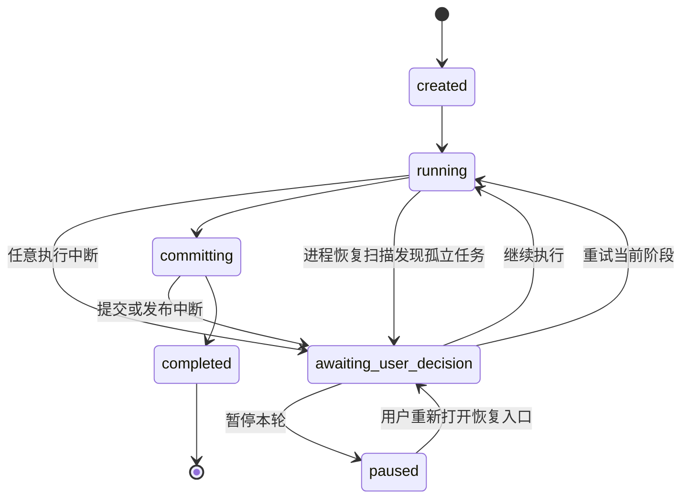

# Worldseed：推演中断、确认与恢复设计

> 本文同时包含目标协议和已落地恢复行为。任务检查点、阶段产物恢复、阶段级 supersede、额度确认和可恢复 finalization 已有实现与测试；尚未完成或尚未长期验证的范围仍以 [设计与实施状态](implementation-status.md) 的记录为准。

## 1. 目标

Worldseed 的一次推演可能持续数分钟，产生多次模型调用、动态资料读取、正文草稿、图治理结果和待提交世界变更。任何软件错误、外部服务异常、资源限制或进程中断都不能把这些成果当作一次性内存丢弃。

本设计规定：

- 任意异常首先转换为可持久化的中断记录，而不是直接终结整轮；
- 已完成阶段、当前上下文、实际读取证据、AI 输出、Token 用量和待提交作用域必须保留；
- 系统必须等待用户选择继续执行、重试当前阶段或暂停本轮；
- 用户显式重置阻塞额度后，继续动作才从稳定检查点恢复；
- Electron 重启、后端进程崩溃和 UI 断线后仍能重新发现并恢复任务；
- 继续执行不能绕过世界一致性、时空连续性、引用合法性或提交原子性检查；
- 所有旧尝试、旧检查点和错误原因只归档或标记失效，不物理删除。

本设计只定义通用任务恢复骨架，不为网络、人物、势力、正文或图结构分别发明业务流程。错误来源只影响诊断内容和推荐动作，不改变统一恢复协议。用户可浏览、保存、返回和分叉的长期推演历史是另一层机制，见 [推演历史、世界线与版本恢复设计](world-history-versioning.md)；历史保存点可以引用本设计的稳定检查点，但不能替代任务状态机。

## 2. 已确认的问题

以下内容是历史真实 `deepseek-v4-pro` 调试所记录的故障样本，用来说明设计动机，不表示当前恢复流程已经通过验收：

- 已完成理解输入、规则装配、资料检索、内容规划和出现审查；
- 已消耗 10 次模型调用、97,505 输入 Token 和 43,709 输出 Token；
- 进入正文阶段时整轮只剩约 11 秒，模型请求被截止时间中止；
- 任务被直接标记为 `failed`；
- 阶段结果、上下文和 pending 作用域仍在 SQLite，但没有恢复入口，产品层面等同丢弃。

当前还存在以下同类路径：

1. 整轮时间、模型调用次数、输入输出预算或上下文容量耗尽；
2. 网络、请求超时、限流、服务端错误或模型凭据问题；
3. 空最终内容、JSON、业务 Schema 或引用契约修复耗尽；
4. AI 返回 `blocked`、`revise`、`reject` 或 `retire` 后被代码当作异常；
5. 工作区索引、表现规则、Markdown 文件或数据库读写失败；
6. 图引用、时空绑定、结算、投影或提交前结构检查失败；
7. 并发任务导致提交基线过期；
8. 世界数据库已经提交但章节 Markdown 发布失败；
9. Electron 或后端进程退出后，数据库任务仍显示运行但没有执行器；
10. 前端一次 IPC 轮询失败后，本地界面把仍在后端运行的任务显示为失败。

检索轮次达到上限已经使用统一检索缺口继续执行，不属于任务中断。图治理或语义审核中尚未执行的验证探针也按此规则记录缺口；不创建虚假的探针执行结果或通过评估。Token、时间、模型调用和实际读取/模型执行错误仍按本章的可恢复中断流程处理。

## 3. 核心原则

### 3.0 单次模型请求也必须受控

整轮墙钟上限不能替代单次模型请求上限。模型请求使用项目参数 `execution.maxModelRequestTimeMs` 生成独立的 AbortSignal，并与整轮截止时间取较短值。请求超时属于可恢复的外部执行中断：已完成阶段、上下文读取账本、供应商可展示的思考文本或思考摘要、用量和 pending 作用域继续保留，任务进入 `awaiting_user_decision`，由用户选择继续、重试当前阶段或暂停本轮。

### 3.0.1 用户主动取消必须中止当前请求

`turn.cancel` 不能只修改任务状态。每次 `turn.start` 或 `turn.resume` 都创建一个仅存在于当前进程内的任务级 `AbortController`，通过应用层执行选项传给 `TurnOrchestrator` 和 `AIModelPort`，再与供应商超时 signal 合并。`AbortSignal`、controller 和其他进程对象不得写入 phase request、上下文、SQLite 或模型 JSON。

用户取消时必须立即触发当前 controller，使正在等待的模型请求停止；编排器在下一个执行边界也必须检查 signal，防止取消后继续读取、启动下一阶段或提交。当前运行中的 phase run 记录为 `cancelled`，已完成阶段保持 `completed`，pending scope、读取账本、阶段结果和临时图不物理删除。任务最终状态固定为 `cancelled`，不进入自动恢复列表。

每次执行代次由其 controller 身份标识。旧代次的成功或失败回调只有在它仍是任务当前 controller 且任务没有取消时才能更新内存状态；取消后的异步回调、旧恢复代次回调和延迟到达的供应商响应都不得把任务覆盖为 `completed`、`failed` 或 `awaiting_user_decision`。恢复任务必须创建新 controller，不能复用已经中止的 signal。

### 3.1 异常不等于丢弃

异常表示当前执行游标不能安全前进，不表示此前成果无效。系统必须保留：

- 同一个 `taskId`、`turnId` 和 pending `scopeId`；
- 当前上下文及其读取账本；
- 所有完成或中断的阶段运行；
- 每次模型的正式输出、供应商可展示的思考文本或思考摘要、用量和响应元数据；
- 资料证据、检索缺口、规则快照和模型配置快照；
- 已生成的正文原文单元和待提交图修订；
- 当前精确执行位置及已经完成的副作用。

### 3.2 不允许通过字符串穷举错误

代码不能通过检查错误消息中是否包含 `network`、`deadline` 或其他文本决定恢复方式。端口、适配器和应用层必须抛出带稳定类型的中断原因。

技术原因只划分为少量通用类别：

- `execution_limit`：时间、调用次数、Token 或上下文容量；
- `external_transient`：网络、限流、服务端暂时错误；
- `external_configuration`：凭据、模型、工作区文件或用户可修复配置；
- `model_contract`：空内容、格式、Schema、引用或阶段结果不合法；
- `consistency_conflict`：提交基线、图修订或时空结算冲突；
- `storage`：数据库、内部文件或章节发布失败；
- `internal_invariant`：代码契约或状态机自身不一致；
- `process_interruption`：进程退出、应用重启或执行租约失效。

这些类别不决定世界语义，也不允许跳过校验；它们只用于日志、UI 建议和恢复前置动作。

### 3.3 pending 隔离，不提交残缺世界

中断时，当前作用域保持 `pending`。正文、图、索引和时空记录只有在完整提交门成立后才能进入 `committed`。保留执行成果不等于把不完整内容写成世界事实。

### 3.4 AI 审查只有建议权

AI 的 `blocked`、`revise`、`reject` 和 `retire` 结论不能直接终止任务。存在可用 artifact 时，结论作为审查建议保存，编排继续；确实没有满足后续阶段的 artifact 时，系统进入用户确认，而不是标记整轮失败。

### 3.5 所有继续操作必须幂等

模型请求、资料读取、阶段落盘、图 staging、作用域提交和章节发布都必须拥有稳定 `operationId`。重复继续不能创建重复章节、节点、连接、修订、证据或提交序号。

## 4. 状态机

任务增加明确状态 `awaiting_user_decision`。`failed` 不再作为正常推演异常的终点，只用于读取旧版本数据或记录无法建立任何恢复记录的灾难性诊断。



关闭确认弹窗、关闭项目或退出应用不能隐式取消任务，只能等价为“暂停本轮”。

## 5. 三种用户动作

### 5.1 继续执行

从失败的最小执行步骤继续，不重跑已经成功的阶段或子步骤。

示例：

- 模型请求被超时中止：复用原请求的语义输入和上下文快照，但使用用户重置后的额度生成新 envelope、截止时间和 AbortSignal；
- SQLite 临时写入失败：重试同一个幂等写入；
- 世界作用域已提交但章节文件发布失败：只重试章节发布；
- 提交基线过期：重新读取最新基线，执行必要复核后继续提交；
- 上下文容量不足：先进入上下文压缩与复核，再回到原执行游标。

每次继续都执行：

- 保留累计 Token、调用次数、时延和 KV 命中统计；
- 检查当前中断是否仍存在未重置的阻塞指标；
- 如果存在阻塞指标，则拒绝恢复并返回 `budget_reset_required`，引导用户在运行监控中显式重置；
- 如果不存在阻塞指标，则使用最新额度窗口生成新的执行 envelope、AbortSignal 和 operation attempt；
- 创建新的恢复代次和 operation attempt，旧尝试保留。

继续执行本身不能重置时间、Token、调用次数、检索轮次或任何其他额度。系统只能执行用户已经明确提交的重置命令。

### 5.2 重试当前阶段

回到当前 AI 阶段的入口检查点，保留此前所有阶段和读取成果，但重新运行当前阶段。

系统必须：

- 将当前阶段已有运行标记为 `superseded`，不能删除；
- 恢复阶段入口上下文、artifact 映射和证据账本；
- 归档当前阶段创建但尚未被后续阶段使用的 pending 派生记录；
- 使用新的阶段运行 ID 和恢复代次；
- 检查所有阻塞指标已经由用户显式重置；
- 不重新执行更早阶段，不重复计算其 Token。

恢复器不能简单地取某阶段任意一条 `completed` 运行。每个阶段只选择最新完成且仍满足当前阶段 Schema 的产物。若旧产物在代码升级后不再满足当前 Schema，则把该阶段及全部下游阶段机械标记为 `superseded`，从该阶段入口建立新的运行；有效上游阶段、其 Token 和读取成果继续复用。

这种失效只判断结构契约，不由代码改写世界语义。恢复器不能为旧产物自动补造节点、连接、场景、时空或查询规则；需要变化的结果必须由拥有该责任的 AI 阶段重新生成。原始模型输出、思考、错误、用量和旧产物继续保留用于审计。

如果世界作用域已经提交，则不能回退到任意 AI 阶段。此时 UI 必须说明当前仅处于最终化步骤，并将“重试当前阶段”映射为重试最终化，不允许修改已提交事实。

### 5.3 暂停本轮

暂停会主动停止尚未完成的模型或读取请求，保存最新检查点并释放执行器。任务保持可恢复，不提交、不归档、不删除。

重新打开项目后，右侧流程栏必须显示暂停任务。用户点击恢复入口后重新看到同一确认界面，再选择继续执行或重试当前阶段。

## 6. 检查点模型

### 6.1 检查点内容

每个稳定检查点至少保存：

- `checkpointId`、`generation`、`taskId`、`turnId`、`projectId`、`scopeId`；
- `phase`、`phaseAttempt`、`step`、`operationId` 和 `phaseEntryCheckpointId`；
- `contextId`、不可变上下文快照引用和读取账本；
- 已完成阶段到最新有效 artifact/phase run 的映射；
- `sourceId`、原文单元 ID、章节命名和待发布路径；
- 规则、目录、模型、Prompt 和项目参数快照；
- 累计用量、剩余额度和历史截止时间；
- 当前 staging、commit、publish 和 finalization 状态；
- 最近一次中断记录及允许的恢复动作。

API Key 不能进入检查点，恢复时仍通过 Electron `safeStorage` 解析 `credentialRef`。

阶段请求允许只保存该阶段实际需要的局部视图，例如晚阶段可以省略目录快照。恢复器因此不能假定最后一次阶段请求包含全部公共状态：`sourceId`、目录快照、规则快照等不可变公共状态必须从本任务已保存的阶段链或专用检查点字段中向后解析；读取证据、检索缺口和原文单元等动态状态则使用最近稳定检查点。缺失时必须生成可见的可恢复诊断，不能返回“运行中”后静默停留在旧状态。

阶段 artifact 映射必须按阶段保存最新有效 head，而不是只保存一个全局“最后完成产物”。恢复后组合下游输入时，先验证各依赖阶段的最新完成产物；任一依赖失效时，从最早失效的责任阶段开始 supersede 下游，避免把新上游与旧下游混合。

### 6.2 检查点时机

至少在以下位置写入稳定检查点：

1. 创建任务和 pending 作用域后；
2. 每个 AI 阶段开始前；
3. 每次模型响应通过契约校验后；
4. 每轮资料读取落盘后；
5. 每个阶段完成后；
6. staging 开始前和结束后；
7. 数据库提交前和提交后；
8. 章节发布前和发布后；
9. 用户暂停或进程准备退出时。

### 6.3 执行游标

执行器不能依赖 JavaScript 调用栈恢复。推演流程必须拆成可重入步骤，例如：

```text
phase.prepare
phase.model_request
phase.validate
phase.read
phase.complete
stage.document
stage.graph
stage.settlement
commit.scope
publish.chapter
finalize.task
```

检查点保存下一个尚未完成的步骤。恢复执行器只读取检查点并执行该步骤，不需要重建之前的内存调用栈。

## 7. 持久化设计

### 7.1 新增记录

项目数据库增加：

- `turn_checkpoints`：不可变检查点；
- `turn_interruptions`：异常类型、原始诊断、发生位置、恢复建议和用户决定；
- `turn_execution_leases`：执行器进程和租约到期时间，用于发现进程崩溃；
- `task_checkpoint_heads`：任务当前检查点和恢复代次；
- `turn_finalization`：作用域提交和章节发布的独立状态。
- `turn_budget_resets`：用户对单项或全部指标执行的重置命令、前后额度窗口和审计信息。

阶段运行状态增加 `interrupted` 和 `superseded`。旧阶段运行、原始模型输出和思考内容始终保留。

### 7.2 主存储失败

如果项目 SQLite 暂时无法写入检查点，后端必须把恢复信封原子写入应用内部的紧急恢复日志，并在 UI 中阻止静默退出。项目下次打开时先回放恢复信封，再允许继续。

无法同时抵抗磁盘物理损坏、操作系统强制终止且所有存储均不可写等硬件级故障；对于所有可被应用捕获的软件异常，必须至少保留到项目数据库或紧急恢复日志之一。

### 7.3 不物理删除

- 阶段重试将旧运行标记为 `superseded`；
- 检查点只移动 head，不删除旧代次；
- 用户未来显式放弃任务时，pending 作用域进入 `retired`，阶段与原文仍可审计；
- 紧急恢复日志完成回放后标记已消费并轮转归档。

## 8. 运行监控、额度与提前保护

### 8.1 用户显式重置原则

系统不能因为用户点击“继续执行”或“重试当前阶段”而自动放宽任何限制。所有额度重置必须来自用户对具体指标的显式操作，并形成持久化审计记录。

重置只创建新的额度窗口，不能清除累计消耗：

- Token 累计用量始终保留；
- 模型调用累计次数始终保留；
- 历史执行时间和每次额度窗口始终保留；
- 检索、网络重试和 Schema 修复的历史尝试始终保留；
- KV 缓存统计始终按真实模型响应累计；
- UI 中的“当前/允许总量”指当前额度窗口，不代表任务历史总消耗。

例如，时间额度为 60 分钟且已经耗尽时，用户点击时间指标的重置按钮后创建一个新的 60 分钟窗口；累计耗时仍显示此前 60 分钟加后续耗时。

### 8.2 通用监控指标

后端不能让前端硬编码一组固定指标。`turn.status` 返回可渲染的指标描述：

```text
metricId
label
scope
unit
current
limit
cumulative
state
blocking
resettable
resetMode
resetGeneration
lastResetAt
description
```

`state` 至少包括 `normal`、`warning`、`exhausted`、`resetting` 和 `fixed`。`scope` 可以是本轮额度窗口、当前阶段、当前请求或上下文窗口，但 UI 不需要理解具体业务，只按后端描述展示。

首批监控指标：

- 当前额度窗口耗时 / 允许时间；
- 当前额度窗口模型调用次数 / 允许调用次数；
- 当前额度窗口输入 Token / 允许输入 Token；
- 当前额度窗口输出 Token / 允许输出 Token；
- 动态上下文 Token / 压缩阈值；
- 当前阶段检索轮次 / 允许检索轮次；
- 当前请求网络重试次数 / 允许自动重试次数；
- 当前结果 Schema 修复次数 / 允许自动修复次数。

KV 缓存命中率、累计总 Token、累计总耗时和提供方固定模型上限属于只读观测项，不参与“全部重置”。图出度、图深度和检索候选数属于世界治理或单次查询参数，也不属于任务恢复额度。

### 8.3 重置模式

指标通过 `resetMode` 声明重置行为：

- `new_window`：以当前项目设置创建新的额度窗口；
- `new_phase_window`：为当前阶段创建新的轮次额度；
- `new_attempt_window`：为当前请求创建新的自动重试或修复额度；
- `provider_fixed`：提供方固定上限，不能重置，只能切换模型或缩减请求。

每个可重置指标后显示独立重置按钮。只读或提供方固定指标不进入可重置列表，并在独立的“固定限制”区域展示，避免出现一个实际上无效的重置按钮。

“全部重置”只作用于当前任务中 `resettable=true` 的指标。它不能修改提供方固定上限、项目默认配置或历史累计值。

### 8.4 阻塞规则

任一具有 `blocking=true` 的指标达到 `exhausted` 时：

1. 不再启动新的模型、读取、staging、commit 或 publish 操作；
2. 保存检查点和指标快照；
3. 任务进入 `awaiting_user_decision`；
4. UI 自动展开运行监控并定位超限指标；
5. “继续执行”和“重试当前阶段”保持禁用；
6. 用户重置所有阻塞指标后，这两个动作才可用；
7. 重置完成不会自动继续，最终仍由用户点击恢复动作。

如果多个指标同时超限，用户可以逐项重置，也可以使用“全部重置”。暂停本轮始终可用，不要求先重置。

### 8.5 提前保护

系统不能在整轮只剩 11 秒时再启动预计需要数十秒的正文模型请求。

每次外部调用前执行预算预检：

- 计算剩余整轮时间；
- 读取当前模型和阶段近期延迟；
- 使用近期 P95 延迟加 30% 冗余；
- 与可配置的最小调用窗口比较；
- 如果剩余时间不足，则在发起请求前进入 `awaiting_user_decision`。

建议参数：

- `minimumModelCallWindowMs`：没有历史数据时的最小窗口；
- `latencySafetyRatio`：默认 `1.30`；
- `maxAutomaticTransportRetries`：用户确认前的自动网络重试次数；
- `maxAutomaticSchemaRepairs`：用户确认前的自动格式修复次数。

这些参数只控制何时请求用户确认，不允许自动丢弃任务，也不允许编排器自动重置额度。

## 9. 提交与章节发布

### 9.1 可恢复最终化

提交过程分为：

1. 在内部存储写入不可变正文；
2. 在 pending 作用域 staging 正文、图、索引、时空和结算记录；
3. 创建状态为 `prepared` 的 finalization；
4. 在 SQLite 事务中提交作用域，并把 finalization 标记为 `scope_committed`；
5. 以“同路径同内容幂等、同路径不同内容冲突”的规则发布章节 Markdown；
6. 把 finalization 标记为 `chapter_published`；
7. 登记只引用 `sourceId/contentRef/contentDigest` 的正式章节入口，并标记为 `chapter_registered`；
8. 在同一个 SQLite 事务中把任务和 finalization 标记为 `completed`。

如果第 5 步失败，世界事实已经提交，但任务进入等待用户决定。继续执行只能从 `publish.chapter` 恢复，不允许重复提交作用域或重跑图治理。

### 9.2 提交基线过期

提交基线冲突不能通过忽略检查强行提交。继续执行时：

1. 读取最新 committed head；
2. 判断当前 pending 修订涉及的已读身份是否变化；
3. 未受影响时更新基线并重新做机械校验；
4. 受影响时回到最靠后的必要 AI 阶段进行复核；
5. 保留原检查点和冲突原因。

## 10. 进程与前端恢复

### 10.1 后端启动扫描

项目打开时扫描 `running` 和 `committing` 任务，并与已经处于 `awaiting_user_decision` 或 `paused` 的任务合并为可恢复列表：

- 执行租约仍有效：重新连接当前执行器；
- 租约过期：创建 `process_interruption` 记录并进入 `awaiting_user_decision`；
- 作用域已提交但任务未完成：从 finalization 状态恢复；
- 只有本地 UI 丢失：继续执行，不改变后端任务状态。

### 10.2 前端轮询

一次 IPC、轮询或渲染器错误不能修改后端任务状态。前端应显示“连接中断，正在重新连接”，并使用持久化 `taskId` 重试状态查询。

项目重新打开时，前端通过 `turn.recoverable.list` 获取等待决定或暂停任务，而不是依赖 React 内存中的任务对象。当前 V1 会把失去执行器的 `running` 和 `committing` 任务转换为可恢复中断；执行租约续接仍属于后续增强，不得在 UI 中伪装成自动继续。

## 11. 用户确认 UI

### 11.1 弹窗

执行停止后显示 IDEA 风格的紧凑确认弹窗：

```text
推演已暂停                                      正文阶段

本轮执行时间已达到上限，当前模型请求已停止。
此前结果均已保存。请先重置超限指标，再选择恢复方式。

已完成阶段   5          恢复位置     draft / model_request
模型调用     10         输入 Token   97,505
输出 Token   43,709     待提交作用域 pending

阻塞指标
执行时间     13:00 / 13:00       [重置]

> 错误详情
> 已保留内容
> 恢复影响

[暂停本轮]              [打开运行监控] [重试当前阶段] [继续执行]
```

交互规则：

- `继续执行`位于右下角并作为主操作；
- `重试当前阶段`是次要操作；
- `暂停本轮`位于左侧；
- 存在未重置阻塞指标时，继续和重试按钮禁用，并明确显示“请先重置 1 项限制”；
- 用户可以直接在弹窗中重置阻塞指标，也可以打开完整运行监控；
- 指标重置成功后只解除按钮禁用，不自动恢复任务；
- 关闭按钮、点击遮罩或 Esc 等价于暂停，不能取消或丢弃；
- 弹窗显示用户能判断成本的信息，不显示内部 UUID；
- 错误详情默认折叠，包含稳定错误类型、提供方状态码、发生步骤和诊断 ID；
- 已保留内容列出完成阶段、正文是否生成、图是否 staging、是否已经提交；
- 恢复影响明确说明哪些步骤会重跑、哪些不会重跑。

### 11.2 右侧流程栏

- 当前阶段使用黄色暂停图标和“等待决定”；
- 已完成阶段保持绿色，不因后续异常回退；
- 中断阶段仍可展开查看 AI 思考、AI 输出和错误详情；
- 暂停任务显示“恢复推演”按钮；
- 恢复后仅当前执行步骤显示运行动画。

### 11.3 运行监控面板

运行监控固定在“流程”Tab 顶部，可折叠但不能被阶段列表滚动隐藏。为给下面的阶段流程留出空间，顶部摘要只显示四项核心指标：

```text
运行监控

执行时间        (圆环) 12:48 / 13:00
活动上下文长度  (圆环) 98.9k / 970k
KV 缓存平均命中率 (圆环) 46%
上下文压缩总次数       (圆环) 1
```

圆环的一圈分别代表本轮允许的墙钟时间、模型上下文窗口和 100% 命中率。后端仍采集模型调用、输入/输出 Token、网络重试、格式修复、累计 Token 等完整指标；这些指标不从监控数据中删除，只不再全部平铺在流程列表上方。可重置指标仍由检查点弹窗和“全部重置”操作处理，用户点击继续或重试不能自动重置任何指标。

UI 规则：

- 四项核心指标统一使用一行圆环表达状态；圆环中心显示当前值；上下文压缩总次数表示活动模型链已执行的机械压缩批次数，不显示虚构的固定上限；
- 指标名称、当前值和上限说明只在悬浮或键盘聚焦时显示，避免在圆环下方持续占用空间；
- 80% 以上显示黄色，达到上限显示红色并定位到该行；
- 每行重置使用 `RotateCcw` 图标按钮并提供 tooltip；
- “全部重置”使用图标加文字，点击后显示紧凑确认浮层，说明累计数据不会清零；
- `resetting` 指标显示进度并禁用重复点击；
- `provider_fixed` 和“不限制”指标进入只读区域，不伪造重置能力；
- 面板展示当前额度窗口与累计用量，不能用重置后的 `0` 掩盖真实成本。

### 11.4 底部状态栏

显示：

```text
推演已暂停 · 正文阶段 · 已保留 10 次调用 · 97,505 输入 / 43,709 输出
```

IPC 断开时显示“后端重新连接中”，不能显示“推演失败”。

### 11.5 可修复外部条件

凭据、模型或文件问题可以提供上下文动作，例如“打开模型配置”或“定位文件”。这些动作只帮助修复条件，不替代三个任务决定。

## 12. 后端接口

建议增加：

- `turn.status`：返回当前检查点、中断信息和允许动作；
- `turn.budget.reset`：由用户显式重置一个或多个可重置指标；
- `turn.continue`：使用用户已重置的最新额度窗口，从精确执行游标继续；
- `turn.retryPhase`：从当前阶段入口检查点重试；
- `turn.pause`：保存检查点并停止执行器；
- `turn.recoverable.list`：项目打开时列出等待决定和暂停任务；返回最近检查点的只读摘要，供 UI 恢复右侧状态栏，不自动继续执行；
- `turn.interruptionDetails`：按需读取折叠诊断详情。

现有 `turn.resume` 可以废弃或明确为 `turn.continue` 的兼容别名，不能同时保留多个含义重叠的恢复入口。

`turn.continue` 和 `turn.retryPhase` 不得修改任何额度。`turn.budget.reset` 必须记录操作者、指标、重置前快照、重置后额度窗口、检查点和 generation。

所有命令必须携带 `taskId`、`checkpointId` 和 `generation`，使用乐观并发防止用户重复点击导致两个执行器同时恢复同一任务。

## 13. 模块边界

- `core/execution`：状态机、检查点、恢复游标和中断类型，不依赖 Electron、SQLite 或 DeepSeek；
- `application/turns`：按检查点驱动阶段和最终化，不包含 UI 逻辑；
- `application/turns/ports`：检查点、租约、中断、任务查询和幂等操作端口；
- `infrastructure/sqlite`：项目检查点、中断、租约和 finalization 持久化；
- `infrastructure/models`：返回带类型的提供方异常和状态码，不决定任务状态；
- `bootstrap`：管理执行器、恢复命令和启动扫描；
- `desktop/renderer`：展示确认 UI，不复制后端恢复规则。

上级业务编排只依赖端口；底层恢复工具可复用，但不能让模型、存储、工作区或 UI 彼此直接调用。

## 14. 测试与验收

### 14.1 必测场景

1. 多阶段完成后整轮超时，用户继续后从当前模型请求恢复；
2. 多阶段完成后整轮超时，未重置时间指标时继续按钮不可用；
3. 用户重置时间指标后任务仍保持暂停，点击继续才从当前模型请求恢复；
4. 模型调用次数耗尽，用户单独重置调用额度后继续；
5. 多项额度同时耗尽，用户使用“全部重置”后继续；
6. 重置额度窗口后累计 Token、调用次数和耗时不清零；
7. 空内容或 Schema 修复耗尽，用户选择继续或重试阶段；
8. 网络、429、5xx 和单次请求超时，自动重试耗尽后进入确认；当单次请求因整轮 deadline 被 Abort 时，额外标记 `wall_time`，方便用户定位并重置对应窗口；
9. 上下文达到阈值后自动执行两阶段机械压缩；若当前轮保护内容本身超过模型容量，则暂停并要求用户切换更大上下文模型；
10. 工作区文件修复后继续同一任务；
11. 图结构或时空校验失败后重试当前阶段；
12. 提交基线过期后的重基和必要复核；
13. SQLite 提交成功但章节发布失败，只重试发布；
14. Electron 在模型请求中退出，重启后发现暂停任务；
15. 前端轮询断开，后端任务继续且 UI 重连；
16. 用户连续点击继续，只有一个恢复执行器获得租约；
17. 每次阶段重试保留旧输出并标记 `superseded`；
18. 主数据库暂时不可写时写入并回放紧急恢复信封。

### 14.2 验收标准

- 任意可捕获异常后任务均为 `awaiting_user_decision` 或 `paused`，不能直接进入不可恢复终态；
- 已完成阶段不重复调用模型；
- 继续后沿用相同 task、turn、scope、context 和 source 身份；
- 时间指标只有在用户显式重置后才从重置时刻建立新的截止时间；
- 任何额度都只能由用户显式重置，继续和重试命令不能隐式修改；
- 存在未重置阻塞指标时，后端拒绝继续或重试；
- 历史 Token 不清零，新增消耗继续累计；
- 重试不会生成重复章节、图对象、修订或索引；
- 进程重启后能从 SQLite 或紧急恢复日志恢复；
- 已提交世界与章节发布状态可独立重试并最终收敛；
- UI 始终明确显示保留内容、恢复位置和恢复影响；
- 用户未作决定前，系统不提交、不归档、不删除当前作用域。

## 15. 实施顺序

1. 增加任务状态、中断、检查点、租约和 finalization 契约；
2. 增加 SQLite Migration 和持久化端口；
3. 把单体 `TurnOrchestrator.execute` 改为检查点驱动的可重入步骤；
4. 使用类型化中断替代错误消息字符串判断；
5. 实现继续、重试阶段、暂停和可恢复任务查询；
6. 接入预算预检、上下文压缩和进程启动扫描；
7. 拆分作用域提交与章节发布最终化；
8. 实现确认弹窗、流程栏和状态栏状态；
9. 增加故障注入测试和 Electron 重启测试；
10. 使用本次真实超时任务作为端到端恢复验收基线。

## 16. 正式章节 Finalization

章节正文、图治理结果和 Markdown 发布属于同一轮正文提交的收尾流程，但它们不共享一个跨存储事务。SQLite 内的世界作用域提交保持数据库原子性；用户工作区 Markdown 发布属于文件系统副作用。因此使用持久化 `turn_finalizations` 记录实现可恢复的最终一致性。

状态只能按以下顺序前进：

```text
prepared -> scope_committed -> chapter_published -> chapter_registered -> completed
```

发生异常时保留当前成功状态，把任务置为 `awaiting_user_decision`，并保存错误诊断。恢复只执行下一个未完成步骤，不重新调用模型，不重新生成正文，不重新治理图。

AI 返回的是阶段草稿。只有正文、图和 Markdown 发布成功后，系统才登记唯一正式章节入口。入口只保存 `sourceId`、`contentRef`、章节顺序、路径、标题和内容摘要，不复制正文；需要正文时通过 `contentRef` 读取唯一原文。

SQLite 作用域提交保存该作用域的 `committedSequence`，重复提交返回原序号；Markdown 发布遵守同路径同内容视为成功、同路径不同内容报告冲突；正式章节登记使用任务和来源唯一约束。进程可以在任意步骤后退出，项目重新打开时扫描未完成 finalization，用户从保存状态继续。
