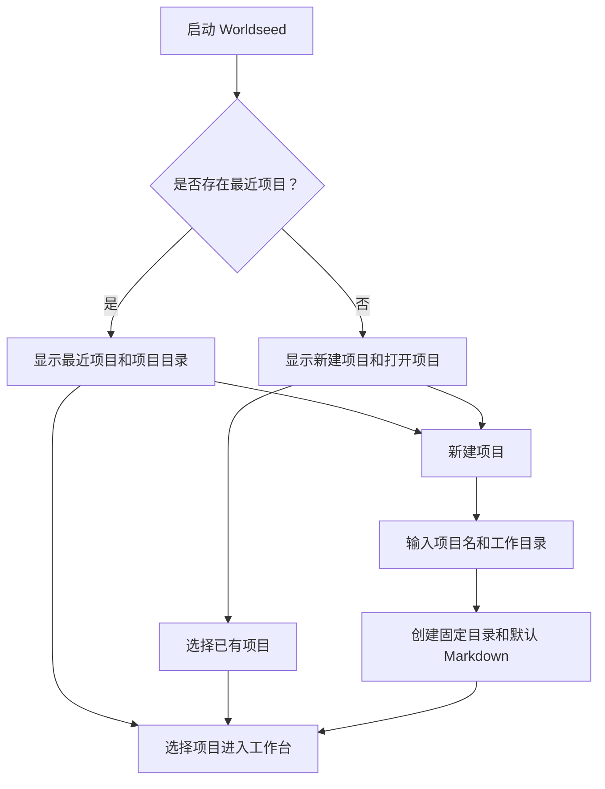
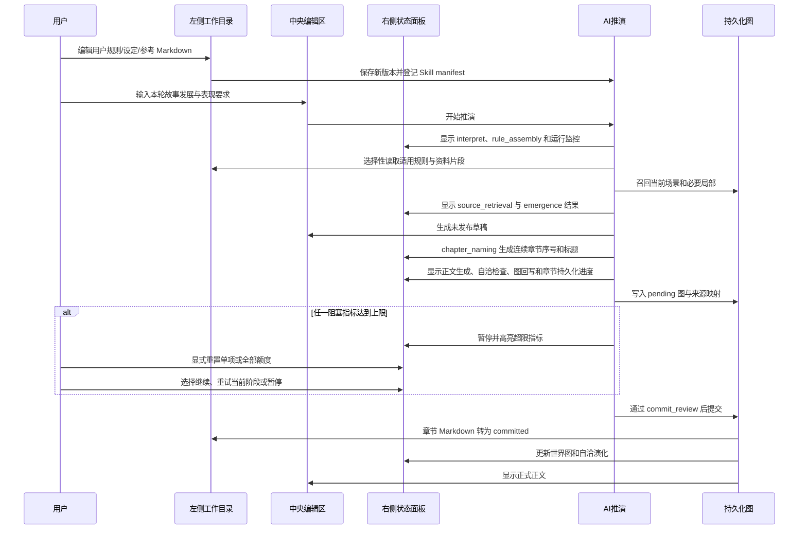

# Worldseed：IDE 式桌面工作台 UI 设计

## 1. 设计目标

Worldseed 采用接近 IntelliJ IDEA 的桌面 IDE 排版，面向长期创作和反复推演，而不是一次性表单或聊天页面。

核心工作流：

1. 用户新建项目或选择已有项目；
2. 在左侧工作目录维护规则、设定集、参考文件和表现输出 Markdown；
3. 在中央编辑正文、查看 Markdown 或输入本轮发展方向；
4. 在右侧观察推演流程、底层动态图和世界自洽演化；
5. 推演完成后从正文、图和状态面板继续下一轮。

界面只提供导航、编辑、查看和任务控制，不替 AI决定人物、势力、地点、事件或连接含义。

本文只定义客户端工作台的布局、可见信息、交互入口和 UI 验收标准。节点、连接、修订、检索、章节结算、规则快照、项目清单和任务进度的数据契约由 [底层动态图设计](system-design.md) 定义；规则和资料的注入方式由 [规则与资料分层](rule-and-source-layers.md) 定义，世界内容的出现时机由 [世界内容出现与生成规则](world-emergence-rules.md) 定义，任务异常后的确认弹窗、恢复动作和暂停状态由 [推演中断、确认与恢复设计](turn-interruption-recovery.md) 定义，长期保存、返回历史状态、历史浏览和世界线交互由 [推演历史、世界线与版本恢复设计](world-history-versioning.md) 定义。底层文档不反向规定菜单、面板或视觉布局。

---

## 2. 项目入口

应用启动后进入项目选择页，不直接进入某一个故事。



### 2.1 项目选择页

- 左侧显示 Worldseed 项目标识和最近项目；
- 中央显示项目卡片：项目名、工作目录、最近打开时间、最近章节和当前图规模；
- 右侧提供“新建项目”和“打开项目”操作；
- 打开项目时，应用先从内部项目注册表定位该工作目录对应的有效 `ProjectManifest`，再校验五个固定顶级目录和 Markdown 文件限制；工作目录移动后必须显式重新关联，不能静默创建替代项目；
- 项目不存在、目录无权限或结构损坏时，显示具体原因，不自动创建替代项目。

### 2.2 新建项目

新建项目只需要：

- 项目名；
- 用户工作目录；
- 可选的初始一句话世界种子；
- 可选的初始正文表现偏好。

创建后系统生成 `ProjectManifest`、固定顶级目录、固定子目录和平台基础规则 Markdown。用户规则、设定集和参考文件不自动填充虚假内容；如果用户输入了初始世界种子，它进入第一轮推演，而不是伪装成完整设定集。

---

## 3. 工作台总体布局

进入项目后采用固定三栏 IDE 布局：

```text
┌─────────────────────────────────────────────────────────────────────────────────────┐
│ 菜单栏：文件  编辑  查看  推演                                  项目名   ●运行状态      │
├──────────────────┬─────────────────────────────────────┬────────────────────────────┤
│                  │                                     │                            │
│  工作目录        │  中央编辑与正文工作区                 │  状态与世界工具窗口           │
│  Project         │  Tab：正文 / Markdown                 │  Tab：流程 / 世界图 / 自洽演化 │
│                  │                                     │                            │
│  固定目录树       │  当前 Markdown 编辑器或正文阅读器       │  当前推演阶段                 │
│  可编辑文件       │  用户本轮输入和生成控制                │  图局部与节点详情              │
│                  │                                     │  后台演化记录                 │
├──────────────────┴─────────────────────────────────────┴────────────────────────────┤
│ 环境状态栏：UTF-8 | LF | 当前文件完整路径 | 保存状态 | 继承环境 | 归档/删除进度 │
└─────────────────────────────────────────────────────────────────────────────────────┘
```

### 3.1 尺寸与行为

- 默认目标窗口为桌面宽屏，建议最小工作宽度 `1280px`；
- 左侧工作目录默认 `280px`，右侧状态与世界工具窗口默认 `360px`；
- 中央工作区占据剩余空间，不因为打开长文件而改变三栏边界；
- 左、右面板都可以折叠，但折叠不改变当前任务和读取集合；
- 面板折叠后通过顶部“查看”菜单恢复，不能导致用户失去当前状态提示；
- 长文本编辑、世界图画布和流程列表各自滚动，不使用整页滚动破坏 IDE 定位。

### 3.2 底部环境状态栏

底部是一行始终可见的 IDE 环境状态栏，主要展示当前编辑和工作目录环境，不重复承载右侧世界推演详情。状态栏从左到右显示：

```text
UTF-8  |  LF  |  Markdown  |  已保存  |  C:\Projects\Worldseed\设定集\盐雾城.md
继承环境：RuleSnapshot rs-00042 / 3 个 Skill  |  归档删除：4/9  [██████░░░░]  44%
```

具体信息包括：

- 当前打开文本的编码格式，例如 `UTF-8`；
- 换行格式，例如 `LF` 或 `CRLF`；
- 当前文件类型，用户文件只能显示 `Markdown`；
- 当前文件是否已保存、是否有未保存修改、是否正在写入；
- 当前打开文件的完整路径；路径过长时视觉截断，但悬停和复制操作返回完整路径；
- 当前继承环境摘要，例如 `RuleSnapshot`、已启用 Skill 数量和当前项目工作目录；
- 当前文件索引、Skill 更新、章节写入或软删除归档任务的进度；
- 当前软删除/归档操作的进度条、已完成数量、总数量、暂停或失败状态。

底部进度条只表示实际进行中的文件或索引任务，不表示世界推演已经完成。删除用户 Markdown 或文件夹时，界面显示“归档删除”而不是物理删除；任务完成后文件从当前目录消失，但历史版本和来源仍可在恢复/审计视图中找到。

状态栏的路径、编码、保存和任务进度属于机械环境信息，代码通过 `ProjectManifest` 和 `WorkspaceOperation` 直接提供；`RuleSnapshot` 中哪些 Skill实际生效、哪些资料成为本轮依据仍由 AI解释，并在右侧流程 Tab 展示详细结果。

---

## 4. 顶部菜单栏

V1 只保留四组菜单，避免把所有诊断能力都暴露成顶层入口。复杂详情统一从右侧状态窗口和当前文件右键菜单进入。

### 4.1 文件

- 新建项目；
- 打开项目；
- 关闭项目；
- 新建 Markdown；
- 新建文件夹；
- 保存；
- 退出。

### 4.2 编辑

- 撤销和重做 Markdown 编辑；
- 查找和替换；
- 在项目内查找；
- 删除或归档当前用户文件。

Markdown 编辑历史与世界图修订历史分开。编辑器撤销不能撤销已经提交的世界事实；已经提交的图变化必须通过 AI 的图治理和归档重构流程处理。

### 4.3 查看

- 显示/隐藏左侧工作目录；
- 显示/隐藏右侧状态与世界工具窗口；
- 恢复默认布局。

正文预览、Markdown 预览和章节差异直接在当前中央 Tab 内切换，不创建额外的长期 Tab。底部环境状态栏始终保留。

### 4.4 推演

- 开始本轮正文推演；
- 查询世界；
- 暂停、继续或停止当前任务；
- 执行后台自洽演化；
- 保存当前推演；
- 返回上一轮；
- 打开推演历史。

当前规则快照、Skill 状态、读取集合、预算和 AI阶段日志从右侧流程窗口查看，不再单独占用顶部菜单。

### 4.5 统一设置入口

顶部模型切换器右侧固定放置“项目设置”齿轮按钮。它是项目推演参数的唯一编辑入口，不再把图容量、检索轮次或任务预算散落在世界图标签、流程面板和 Markdown 中。设置窗口采用 IDEA 的左侧分类、右侧表单结构：

```text
设置 / 项目名
├── 项目
│   ├── 推演执行
│   ├── 资料检索
│   ├── 世界图
│   └── 推演历史
└── 应用
    └── 模型服务
```

“推演执行”配置单轮最大模型调用、模型上下文窗口、主动压缩阈值、最长墙钟时间与最大检索轮次；输出 Token 不设置应用级累计上限，由模型接口自身能力决定。“资料检索”配置每轮读取请求、单请求候选、最大检索深度与证据 Token 上限。“世界图”配置直接入度/出度上限、合并预警阈值、推荐和最大展开深度、局部访问节点和连接上限；布局固定显示为“分层避碰”，该字段只影响显示，不改变世界事实。“推演历史”配置历史保存点保留数量，默认为“无上限”；用户可切换为正整数上限，超过后每新增一个保存点都删除最旧保存点。

项目参数写入应用内部的项目 SQLite，不在用户工作目录创建 JSON、数据库或任务文件。默认单轮预算为 `400` 次模型调用、`7200000` 毫秒和 `10` 次检索轮次；单次模型请求默认允许 `3600000` 毫秒。模型上下文窗口默认为 `1000000` Token，系统在 `95%` 即 `950000` Token 处停止继续扩张并进入自有压缩流程，不能把超限后的截断交给模型供应商。应用不设置累计输入、输出 Token 截止线，只持续计量实际消耗；默认不向模型请求传入 `max_tokens`，正文长度仅通过提示词约束，具体输出上限由模型服务决定。这些提示词约束不是用户可见正文的硬截断。上述默认值只扩大可恢复执行空间，不扩大证据候选、图展开或上下文证据体积；保存后的设置从下一轮推演开始生效，已经运行的任务继续使用启动时冻结的配置快照。模型服务入口在同一设置导航中可达，但模型 Profile 属于应用级配置，API Key 继续使用系统安全存储，不写入项目数据库。

右侧世界图顶部只读显示当前项目的实际图参数，不能继续写死默认值。流程面板显示任务启动时的预算快照和实际消耗，设置窗口负责修改下一轮参数，两者职责分开。

---

## 5. 左侧工作目录

左侧是用户可见的简化文件管理系统。它只展示 Markdown 和文件夹，不展示图数据库、索引数据库、任务日志、模型缓存或其他内部文件。

### 5.1 默认目录树

```text
项目名/
├── 世界推演规则/                 [固定，不可删除、重命名、移动]
│   ├── 基础规则/                 [固定，只读]
│   │   ├── 底层连续性规则.md
│   │   ├── 选择性读取规则.md
│   │   ├── 世界内容出现与生成规则.md
│   │   └── AI 推演流程规则.md
│   └── 用户规则/                 [固定目录，可编辑]
│       └── 用户创建的规则.md
├── 设定集/                       [固定，不可删除、重命名、移动]
│   └── 用户创建的文件夹和.md
├── 参考文件/                     [固定，不可删除、重命名、移动]
│   └── 用户创建的文件夹和.md
├── 章节正文/                     [固定，不可删除、重命名、移动]
│   ├── 第一章 xxxx.md            [AI生成，正文首行同名标题]
│   └── 第二章 xxxx.md
└── 表现输出/                     [固定，不可删除、重命名、移动]
    ├── 描写规则/                 [固定目录，可编辑]
    │   └── 默认描写规则.md
    └── 笔风规则/                 [固定目录，可编辑]
        └── 默认笔风规则.md
```

平台提供的默认 Markdown 文件可以被用户查看，但属于基础规则时只读。用户规则、设定集、参考文件、章节正文、描写规则和笔风规则中的 Markdown 可编辑；章节正文的编辑会触发正文修订和重新结算，不能静默改变已经提交的图事实。

### 5.2 文件系统权限

| 位置 | 查看 | 编辑 | 新建文件夹 | 新建 `.md` | 删除/重命名 |
| --- | --- | --- | --- | --- | --- |
| 五个顶级目录 | 是 | 否 | 否 | 否 | 否 |
| `基础规则` | 是 | 否 | 否 | 否 | 否 |
| `用户规则` | 是 | 是 | 是 | 是 | 用户内容可软删除 |
| `设定集` | 是 | 是 | 是 | 是 | 用户内容可软删除 |
| `参考文件` | 是 | 是 | 是 | 是 | 用户内容可软删除 |
| `章节正文` | 是 | 是 | 受章节组织规则限制 | 是 | 章节文档可修订，历史保留 |
| `描写规则` | 是 | 是 | 是 | 是 | 用户内容可软删除 |
| `笔风规则` | 是 | 是 | 是 | 是 | 用户内容可软删除 |

固定目录的名称、位置和权限由项目协议维护。用户可以在可编辑目录中继续建立任意层级文件夹，但不能在项目根目录创建第六个顶级目录。

### 5.3 文件类型限制

- 用户界面只允许创建文件夹和 `.md` 文档；
- 新建 Markdown 时自动补充 `.md` 扩展名，用户不能改成其他扩展名；
- 上传单个文件只接受 `.md`；上传文件夹时递归检查全部内容，发现任意非 `.md` 文件、符号链接或越界路径时整批拒绝并显示具体文件；
- 拖入和粘贴内容如果不是 Markdown，必须先转为 Markdown 或拒绝；
- 图片、PDF、Word、数据库和模型文件不能作为项目文件写入用户工作目录；
- 参考外部资料时，可以在 Markdown 中保存 URL、书目信息、摘录和查询说明；实际索引和缓存属于应用内部存储，不显示在该文件系统；
- 内部图、原文单元、修订、索引、RuleSnapshot 和任务日志不属于用户文件系统，不能被用户通过文件树直接修改；已提交章节正文以 Markdown 形式属于用户可见文件，但其原文单元和图结算记录仍由系统维护。

### 5.4 文件树操作

右键可编辑目录显示：

- 新建文件夹；
- 新建 Markdown；
- 重命名；
- 删除；
- 在编辑器打开；
- 在项目内查找引用；
- 查看被哪些 Skill 使用。

右键固定目录只显示：

- 打开；
- 在中央区域查看；
- 查看权限说明。

删除用户文件时采用软删除和版本保留。文件从当前工作目录消失，但已经进入 `RuleSnapshot`、图修订或正文来源的历史仍可追溯；下一轮不得继续把已删除文件当作当前有效用户规则，除非用户恢复它。

### 5.5 表现输出默认内容

`表现输出` 保存“正文应该如何被呈现”的 Markdown 规则，不保存生成后的连续小说原文。生成后的连续小说原文保存到固定的 `章节正文` 目录，并在中央正文阅读 Tab 中展示。

`描写规则/默认描写规则.md` 默认使用自动模式：AI根据当前场景、用户输入和实际读取世界选择描写角度、观察距离、景别、机位、镜头移动、蒙太奇组织或其他表达方式。用户可以在该目录创建规则，明确指定其中任意一项，也可以规定何时保持自动判断。

`笔风规则/默认笔风规则.md` 默认要求保持作品当前已形成的语言连续性。用户可以新增 Markdown 规定节奏、句式、词汇倾向、叙述密度、语言习惯和禁用表达；没有适用用户规则或无法判断时使用默认笔风规则。

表现规则只控制正式正文如何表达，不自动改变世界事实、人物认知、事件结果或图结构。若用户在表现规则中同时写入世界变化要求，AI必须在 `interpret` 阶段把它拆分到世界推演约束，不能因文件位置而跳过出现规划和图治理。

### 5.6 章节正文

每次正式正文推演成功后，AI必须生成一个章节 Markdown 文档并写入 `章节正文` 根目录。文件名和正文第一行使用同一个 AI生成的章节标题：

```md
# 第一章 雾港来信

章节正文从这里开始。
```

章节文档要求：

- 文件名格式为 `第一章 xxxx.md`，其中章节序号和 `xxxx` 都由 AI根据上一章、当前大纲、目标场景时空绑定和本轮推演内容生成；
- `第一章 xxxx` 是正文的一部分，也是第一个 `NarrativeSourceUnit`，不能只存在于文件名元数据中；
- AI必须先读取最后一个已提交章节的标题、正文结算记录和当前规则快照，再决定下一章标题，保持章节延续性；
- 每次正式正文推演默认生成一个新章节；只读查询、后台自洽演化和失败任务不生成正式章节；
- 章节内容先持久化到应用内部目录，作为不可见的 pending 产物参与自动审计；左侧 `章节正文` 只显示已提交 Markdown，不把内部草稿伪装成用户文件；完成依赖审计、图治理、正文结算和 `commit_review` 后才发布或切换为 `committed`；
- 暂停或失败的章节 Markdown 只保留在内部任务恢复视图，不能进入左侧文件树、普通正文阅读和世界事实召回；
- 用户可以编辑章节 Markdown，但编辑已提交章节会生成新的正文修订任务，必须重新执行原文单元结算和图治理；
- 已提交章节默认先以只读方式打开；点击“编辑章节”后建立 `pending` 修订副本；
- 章节编辑器只提供“保存修订”“查看差异”“提交章节修订”“放弃修订”四个相关动作；普通保存不会改变 `committed` 正文；
- 用户修改章节标题时，系统在提交前要求同步章节文件名、正文第一行和章节索引，不能只改其中一处；
- 章节文件的重命名和删除都进入章节修订/归档流程，不能使用普通文件操作直接改名或删除；
- 章节正文不允许被物理删除，用户删除操作只进入归档并保留历史来源。

---

## 6. 中央编辑与正文区域

中央区域是用户主要工作的编辑区，使用 Tab 管理多个打开内容。

### 6.1 Tab 类型

- **正文**：显示 `章节正文` 中的章节 Markdown，并在同一 Tab 内切换阅读、编辑和修订差异；
- **Markdown**：查看或编辑基础规则、用户规则、设定集、参考文件和表现规则，并在同一 Tab 内切换源码与预览。

世界查询结果作为临时只读内容显示在当前正文 Tab；关闭后仍可从右侧流程记录重新打开。`pending` 任务的恢复入口放在右侧流程 Tab，不再创建独立中央 Tab。

基础规则 Markdown 打开后使用只读编辑器，并在页首显示版本、来源和“平台规则，不可修改”标记。用户规则编辑器显示当前作用范围、生效状态和是否会影响下一轮。章节正文打开后显示当前提交状态；编辑已提交章节必须先点击“编辑章节”，进入独立的 `pending` 修订。

### 6.2 Markdown 编辑器

编辑器提供：

- 行号、折叠、查找、替换和 Markdown 预览；
- 标题、列表、代码块和链接的语法提示；
- 未保存标记和保存状态；
- 当前文件被哪些 Skill、规则快照或图来源引用；
- 当前内容是否存在冲突、格式错误或未能解析的适用范围；
- “仅下一轮生效”或“从指定时间/局部生效”的规则范围编辑入口。

用户可以写普通 Markdown，不强制使用结构化字段。系统只解析必要的适用范围、优先级语义、生效时空范围和引用信息，世界内容仍由 AI在通用图中解释。

### 6.3 正文推演区

正文阅读 Tab 下方固定保留本轮输入区：

- 故事发展、某人行动、想法和方向；
- 是否继续当前场景或切换场景；
- 可选的表现规则引用；
- AI生成的章节序号和标题预览；
- 本轮推演按钮；
- 生成前显示将读取的规则快照摘要、当前时间锚点和地点锚点。

本轮正文生成完成后，中央正文 Tab 显示章节标题预览、章节 Markdown 路径和 `pending` 状态；用户可以查看，但只有完整结算后才显示“已提交”。

用户不需要在输入框中重复粘贴规则。规则、设定集和参考资料由左侧文件和当前任务选择性召回。

---

## 7. 右侧状态与世界工具窗口

右侧是实时状态面板，不是普通文本状态栏。它展示本轮运行到哪里、底层图如何变化，以及用户视野外的世界发生了什么。

### 7.1 推演流程 Tab

使用纵向阶段时间线显示：

```text
● interpret              已完成
● rule_assembly          已完成   RuleSnapshot: rs-00042
● source_retrieval       已完成   读取 3 个设定片段
● emergence_planning     已完成   复用 2 / 创建 1 / 延后 1
● emergence_review       进行中
○ draft                  等待
○ chapter_naming         等待
○ dependency_audit       等待
○ graph_governance       等待
○ semantic_review        等待
○ settlement_review      等待
○ frontier_settlement    等待
○ commit_review          等待
```

每个阶段展开后显示：

- 状态：等待、进行中、完成、需要读取、需要修订、暂停、失败；
- 当前耗时、输入 token、输出 token、剩余预算和本轮 KV 缓存命中率；
- 实际读取的规则、设定、参考资料和图入口数量；
- AI 请求的补充读取；
- 当前 `pending` 或 `committed` 可见性；
- 阻塞原因和下一步动作。

流程面板顶部的“本轮消耗”摘要固定显示阶段进度、输入 token、输出 token、上下文预算占用和 `KV 缓存命中率`。命中率只统计本轮模型调用返回的缓存输入 token：`cacheHitInputTokens / totalInputTokens`；供应商未返回缓存明细时显示“不可用”，不能显示为 `0%`。上下文预算占用和 KV 缓存命中率是两个独立指标，前者表示本轮上下文使用量，后者表示稳定提示前缀的复用程度。

#### 7.1.1 运行监控

“本轮消耗”下方固定显示可折叠运行监控，指标由后端动态返回，不在前端硬编码。首批包括执行时间、模型调用、输入 Token、输出 Token、动态上下文、检索轮次、网络重试和格式修复。

每个可重置指标显示名称、当前额度窗口用量、允许总量、进度、状态和独立重置按钮；面板底部显示“全部重置”。用户点击继续或重试不能自动重置任何指标。任一阻塞指标耗尽后，流程暂停、超限行高亮，用户显式重置所有阻塞指标后才能选择恢复。

只读指标单独展示：累计 Token、累计耗时、KV 缓存命中率、提供方固定模型上限和不受本地限制的额度。重置额度窗口不能把这些历史成本显示为零。详细交互、后端指标描述和恢复规则见 [推演中断、确认与恢复设计](turn-interruption-recovery.md)。

用户可以暂停任务。暂停保留 `pending`、阶段记录和检查点，不将其伪装为世界事实；继续任务时使用原 `RuleSnapshot`，不会在半轮中途换规则。

### 7.2 世界图 Tab

世界图 Tab 使用可缩放、可拖拽的局部图画布，默认以当前正文场景、时间锚点和地点锚点为中心，不加载整张图。

顶部控件：

- 当前场景；
- 搜索节点或原文；
- 展开深度；
- 图参数：直接入度/出度上限、合并预警阈值和布局；V1 默认出度 `12`、入度 `12`、预警阈值 `10`、布局为“分层避碰”；
- 查询入口：默认每批 `32` 个，允许在项目设置中提高，单批硬上限 `64`；该参数控制从多少个已提交锚点展开局部图，不等于节点出度；
- 当前有效/历史/归档；
- `committed` / 当前任务 `pending`；
- 重新布局；
- 返回正文。

图中的节点不使用固定人物、势力或地点颜色。节点显示 AI为当前任务选择的摘要和来源；连接显示方向、连接信息摘要和可展开入口。用户点击节点后，右侧或中央弹出：

- 当前节点资料；
- 相关连接和连接携带的信息；
- 当前有效状态；
- 历史修订时间线；
- 原文来源；
- 可以重新发现它的入口；
- AI创建、编辑、归档或重构的原因。

世界图只读展示。用户不能在画布上直接拖动节点改变世界事实；需要改变世界时，通过用户规则、正文输入或 AI图治理流程产生可审计修订。

当本轮返回的图锚点多于单批查询入口时，界面先显示已经加载的局部图，并在顶部显示非阻断提示：`正文与图数据已提交；已加载 32/总数，是否继续加载下一批？`。操作只提供“继续加载世界图”和“只看正文”；继续时读取下一窗口并按节点、连接 ID 合并，只看正文时关闭提示但不修改图和任务。网络或展示查询失败时将第一个按钮改为“重试世界图”。这些状态使用黄色可继续提示，不得显示红色任务失败，也不得把已经完成的推演改回失败。

### 7.3 自洽演化 Tab

自洽演化 Tab 展示用户没有直接输入但已经沿合理路径发生的世界变化：

```text
当前场景：盐雾城历·第 42 日 18:20 / 旧港

[已提交] 盐雾城局部
  发生：旧港的通行限制扩大到内河码头
  时间：第 42 日 16:00 - 18:00
  依据：港口局部、商路局部、此前的税令
  影响：主角尚未接触

[已到达正文] 北桥局部
  发生：旧桥线索沿商队传到当前地点
  时间：第 42 日 18:15
  依据：商队路径、已提交线索、当前地点
  影响：可进入本轮正文

[延后] 未展开局部
  原因：缺少可用时间路径，保留在演化前沿
  重访条件：主角进入东侧渡口，或该局部与目标场景形成第 44 日之后的可读对应
```

每条记录显示：

- 局部时间参照、时间锚点和空间范围；
- 变化摘要；
- 来源锚点和影响路径；
- 是否已经进入当前人物认知；
- 是否进入正文；
- 当前状态：`pending`、`committed`、延后或归档；
- AI给出的修改原因和自审结果。

自洽演化面板不是事件表，也不要求所有后台变化提前完整。它只是当前任务相关演化前沿和已到达影响的投影。

### 7.4 推演历史 Tab

推演历史 Tab 使用紧凑时间线展示手动保存、完整轮自动保存和世界线分叉。默认只展开当前世界线，允许切换查看其他世界线，但查看本身不改变当前写入目标。

顶部提供：

- 保存当前推演；
- 返回上一轮；
- 当前世界线选择；
- 全部、自动保存、手动保存、含暂停任务筛选；
- 搜索保存名称、章节名和备注。

顶部同时显示 `当前数量 / 保留上限`。默认显示“无上限”。达到有限上限后，新保存点写入完成，最旧保存点自动从列表消失；底部状态栏显示本次删除数量和内部清理进度。

每个保存点显示保存名称、所属章节和轮次、保存时间、保存类型、完整世界或暂停检查点、是否存在在途请求，以及与当前点的章节、图和 Markdown 变化摘要。条目操作包括“查看”“恢复到这里”“从这里继续”“比较”和“重命名”；界面不显示 commit、branch 或 checkout 等 Git 术语。

模型请求期间手动保存时，界面明确显示“已保存最近稳定检查点，当前请求仍在继续”。恢复任何包含检查点的保存点后，流程 Tab 显示任务为“已从历史恢复 · 已暂停”，不会自动请求模型，也不会自动重置额度。

“返回上一轮”把历史游标切换到前一个完整轮自动保存点，当前轮仍显示在历史列表中；仅切换历史状态不会立刻创建新世界线。用户从旧保存点开始新推演或产生持久化修改时，系统才在首次写入前创建新世界线并保留原未来。完整交互和后端恢复协议见 [推演历史、世界线与版本恢复设计](world-history-versioning.md)。

用户在项目设置中降低历史上限时，确认面板预览将删除的最旧保存点数量、时间范围、可能消失的空世界线，以及当前历史游标的新位置，并明确提示不可恢复。确认后立即结算；取消则保持原配置和历史列表不变。增大上限或恢复“无上限”只影响后续保留，不恢复此前已删除历史。

### 7.5 右侧面板摘要

右侧面板底部只保留世界运行摘要：

- 当前场景采用的局部时间参照与时间锚点；
- 当前场景地点与空间参照；
- 当前任务状态；
- `pending` / `committed`；
- 图节点数、连接数和当前局部规模；
- 本轮模型调用、token 和耗时；
- 是否存在未处理冲突或需要用户决定的任务。

项目名、当前文件路径、编码、保存状态和文件删除/归档进度统一显示在底部环境状态栏，不在此处重复。

---

## 8. 一轮推演的 UI 流程



规则 Markdown 在推演开始后修改，不改变已经形成的 `RuleSnapshot`。编辑器显示“下一轮生效”，用户可以继续查看本轮采用的旧快照。

---

## 9. 状态颜色与可见性

颜色只表达运行状态，不表达人物、势力或地点类型：

- 中性灰：未运行、只读资料、历史或归档；
- 蓝色：当前读取、进行中或可继续；
- 绿色：已通过审查并 `committed`；
- 黄色：`pending`、延后、等待读取、需要修订、等待用户决定或已暂停；
- 红色：已经达到上限的阻塞指标、规则冲突或索引损坏；

可恢复中断不能显示为永久失败。红色指标只表示需要立即处理，任务本身仍保持黄色暂停状态。

颜色不能替代文字说明。`pending` 和 `committed` 必须同时显示文字标签，避免用户把草稿误认为世界事实。

---

## 10. 不可见的内部资料

用户文件树保持简单，但系统仍然需要保存：

- 世界图节点、连接和修订；
- 章节 Markdown 对应的不可变原文版本、原文单元和章节索引；
- Skill manifest、索引和 `RuleSnapshot`；
- AI阶段结果、读取集合、决定记录和检索投影；
- 后台演化前沿和任务预算。

章节正文内容本身以 `.md` 文件展示在 `章节正文`；其不可变版本、原文单元、结算映射和索引存放在应用内部项目数据区或独立数据库中。其他内部内容不作为用户可以直接创建、编辑或删除的文件，界面只通过中央 Tab、右侧工具窗口和只读详情展示它们。

---

## 11. 验收标准

1. 启动后用户可以新建项目或选择已有项目进入；
2. 进入项目后拥有顶部菜单、左侧工作目录、中央编辑区和右侧状态与世界工具窗口；
3. 五个顶级目录始终存在，不能删除、重命名、移动或增加第六个顶级目录；
4. `基础规则` 可见但不可编辑，`用户规则` 可编辑；
5. `描写规则` 和 `笔风规则` 默认存在并可编辑；
6. 用户只能创建文件夹和 `.md` 文档，其他文件类型无法写入用户工作目录；
7. 项目通过 `ProjectManifest` 校验固定目录和用户文件权限，异常目录不会被静默读取；
8. 用户规则 Markdown 每轮全部读取；设定集和参考文件先读取各自的 `readme.md`，再以 Skill manifest 加选择性片段参与上下文；表现规则作为本轮用户提示注入，不作为世界资料全文注入；
9. 参考文件必须存在可编辑但不可删除的 `参考文件/readme.md`；AI 先读取索引再选择性检索，索引缺失时显示项目配置错误并阻止正式推演；
10. 右侧流程 Tab 能显示当前阶段、读取量、预算、`pending`/`committed` 和阻塞原因；
11. 右侧世界图 Tab 能从当前局部查看节点、连接、修订、来源和返回路径；
12. 右侧自洽演化 Tab 能显示后台变化、影响路径、是否到达当前场景和延后原因；
13. 用户规则在明确范围内优先作为创作依据，范围外或无法判断时回退平台默认规则；
14. 停止或暂停任务不会把 `pending` 内容展示为已提交世界事实；
15. 删除用户 Markdown 后，历史来源仍可追溯，但下一轮不再作为当前有效用户资料使用；
16. 每次正式正文推演由 AI生成连续章节序号和章节名，并以 `第一章 xxxx.md` 形式写入 `章节正文`；
17. 章节标题同时存在于文件名和正文第一行，并作为正文原文单元参与图结算；
18. 编辑已提交章节会进入正文修订流程，不能静默改变已经提交的世界事实；
19. 底部环境状态栏显示编码、换行格式、文件类型、完整路径、保存状态、继承环境和文件删除/归档进度；右侧面板仍显示世界推演状态；
20. 文件归档、恢复、章节写入和索引任务的进度来自 `WorkspaceOperation`，不会使用假进度。
21. 流程 Tab 固定显示当前额度窗口和累计成本；每个可重置指标有独立重置按钮，底部有“全部重置”；
22. 继续和重试不能自动重置额度，存在未重置阻塞指标时两个按钮不可用；
23. 超限确认弹窗能直接重置阻塞指标，也能打开完整运行监控；重置后仍由用户决定是否继续；
24. 重置后的当前窗口可以从零重新计量，但累计 Token、累计调用和累计耗时始终保留。
25. 用户可在任意时刻手动保存；模型请求期间保存只冻结最近稳定检查点，不中断当前请求；
26. 完整一轮最终化成功后自动创建历史保存点；
27. 推演历史可按世界线浏览手动保存、自动保存和暂停检查点，并能查看差异摘要；
28. 恢复包含任务检查点的保存点后任务固定为暂停，不自动调用模型、不自动重置额度；
29. 返回上一轮只移动历史游标；从旧历史点产生新写入时才创建新世界线，原世界线和原未来不会被删除；
30. 恢复会同时切换章节、用户 Markdown、世界图、上下文链和当前状态，不产生跨世界线混读；
31. 内部历史仓库不出现在用户工作目录，也不要求用户理解或操作 Git；
32. 推演历史保留上限默认为无上限，用户可以在项目设置中改为正整数；
33. 超过上限后每完成一个新保存点都自动删除最旧保存点，任务检查点不计入数量；
34. 降低上限前 UI 会预览删除数量和时间范围，确认后立即执行且明确不可恢复；
35. 历史删除不会破坏仍保留保存点的章节、图、Markdown、上下文和状态恢复。

---

## 12. 最终定义

Worldseed 的 UI 是一个围绕持久化动态图的 IDE：

> 左侧管理用户可编辑的 Markdown 世界材料，中央进行规则驱动的创作和正文工作，右侧展示 AI 当前如何读取、推演、治理图和让世界自洽演化；用户看到的是完整过程，但不能绕过基础规则直接破坏世界连续性。
