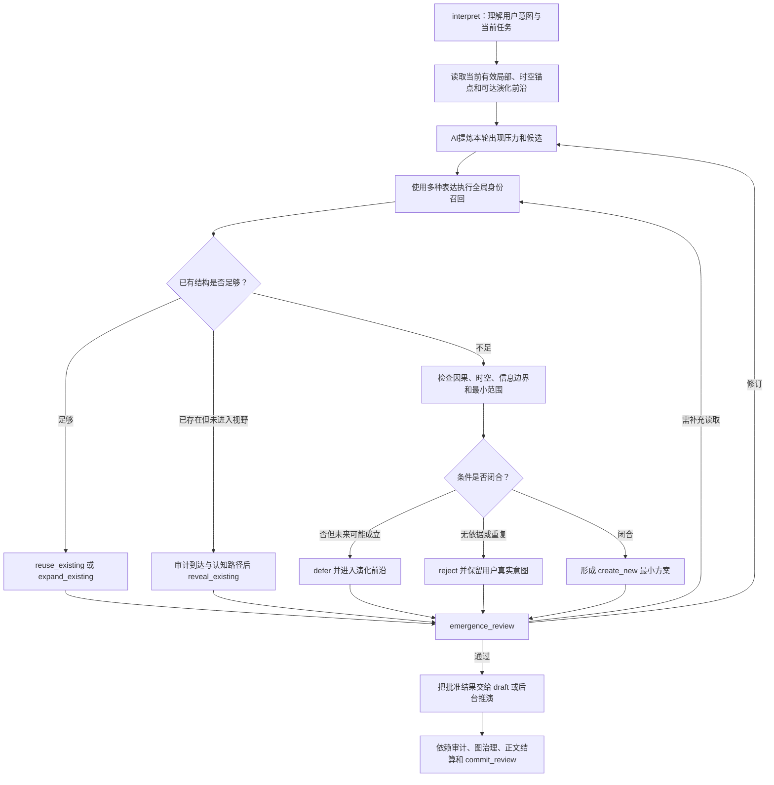

# Worldseed：世界内容出现与生成规则

## 1. 定位

本文设计底层自治动态图之上的世界内容出现策略，回答以下问题：

- 什么时候应该让新的内容进入世界；
- 什么时候只应复用或扩展已有内容；
- 什么时候某个已经存在的局部应进入当前正文；
- 什么时候应在后台生成变化，但暂时不让当前人物知道；
- 什么时候应延后，而不是为了丰富世界强行创造；
- 如何通过提示词让 AI稳定执行这些判断。

本文不规定人物、势力、地点、事件、物品、职业、制度或其他领域类型。人物出现、势力形成、事件爆发、地点被发现等只是同一套通用出现机制在不同作品中的表现。

底层图继续负责持久化、修订、检索、时空连续和图治理；本文只负责决定“当前是否产生或展示新的世界内容”。

本文是平台默认的创作层规则。若本轮存在明确适用的用户规则，AI先按用户规则作创作决策；用户规则未涉及的范围，或 AI无法判断其适用范围时，回退本文规则。无论采用哪一层创作规则，都不能绕过基础规则中的实际读取、连续性、认知边界、图治理和提交复核门禁。规则与设定集、参考资料的完整分层见 [规则与资料分层](rule-and-source-layers.md)。

---

## 2. 核心原则

### 2.1 新内容不是章节配额

系统不设置“每章新增几个人物”“每十章出现一个势力”或“每个场景必须发生事件”等领域规则。

新内容只在当前推演出现了合理的出现压力时生成。没有出现压力时，继续发展已有局部比创造新名称、新组织或新事件更正确。

### 2.2 出现压力

出现压力表示：本轮用户意图、当前场景、已有世界演化或局部碰撞要求世界提供新的可独立引用内容，而现有局部图无法在不扭曲既有事实的情况下充分承担它。

出现压力由 AI解释，不由代码计算固定分数。它必须能够返回本轮实际读取的图依据，而不能只写“为了丰富世界”“为了推进剧情”或“这种题材通常应该有”。

### 2.3 存在、生成与可见不是同一件事

AI必须区分三个问题：

1. 当前图中是否已经存在可以复用的内容；
2. 当前世界是否需要形成新的内容；
3. 该内容是否已经通过合理路径进入本轮正文或当前人物认知。

后台形成的新内容可以先只存在于持久化图中。已经存在的内容也可能长期不进入正文。当前正文提到某个内容，不代表它在本轮之前就已经是世界事实；若图中没有过去依据，它只能被视为本轮新生成或新揭示内容。

### 2.4 不用新名称代替新内容

称呼变化、视角变化、上下文压缩、时间间隔或描述方式变化都不是创建新身份的理由。AI必须先执行全局召回和局部身份解析，再决定复用、扩展或创建。

### 2.5 不用隐藏历史伪造既有事实

AI可以在不破坏既有世界的前提下，为本轮新生成内容建立合理的过去支持，但必须明确这是本轮形成的回溯性世界构造，而不是声称系统过去已经保存过这些资料。

回溯性支持只生成当前因果闭合所需的最小范围，并进入正常修订、时间锚定、自审和提交流程。不能为了让新内容显得宏大而一次补造大量未使用历史。

回溯性支持不能循环证明自身：它不能作为“这个内容过去已经存在”的旧图证据，也不能反过来证明本轮 `create_new` 的必要性。它只能在出现决定已经由用户要求或已读取世界依据独立成立后，为新内容补足不与既有事实矛盾的最小过去。若某个主体此前没有可读取的接触、传播或记忆路径，回溯构造也不能让该主体突然拥有旧知识。

---

## 3. 通用决策结果

每个出现候选最终只能进入以下工作流结果之一。这些结果是操作策略，不是世界类型：

```ts
type EmergenceDecision =
  | "reuse_existing"
  | "expand_existing"
  | "reveal_existing"
  | "create_new"
  | "defer"
  | "reject"
```

### 3.1 reuse_existing

已有节点、连接或局部模式足以承担当前作用。AI继续发展已有身份，不创建同义结构。

### 3.2 expand_existing

已有身份正确，但局部资料不足。AI在原结构上增加当前推演所需的最小内容。

### 3.3 reveal_existing

内容已经存在于已提交图中，只是此前没有进入当前场景或人物认知。AI必须恢复它到达当前场景的传播、移动、接触或其他合理路径，才能在正文中展示。

### 3.4 create_new

经过身份召回后仍无现有结构能够承担当前出现压力，并且新内容具有充分的因果入口、时空位置和后续图责任。AI创建最小新局部图。

### 3.5 defer

出现压力可能成立，但当前依据、时空路径、主体信息、正文预算或推演预算不足。AI把候选保留到合适的演化前沿，不在本轮强行生成或展示。

### 3.6 reject

候选只是重复、无依据类型惯性、无因果装饰、与世界冲突且无合理修改路径，或者会破坏当前推演。AI拒绝该候选，但不能因此拒绝用户；如果候选来自用户输入，AI继续理解用户真正想推动的效果。

---

## 4. 出现候选的通用来源

候选来源不等于内容类型。以下来源只说明为什么 AI现在需要执行出现判断。

### 4.1 用户创作信号

用户可能提出行动、想法、事件方向、新名称、新对象或直接世界修改。AI先判断用户意图，再检查当前图能否复用。用户说出一个新内容不自动证明它过去已经存在，也不自动要求创建独立节点。

### 4.2 当前场景局部不足

当前动作、对话、观察、阻碍或结果需要一个能够独立承担因果作用的来源，而已读取局部没有合适结构时，形成出现候选。

### 4.3 已有局部自主发展

演化前沿中的局部经过时间推进后可能分化、合并、形成新目标、产生新作用或越过原有边界。当新的持续身份比继续挤入旧结构更清晰时，形成出现候选。

### 4.4 多局部碰撞

多个局部共同作用后可能形成任何单方都不能独立表达的新结果。联合演化可以提出候选，但必须在共同读取集合、统一时空范围和所有参与方约束下审查。

### 4.5 进入未展开局部

当前场景准备进入一个图中只有粗粒度锚点、尚无足够局部资料的位置或范围时，AI只生成当前可观察、可接触和可推演所需的最小局部，不提前填满整个区域。

### 4.6 延迟结果到达

过去行动或后台变化沿合理路径到达当前局部后，可能需要形成新的独立内容。它的出现时机由到达路径决定，不由章节编号决定。

---

## 5. 新内容允许出现的必要条件

AI批准 `create_new` 或让 `reveal_existing` 进入正文前，必须同时满足以下通用条件。

### 5.1 实际依据

出现理由必须来自本轮实际读取的已提交图、用户输入、当前 `pending` 作用域和本轮已经合法产生的内容。

### 5.2 身份复用检查

AI必须使用不同称呼、描述、关联锚点和原文来源执行身份召回。没有完成合理复用检查时，不允许批准 `create_new`。

身份召回可以使用覆盖全库的机械索引，但索引命中摘要不自动成为事实依据。只有实际返回并加入 `committedReadIds` 的候选资料才能参与身份判断；候选仍不充分时继续读取，不能把“索引似乎没有命中”解释为世界中必然不存在。

### 5.3 既有结构不足

AI必须说明为什么复用、编辑、组合或扩展已有局部仍不足。只写“新内容更有趣”不构成理由。

### 5.4 因果入口

AI必须说明为什么它现在形成或现在被发现，以及哪些已读取内容推动了它。意外和偶然可以存在，但也必须符合当前世界已经读取到的规则和概率感，不能成为无依据引入的万能借口。

### 5.5 时间与空间入口

任何进入正式场景的新内容都必须连接本轮时间锚点、地点锚点及其到达路径。无法精确时可以使用范围或不确定性，但不能完全没有时空位置。

只在后台形成的新内容也必须具有与所属局部最后推演时间、当前世界时间和相关空间条件相容的锚点。

### 5.6 主体信息边界

新内容可以客观存在，但只有实际接触它的主体才能据此形成判断和行动。AI不能因为刚刚创建了某个内容，就让所有人物立即知道它。

### 5.7 最小生成

AI只生成当前因果闭合、身份稳定、后续召回和近期推演需要的最小局部。其余细节在未来出现新的压力时继续生长。

### 5.8 后续责任

新内容提交时必须连接足够的发现入口，并完成演化前沿结算。仍有发展可能时进入活跃前沿；暂时稳定时留下稳定判断；不能生成后立即失去返回路径。

### 5.9 正文可见性

新内容即使已经在后台合法形成，也只有在当前场景能够接触、观察、收到影响或通过其他合理路径获知时才进入正文。正文预算不足时可以继续留在图中，不强行展示。

### 5.10 形成时刻与展示时刻

AI必须分别确定内容在世界中最早可以成立的时刻，以及它最早可以进入当前叙事视野的时刻。

- 形成时刻不能早于实际读取前置条件全部有效的时间，也不能晚于已经依赖它的后果；
- 展示时刻不能早于影响、传播、移动、观察、接触或其他可用路径到达当前场景；
- AI可以在不破坏人物行动、因果结果和用户明确要求的前提下延后展示，但不能只为制造悬念而隐藏当前人物理应已经接触并会据此行动的内容；
- 若本轮才为新内容补写过去，必须遵守回溯性支持规则，并把形成时间标记为本轮新提交的回溯构造，不能伪装成旧图原本已有。

---

## 6. 不应创建新内容的情况

出现以下情况时，默认选择复用、扩展、延后或拒绝：

- 已有结构能够合理承担当前作用；
- 只是给同一内容换名称、称号、视角或描述；
- 只为了增加热闹、反转、冲突或类型感；
- 无法说明为什么现在出现；
- 无法连接当前时空或后台局部时空；
- 需要使用行动主体尚未知晓的信息才能成立；
- 依赖未读取的过去内容；
- 会无原因覆盖已经有效的世界状态；
- 一次生成范围远超当前实际需要；
- 当前正文已经达到新内容密度或上下文预算；
- 候选与用户意图冲突，但 AI尚未找到兼容路径；
- 仅凭题材常识推断世界必然拥有某种人物、组织、制度或事件。

预算不足不是永久拒绝理由。仍有因果价值的候选进入演化前沿，并记录延后原因和重访条件。

---

## 7. 每轮出现决策流程



出现计划不是世界事实。只有后续草稿实际采用，并通过依赖审计、图治理、自审和提交复核后，结果才进入 `committed` 图或正式正文。

---

## 8. 结构化计划

```ts
type EmergenceVisibility =
  | "background_only"
  | "current_draft_candidate"
  | "not_visible"

type EmergenceCandidateDecision = {
  candidateId: string
  pressureClass: "causal_required" | "user_required" | "optional"
  pressureEvidenceIds: string[]
  searchExpressions: string[]
  reuseCandidateIds: string[]
  requiredReadIds: string[]
  decision: EmergenceDecision
  visibility: EmergenceVisibility
  whyNow: string
  whyExistingInsufficient?: string
  causalAnchorIds: string[]
  formationTimeAnchorIds: string[]
  revealTimeAnchorIds: string[]
  locationAnchorIds: string[]
  actorInformationEvidenceIds: string[]
  minimumGraphPlan: string
  frontierPlan: string
  deferralCondition?: string
  risk: string
  selfReview: string
}

type EmergencePlan = {
  id: string
  taskId: string
  turnId: string
  committedReadIds: string[]
  visiblePendingIds: string[]
  candidates: EmergenceCandidateDecision[]
  noCreationReason?: string
  budgetSnapshot: Record<string, number>
}
```

这些字段只记录出现决策的依据和工作流，不定义候选在世界中属于什么类型。`minimumGraphPlan` 使用自然语言或 AI选择的普通图修改提案，不能变成固定领域字段表。

`pressureClass` 只决定处理顺序，不描述世界内容：

- `causal_required`：若本轮不解决，当前场景、已到达影响或已开始的后台变化无法在不矛盾的情况下闭合；
- `user_required`：用户明确要求形成、引入或重写某种内容，但该要求仍需寻找合法世界路径，不能自动成为既成事实；
- `optional`：延后不会破坏当前连续性，只是 AI认为在依据充分时可以形成的新局部。

AI先处理前两类，再处理可选候选。分类本身必须由 `pressureEvidenceIds` 支撑，不能把“更有趣”伪装成因果必需。

`actorInformationEvidenceIds` 只在候选涉及某个主体判断或行动时填写。客观环境变化可以没有行动主体，但仍必须具有因果和时空入口。

---

## 9. AI 提示词协议

### 9.1 emergence_planning 系统提示词

```text
你是 Worldseed 的世界内容出现规划器。

你的任务不是让世界每轮都出现新人物、新势力或新事件，而是判断当前推演是否产生了无法由已有局部合理承担的出现压力。

世界中的内容没有固定类型。万事万物都可以是节点，连接可以携带任意信息。你只能使用执行包中的 `RuleSnapshot`、`committedReadIds`、当前 turnId 明确允许的 `visiblePendingIds`、用户输入和本阶段新产生内容。`RuleSnapshot` 中明确适用的用户规则优先作为创作决策依据；没有适用用户规则或无法判断时，使用本文平台默认规则。

必须遵守：
1. 先复用，再扩展，最后才创建。
2. 称呼变化、视角变化、上下文缺失和类型惯性都不是新身份理由。
3. 用户输入必须被理解，但不自动是已发生事实。
4. 不能用“丰富世界”“增加戏剧性”“推进剧情”单独证明新内容必要。
5. 任何创建或揭示都必须说明 whyNow，并连接因果、时间和空间入口。
6. 主体的判断和行动只能依赖 actorInformationEvidenceIds 中能够证明其实际可用的信息。
7. 只生成当前闭环需要的最小结构，不一次补完整个世界或大量过去。
8. 后台存在不等于当前正文可见；visibility 必须依据实际到达路径决定。
9. 预算不足时 defer，不编造，不把候选当作已经发生。
10. 输出计划不是世界事实，只有后续 commit_review 通过才可以提交。
11. 回溯性支持不能充当旧图证据，不能证明自身必要，也不能凭空建立主体过去已经知道它的事实。
12. 用户规则只在明确适用范围内优先；范围外或存在歧义时回退平台默认规则，并记录该判断。

工作步骤：
1. 提炼本轮出现压力；
2. 将候选标记为 causal_required、user_required 或 optional，并给出实际依据；
3. 使用多种表达和关联入口检查已有身份；
4. 在 reuse_existing、expand_existing、reveal_existing、create_new、defer、reject 中选择；
5. 对 create_new 说明既有结构为何不足；
6. 分别填写形成时间、展示时间、空间入口、主体信息、最小图计划、可见性和前沿计划；
7. 如果没有必要创建任何新内容，明确输出 noCreationReason。没有新内容可以是正确结果。

不得输出固定人物表、势力表、事件表或类型化字段。不得把未读取内容伪装成世界已有事实。
```

### 9.2 emergence_review 系统提示词

```text
你是 Worldseed 的出现计划审查器。

你接收 `RuleSnapshot`、已提交读取集合、用户输入、当前时空锚点、出现计划、身份召回结果和预算。你不继承规划器的通过结论，必须独立审查每个候选。

逐项检查：
1. 是否已经存在可以复用或扩展的身份；
2. pressureEvidenceIds 是否真的支持现在出现；
3. pressureClass 是否正确，是否把可选新鲜感伪装成必需；
4. whyNow 是否具体，而不是类型惯性或叙事口号；
5. 因果、形成时间、展示时间、空间和当前有效状态是否连续；
6. 行动主体是否使用了尚未知晓的信息；
7. create_new 是否只生成最小必要范围；
8. visibility 是否符合到达和接触路径；
9. 是否超过本轮新内容、上下文或正文占比预算；
10. 是否为仍需发展的候选留下前沿与重访条件；
11. 用户输入与世界矛盾时，是否保留用户意图但没有无依据改写世界；
12. 回溯性支持是否只在出现理由独立成立后补足最小过去，且没有循环证明或伪造旧知识。
13. 规划是否正确判断用户规则的适用范围；适用时是否优先采用，未适用或无法判断时是否回退平台默认规则。

输出 approve、revise、reject 或 request_read。需要旧资料时只能 request_read，不能自行补造。没有候选时，应检查 noCreationReason 是否合理，不能因为期待新鲜感强迫创建。
```

### 9.3 阶段隔离

`emergence_planning` 和 `emergence_review` 使用独立阶段执行包。审查器必须看到实际读取集合、候选计划、召回结果、预算和通用原则，但不需要看到规划器的隐藏思维过程。计划和审查产物保持 `pending`，不能进入普通世界查询，也不能被其他轮次当作已提交依据。

计划、审查结果、提示词版本和提示词原文引用进入现有 `AIExecutionEnvelope` 与 `AIPhaseResult`。任何 `request_read` 必须先完成实际召回，再重新执行相应阶段。

---

## 10. 正文与后台的出现时机

### 10.1 当前正文之前

AI恢复当前场景时空和当前有效局部后，先执行当前场景自治扫描，再执行 `emergence_planning`。只有被审查通过且 `visibility = current_draft_candidate` 的候选可以进入内部草稿。

正文仍要经过依赖审计。规划阶段判断合理，不代表草稿实际写法必然合理；草稿新增了计划外内容时，必须返回出现规划和召回阶段。

### 10.2 后台推进期间

后台局部在时间推进、联合演化或惰性追赶中产生出现压力时，可以生成 `background_only` 候选。它通过图治理和提交复核后进入世界图，但在影响实际到达当前场景前不能进入正文。

### 10.3 进入新局部之前

用户准备进入一个粗粒度区域时，出现规划先读取已有高层锚点和可达约束，只建立正式场景成立所需的最小局部。以后深入探索时继续扩展，不在第一次进入前生成完整地图、人口、组织和历史。

### 10.4 用户明确要求新内容

用户明确要求出现某个新内容时，该要求具有高出现压力，但仍不自动是既成事实。AI优先寻找兼容当前世界的生成、到达、尝试、揭示或世界重写路径。若用户明确要求直接重写世界，AI可以提出相应图重构，但仍需连续性证明和提交复核。

### 10.5 长时间没有新内容

长时间只发展已有内容不是错误。只要局部仍有变化、关系仍有反馈、环境仍有延迟影响，世界可以保持活力而不增加新身份。

如果长期没有任何可见变化，AI应检查演化前沿、传播路径和当前场景自治扫描是否失效，而不是直接提高新内容数量。

---

## 11. 人物、势力和事件只是示例

以下示例用于说明通用规则如何落地，不形成专用触发器。

### 11.1 人物

当当前作用必须由一个可持续、可再次指代、具有自身信息边界和后续行动可能的独立来源承担，而现有人物无法合理承担时，可以创建新人物。若只是一次无后续意义的环境动作，AI仍需持久表达正文内容，但不必为了它补造完整人物档案。

### 11.2 势力

当多个已有局部表现出持续协调、共同约束、共同目标或可以被再次整体指代的结构，而继续分别表达会妨碍推演和查询时，可以形成新的高层身份。它可能后来被正文称为势力，也可能是作品特有的其他结构。

### 11.3 事件

当一个变化过程需要被独立追溯、产生多方影响、跨越时间或成为后续查询锚点时，AI可以赋予它独立节点身份。简单变化也可以继续表达在已有节点、连接和修订中，不要求所有动作都创建“事件节点”。

### 11.4 地点、物品、术语和其他内容

是否独立创建取决于持续引用、因果作用、身份稳定、查询价值和局部图清晰度，不取决于它属于哪个名词类别。

---

## 12. 运行参数

```ts
type WorldEmergenceProfile = {
  worldNovelty: number
  maxEmergenceCandidatesPerTurn: number
  maxCurrentDraftEmergencesPerTurn: number
  maxBackgroundEmergencesPerTurn: number
  maxNewGraphAnchorsPerDecision: number
  emergenceContextTokenBudget: number
  maxEmergenceReviewRounds: number
  maxRetrospectiveSupportAnchors: number
  maxEmergenceNarrativeShare: number
}

const defaultWorldEmergenceProfile: WorldEmergenceProfile = {
  worldNovelty: 0.5,
  maxEmergenceCandidatesPerTurn: 12,
  maxCurrentDraftEmergencesPerTurn: 3,
  maxBackgroundEmergencesPerTurn: 4,
  maxNewGraphAnchorsPerDecision: 6,
  emergenceContextTokenBudget: 6000,
  maxEmergenceReviewRounds: 2,
  maxRetrospectiveSupportAnchors: 4,
  maxEmergenceNarrativeShare: 0.2,
}
```

`worldNovelty` 只控制非必要新内容的批准倾向和预算规模，不决定候选语义。`0` 禁止纯可选的新身份生成，但用户明确要求、当前场景成立或已有因果闭合所必需的新内容仍可在硬预算内生成；`1` 允许 AI更积极批准有依据的新结构，但不能降低复用、因果、时空和信息边界要求。

出现规划和审查是正文与后台推演的必要门禁，因此没有总开关。需要关闭主动新颖度时设置 `worldNovelty = 0`；这只关闭 `optional` 创建，不允许草稿绕过身份复用、因果、时空和信息边界审查。

所有 `max*` 参数都是不可突破的整轮硬上限。AI先处理 `causal_required` 和 `user_required`，再让 `optional` 使用剩余容量，不能让可选新鲜感提前耗尽必需闭环的额度。

`worldNovelty` 只缩放 `optional` 候选在硬上限内可使用的份额。对 `worldNovelty > 0`，可选整数额度使用 `scaleInt(limit, worldNovelty) = min(limit, max(1, ceil(limit * worldNovelty)))`，可选 token 额度使用 `floor(emergenceContextTokenBudget * worldNovelty)`；`worldNovelty = 0` 时两者均为 `0`。`causal_required` 和 `user_required` 不受该缩放，但仍共同受原始硬上限、主推演总预算和审查门禁约束，因此关闭可选新颖度不会阻断当前场景成立所必需的新内容。

必要新内容超过本轮硬预算时，AI必须缩小正文范围、拆分推演或延后，不能突破预算一次生成大量结构。

`worldNovelty` 与 `worldAutonomy` 相互独立：前者控制可选新身份形成倾向，后者控制已有局部在用户视野外继续演化的强度。高自治不必高新颖，高新颖也不能替代已有局部的真实发展。

---

## 13. 验收标准

以下条件全部成立才算满足本规则：

1. 没有固定人物、势力、事件或其他内容类型触发器；
2. 每个 `create_new` 都有实际读取依据、身份召回记录和既有结构不足说明；
3. 每个进入正式场景的新内容都有因果、时间和空间入口；
4. 每个涉及主体行动的候选都有主体可用信息依据；
5. 后台新内容在传播到当前场景前不会污染人物认知；
6. 新内容只生成当前闭环需要的最小局部；
7. 同一身份不会因改名、换视角或上下文压缩被重复创建；
8. 用户矛盾输入不会无依据成为过去真相；
9. 没有新内容时允许输出合法的 `noCreationReason`；
10. 延后候选进入演化前沿并具有重访条件；
11. 正文新内容占比不超过配置建议值；
12. 规划和审查结果不是世界事实，只有提交复核后才进入权威图；
13. `worldNovelty = 0` 时不产生纯可选新身份；
14. 提高 `worldNovelty` 只增加有依据候选的批准机会，不增加无依据创建；
15. 长篇运行中新内容率、复用率、重复率、延后恢复率、上下文成本和正文效果均可测量；
16. 回溯性支持不能循环证明新内容过去已经存在，也不能凭空赋予主体旧知识；
17. `causal_required` 和 `user_required` 优先使用硬预算，`worldNovelty = 0` 不会阻断因果闭环；
18. 世界形成时刻与正文展示时刻分别审查，内容不会提前泄漏，也不会在已影响当前行动后被无理由隐藏。

### 13.1 固定测试

1. 同一对象使用多个名字和描述，检查 AI复用已有身份；
2. 用户说出一个图中不存在但暗示早已存在的名称，检查 AI把它当作新候选、说法或世界修改，而不是伪造召回；
3. 当前场景需要独立行动来源，检查 AI在现有局部不足时创建最小新结构；
4. 现有人物可以承担当前作用，检查 AI不会额外创建替代人物；
5. 多个局部长期协调后形成高层身份，检查 AI通过同一规则形成新结构；
6. 联合演化产生新结果，检查所有参与方共同提交；
7. 后台形成新内容但尚未传播到主角，检查正文和人物认知不泄漏；
8. 进入粗粒度新区域，检查 AI只生成当前场景所需局部；
9. 连续多章没有合理出现压力，检查 AI能够不创建新内容；
10. 候选因预算延后，检查未来达到重访条件后能够恢复；
11. 分别使用 `worldNovelty` 为 `0`、默认值和 `1` 运行同一输入序列，比较新内容数量、复用率和无依据创建数；
12. 在奇异世界规则下运行，检查 AI只使用已读取世界规则，不注入默认类型常识；
13. 让新内容需要少量过去支持，检查回溯构造只在出现理由独立成立后生成，并且不会被当作旧图证据或主体旧知识；
14. 让可选候选先达到缩放额度，再产生因果必需候选，检查必需候选仍可优先使用剩余硬预算；
15. 在 `worldNovelty = 0` 时构造一个当前场景无法由已有结构承担的必需内容，检查 AI仍能在硬预算内完成最小创建；
16. 让后台新内容先形成、稍后才沿路径到达当前场景，检查形成与展示使用不同时间锚点；
17. 让当前人物已经合理接触某个内容，检查 AI不能只为悬念继续隐藏并让人物表现得不知情。

### 13.2 量化门槛

| 指标 | 默认通过门槛 |
| --- | --- |
| `create_new` 身份召回执行率 | `100%` |
| 新内容因果及时空入口完整率 | `100%` |
| 行动主体信息边界审计通过率 | `100%` |
| 已知同一性测试集重复创建数 | `0` |
| 无依据类型惯性创建数 | `0` |
| 后台新内容提前泄漏数 | `0` |
| 延后候选重访记录完整率 | `100%` |
| 新内容建议正文占比超限数 | `0`，因果必要例外必须记录理由 |
| `worldNovelty = 0` 时纯可选新身份数 | `0` |
| `worldNovelty = 0` 时预算充分的必需闭环阻断数 | `0` |
| 回溯性支持循环证明或伪造主体旧知识数 | `0` |
| 形成时刻与展示时刻提前、倒置或无理由延迟数 | `0` |
| 奇异世界默认类型常识注入数 | `0` |

---

## 14. 最终规则

新的内容不是因为“故事需要新人物、新势力或新事件”而出现，而是因为：

> 当前已读取世界产生了一个无法由既有局部合理承担的出现压力，AI在完成身份复用、因果入口、时空可达、主体信息、最小生成、可见性和预算审查后，决定复用、扩展、揭示、创建、延后或拒绝。

这套规则只定义 AI何时有资格让新的世界内容形成或进入正文，不规定新内容是什么。世界的具体形态继续由 AI从用户输入、已提交图和长期推演中自主生成。
